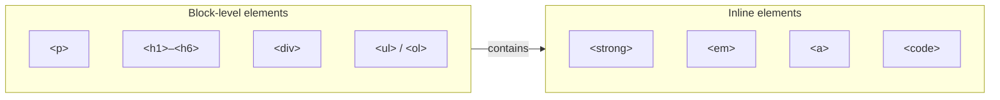

import Tabs from '@theme/Tabs';
import TabItem from '@theme/TabItem';
import MilestoneChecklist from '@site/src/components/MilestoneChecklist';
import QuizQuestion from '@site/src/components/QuizQuestion';

> **Course:** HTML Fundamentals · **Time:** 45 minutes · **Domain:** Web Development

---

## 🎯 Learning Objectives

- Use heading levels `<h1>` through `<h6>` correctly (one `<h1>` per page)
- Structure content using paragraphs, line breaks, and horizontal rules
- Create ordered and unordered lists
- Apply inline text formatting: `<strong>`, `<em>`, `<code>`, `<mark>`, `<del>`
- Understand the difference between block-level and inline elements

---

## 📖 Concepts

### Block-Level vs. Inline Elements

This is one of the most important distinctions in HTML layout:

| Type | Behavior | Examples |
|------|----------|---------| 
| **Block-level** | Takes up the full width of its container; starts on a new line | `<p>`, `<h1>`, `<div>`, `<ul>`, `<li>` |
| **Inline** | Takes up only as much width as its content; flows within text | `<strong>`, `<em>`, `<a>`, `<span>`, `<code>` |



### Headings

HTML has six heading levels. They communicate hierarchy, not visual size (that is CSS's job).

```html
<h1>Site Title — Only ONE h1 per page (SEO and accessibility rule)</h1>
<h2>Major Section</h2>
<h3>Sub-section</h3>
<h4>Sub-sub-section</h4>
<h5>Rarely used in practice</h5>
<h6>Almost never used</h6>
```

:::important
Never skip heading levels for visual reasons (e.g., don't jump from `<h2>` to `<h4>`). Screen readers build a document outline from headings, and skipping levels breaks navigation for visually impaired users.
:::

### Paragraphs, Breaks, and Dividers

```html
<!-- Paragraph — block element, adds spacing above and below -->
<p>The browser automatically adds spacing around paragraphs.</p>

<!-- Line break — inline, forces a new line without starting a new paragraph -->
<!-- Use sparingly. Poetry, addresses, and code are valid use cases. -->
<p>
    123 Main Street<br>
    Springfield, IL 62701
</p>

<!-- Horizontal rule — a semantic thematic break, not just a decorative line -->
<hr>
```

### Lists

```html
<!-- Unordered list (bullet points) — order doesn't matter -->
<ul>
    <li>HTML</li>
    <li>CSS</li>
    <li>JavaScript</li>
</ul>

<!-- Ordered list (numbered) — sequence matters -->
<ol>
    <li>Open the file</li>
    <li>Edit the content</li>
    <li>Save the changes</li>
</ol>

<!-- Description list — term/definition pairs -->
<dl>
    <dt>HTML</dt>
    <dd>HyperText Markup Language — provides structure.</dd>
    <dt>CSS</dt>
    <dd>Cascading Style Sheets — provides presentation.</dd>
</dl>
```

### Inline Text Formatting

```html
<p>
    This is <strong>bold text</strong> for important information.<br>
    This is <em>italicized text</em> for emphasis or book titles.<br>
    This is <code>inline_code()</code> for code references in prose.<br>
    This is <mark>highlighted text</mark> for editorial emphasis.<br>
    This is <del>deleted text</del> and <ins>inserted text</ins> for changes.<br>
    This is text with a <sup>superscript</sup> like 2<sup>10</sup>.<br>
    This is text with a <sub>subscript</sub> like H<sub>2</sub>O.
</p>
```

:::tip
Use `<strong>` and `<em>` rather than `<b>` and `<i>`. The former carry semantic weight (importance, emphasis) while the latter are purely visual styling tags with no meaning.
:::

---

## 🧠 Quick Check

<QuizQuestion
  id="html-lesson02-q1"
  question="Which HTML element should you use to mark text as critically important?"
  options={[
    { label: "<b> — makes text bold", correct: false, explanation: "<b> is a visual-only element with no semantic meaning. Screen readers treat it no differently from regular text." },
    { label: "<strong> — marks text as important", correct: true, explanation: "Correct! <strong> carries semantic weight — it signals importance to both browsers and screen readers." },
    { label: "<em> — emphasises text", correct: false, explanation: "<em> conveys stress emphasis (like italics in speech), not strong importance." },
    { label: "<mark> — highlights text", correct: false, explanation: "<mark> is for highlighting relevance (like search results), not importance." },
  ]}
/>

<QuizQuestion
  id="html-lesson02-q2"
  question="A page has the structure h1 → h3 → h2. What's wrong?"
  options={[
    { label: "Nothing — heading levels don't need to be sequential", correct: false, explanation: "Heading levels must be sequential. Skipping levels breaks document outline for screen readers." },
    { label: "The h3 comes before the h2, skipping a level — this breaks document outline for screen readers", correct: true, explanation: "Correct! The outline should flow h1 → h2 → h3, never skipping levels. This is both an accessibility and SEO issue." },
    { label: "You can only have one h2 per page", correct: false, explanation: "You can have multiple h2 elements. The rule is only one h1 per page." },
    { label: "h3 cannot appear after h1", correct: false, explanation: "h3 can appear after h1, but only when nested inside an h2 section." },
  ]}
/>

---

## 🏗️ Assignments

### Assignment 1 — Article Structure

Build a short article (you pick any topic) with:
- One `<h1>` for the article title
- Two `<h2>` section headings
- At least one `<h3>` sub-section
- At least two paragraphs per section

### Assignment 2 — Mixed Lists

On the same page, add:
1. A shopping list using `<ul>`
2. A recipe's step-by-step instructions using `<ol>`
3. A glossary of three web dev terms using `<dl>`

### Assignment 3 — Inline Formatting

Add a paragraph that uses at least four different inline elements (`<strong>`, `<em>`, `<code>`, `<mark>`) to annotate the text naturally.

---

## ✅ Milestone Checklist

<MilestoneChecklist
  lessonId="html-fundamentals-lesson-02"
  items={[
    "My page has exactly one <h1> tag",
    "I used ordered and unordered lists",
    "I correctly used <strong> and <em> (not <b> and <i>)",
    "I understand the difference between block-level and inline elements",
    "I completed all three assignments",
  ]}
/>

## ➡️ Next Unit

[Lesson 03 — Anchors & Navigation](./lesson_03)
