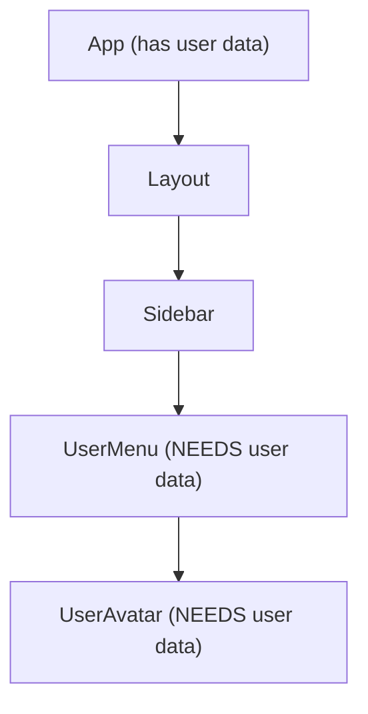

# Lesson 07 — Context & useContext

> **Course:** React Fundamentals · **Time:** 60 minutes
> **📖 Wiki:** [Frontend Frameworks — State Management](../../domains/web_dev/frontend_frameworks.md#state-management)
> **🔗 Official Docs:** [useContext](https://react.dev/reference/react/useContext) · [Passing Data Deeply with Context](https://react.dev/learn/passing-data-deeply-with-context)

---

## 🎯 Learning Objectives

- [ ] Explain when Context is the right solution (vs lifting state)
- [ ] Create, provide, and consume a typed context
- [ ] Build a theme context with toggle functionality
- [ ] Build an auth context pattern used in real applications

---

## 📖 Concepts

### The Prop Drilling Problem

When many nested components need the same data, passing it through every level becomes tedious:



Passing `user` through `Layout` and `Sidebar` just to reach `UserMenu` is **prop drilling**. Context provides a way to share values without explicit prop passing.

### Creating a Context

```tsx
// contexts/ThemeContext.tsx
import { createContext, useContext, useState, type ReactNode } from 'react';

// 1. Define the shape
interface ThemeContextValue {
    theme:       'light' | 'dark';
    toggleTheme: () => void;
}

// 2. Create the context with a sensible default
const ThemeContext = createContext<ThemeContextValue | null>(null);

// 3. Create a provider component
export function ThemeProvider({ children }: { children: ReactNode }) {
    const [theme, setTheme] = useState<'light' | 'dark'>(() => {
        const saved = localStorage.getItem('theme');
        if (saved === 'dark' || saved === 'light') return saved;
        return window.matchMedia('(prefers-color-scheme: dark)').matches ? 'dark' : 'light';
    });

    function toggleTheme() {
        setTheme(prev => {
            const next = prev === 'light' ? 'dark' : 'light';
            localStorage.setItem('theme', next);
            document.documentElement.classList.toggle('dark', next === 'dark');
            return next;
        });
    }

    // Apply theme class on mount
    useState(() => {
        document.documentElement.classList.toggle('dark', theme === 'dark');
    });

    return (
        <ThemeContext.Provider value={{ theme, toggleTheme }}>
            {children}
        </ThemeContext.Provider>
    );
}

// 4. Create a custom hook for consuming the context (better DX than raw useContext)
export function useTheme(): ThemeContextValue {
    const ctx = useContext(ThemeContext);
    if (!ctx) throw new Error('useTheme must be used inside <ThemeProvider>');
    return ctx;
}
```

```tsx
// main.tsx — wrap the app in the provider
ReactDOM.createRoot(document.getElementById('root')!).render(
    <React.StrictMode>
        <ThemeProvider>
            <App />
        </ThemeProvider>
    </React.StrictMode>
);
```

```tsx
// Any component, anywhere in the tree
import { useTheme } from './contexts/ThemeContext';

function ThemeToggleButton() {
    const { theme, toggleTheme } = useTheme();
    return (
        <button onClick={toggleTheme} className="btn btn-secondary">
            {theme === 'dark' ? '☀️ Light mode' : '🌙 Dark mode'}
        </button>
    );
}
```

### Auth Context — Real-World Pattern

```tsx
// contexts/AuthContext.tsx
import { createContext, useContext, useState, type ReactNode } from 'react';

interface User {
    id:    number;
    name:  string;
    email: string;
    role:  'admin' | 'user';
}

interface AuthContextValue {
    user:     User | null;
    isLoading: boolean;
    login:    (email: string, password: string) => Promise<void>;
    logout:   () => void;
    isAdmin:  boolean;
}

const AuthContext = createContext<AuthContextValue | null>(null);

export function AuthProvider({ children }: { children: ReactNode }) {
    const [user, setUser]         = useState<User | null>(null);
    const [isLoading, setLoading] = useState(false);

    async function login(email: string, password: string) {
        setLoading(true);
        try {
            const res = await fetch('/api/auth/login', {
                method: 'POST',
                headers: { 'Content-Type': 'application/json' },
                body: JSON.stringify({ email, password })
            });
            if (!res.ok) throw new Error('Invalid credentials');
            const { user: loggedInUser } = await res.json();
            setUser(loggedInUser);
        } finally {
            setLoading(false);
        }
    }

    function logout() {
        setUser(null);
        // In a real app: also call /api/auth/logout, clear cookies, etc.
    }

    return (
        <AuthContext.Provider value={{
            user,
            isLoading,
            login,
            logout,
            isAdmin: user?.role === 'admin'
        }}>
            {children}
        </AuthContext.Provider>
    );
}

export function useAuth(): AuthContextValue {
    const ctx = useContext(AuthContext);
    if (!ctx) throw new Error('useAuth must be used inside <AuthProvider>');
    return ctx;
}

// Convenience hook for when you KNOW the user is logged in
export function useRequiredUser(): User {
    const { user } = useAuth();
    if (!user) throw new Error('User is not authenticated');
    return user;
}
```

### When to Use Context (and When Not To)

| ✅ Good use cases | ❌ Poor use cases |
|-----------------|-----------------|
| Auth / current user | Frequently changing state (causes all consumers to re-render) |
| Theme / locale | Data only needed by a few deeply nested components |
| Shopping cart | App-wide server cache (use TanStack Query instead) |
| Feature flags | Complex state with many actions (use `useReducer` or Zustand) |

> [!TIP]
> Context is not a state management library — it's a dependency injection mechanism.
> For complex global state, pair Context for auth/theme with Zustand for application data.

### Multiple Contexts

```tsx
// Stack providers at the application root — each provides a different concern
ReactDOM.createRoot(root).render(
    <React.StrictMode>
        <ThemeProvider>
            <AuthProvider>
                <App />
            </AuthProvider>
        </ThemeProvider>
    </React.StrictMode>
);
```

---

## 🏗️ Assignments

### Assignment 1 — Notification Context

Build a `NotificationContext` that allows any component to trigger toast notifications:
- `notify(message: string, type: "success" | "error" | "info")` adds a notification
- Notifications auto-dismiss after 4 seconds
- Render up to 3 notifications stacked in the top-right corner

### Assignment 2 — Shopping Cart Context

Convert the shopping cart you built in Lesson 03 to use Context. Any component in the tree can call `useCart()` to get items and call `addToCart()`, `removeFromCart()`, `clearCart()`.

---

## ✅ Milestone Checklist

- [ ] I created a typed Context with a Provider and a custom hook
- [ ] My custom hook throws an error if used outside the Provider
- [ ] I understand that all consumers re-render when context value changes
- [ ] I did NOT use Context for frequently-changing performance-critical state

## ➡️ Next Unit

[Lesson 08 — Custom Hooks](./lesson_08.md)
