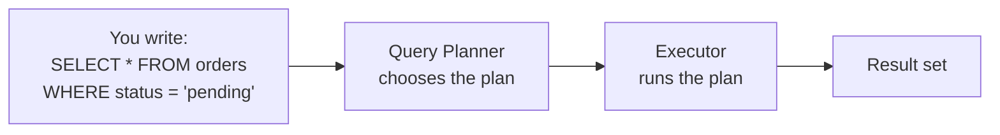
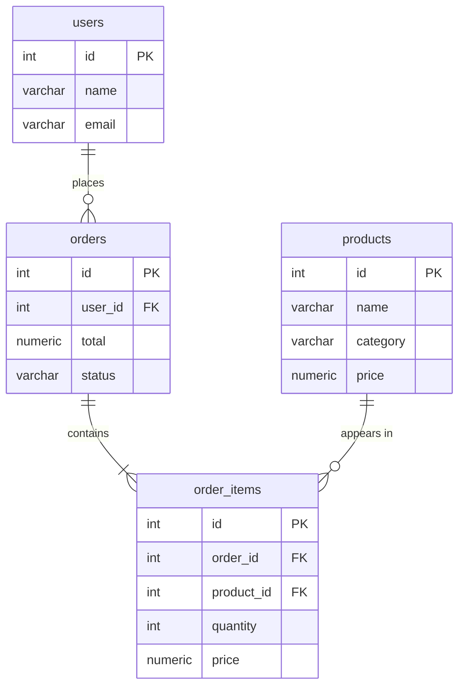
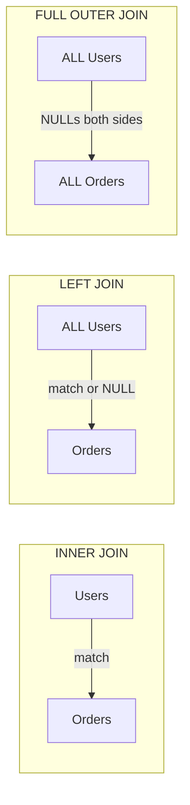

import Tabs from '@theme/Tabs';
import TabItem from '@theme/TabItem';
import YouTubeEmbed from '@site/src/components/YouTubeEmbed';
import QuizQuestion from '@site/src/components/QuizQuestion';
import MilestoneChecklist from '@site/src/components/MilestoneChecklist';

> **Domain:** Databases · **Status:** 🔵 Foundation (SQL, 1974) + 🟢 Modern (PostgreSQL 17, 2024)
>
> **Prerequisites:** None — SQL is readable without prior programming knowledge.
>
> **Who needs this:** Everyone who builds software that stores data. SQL is not optional. It is the lingua franca of the database world.

---

## 🎯 Learning Objectives

By the end of this unit, you will be able to:

- [ ] Write `SELECT` queries with `WHERE`, `ORDER BY`, `LIMIT`, and `OFFSET`
- [ ] Use all four `JOIN` types and know when to reach for each
- [ ] Aggregate data with `GROUP BY`, `HAVING`, and window functions
- [ ] Write DDL: `CREATE TABLE`, `ALTER TABLE`, `DROP TABLE`
- [ ] Define constraints: `PRIMARY KEY`, `FOREIGN KEY`, `UNIQUE`, `NOT NULL`, `CHECK`
- [ ] Understand why indexes exist and create them correctly
- [ ] Wrap operations in transactions with `BEGIN`, `COMMIT`, and `ROLLBACK`
- [ ] Explain what ACID means without looking it up

---

## 📖 Concepts

### 1. What SQL Actually Is

SQL (Structured Query Language) is a **declarative** language — you describe *what* data you want, not *how* to retrieve it. The database engine figures out the how.



PostgreSQL is the modern standard for relational databases — open source, feature-rich, and battle-tested. All examples use PostgreSQL syntax; the core SQL is standard-compliant.

<YouTubeEmbed
  id="qw--VYLpxG4"
  title="SQL Tutorial for Beginners — full course by freeCodeCamp"
  caption="Start from 0:00 for the full course, or jump to 1:15:00 for JOINs specifically."
/>

---

### 2. Querying Data — SELECT

```sql
-- Basic shape of every SELECT
SELECT column1, column2       -- What to return (use * for all columns)
FROM   table_name             -- Where to look
WHERE  condition              -- Filter rows (optional)
ORDER BY column1 ASC          -- Sort (optional, ASC is default)
LIMIT  10                     -- Max rows returned (optional)
OFFSET 20;                    -- Skip first N rows (optional, for pagination)
```

**Filtering with WHERE:**

```sql
-- Comparison operators
SELECT * FROM products WHERE price > 100;
SELECT * FROM products WHERE price BETWEEN 50 AND 200;
SELECT * FROM products WHERE name LIKE 'Mac%';      -- Starts with "Mac"
SELECT * FROM products WHERE name ILIKE '%pro%';    -- Case-insensitive LIKE (PostgreSQL)
SELECT * FROM products WHERE category IN ('laptop', 'tablet');
SELECT * FROM products WHERE discontinued IS NULL;
SELECT * FROM products WHERE discontinued IS NOT NULL;

-- Boolean logic
SELECT * FROM orders
WHERE status = 'pending'
  AND total > 100
  AND (region = 'US' OR region = 'CA');
```

**Aliasing and expressions:**

```sql
SELECT
    first_name || ' ' || last_name  AS full_name,   -- Concatenation
    price * 1.13                    AS price_with_tax,
    UPPER(email)                    AS email_upper,
    DATE_TRUNC('month', created_at) AS month
FROM users;
```

---

### 3. Joins — Combining Tables

A **join** combines rows from two or more tables based on a related column. This is the single most important concept in relational databases.

**Sample schema we'll use throughout:**

```sql
-- users: id, name, email
-- orders: id, user_id, total, status, created_at
-- order_items: id, order_id, product_id, quantity, price
-- products: id, name, category, price
```



**The four join types:**

```sql
-- INNER JOIN — only rows where match exists in BOTH tables
SELECT u.name, o.total, o.status
FROM   orders o
INNER JOIN users u ON u.id = o.user_id
WHERE  o.status = 'pending';

-- LEFT JOIN — all rows from left table, NULL for unmatched right
-- (Find users who have NEVER placed an order)
SELECT u.name, u.email, o.id AS order_id
FROM   users u
LEFT JOIN orders o ON o.user_id = u.id
WHERE  o.id IS NULL;   -- ← The "anti-join" pattern

-- RIGHT JOIN — inverse of LEFT JOIN (rarely needed; swap tables and use LEFT JOIN instead)
-- FULL OUTER JOIN — all rows from both tables with NULLs where no match
SELECT u.name, o.id
FROM   users u
FULL OUTER JOIN orders o ON o.user_id = u.id;
```



:::tip
**Rule of thumb:** Use `INNER JOIN` when you require a match. Use `LEFT JOIN` when the right side is optional (e.g., user may not have an order yet). Almost never need `RIGHT JOIN` — just swap the tables.
:::

**Multi-table join:**

```sql
-- Every order with user name, product names, and quantities
SELECT
    u.name          AS customer,
    o.id            AS order_id,
    p.name          AS product,
    oi.quantity,
    oi.price
FROM orders o
JOIN users u        ON u.id = o.user_id
JOIN order_items oi ON oi.order_id = o.id
JOIN products p     ON p.id = oi.product_id
WHERE o.status = 'shipped'
ORDER BY o.id, p.name;
```

---

### 4. Aggregates and Grouping

```sql
-- Aggregate functions collapse many rows into one value
SELECT
    COUNT(*)               AS total_orders,
    COUNT(DISTINCT user_id) AS unique_customers,
    SUM(total)             AS revenue,
    AVG(total)             AS avg_order_value,
    MIN(total)             AS smallest_order,
    MAX(total)             AS largest_order
FROM orders
WHERE status = 'completed';

-- GROUP BY — aggregate per group
SELECT
    status,
    COUNT(*)   AS count,
    SUM(total) AS revenue
FROM orders
GROUP BY status
ORDER BY revenue DESC;

-- HAVING — filter AFTER grouping (WHERE filters BEFORE grouping)
SELECT
    user_id,
    COUNT(*)   AS order_count,
    SUM(total) AS lifetime_value
FROM orders
GROUP BY user_id
HAVING SUM(total) > 500      -- Only customers who've spent more than $500
ORDER BY lifetime_value DESC
LIMIT 10;
```

:::important
**`WHERE` vs `HAVING`**: `WHERE` filters individual rows *before* grouping — it cannot reference aggregate functions. `HAVING` filters *after* grouping — it operates on the aggregated result. You can use both in the same query.
:::

**Window functions** — aggregate without collapsing rows:

```sql
-- Rank orders by value within each user
SELECT
    user_id,
    total,
    ROW_NUMBER() OVER (PARTITION BY user_id ORDER BY total DESC) AS rank_for_user,
    SUM(total)   OVER (PARTITION BY user_id)                     AS user_lifetime_value,
    SUM(total)   OVER (ORDER BY created_at)                      AS running_total
FROM orders;
```

---

### 5. Defining Schema — DDL

**DDL (Data Definition Language)** creates and modifies the database structure.

```sql
-- Create a table
CREATE TABLE products (
    id          SERIAL PRIMARY KEY,              -- Auto-incrementing integer PK
    name        VARCHAR(200)    NOT NULL,
    description TEXT,                            -- Unlimited length text, nullable
    price       NUMERIC(10, 2)  NOT NULL CHECK (price >= 0),
    category    VARCHAR(50)     NOT NULL,
    created_at  TIMESTAMPTZ     NOT NULL DEFAULT NOW(),  -- With timezone
    is_active   BOOLEAN         NOT NULL DEFAULT TRUE
);

-- Modern PostgreSQL: use BIGSERIAL or GENERATED for new tables
CREATE TABLE events (
    id         BIGINT GENERATED ALWAYS AS IDENTITY PRIMARY KEY,
    type       TEXT   NOT NULL,
    payload    JSONB,                            -- Native JSON storage + indexing
    occurred_at TIMESTAMPTZ NOT NULL DEFAULT NOW()
);
```

**Foreign keys:**

```sql
CREATE TABLE orders (
    id         SERIAL PRIMARY KEY,
    user_id    INT NOT NULL,
    total      NUMERIC(12, 2) NOT NULL,
    status     TEXT NOT NULL DEFAULT 'pending',
    created_at TIMESTAMPTZ NOT NULL DEFAULT NOW(),

    CONSTRAINT fk_orders_user
        FOREIGN KEY (user_id)
        REFERENCES users (id)
        ON DELETE RESTRICT    -- Prevent deleting a user who has orders
        ON UPDATE CASCADE     -- If user.id changes, update here too
);
```

**`ON DELETE` options:**

| Option | Behaviour |
|--------|-----------|
| `RESTRICT` | Block the delete if rows reference this row (safest) |
| `CASCADE` | Delete all referencing rows too |
| `SET NULL` | Set the FK column to NULL |
| `NO ACTION` | Like RESTRICT but checked at end of transaction |

**Altering a table:**

```sql
-- Add a column (safe — no lock on PostgreSQL with a default value)
ALTER TABLE products ADD COLUMN stock_count INT NOT NULL DEFAULT 0;

-- Add a column (careful! NOT NULL without default locks the whole table)
ALTER TABLE products ADD COLUMN weight_kg NUMERIC(6, 2);  -- Nullable first
UPDATE products SET weight_kg = 0.5 WHERE weight_kg IS NULL;
ALTER TABLE products ALTER COLUMN weight_kg SET NOT NULL;

-- Rename a column
ALTER TABLE products RENAME COLUMN description TO body;

-- Drop a column (irreversible!)
ALTER TABLE products DROP COLUMN IF EXISTS legacy_code;

-- Add a constraint
ALTER TABLE products ADD CONSTRAINT chk_positive_price CHECK (price > 0);
```

---

### 6. Indexes

Without an index, the database reads every row to find matches — an **O(n) full table scan**.
An index is a sorted data structure (usually a B-tree) that finds rows in **O(log n)**.

```sql
-- Single-column index (most common)
CREATE INDEX idx_orders_user_id ON orders (user_id);

-- Multi-column (composite) index — order matters
-- Best for: WHERE status = 'pending' AND created_at > '2025-01-01'
CREATE INDEX idx_orders_status_created ON orders (status, created_at DESC);

-- Partial index — only index the rows you actually query
-- Smaller, faster than a full index
CREATE INDEX idx_pending_orders ON orders (created_at)
    WHERE status = 'pending';

-- Unique index — enforces uniqueness + enables fast lookup
CREATE UNIQUE INDEX idx_users_email ON users (email);

-- GIN index for JSONB, full-text search, and array columns
CREATE INDEX idx_events_payload ON events USING GIN (payload);

-- CONCURRENTLY — build index without locking the table (takes longer but safe in production)
CREATE INDEX CONCURRENTLY idx_products_category ON products (category);
```

:::warning
**Don't over-index.** Every index slows down `INSERT`, `UPDATE`, and `DELETE` (the index must be updated too). Index the columns in your `WHERE` clauses and join conditions. Monitor with `pg_stat_user_indexes` to find unused indexes.
:::

**Check if your query uses an index:**

```sql
EXPLAIN ANALYZE
SELECT * FROM orders WHERE user_id = 42;
-- Look for "Index Scan" (good) vs "Seq Scan" (full table scan — may need an index)
```

---

### 7. Transactions and ACID

A **transaction** groups multiple statements into a single atomic unit — either all succeed or all fail together.

```sql
-- Pattern: transfer money between accounts
BEGIN;

UPDATE accounts SET balance = balance - 100 WHERE id = 1;
UPDATE accounts SET balance = balance + 100 WHERE id = 2;

-- Check: did anything go wrong? If yes, roll back.
-- If all good:
COMMIT;

-- If something failed:
-- ROLLBACK;  -- Undoes everything since BEGIN
```

**ACID properties:**

| Property | Meaning |
|----------|---------|
| **Atomicity** | All-or-nothing: partial success is impossible |
| **Consistency** | Transaction leaves DB in a valid state (constraints enforced) |
| **Isolation** | Concurrent transactions don't see each other's partial work |
| **Durability** | Committed data survives crashes (written to disk) |

**Savepoints** — partial rollback within a transaction:

```sql
BEGIN;
  INSERT INTO orders (user_id, total) VALUES (1, 99.99);
  SAVEPOINT after_order;

  INSERT INTO order_items (...) VALUES (...);  -- This might fail

  -- If just the item failed:
  ROLLBACK TO after_order;  -- Undo only since the savepoint, keep the order

COMMIT;
```

:::tip
In application code, always use your framework's transaction helper rather than raw `BEGIN`/`COMMIT`. It ensures rollback on exception automatically (e.g., SQLAlchemy's `session`, Prisma's `$transaction`, Laravel's `DB::transaction(...)`).
:::

---

### 8. Common Patterns

```sql
-- Upsert (insert or update if conflict)
INSERT INTO users (email, name)
VALUES ('alice@example.com', 'Alice')
ON CONFLICT (email)
DO UPDATE SET name = EXCLUDED.name, updated_at = NOW();

-- Soft delete (don't actually remove rows, just mark them)
ALTER TABLE posts ADD COLUMN deleted_at TIMESTAMPTZ;
UPDATE posts SET deleted_at = NOW() WHERE id = 42;
-- Query: WHERE deleted_at IS NULL

-- CTE (Common Table Expression) — readable subquery alias
WITH high_value_customers AS (
    SELECT user_id, SUM(total) AS lifetime_value
    FROM orders
    WHERE status = 'completed'
    GROUP BY user_id
    HAVING SUM(total) > 1000
)
SELECT u.email, hvc.lifetime_value
FROM high_value_customers hvc
JOIN users u ON u.id = hvc.user_id
ORDER BY hvc.lifetime_value DESC;

-- Returning — get the inserted/updated row immediately
INSERT INTO posts (title, body, author_id)
VALUES ('Hello World', 'My first post', 1)
RETURNING id, created_at;
```

---

## 🧠 Quick Check

<QuizQuestion
  id="sql-q1"
  question="Which JOIN type returns ALL rows from the left table, even when there's no match in the right table?"
  options={[
    { label: "INNER JOIN", correct: false, explanation: "INNER JOIN only returns rows where a match exists in both tables." },
    { label: "LEFT JOIN", correct: true, explanation: "Correct! LEFT JOIN returns all rows from the left table. Where no match exists in the right table, the right-side columns are NULL." },
    { label: "CROSS JOIN", correct: false, explanation: "CROSS JOIN returns every combination of rows (cartesian product) — no ON condition." },
    { label: "FULL OUTER JOIN", correct: false, explanation: "FULL OUTER JOIN returns all rows from both tables. You'd use it when you want unmatched rows from either side." },
  ]}
/>

<QuizQuestion
  id="sql-q2"
  question="You want to find users who have spent more than $500 in total across all orders. Which clause filters on an aggregate?"
  options={[
    { label: "WHERE SUM(total) > 500", correct: false, explanation: "WHERE runs before aggregation — you can't use aggregate functions in WHERE. This will throw an error." },
    { label: "HAVING SUM(total) > 500", correct: true, explanation: "Correct! HAVING filters after GROUP BY has been applied. It operates on the aggregated result, so aggregate functions like SUM() work here." },
    { label: "ORDER BY SUM(total) > 500", correct: false, explanation: "ORDER BY sorts results — it doesn't filter rows." },
    { label: "GROUP BY total > 500", correct: false, explanation: "GROUP BY defines how to group rows, not how to filter them." },
  ]}
/>

<QuizQuestion
  id="sql-q3"
  question="An index on the `orders` table speeds up reads but also has a cost. What is that cost?"
  options={[
    { label: "It uses more disk space only", correct: false, explanation: "Disk space is one cost, but not the only one." },
    { label: "It slows down INSERT, UPDATE, and DELETE because the index must also be updated", correct: true, explanation: "Correct! Every write operation must also update every index on the table. This is why over-indexing hurts write performance." },
    { label: "It prevents transactions from working", correct: false, explanation: "Indexes don't affect transaction behaviour at all." },
    { label: "It requires a table lock on every query", correct: false, explanation: "Reading via an index doesn't require a table lock. PostgreSQL uses MVCC for concurrent access." },
  ]}
/>

<QuizQuestion
  id="sql-q4"
  question="What does ACID stand for, and which property guarantees that committed data survives a server crash?"
  options={[
    { label: "Atomicity, Consistency, Isolation, Durability — Durability guarantees crash survival", correct: true, explanation: "Correct! Durability means committed transactions are written to persistent storage (WAL on disk) before the transaction is confirmed, so they survive crashes." },
    { label: "Atomicity, Consistency, Integrity, Durability — Integrity guarantees crash survival", correct: false, explanation: "ACID = Atomicity, Consistency, Isolation, Durability. 'Integrity' is not one of the four." },
    { label: "Atomicity, Consistency, Isolation, Durability — Atomicity guarantees crash survival", correct: false, explanation: "Atomicity means all-or-nothing execution, not crash persistence. Durability is the property about surviving crashes." },
    { label: "Availability, Consistency, Isolation, Durability — Durability guarantees crash survival", correct: false, explanation: "ACID starts with Atomicity, not Availability. Availability is from the CAP theorem." },
  ]}
/>

---

## 🏗️ Assignments

### Assignment 1 — Schema Design
Design a database schema for a simple blog with posts, tags, and comments:

- [ ] `users` table with `id`, `name`, `email` (unique), `created_at`
- [ ] `posts` table with FK to `users`, `title`, `body`, `published_at` (nullable = draft)
- [ ] `tags` table and a `post_tags` join table (many-to-many)
- [ ] `comments` table with FK to `posts` and `users`, supports nested comments (self-referential FK)
- [ ] Add appropriate indexes for: author lookup, tag filtering, sorting by date
- [ ] Write `INSERT` statements to seed sample data

### Assignment 2 — Query Practice
Using your schema from Assignment 1:

- [ ] Find all published posts by a specific author, ordered by date
- [ ] Count comments per post, only including posts with more than 5 comments
- [ ] Find all posts tagged with 'javascript' or 'typescript'
- [ ] Find users who have never commented (use LEFT JOIN + IS NULL)
- [ ] Calculate the average number of comments per post per month

### Assignment 3 — Transactions
Using a bank account table (`id, owner, balance`):

- [ ] Write a `transfer(from_id, to_id, amount)` function in SQL using a transaction
- [ ] Handle the case where `from_id` has insufficient funds — rollback with a meaningful error
- [ ] Use a savepoint to attempt a bonus calculation and rollback just that step if it fails
- [ ] Test: verify the total balance across all accounts is the same before and after transfers

---

## ✅ Milestone Checklist

<MilestoneChecklist
  lessonId="wiki-sql-fundamentals"
  items={[
    "Can write SELECT queries with WHERE, ORDER BY, LIMIT, and OFFSET",
    "Understand all four JOIN types and can choose the right one",
    "Can use GROUP BY, HAVING, and at least one window function",
    "Can design a normalized schema with appropriate constraints and foreign keys",
    "Can create the right type of index for a given query pattern",
    "Understand ACID and can use BEGIN / COMMIT / ROLLBACK correctly",
    "Completed all three assignments",
  ]}
/>
