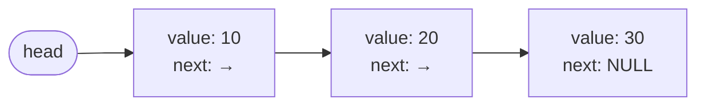

import Tabs from '@theme/Tabs';
import TabItem from '@theme/TabItem';
import YouTubeEmbed from '@site/src/components/YouTubeEmbed';
import QuizQuestion from '@site/src/components/QuizQuestion';
import MilestoneChecklist from '@site/src/components/MilestoneChecklist';

# Data Structures

<YouTubeEmbed
  id="pkYVOmU3MgA"
  title="Data Structures Easy to Advanced - Full Tutorial by freeCodeCamp"
  caption="freeCodeCamp full data structures course covering arrays, linked lists, trees, heaps, graphs."
/>

**Domain:** Foundations · **Time Estimate:** 3–4 weeks · **Language:** See language tabs in each section

> **Prerequisites:** [Programming Basics](programming_basics.md) — comfortable with functions, loops, and arrays.
>
> **Who needs this:** Everyone. Every real program uses data structures constantly. Choosing the *wrong* one makes your code slow or broken. Choosing the *right* one makes it elegant and fast.

---

## 🎯 Learning Objectives

By the end of this unit, you will be able to:

- [ ] Explain what a data structure is and why different ones exist
- [ ] Implement arrays, linked lists, stacks, and queues from scratch in your language
- [ ] Use hash tables and explain why average lookups are O(1)
- [ ] Traverse a binary tree using recursion
- [ ] Choose the right data structure for a given problem
- [ ] State the time complexity of insert/delete/search for each structure
- [ ] Implement at least 3 structures without using built-in helpers

---

## 📖 Concepts

### 1. Why Data Structures Exist

Data structures are **ways of organizing data in memory** so that certain operations are efficient.

The core question is always: **"What do I need to do most often?"**

| If you need to... | Use... | Why |
|-------------------|--------|-----|
| Access items by index instantly | Array | Direct memory address math |
| Insert/delete from the middle frequently | Linked List | Pointer update instead of shifting |
| Process in LIFO order (undo, call stack) | Stack | Restricted access = strong guarantee |
| Process in FIFO order (queues, BFS) | Queue | Restricted access = strong guarantee |
| Look up items by a key instantly | Hash Table | Hash function → direct bucket |
| Search hierarchical relationships | Tree | Divide and conquer by structure |
| Model connections between things | Graph | Nodes + edges = any relationship |

Before writing any significant program, ask: *What operations will I do most? What structure makes those fast?*

---

### 2. Arrays

An **array** is a contiguous block of memory where each element is the same size and directly accessible by index.

<svg viewBox="0 0 430 72" width="100%" style={{maxWidth:'500px',display:'block',margin:'1rem auto'}} aria-label="Array with 5 cells indexed 0-4">
  <style>{`
    .ac { fill: var(--ifm-card-background-color, #1e1e2e); stroke: var(--ifm-color-primary, #7c3aed); stroke-width: 2; }
    .av { font: bold 18px monospace; fill: var(--ifm-font-color-base, #cdd6f4); dominant-baseline: middle; text-anchor: middle; }
    .ai { font: bold 12px monospace; fill: var(--ifm-color-primary, #a78bfa); text-anchor: middle; }
  `}</style>
  <rect className="ac" x="4"   y="8" width="78" height="44" rx="6"/><text className="av" x="43"  y="30">10</text><text className="ai" x="43"  y="64">[0]</text>
  <rect className="ac" x="90"  y="8" width="78" height="44" rx="6"/><text className="av" x="129" y="30">20</text><text className="ai" x="129" y="64">[1]</text>
  <rect className="ac" x="176" y="8" width="78" height="44" rx="6"/><text className="av" x="215" y="30">30</text><text className="ai" x="215" y="64">[2]</text>
  <rect className="ac" x="262" y="8" width="78" height="44" rx="6"/><text className="av" x="301" y="30">40</text><text className="ai" x="301" y="64">[3]</text>
  <rect className="ac" x="348" y="8" width="78" height="44" rx="6"/><text className="av" x="387" y="30">50</text><text className="ai" x="387" y="64">[4]</text>
</svg>

`array[2]` → `base_address + (2 × element_size)` → **30**

This is why index access is **O(1)** — it's just arithmetic, not searching.

**Core operations and their complexity:**

| Operation | Time | Why |
|-----------|------|-----|
| Access by index | O(1) | Direct address calculation |
| Search (unsorted) | O(n) | Must check each element |
| Insert at end | O(1) amortized | Occasional resize is O(n) but rare |
| Insert at middle | O(n) | Must shift all elements right |
| Delete from middle | O(n) | Must shift all elements left |

<Tabs>
<TabItem value="pseudo" label="Pseudocode">

```pseudocode
// Dynamic array (auto-resizing)
array ← NEW List<Int>

append(array, 10)       // [10]
append(array, 20)       // [10, 20]
append(array, 30)       // [10, 20, 30]

array[1]                // → 20  (O(1))
length(array)           // → 3

// Insert at index (shifts elements right)
insert(array, index=1, value=15)  // [10, 15, 20, 30]

// Remove last
remove_last(array)      // [10, 15, 20]
```


</TabItem>
<TabItem value="python" label="Python">

```python
arr = []
arr.append(10)      # O(1) amortized
arr.append(20)
arr.append(30)

print(arr[1])       # 20 — O(1)
print(len(arr))     # 3

arr.insert(1, 15)   # O(n) — shifts right
arr.pop()           # O(1) — removes last
arr.pop(0)          # O(n) — removes first, shifts left

# Slicing creates a new list
arr[1:3]            # Elements at index 1 and 2
arr[-2:]            # Last 2 elements
```


</TabItem>
<TabItem value="typescript" label="TypeScript">

```typescript
const arr: number[] = [];
arr.push(10);           // O(1) amortized
arr.push(20);
arr.push(30);

console.log(arr[1]);    // 20 — O(1)
console.log(arr.length);// 3

arr.splice(1, 0, 15);   // O(n) — insert at index 1
arr.pop();              // O(1) — remove last
arr.shift();            // O(n) — remove first (avoid for queues)

arr.slice(1, 3);        // Elements at index 1 and 2 (new array)
```


</TabItem>
<TabItem value="rust" label="Rust">

```rust
let mut arr: Vec<i32> = Vec::new();
arr.push(10);           // O(1) amortized
arr.push(20);
arr.push(30);

println!("{}", arr[1]); // 20 — O(1), panics if out of bounds
println!("{}", arr.len());

arr.insert(1, 15);      // O(n) — insert at index
arr.pop();              // O(1) — returns Option<i32>
arr.remove(0);          // O(n) — remove and shift

&arr[1..3]              // Slice reference (no allocation)
```


</TabItem>
<TabItem value="c" label="C">

```c
// Static array (fixed size)
int arr[5] = {10, 20, 30, 40, 50};
printf("%d\n", arr[2]);  // 30 — O(1)

// Dynamic array — manual management
int *dynamic = malloc(5 * sizeof(int));
dynamic[0] = 10;
// ... resize requires realloc()
free(dynamic);           // Must free manually!
```


</TabItem>
</Tabs>

:::tip[Research Question 🔍]
What happens internally when a dynamic array resizes? Why is `append()` / `push()` O(1) *amortized* rather than always O(1)? Look up "amortized analysis" and "dynamic array growth factor."
:::

---

### 3. Linked Lists

A linked list stores data in **nodes**. Each node holds a value and a pointer to the next node. They are not stored contiguously — each node can be anywhere in memory.



The benefit: inserting or deleting at a **known position** is O(1) — just redirect pointers.  
The cost: no random access — finding the Nth element requires walking from head.

**Core operations:**

| Operation | Time | Why |
|-----------|------|-----|
| Access by index | O(n) | Must walk from head |
| Search | O(n) | Must walk until found |
| Insert at head | O(1) | Just update head pointer |
| Insert at tail (no tail pointer) | O(n) | Must walk to end |
| Delete (with reference to node) | O(1) | Just update pointers |
| Delete by value | O(n) | Must find it first |

<Tabs>
<TabItem value="pseudo" label="Pseudocode">

```pseudocode
CLASS Node<T>
    value: T
    next: Optional<Node<T>> ← NULL
END CLASS

CLASS LinkedList<T>
    head: Optional<Node<T>> ← NULL
    size: Int ← 0

    FUNCTION append(value: T) -> Void
        new_node ← NEW Node(value)
        IF self.head == NULL THEN
            self.head ← new_node
        ELSE
            current ← self.head
            WHILE current.next != NULL DO
                current ← current.next   // walk to end
            END WHILE
            current.next ← new_node      // link in
        END IF
        self.size ← self.size + 1
    END FUNCTION

    FUNCTION prepend(value: T) -> Void
        new_node ← NEW Node(value)
        new_node.next ← self.head        // new node points to old head
        self.head ← new_node             // head = new node
        self.size ← self.size + 1
    END FUNCTION

    FUNCTION delete(value: T) -> Bool
        IF self.head == NULL THEN RETURN FALSE

        IF self.head.value == value THEN
            self.head ← self.head.next   // bypass head
            self.size ← self.size - 1
            RETURN TRUE
        END IF

        current ← self.head
        WHILE current.next != NULL DO
            IF current.next.value == value THEN
                current.next ← current.next.next  // bypass node
                self.size ← self.size - 1
                RETURN TRUE
            END IF
            current ← current.next
        END WHILE
        RETURN FALSE
    END FUNCTION

    FUNCTION contains(value: T) -> Bool
        current ← self.head
        WHILE current != NULL DO
            IF current.value == value THEN RETURN TRUE
            current ← current.next
        END WHILE
        RETURN FALSE
    END FUNCTION
END CLASS
```


</TabItem>
<TabItem value="python" label="Python">

```python
class Node:
    def __init__(self, value):
        self.value = value
        self.next = None

class LinkedList:
    def __init__(self):
        self.head = None
        self.size = 0

    def append(self, value):
        new_node = Node(value)
        if not self.head:
            self.head = new_node
        else:
            current = self.head
            while current.next:
                current = current.next
            current.next = new_node
        self.size += 1

    def prepend(self, value):
        new_node = Node(value)
        new_node.next = self.head
        self.head = new_node
        self.size += 1

    def delete(self, value):
        if not self.head:
            return False
        if self.head.value == value:
            self.head = self.head.next
            self.size -= 1
            return True
        current = self.head
        while current.next:
            if current.next.value == value:
                current.next = current.next.next
                self.size -= 1
                return True
            current = current.next
        return False

    def contains(self, value):
        current = self.head
        while current:
            if current.value == value:
                return True
            current = current.next
        return False

    def to_list(self):
        result, current = [], self.head
        while current:
            result.append(current.value)
            current = current.next
        return result
```


</TabItem>
<TabItem value="typescript" label="TypeScript">

```typescript
class ListNode<T> {
    value: T;
    next: ListNode<T> | null = null;
    constructor(value: T) { this.value = value; }
}

class LinkedList<T> {
    private head: ListNode<T> | null = null;
    public size: number = 0;

    append(value: T): void {
        const node = new ListNode(value);
        if (!this.head) { this.head = node; }
        else {
            let current = this.head;
            while (current.next) current = current.next;
            current.next = node;
        }
        this.size++;
    }

    prepend(value: T): void {
        const node = new ListNode(value);
        node.next = this.head;
        this.head = node;
        this.size++;
    }

    delete(value: T): boolean {
        if (!this.head) return false;
        if (this.head.value === value) {
            this.head = this.head.next;
            this.size--;
            return true;
        }
        let current = this.head;
        while (current.next) {
            if (current.next.value === value) {
                current.next = current.next.next;
                this.size--;
                return true;
            }
            current = current.next;
        }
        return false;
    }

    contains(value: T): boolean {
        let current = this.head;
        while (current) {
            if (current.value === value) return true;
            current = current.next;
        }
        return false;
    }
}
```


</TabItem>
<TabItem value="rust" label="Rust">

```rust
// NOTE: Rust's ownership model makes linked lists tricky.
// This is simplified — see "Learning Rust With Entirely Too Many
// Linked Lists" (free online book) for the full idiomatic version.

type Link<T> = Option<Box<Node<T>>>;

struct Node<T> {
    value: T,
    next: Link<T>,
}

struct LinkedList<T> {
    head: Link<T>,
    size: usize,
}

impl<T> LinkedList<T> {
    fn new() -> Self {
        LinkedList { head: None, size: 0 }
    }

    fn prepend(&mut self, value: T) {
        let old_head = self.head.take();
        self.head = Some(Box::new(Node { value, next: old_head }));
        self.size += 1;
    }

    fn pop_front(&mut self) -> Option<T> {
        self.head.take().map(|node| {
            self.head = node.next;
            self.size -= 1;
            node.value
        })
    }
}
```


</TabItem>
</Tabs>

:::tip[Research Question 🔍]
What is a **doubly linked list**? When would you use it vs. singly linked? What is a **sentinel node** and why do some implementations use one?
:::

---

### 4. Stacks

A **stack** is LIFO — **Last In, First Out**. Like a stack of plates — you can only add or take from the top.

<div className="svg-graphic-container margin-bottom--lg">
  <svg viewBox="0 0 780 280" xmlns="http://www.w3.org/2000/svg" className="diagram-svg" role="img" aria-label="Stack state progression: Push 10, Push 20, Push 30, Pop returns 30, Peek returns 20">
    <style>{`
      .sk-col  { fill: var(--diagram-layer-1-fill); stroke: var(--diagram-layer-1-stroke); stroke-width: 2; }
      .sk-top  { fill: var(--diagram-layer-2-fill); stroke: var(--diagram-layer-2-stroke); stroke-width: 2; }
      .sk-op   { fill: var(--diagram-layer-4-fill); stroke: var(--diagram-layer-4-stroke); stroke-width: 1.5; }
      .sk-empty{ fill: var(--diagram-semantic-page); stroke: var(--diagram-semantic-stroke); stroke-width: 2; stroke-dasharray: 5 3; }
      .sk-arr  { stroke: var(--diagram-text-muted); stroke-width: 2; fill: none; marker-end: url(#sk-arrow); }
      .sk-title{ fill: var(--diagram-text);       font: 600 13px var(--ifm-font-family-base); text-anchor: middle; }
      .sk-val  { fill: var(--diagram-text);       font: bold 16px monospace;                  text-anchor: middle; dominant-baseline: middle; }
      .sk-top-lbl { fill: var(--diagram-layer-2-stroke); font: bold 11px var(--ifm-font-family-base); text-anchor: start; }
      .sk-op-lbl  { fill: var(--diagram-text-muted); font: 11px var(--ifm-font-family-base); text-anchor: middle; }
    `}</style>
    <defs>
      <marker id="sk-arrow" markerWidth="8" markerHeight="6" refX="7" refY="3" orient="auto">
        <polygon points="0 0, 8 3, 0 6" fill="var(--diagram-text-muted)" />
      </marker>
    </defs>

    {/* ── Column 1: Empty ── */}
    <text x="78" y="20" className="sk-title">Empty</text>
    <rect x="40" y="30" width="76" height="44" className="sk-empty" rx="4"/>
    <text x="78" y="58" className="sk-op-lbl" style={{fontStyle:'italic'}}>no items</text>

    {/* ── Arrow 1→2 ── */}
    <line x1="120" y1="100" x2="148" y2="100" className="sk-arr"/>
    <text x="134" y="92" className="sk-op-lbl">push(10)</text>

    {/* ── Column 2: [10] ── */}
    <text x="208" y="20" className="sk-title">Push 10</text>
    <rect x="170" y="74" width="76" height="44" className="sk-top" rx="4"/>
    <text x="208" y="99" className="sk-val">10</text>
    <text x="250" y="87" className="sk-top-lbl">← TOP</text>

    {/* ── Arrow 2→3 ── */}
    <line x1="250" y1="100" x2="278" y2="100" className="sk-arr"/>
    <text x="264" y="92" className="sk-op-lbl">push(20)</text>

    {/* ── Column 3: [20,10] ── */}
    <text x="338" y="20" className="sk-title">Push 20</text>
    <rect x="300" y="30" width="76" height="44" className="sk-top" rx="4"/>
    <text x="338" y="55" className="sk-val">20</text>
    <text x="380" y="43" className="sk-top-lbl">← TOP</text>
    <rect x="300" y="74" width="76" height="44" className="sk-col" rx="4"/>
    <text x="338" y="99" className="sk-val">10</text>

    {/* ── Arrow 3→4 ── */}
    <line x1="380" y1="70" x2="408" y2="70" className="sk-arr"/>
    <text x="394" y="62" className="sk-op-lbl">push(30)</text>

    {/* ── Column 4: [30,20,10] ── */}
    <text x="468" y="20" className="sk-title">Push 30</text>
    <rect x="430" y="30" width="76" height="40" className="sk-top" rx="4"/>
    <text x="468" y="52" className="sk-val">30</text>
    <text x="510" y="43" className="sk-top-lbl">← TOP</text>
    <rect x="430" y="70" width="76" height="40" className="sk-col" rx="4"/>
    <text x="468" y="92" className="sk-val">20</text>
    <rect x="430" y="110" width="76" height="40" className="sk-col" rx="4"/>
    <text x="468" y="132" className="sk-val">10</text>

    {/* ── Arrow 4→5 pop ── */}
    <line x1="510" y1="85" x2="538" y2="85" className="sk-arr"/>
    <text x="524" y="77" className="sk-op-lbl">pop()</text>
    <rect x="510" y="93" width="54" height="20" className="sk-op" rx="3"/>
    <text x="537" y="107" className="sk-op-lbl">→ 30</text>

    {/* ── Column 5: [20,10] after pop ── */}
    <text x="600" y="20" className="sk-title">After Pop</text>
    <rect x="562" y="30" width="76" height="44" className="sk-top" rx="4"/>
    <text x="600" y="55" className="sk-val">20</text>
    <text x="642" y="43" className="sk-top-lbl">← TOP</text>
    <rect x="562" y="74" width="76" height="44" className="sk-col" rx="4"/>
    <text x="600" y="99" className="sk-val">10</text>

    {/* Peek annotation */}
    <text x="600" y="145" className="sk-op-lbl" style={{fontSize:'12px'}}>peek() → 20 (no removal)</text>

    {/* Legend */}
    <rect x="20" y="200" width="14" height="14" className="sk-top" rx="2"/>
    <text x="40" y="212" className="sk-op-lbl" style={{fontSize:'11px'}}>TOP item</text>
    <rect x="100" y="200" width="14" height="14" className="sk-col" rx="2"/>
    <text x="120" y="212" className="sk-op-lbl" style={{fontSize:'11px'}}>lower items</text>
    <rect x="190" y="200" width="14" height="14" className="sk-op" rx="2"/>
    <text x="210" y="212" className="sk-op-lbl" style={{fontSize:'11px'}}>return value</text>
  </svg>
</div>

**Real uses:** undo/redo, browser back button, call stack, parenthesis matching, expression evaluation.

<Tabs>
<TabItem value="pseudo" label="Pseudocode">

```pseudocode
CLASS Stack<T>
    data: List<T> ← []

    FUNCTION push(value: T) -> Void
        append(self.data, value)
    END FUNCTION

    FUNCTION pop() -> T
        IF self.is_empty() THEN
            THROW UnderflowError("Stack is empty")
        END IF
        RETURN remove_last(self.data)
    END FUNCTION

    FUNCTION peek() -> T
        IF self.is_empty() THEN
            THROW UnderflowError("Stack is empty")
        END IF
        RETURN self.data[length(self.data) - 1]
    END FUNCTION

    FUNCTION is_empty() -> Bool
        RETURN length(self.data) == 0
    END FUNCTION
END CLASS

// Classic application: balanced parentheses check
FUNCTION is_balanced(text: String) -> Bool
    stack ← NEW Stack<Char>
    pairs ← {')': '(', ']': '[', '}': '{'}

    FOREACH char IN text DO
        IF char IN ['(', '[', '{'] THEN
            stack.push(char)
        ELSE IF char IN [')', ']', '}'] THEN
            IF stack.is_empty() OR stack.pop() != pairs[char] THEN
                RETURN FALSE
            END IF
        END IF
    END FOREACH

    RETURN stack.is_empty()
END FUNCTION
```


</TabItem>
<TabItem value="python" label="Python">

```python
class Stack:
    def __init__(self):
        self._data = []

    def push(self, value):     # O(1)
        self._data.append(value)

    def pop(self):             # O(1)
        if self.is_empty():
            raise IndexError("Stack is empty")
        return self._data.pop()

    def peek(self):            # O(1)
        if self.is_empty():
            raise IndexError("Stack is empty")
        return self._data[-1]

    def is_empty(self):
        return len(self._data) == 0

# Application: balanced brackets
def is_balanced(text: str) -> bool:
    stack = Stack()
    pairs = {')': '(', ']': '[', '}': '{'}
    for char in text:
        if char in '([{':
            stack.push(char)
        elif char in ')]}':
            if stack.is_empty() or stack.pop() != pairs[char]:
                return False
    return stack.is_empty()

print(is_balanced("({[]})"))  # True
print(is_balanced("([)]"))    # False
```


</TabItem>
<TabItem value="typescript" label="TypeScript">

```typescript
class Stack<T> {
    private data: T[] = [];

    push(value: T): void { this.data.push(value); }

    pop(): T {
        if (this.isEmpty()) throw new Error("Stack is empty");
        return this.data.pop()!;
    }

    peek(): T {
        if (this.isEmpty()) throw new Error("Stack is empty");
        return this.data[this.data.length - 1];
    }

    isEmpty(): boolean { return this.data.length === 0; }
    size(): number { return this.data.length; }
}

function isBalanced(text: string): boolean {
    const stack = new Stack<string>();
    const pairs: Record<string, string> = { ')': '(', ']': '[', '}': '{' };
    for (const char of text) {
        if ('([{'.includes(char)) stack.push(char);
        else if (')]}'.includes(char)) {
            if (stack.isEmpty() || stack.pop() !== pairs[char]) return false;
        }
    }
    return stack.isEmpty();
}
```


</TabItem>
</Tabs>

---

### 5. Queues

A **queue** is FIFO — **First In, First Out**. Like a line at a store — new arrivals join the back, service happens at the front.

<div className="svg-graphic-container margin-bottom--lg">
  <svg viewBox="0 0 820 310" xmlns="http://www.w3.org/2000/svg" className="diagram-svg" role="img" aria-label="Queue FIFO: enqueue 10, 20, 30; then dequeue returns 10 from FRONT">
    <style>{`
      .q-node  { fill: var(--diagram-layer-1-fill); stroke: var(--diagram-layer-1-stroke); stroke-width: 2; }
      .q-front { fill: var(--diagram-layer-2-fill); stroke: var(--diagram-layer-2-stroke); stroke-width: 2; }
      .q-back  { fill: var(--diagram-layer-3-fill); stroke: var(--diagram-layer-3-stroke); stroke-width: 2; }
      .q-gone  { fill: var(--diagram-layer-4-fill); stroke: var(--diagram-layer-4-stroke); stroke-width: 2; stroke-dasharray: 5 3; opacity: 0.65; }
      .q-arr   { stroke: var(--diagram-text-muted); stroke-width: 2; fill: none; marker-end: url(#q-arrow); }
      .q-lbl   { fill: var(--diagram-text);          font: 600 12px var(--ifm-font-family-base); text-anchor: start; dominant-baseline: middle; }
      .q-val   { fill: var(--diagram-text);          font: bold 15px monospace; text-anchor: middle; dominant-baseline: middle; }
      .q-tag-f { fill: var(--diagram-layer-2-stroke); font: bold 10px var(--ifm-font-family-base); text-anchor: middle; }
      .q-tag-b { fill: var(--diagram-layer-3-stroke); font: bold 10px var(--ifm-font-family-base); text-anchor: middle; }
      .q-note  { fill: var(--diagram-text-muted); font: 10px var(--ifm-font-family-base); text-anchor: middle; }
    `}</style>
    <defs>
      <marker id="q-arrow" markerWidth="8" markerHeight="6" refX="7" refY="3" orient="auto">
        <polygon points="0 0, 8 3, 0 6" fill="var(--diagram-text-muted)" />
      </marker>
    </defs>

    {/* ── Row labels on far left ── */}
    <text x="10" y="50"  className="q-lbl">enqueue(10)</text>
    <text x="10" y="130" className="q-lbl">enqueue(20)</text>
    <text x="10" y="210" className="q-lbl">enqueue(30)</text>
    <text x="10" y="290" className="q-lbl">dequeue()</text>

    {/* ── Divider ── */}
    <line x1="148" y1="10" x2="148" y2="300" stroke="var(--diagram-semantic-stroke)" strokeWidth="1" strokeDasharray="3 3"/>

    {/* ─── ROW 1: [10]  FRONT=10 ─── */}
    <rect x="160" y="30" width="52" height="38" className="q-front" rx="4"/>
    <text x="186" y="50" className="q-val">10</text>
    <text x="186" y="73" className="q-tag-f">FRONT</text>
    <text x="225" y="50" className="q-note" style={{textAnchor:'start', fontSize:'10px'}}>← BACK</text>

    {/* ─── ROW 2: [10, 20]  ─── */}
    <rect x="160" y="110" width="52" height="38" className="q-front" rx="4"/>
    <text x="186" y="130" className="q-val">10</text>
    <text x="186" y="153" className="q-tag-f">FRONT</text>
    <line x1="213" y1="129" x2="229" y2="129" className="q-arr"/>
    <rect x="232" y="110" width="52" height="38" className="q-back" rx="4"/>
    <text x="258" y="130" className="q-val">20</text>
    <text x="258" y="153" className="q-tag-b">BACK</text>

    {/* ─── ROW 3: [10, 20, 30]  ─── */}
    <rect x="160" y="190" width="52" height="38" className="q-front" rx="4"/>
    <text x="186" y="210" className="q-val">10</text>
    <text x="186" y="233" className="q-tag-f">FRONT</text>
    <line x1="213" y1="209" x2="229" y2="209" className="q-arr"/>
    <rect x="232" y="190" width="52" height="38" className="q-node" rx="4"/>
    <text x="258" y="210" className="q-val">20</text>
    <line x1="285" y1="209" x2="301" y2="209" className="q-arr"/>
    <rect x="304" y="190" width="52" height="38" className="q-back" rx="4"/>
    <text x="330" y="210" className="q-val">30</text>
    <text x="330" y="233" className="q-tag-b">BACK</text>

    {/* ─── ROW 4: dequeue result — [20, 30], 10 returned ─── */}
    {/* 10 crossed out */}
    <rect x="160" y="270" width="52" height="38" className="q-gone" rx="4"/>
    <text x="186" y="290" className="q-val" style={{opacity:0.45}}>10</text>
    <text x="186" y="313" className="q-note">removed</text>
    {/* returned badge */}
    <rect x="160" y="252" width="52" height="14" rx="3" fill="var(--diagram-layer-4-fill)" stroke="var(--diagram-layer-4-stroke)" strokeWidth="1"/>
    <text x="186" y="261" className="q-note" style={{fill:'var(--diagram-layer-4-stroke)', fontWeight:'bold'}}>→ 10</text>

    <line x1="213" y1="289" x2="229" y2="289" className="q-arr"/>
    <rect x="232" y="270" width="52" height="38" className="q-front" rx="4"/>
    <text x="258" y="290" className="q-val">20</text>
    <text x="258" y="313" className="q-tag-f">new FRONT</text>
    <line x1="285" y1="289" x2="301" y2="289" className="q-arr"/>
    <rect x="304" y="270" width="52" height="38" className="q-back" rx="4"/>
    <text x="330" y="290" className="q-val">30</text>
    <text x="330" y="313" className="q-tag-b">BACK</text>

    {/* ── Legend ── */}
    <rect x="410" y="30" width="12" height="12" className="q-front" rx="2"/>
    <text x="428" y="40" className="q-note" style={{textAnchor:'start'}}>FRONT — served first (dequeued)</text>
    <rect x="410" y="52" width="12" height="12" className="q-back" rx="2"/>
    <text x="428" y="62" className="q-note" style={{textAnchor:'start'}}>BACK — new arrivals (enqueued)</text>
    <rect x="410" y="74" width="12" height="12" className="q-node" rx="2"/>
    <text x="428" y="84" className="q-note" style={{textAnchor:'start'}}>middle items</text>
    <rect x="410" y="96" width="12" height="12" className="q-gone" rx="2"/>
    <text x="428" y="106" className="q-note" style={{textAnchor:'start'}}>dequeued / removed</text>

    {/* ── FIFO rule summary ── */}
    <text x="410" y="145" className="q-lbl" style={{fontSize:'13px'}}>FIFO: First In, First Out</text>
    <text x="410" y="165" className="q-note" style={{textAnchor:'start', fontSize:'11px'}}>Items leave in the same order they arrived.</text>
    <text x="410" y="182" className="q-note" style={{textAnchor:'start', fontSize:'11px'}}>The item at FRONT was enqueued first.</text>
  </svg>
</div>

**Real uses:** task schedulers, web server request handling, BFS graph traversal, print queues.

<Tabs>
<TabItem value="pseudo" label="Pseudocode">

```pseudocode
CLASS Queue<T>
    data: Deque<T> ← NEW Deque()   // double-ended queue internally

    FUNCTION enqueue(value: T) -> Void
        append_back(self.data, value)
    END FUNCTION

    FUNCTION dequeue() -> T
        IF self.is_empty() THEN
            THROW UnderflowError("Queue is empty")
        END IF
        RETURN remove_front(self.data)   // O(1) with deque
    END FUNCTION

    FUNCTION front() -> T
        IF self.is_empty() THEN
            THROW UnderflowError("Queue is empty")
        END IF
        RETURN self.data[0]
    END FUNCTION

    FUNCTION is_empty() -> Bool
        RETURN length(self.data) == 0
    END FUNCTION
END CLASS
```


</TabItem>
<TabItem value="python" label="Python">

```python
from collections import deque

class Queue:
    def __init__(self):
        self._data = deque()          # NOT a list — deque matters here

    def enqueue(self, value):         # O(1)
        self._data.append(value)

    def dequeue(self):                # O(1) ← this is why we use deque
        if self.is_empty():
            raise IndexError("Queue is empty")
        return self._data.popleft()   # list.pop(0) would be O(n)!

    def front(self):
        if self.is_empty():
            raise IndexError("Queue is empty")
        return self._data[0]

    def is_empty(self):
        return len(self._data) == 0
```


</TabItem>
<TabItem value="typescript" label="TypeScript">

```typescript
// TS doesn't have a built-in deque, but array works for learning
class Queue<T> {
    private data: T[] = [];

    enqueue(value: T): void { this.data.push(value); }

    dequeue(): T {
        if (this.isEmpty()) throw new Error("Queue is empty");
        return this.data.shift()!;    // O(n) — OK for learning, not production
    }

    front(): T {
        if (this.isEmpty()) throw new Error("Queue is empty");
        return this.data[0];
    }

    isEmpty(): boolean { return this.data.length === 0; }
}
// For production TS: use a linked-list-based queue for O(1) dequeue
```


</TabItem>
</Tabs>

:::warning[Common Mistake]
Using `list.pop(0)` (Python) or `array.shift()` (JavaScript/TS) for a queue. Both are O(n) because they shift every element. Use `collections.deque` in Python. For performance-critical TypeScript, use a linked-list-based queue.
:::

---

### 6. Hash Tables

A **hash table** maps keys to values with average O(1) lookup, insert, and delete.

**Concept — how it works:**

<div className="svg-graphic-container margin-bottom--lg">
  <svg viewBox="0 0 680 180" xmlns="http://www.w3.org/2000/svg" className="diagram-svg" role="img" aria-label="Hash table: key is hashed to a bucket index, and the value is stored there">
    <style>{`
      .ht-key    { fill: var(--diagram-layer-1-fill); stroke: var(--diagram-layer-1-stroke); stroke-width: 2; }
      .ht-hash   { fill: var(--diagram-layer-4-fill); stroke: var(--diagram-layer-4-stroke); stroke-width: 2; }
      .ht-bucket { fill: var(--diagram-layer-3-fill); stroke: var(--diagram-layer-3-stroke); stroke-width: 2; }
      .ht-val    { fill: var(--diagram-layer-2-fill); stroke: var(--diagram-layer-2-stroke); stroke-width: 2; }
      .ht-arr    { stroke: var(--diagram-text-muted); stroke-width: 1.5; fill: none; marker-end: url(#ht-arrow); }
      .ht-txt    { fill: var(--diagram-text);       font: 13px monospace; text-anchor: middle; dominant-baseline: middle; }
      .ht-lbl    { fill: var(--diagram-text-muted); font: 10px var(--ifm-font-family-base); text-anchor: middle; }
    `}</style>
    <defs>
      <marker id="ht-arrow" markerWidth="7" markerHeight="5" refX="6" refY="2.5" orient="auto">
        <polygon points="0 0, 7 2.5, 0 5" fill="var(--diagram-text-muted)" />
      </marker>
    </defs>

    {/* Column headers */}
    <text x="80"  y="16" className="ht-lbl">key</text>
    <text x="220" y="16" className="ht-lbl">hash(key)</text>
    <text x="370" y="16" className="ht-lbl">bucket index</text>
    <text x="530" y="16" className="ht-lbl">value</text>

    {/* Row 1 */}
    <rect x="20"  y="30" width="120" height="32" className="ht-key"   rx="4"/>
    <text x="80"  y="47" className="ht-txt">&quot;name&quot;</text>
    <line x1="140" y1="46" x2="158" y2="46" className="ht-arr"/>
    <rect x="160" y="30" width="120" height="32" className="ht-hash"  rx="4"/>
    <text x="220" y="47" className="ht-txt">hash()</text>
    <line x1="280" y1="46" x2="298" y2="46" className="ht-arr"/>
    <rect x="300" y="30" width="120" height="32" className="ht-bucket" rx="4"/>
    <text x="360" y="47" className="ht-txt">bucket[42]</text>
    <line x1="420" y1="46" x2="438" y2="46" className="ht-arr"/>
    <rect x="440" y="30" width="120" height="32" className="ht-val"   rx="4"/>
    <text x="500" y="47" className="ht-txt">&quot;Alice&quot;</text>

    {/* Row 2 */}
    <rect x="20"  y="74" width="120" height="32" className="ht-key"   rx="4"/>
    <text x="80"  y="91" className="ht-txt">&quot;age&quot;</text>
    <line x1="140" y1="90" x2="158" y2="90" className="ht-arr"/>
    <rect x="160" y="74" width="120" height="32" className="ht-hash"  rx="4"/>
    <text x="220" y="91" className="ht-txt">hash()</text>
    <line x1="280" y1="90" x2="298" y2="90" className="ht-arr"/>
    <rect x="300" y="74" width="120" height="32" className="ht-bucket" rx="4"/>
    <text x="360" y="91" className="ht-txt">bucket[7]</text>
    <line x1="420" y1="90" x2="438" y2="90" className="ht-arr"/>
    <rect x="440" y="74" width="120" height="32" className="ht-val"   rx="4"/>
    <text x="500" y="91" className="ht-txt">25</text>

    {/* Row 3 */}
    <rect x="20"  y="118" width="120" height="32" className="ht-key"   rx="4"/>
    <text x="80"  y="135" className="ht-txt">&quot;city&quot;</text>
    <line x1="140" y1="134" x2="158" y2="134" className="ht-arr"/>
    <rect x="160" y="118" width="120" height="32" className="ht-hash"  rx="4"/>
    <text x="220" y="135" className="ht-txt">hash()</text>
    <line x1="280" y1="134" x2="298" y2="134" className="ht-arr"/>
    <rect x="300" y="118" width="120" height="32" className="ht-bucket" rx="4"/>
    <text x="360" y="135" className="ht-txt">bucket[19]</text>
    <line x1="420" y1="134" x2="438" y2="134" className="ht-arr"/>
    <rect x="440" y="118" width="120" height="32" className="ht-val"   rx="4"/>
    <text x="500" y="135" className="ht-txt">&quot;Toronto&quot;</text>

    {/* bottom note */}
    <text x="340" y="168" className="ht-lbl" style={{fontSize:'11px'}}>Each key hashes to a unique bucket index → O(1) average lookup, no searching</text>
  </svg>
</div>

Lookup `table["name"]`:
1. `hash("name")` → 42
2. Go directly to `bucket[42]`  
3. Return `"Alice"` — **no searching required**

**Collisions** happen when two keys hash to the same bucket. Handled by **chaining** (linked list at each bucket) or **open addressing** (find next empty bucket).

<Tabs>
<TabItem value="pseudo" label="Pseudocode">

```pseudocode
CLASS HashTable<K, V>
    CONSTANT CAPACITY ← 64
    buckets: List<List<Pair<K,V>>> ← array of CAPACITY empty lists

    FUNCTION hash(key: K) -> Int
        // Language-dependent — converts key to bucket index
        RETURN some_hash_function(key) MOD CAPACITY
    END FUNCTION

    FUNCTION set(key: K, value: V) -> Void
        index ← self.hash(key)
        bucket ← self.buckets[index]

        // Update if key already exists
        FOREACH pair IN bucket DO
            IF pair.key == key THEN
                pair.value ← value
                RETURN
            END IF
        END FOREACH

        // Otherwise add new pair (chaining)
        append(bucket, NEW Pair(key, value))
    END FUNCTION

    FUNCTION get(key: K) -> Optional<V>
        index ← self.hash(key)
        FOREACH pair IN self.buckets[index] DO
            IF pair.key == key THEN RETURN pair.value
        END FOREACH
        RETURN NULL
    END FUNCTION

    FUNCTION delete(key: K) -> Bool
        index ← self.hash(key)
        bucket ← self.buckets[index]
        FOREACH pair IN bucket DO
            IF pair.key == key THEN
                remove(bucket, pair)
                RETURN TRUE
            END IF
        END FOREACH
        RETURN FALSE
    END FUNCTION
END CLASS
```


</TabItem>
<TabItem value="python" label="Python">

```python
# Python's dict IS a hash table — but let's build one to understand it
class HashTable:
    def __init__(self, capacity=64):
        self._capacity = capacity
        self._buckets = [[] for _ in range(capacity)]

    def _hash(self, key):
        return hash(key) % self._capacity

    def set(self, key, value):
        index = self._hash(key)
        for pair in self._buckets[index]:
            if pair[0] == key:
                pair[1] = value  # Update existing
                return
        self._buckets[index].append([key, value])  # Chaining

    def get(self, key, default=None):
        index = self._hash(key)
        for pair in self._buckets[index]:
            if pair[0] == key:
                return pair[1]
        return default

    def delete(self, key):
        index = self._hash(key)
        bucket = self._buckets[index]
        for i, pair in enumerate(bucket):
            if pair[0] == key:
                bucket.pop(i)
                return True
        return False

# Practical patterns with Python's built-in dict
# Frequency counting
def word_freq(text):
    counts = {}
    for word in text.split():
        counts[word] = counts.get(word, 0) + 1
    return counts

# Grouping
from collections import defaultdict
def group_by_length(words):
    groups = defaultdict(list)
    for word in words:
        groups[len(word)].append(word)
    return dict(groups)
```


</TabItem>
<TabItem value="typescript" label="TypeScript">

```typescript
class HashMap<K, V> {
    private buckets: Array<Array<[K, V]>>;
    private capacity: number;

    constructor(capacity = 64) {
        this.capacity = capacity;
        this.buckets = Array.from({ length: capacity }, () => []);
    }

    private hash(key: K): number {
        // Simple string hash for demonstration
        const str = String(key);
        let hash = 0;
        for (let i = 0; i < str.length; i++) {
            hash = (hash * 31 + str.charCodeAt(i)) % this.capacity;
        }
        return hash;
    }

    set(key: K, value: V): void {
        const index = this.hash(key);
        const bucket = this.buckets[index];
        const existing = bucket.find(([k]) => k === key);
        if (existing) { existing[1] = value; return; }
        bucket.push([key, value]);
    }

    get(key: K): V | undefined {
        const index = this.hash(key);
        return this.buckets[index].find(([k]) => k === key)?.[1];
    }

    delete(key: K): boolean {
        const index = this.hash(key);
        const bucket = this.buckets[index];
        const i = bucket.findIndex(([k]) => k === key);
        if (i === -1) return false;
        bucket.splice(i, 1);
        return true;
    }
}
```


</TabItem>
</Tabs>

:::tip[Research Question 🔍]
When does a hash table's worst-case O(n) actually occur? What is a "hash collision attack" and why do Python and Rust use hash randomization? What is the "load factor" and how does it affect performance?
:::

---

### 7. Trees

A **tree** is a hierarchical structure. Every node has one parent (except root) and zero or more children. Trees are acyclic.

<div className="svg-graphic-container margin-bottom--lg">
  <svg viewBox="0 0 680 280" xmlns="http://www.w3.org/2000/svg" className="diagram-svg" role="img" aria-label="Binary Search Tree: root 50, left subtree 30 with children 20 and 40, right subtree 70 with child 80">
    <style>{`
      .tr-node  { fill: var(--diagram-layer-2-fill); stroke: var(--diagram-layer-2-stroke); stroke-width: 2; }
      .tr-root  { fill: var(--diagram-layer-4-fill); stroke: var(--diagram-layer-4-stroke); stroke-width: 2.5; }
      .tr-leaf  { fill: var(--diagram-layer-1-fill); stroke: var(--diagram-layer-1-stroke); stroke-width: 2; }
      .tr-edge  { stroke: var(--diagram-text-muted); stroke-width: 2; }
      .tr-val   { fill: var(--diagram-text); font: bold 18px monospace; text-anchor: middle; dominant-baseline: middle; }
      .tr-ann   { fill: var(--diagram-text-muted); font: 11px var(--ifm-font-family-base); text-anchor: start; dominant-baseline: middle; }
      .tr-dep   { fill: var(--diagram-layer-2-stroke); font: bold 11px var(--ifm-font-family-base); text-anchor: end; dominant-baseline: middle; }
      .tr-lbl   { fill: var(--diagram-text-muted); font: 10px var(--ifm-font-family-base); text-anchor: middle; }
    `}</style>

    {/* Depth guide lines */}
    <line x1="10" y1="80"  x2="420" y2="80"  stroke="var(--diagram-semantic-stroke)" strokeWidth="1" strokeDasharray="3 4"/>
    <line x1="10" y1="168" x2="420" y2="168" stroke="var(--diagram-semantic-stroke)" strokeWidth="1" strokeDasharray="3 4"/>
    <line x1="10" y1="256" x2="420" y2="256" stroke="var(--diagram-semantic-stroke)" strokeWidth="1" strokeDasharray="3 4"/>
    <text x="408" y="80"  className="tr-dep">depth 0</text>
    <text x="408" y="168" className="tr-dep">depth 1</text>
    <text x="408" y="256" className="tr-dep">depth 2</text>

    {/* Edges */}
    <line x1="210" y1="98"  x2="130" y2="150" className="tr-edge"/>
    <line x1="210" y1="98"  x2="290" y2="150" className="tr-edge"/>
    <line x1="130" y1="186" x2="70"  y2="238" className="tr-edge"/>
    <line x1="130" y1="186" x2="190" y2="238" className="tr-edge"/>
    <line x1="290" y1="186" x2="350" y2="238" className="tr-edge"/>

    {/* Root */}
    <circle cx="210" cy="80"  r="28" className="tr-root"/>
    <text    x="210"  y="80"  className="tr-val">50</text>

    {/* Depth 1 */}
    <circle cx="130" cy="168" r="26" className="tr-node"/>
    <text    x="130"  y="168" className="tr-val">30</text>
    <circle cx="290" cy="168" r="26" className="tr-node"/>
    <text    x="290"  y="168" className="tr-val">70</text>

    {/* Depth 2 / Leaves */}
    <circle cx="70"  cy="256" r="24" className="tr-leaf"/>
    <text    x="70"   y="256" className="tr-val">20</text>
    <circle cx="190" cy="256" r="24" className="tr-leaf"/>
    <text    x="190"  y="256" className="tr-val">40</text>
    <circle cx="350" cy="256" r="24" className="tr-leaf"/>
    <text    x="350"  y="256" className="tr-val">80</text>

    {/* Annotations */}
    <text x="440" y="80"  className="tr-ann">root — top of the tree, no parent</text>
    <text x="440" y="168" className="tr-ann">internal nodes — have children</text>
    <text x="440" y="256" className="tr-ann">leaves — no children</text>

    {/* BST ordering annotation */}
    <text x="60" y="16" className="tr-lbl" style={{textAnchor:'start', fontSize:'11px', fill:'var(--diagram-text)'}}>BST rule: left child &lt; parent &lt; right child</text>
    <text x="60" y="30" className="tr-lbl" style={{textAnchor:'start'}}>Height = 2  (longest root-to-leaf path)</text>

    {/* Legend */}
    <circle cx="26" cy="200" r="10" className="tr-root"/>
    <text x="42" y="200" className="tr-lbl" style={{textAnchor:'start'}}>root</text>
    <circle cx="80" cy="200" r="10" className="tr-node"/>
    <text x="96" y="200" className="tr-lbl" style={{textAnchor:'start'}}>internal</text>
    <circle cx="150" cy="200" r="10" className="tr-leaf"/>
    <text x="166" y="200" className="tr-lbl" style={{textAnchor:'start'}}>leaf</text>
  </svg>
</div>

**Binary Search Tree (BST) rule:** for every node, ALL values in the left subtree are smaller, ALL values in the right subtree are larger. This makes search O(log n) for balanced trees.

<Tabs>
<TabItem value="pseudo" label="Pseudocode">

```pseudocode
CLASS BSTNode<T>
    value: T
    left:  Optional<BSTNode<T>> ← NULL
    right: Optional<BSTNode<T>> ← NULL
END CLASS

CLASS BST<T>
    root: Optional<BSTNode<T>> ← NULL

    FUNCTION insert(value: T) -> Void
        self.root ← self._insert(self.root, value)
    END FUNCTION

    FUNCTION _insert(node: Optional<BSTNode<T>>, value: T) -> BSTNode<T>
        IF node == NULL THEN
            RETURN NEW BSTNode(value)
        END IF
        IF value < node.value THEN
            node.left ← self._insert(node.left, value)
        ELSE IF value > node.value THEN
            node.right ← self._insert(node.right, value)
        END IF
        RETURN node      // value == node.value → no duplicate
    END FUNCTION

    FUNCTION search(value: T) -> Bool
        RETURN self._search(self.root, value)
    END FUNCTION

    FUNCTION _search(node: Optional<BSTNode<T>>, value: T) -> Bool
        IF node == NULL THEN RETURN FALSE
        IF value == node.value THEN RETURN TRUE
        IF value < node.value THEN RETURN self._search(node.left, value)
        RETURN self._search(node.right, value)
    END FUNCTION

// Traversals
    FUNCTION inorder(node: Optional<BSTNode<T>>) -> Void
        IF node == NULL THEN RETURN
        self.inorder(node.left)    // Left first
        PRINT node.value           // Then root
        self.inorder(node.right)   // Then right
        // Result: sorted ascending order!
    END FUNCTION

    FUNCTION preorder(node: Optional<BSTNode<T>>) -> Void
        IF node == NULL THEN RETURN
        PRINT node.value           // Root first (useful for copying)
        self.preorder(node.left)
        self.preorder(node.right)
    END FUNCTION

    FUNCTION postorder(node: Optional<BSTNode<T>>) -> Void
        IF node == NULL THEN RETURN
        self.postorder(node.left)
        self.postorder(node.right)
        PRINT node.value           // Root last (useful for deletion)
    END FUNCTION
END CLASS
```


</TabItem>
<TabItem value="python" label="Python">

```python
class TreeNode:
    def __init__(self, value):
        self.value = value
        self.left = None
        self.right = None

class BST:
    def __init__(self):
        self.root = None

    def insert(self, value):
        self.root = self._insert(self.root, value)

    def _insert(self, node, value):
        if node is None:
            return TreeNode(value)
        if value < node.value:
            node.left = self._insert(node.left, value)
        elif value > node.value:
            node.right = self._insert(node.right, value)
        return node  # equal = duplicate, ignore

    def search(self, value):
        return self._search(self.root, value)

    def _search(self, node, value):
        if node is None:
            return False
        if value == node.value:
            return True
        if value < node.value:
            return self._search(node.left, value)
        return self._search(node.right, value)

    def inorder(self, node=None, first=True):
        if first: node = self.root
        if node:
            self.inorder(node.left, False)
            print(node.value, end=' ')
            self.inorder(node.right, False)
```


</TabItem>
<TabItem value="typescript" label="TypeScript">

```typescript
class TreeNode<T> {
    value: T;
    left: TreeNode<T> | null = null;
    right: TreeNode<T> | null = null;
    constructor(value: T) { this.value = value; }
}

class BST<T> {
    private root: TreeNode<T> | null = null;

    insert(value: T): void {
        this.root = this._insert(this.root, value);
    }

    private _insert(node: TreeNode<T> | null, value: T): TreeNode<T> {
        if (!node) return new TreeNode(value);
        if (value < node.value) node.left = this._insert(node.left, value);
        else if (value > node.value) node.right = this._insert(node.right, value);
        return node;
    }

    inorder(): T[] {
        const result: T[] = [];
        const traverse = (node: TreeNode<T> | null) => {
            if (!node) return;
            traverse(node.left);
            result.push(node.value);
            traverse(node.right);
        };
        traverse(this.root);
        return result;
    }
}
```


</TabItem>
</Tabs>

:::tip[Research Question 🔍]
What happens to BST search performance when you insert elements in sorted order? (Try: insert 1, 2, 3, 4, 5 — draw the tree.) What are **AVL trees** and **Red-Black trees**, and what problem do they solve?
:::

---

### 8. Graphs

A **graph** is nodes connected by edges. Unlike trees, graphs can have cycles and any connection structure.

<div className="svg-graphic-container margin-bottom--lg">
  <svg viewBox="0 0 680 260" xmlns="http://www.w3.org/2000/svg" className="diagram-svg" role="img" aria-label="Undirected graph with 5 nodes: A connected to B and C, B connected to D, C connected to D, D connected to E">
    <style>{`
      .gr-node { fill: var(--diagram-layer-2-fill); stroke: var(--diagram-layer-2-stroke); stroke-width: 2.5; }
      .gr-edge { stroke: var(--diagram-text-muted); stroke-width: 2; }
      .gr-val  { fill: var(--diagram-text); font: bold 17px monospace; text-anchor: middle; dominant-baseline: middle; }
      .gr-lbl  { fill: var(--diagram-text-muted); font: 11px var(--ifm-font-family-base); text-anchor: middle; }
      .gr-ann  { fill: var(--diagram-text-muted); font: 11px var(--ifm-font-family-base); text-anchor: start; dominant-baseline: middle; }
    `}</style>

    {/* Edges (undirected — no arrowheads) */}
    <line x1="120" y1="100" x2="240" y2="60"  className="gr-edge"/>{/* A-B */}
    <line x1="120" y1="100" x2="240" y2="160" className="gr-edge"/>{/* A-C */}
    <line x1="240" y1="60"  x2="370" y2="100" className="gr-edge"/>{/* B-D */}
    <line x1="240" y1="160" x2="370" y2="100" className="gr-edge"/>{/* C-D */}
    <line x1="370" y1="100" x2="490" y2="100" className="gr-edge"/>{/* D-E */}

    {/* Nodes */}
    <circle cx="120" cy="100" r="28" className="gr-node"/>
    <text    x="120"  y="100" className="gr-val">A</text>

    <circle cx="240" cy="60"  r="28" className="gr-node"/>
    <text    x="240"  y="60"  className="gr-val">B</text>

    <circle cx="240" cy="160" r="28" className="gr-node"/>
    <text    x="240"  y="160" className="gr-val">C</text>

    <circle cx="370" cy="100" r="28" className="gr-node"/>
    <text    x="370"  y="100" className="gr-val">D</text>

    <circle cx="490" cy="100" r="28" className="gr-node"/>
    <text    x="490"  y="100" className="gr-val">E</text>

    {/* Edge labels */}
    <text x="178" y="55"  className="gr-lbl">A–B</text>
    <text x="178" y="148" className="gr-lbl">A–C</text>
    <text x="302" y="64"  className="gr-lbl">B–D</text>
    <text x="302" y="148" className="gr-lbl">C–D</text>
    <text x="428" y="88"  className="gr-lbl">D–E</text>

    {/* Annotations column */}
    <text x="548" y="46"  className="gr-ann">Undirected: edges have</text>
    <text x="548" y="60"  className="gr-ann">no direction (A↔B)</text>
    <text x="548" y="84"  className="gr-ann">Directed: arrow shows</text>
    <text x="548" y="98"  className="gr-ann">one-way flow (A→B)</text>
    <text x="548" y="122" className="gr-ann">Weighted: edges carry</text>
    <text x="548" y="136" className="gr-ann">a cost (distance, time…)</text>

    {/* Adjacency list */}
    <text x="20"  y="205" className="gr-lbl" style={{textAnchor:'start', fontSize:'11px', fill:'var(--diagram-text)', fontWeight:'bold'}}>Adjacency list (how this graph is stored):</text>
    <text x="20"  y="222" className="gr-lbl" style={{textAnchor:'start', fontFamily:'monospace', fontSize:'11px', fill:'var(--diagram-text)'}}>A → [B, C]   B → [A, D]   C → [A, D]   D → [B, C, E]   E → [D]</text>
  </svg>
</div>

**Types:** directed (edges have direction), undirected (bidirectional), weighted (edges have costs).

<Tabs>
<TabItem value="pseudo" label="Pseudocode">

```pseudocode
// Adjacency list representation (most common)
graph: Map<Node, List<Node>> ← {
    "A": ["B", "C"],
    "B": ["A", "D"],
    "C": ["A", "D"],
    "D": ["B", "C", "E"],
    "E": ["D"]
}

// BFS — Breadth-First Search
// Uses a queue. Explores all neighbors before going deeper.
// Finds SHORTEST PATH in unweighted graphs.
FUNCTION bfs(graph, start: Node) -> List<Node>
    visited ← NEW Set()
    queue ← NEW Queue()
    order ← NEW List()

    queue.enqueue(start)
    visited.add(start)

    WHILE NOT queue.is_empty() DO
        node ← queue.dequeue()
        append(order, node)

        FOREACH neighbor IN graph[node] DO
            IF neighbor NOT IN visited THEN
                visited.add(neighbor)
                queue.enqueue(neighbor)
            END IF
        END FOREACH
    END WHILE

    RETURN order
END FUNCTION

// DFS — Depth-First Search
// Uses recursion (implicit stack). Goes as deep as possible first.
FUNCTION dfs(graph, node: Node, visited: Set = NEW Set()) -> List<Node>
    visited.add(node)
    result ← [node]

    FOREACH neighbor IN graph[node] DO
        IF neighbor NOT IN visited THEN
            result ← result + dfs(graph, neighbor, visited)
        END IF
    END FOREACH

    RETURN result
END FUNCTION
```


</TabItem>
<TabItem value="python" label="Python">

```python
from collections import deque

graph = {
    "A": ["B", "C"],
    "B": ["A", "D"],
    "C": ["A", "D"],
    "D": ["B", "C", "E"],
    "E": ["D"]
}

def bfs(graph, start):
    visited = {start}
    queue = deque([start])
    order = []
    while queue:
        node = queue.popleft()
        order.append(node)
        for neighbor in graph[node]:
            if neighbor not in visited:
                visited.add(neighbor)
                queue.append(neighbor)
    return order

def dfs(graph, start, visited=None):
    if visited is None:
        visited = set()
    visited.add(start)
    result = [start]
    for neighbor in graph[start]:
        if neighbor not in visited:
            result += dfs(graph, neighbor, visited)
    return result

print(bfs(graph, "A"))  # ['A', 'B', 'C', 'D', 'E']
print(dfs(graph, "A"))  # ['A', 'B', 'D', 'C', 'E'] (order may vary)
```


</TabItem>
<TabItem value="typescript" label="TypeScript">

```typescript
type Graph = Record<string, string[]>;

const graph: Graph = {
    A: ["B", "C"], B: ["A", "D"],
    C: ["A", "D"], D: ["B", "C", "E"], E: ["D"]
};

function bfs(graph: Graph, start: string): string[] {
    const visited = new Set([start]);
    const queue = [start];
    const order: string[] = [];
    while (queue.length) {
        const node = queue.shift()!;
        order.push(node);
        for (const neighbor of graph[node]) {
            if (!visited.has(neighbor)) {
                visited.add(neighbor);
                queue.push(neighbor);
            }
        }
    }
    return order;
}

function dfs(graph: Graph, start: string, visited = new Set<string>()): string[] {
    visited.add(start);
    const result = [start];
    for (const neighbor of graph[start]) {
        if (!visited.has(neighbor)) {
            result.push(...dfs(graph, neighbor, visited));
        }
    }
    return result;
}
```


</TabItem>
</Tabs>

:::tip[Research Question 🔍]
What is the difference between BFS and DFS in terms of what they find? When would you choose one over the other? Name two real-world systems modeled as graphs.
:::

---

## 📚 Resources

<Tabs>
<TabItem value="primary-do-these" label="Primary (Do These)">

- 📺 **[CS50x — Week 5: Data Structures (FREE)](https://cs50.harvard.edu/x/)** — Best visual intro, language-agnostic
- 🌐 **[Visualgo (FREE)](https://visualgo.net/)** — Animate every structure as you insert/delete — **bookmark this**


</TabItem>
<TabItem value="supplemental" label="Supplemental">

- 📺 **[NeetCode — Data Structures for Beginners (YouTube, FREE)](https://www.youtube.com/watch?v=ft0owvS5tQA)** — Concise visual walkthrough
- 📺 **[Coursera: Algorithms, Part I — Princeton (FREE to audit)](https://www.coursera.org/learn/algorithms-part1)** — Rigorous trees and graphs


</TabItem>
<TabItem value="practice" label="Practice">

- 🎮 **[LeetCode Easy (FREE)](https://leetcode.com/problemset/)** — Filter: Easy + Arrays/Hash Table/Linked List
- 🎮 **[Data Structure Visualizations — USFCA (FREE)](https://www.cs.usfca.edu/~galles/visualization/Algorithms.html)** — Animate while you code


</TabItem>
</Tabs>

---

## 🏗️ Assignments

:::note[Language Choice]
These assignments can be done in **any language**. Pick the one you're learning. The concepts are identical — only syntax differs. Consider implementing the same assignment in two languages to feel the difference.
:::

### Assignment 1 — Implement Them All
**Combines:** Linked list, stack, queue, hash table, BST  
**Language:** Your choice

Implement all five structures **without** using built-in collection types for the core logic:

- [ ] `LinkedList<T>` — append, prepend, delete, contains, reverse in-place
- [ ] `Stack<T>` — push, pop, peek; bonus: track minimum value in O(1)
- [ ] `Queue<T>` — enqueue, dequeue, peek (use linked list internally, not array)
- [ ] `HashTable<K,V>` — set, get, delete (implement chaining with array of lists)
- [ ] `BST<T>` — insert, search, delete, inorder/preorder/postorder traversals

Each class needs a readable string representation showing its current state.

---

### Assignment 2 — Text Editor History
**Combines:** Stack, strings, file I/O, error handling  
**Language:** Your choice

Build a text editor with full undo/redo using **two stacks**:

- [ ] Add lines of text (the "action")
- [ ] `undo` — revert last action (one stack per undo)
- [ ] `redo` — reapply undone action (second stack)
- [ ] `save <filename>` — write current state to file
- [ ] `load <filename>` — load from file (clears history)
- [ ] `history` — print last N actions with type (add/undo/redo)

```
> add Hello World
> add Second line
> undo
Undid: "add Second line"
> redo
Redid: "add Second line"
> save doc.txt
Saved to doc.txt
```

---

### Assignment 3 — Social Graph Analyzer
**Combines:** Graph (adjacency list), BFS/DFS, hash tables, file I/O  
**Language:** Your choice

Load a CSV of friendships (`alice,bob` = they are friends) and implement:

- [ ] **Degrees of separation** — shortest path between two people (BFS)
- [ ] **Mutual friends** — common neighbors of two nodes
- [ ] **Most connected** — node with highest degree
- [ ] **Connected groups** — find isolated clusters (DFS from unvisited nodes)
- [ ] **Simple text visualization** — print adjacency list sorted alphabetically

⭐ **Stretch:** Implement Dijkstra's shortest path on a *weighted* version where friendship "strength" is a number.


---

## Quick Check

<QuizQuestion
  id="ds-q1"
  question="An array stores 1 million integers. You need to find one specific value. What is the time complexity with no sorting?"
  options={[
    { label: "O(1) — arrays support direct lookup", correct: false, explanation: "O(1) lookup by INDEX (array[42]) works via arithmetic. Looking up by VALUE requires checking each element — O(n) linear search." },
    { label: "O(n) — must check each element until found", correct: true, explanation: "Correct! Searching an unsorted array by value is O(n) — worst case you scan every element. If sorted, binary search gives O(log n)." },
    { label: "O(log n) — arrays use binary search internally", correct: false, explanation: "Binary search only works on a SORTED array and must be applied explicitly. Unsorted arrays have no search shortcut." },
    { label: "O(n squared) — arrays are inefficient for search", correct: false, explanation: "O(n squared) would be a nested loop. Linear search through an array is O(n)." },
  ]}
/>

<QuizQuestion
  id="ds-q2"
  question="You need a collection where you frequently add to the BACK and remove from the FRONT (task queue, BFS). Which structure?"
  options={[
    { label: "Stack / Python list with pop()", correct: false, explanation: "A stack is LIFO — add and remove from the same end. That is the opposite of what you need." },
    { label: "Queue / Python collections.deque", correct: true, explanation: "Correct! A queue is FIFO. Python's collections.deque supports O(1) append() and popleft(). Using list.pop(0) is O(n) — avoid it." },
    { label: "Queue / Python list with pop(0)", correct: false, explanation: "Technically correct pattern but list.pop(0) is O(n). Use collections.deque for O(1) popleft()." },
    { label: "Linked list / Python list", correct: false, explanation: "Python list is a dynamic array, not a linked list. Use deque for this pattern." },
  ]}
/>

<QuizQuestion
  id="ds-q3"
  question="A hash table guarantees O(1) average lookup. What causes this to degrade to O(n) worst case?"
  options={[
    { label: "When the table is too large", correct: false, explanation: "A larger table reduces collisions. Small tables are the problem." },
    { label: "When many keys hash to the same bucket, causing chains to degrade to linear search", correct: true, explanation: "Correct! With many collisions, chains grow long. Finding a key in a long chain is O(k). Worst case: all keys hash to one bucket giving O(n)." },
    { label: "When the keys are strings instead of integers", correct: false, explanation: "String keys are fine. The issue is hash collisions, not key type." },
    { label: "When using chaining instead of open addressing", correct: false, explanation: "Both strategies degrade to O(n) worst case with enough collisions." },
  ]}
/>

<QuizQuestion
  id="ds-q4"
  question="In-Order traversal on a Binary Search Tree (BST) visits nodes in what order?"
  options={[
    { label: "Random order — trees have no traversal guarantee", correct: false, explanation: "Trees have well-defined traversal orders. In-Order is left-root-right." },
    { label: "Ascending sorted order", correct: true, explanation: "Correct! In a BST, left children are smaller than the parent and right children are larger. In-Order (left, root, right) always produces ascending sorted output." },
    { label: "Root first, then all left children, then all right children", correct: false, explanation: "That describes a Pre-Order style. Pre-Order is root-left-right." },
    { label: "Bottom-up, smallest height nodes first", correct: false, explanation: "That would be level-order (BFS) from leaves, not In-Order." },
  ]}
/>

---

## ✅ Milestone Checklist

- [ ] Can implement a linked list from scratch without notes (in my chosen language)
- [ ] Can explain why `deque.popleft()` is O(1) but moving from the front of an array is O(n)
- [ ] Can traverse a BST inorder, preorder, and postorder
- [ ] Can write BFS and DFS without looking them up
- [ ] Can explain what a hash collision is and how chaining resolves it
- [ ] Know the Big-O of insert/delete/search for all 5 structures (can say from memory)
- [ ] All 3 assignments committed to GitHub with a README

---

## 🏆 Milestone Complete!

> **You now think algorithmically about data.**
>
> You no longer just store things — you choose *how* to store them based on what you need to do.
> The next question: now that structures are efficient, how do we *search and sort* them at scale?

**Log this in your kanban:** Move `foundations/data_structures` to ✅ Done.

---

## ➡️ Next Unit

→ [Algorithms](algorithms.md)
