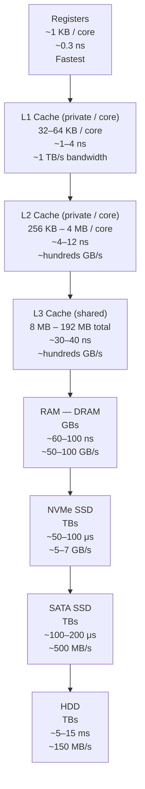
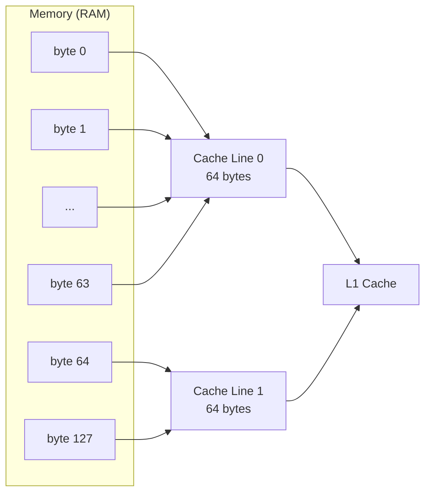
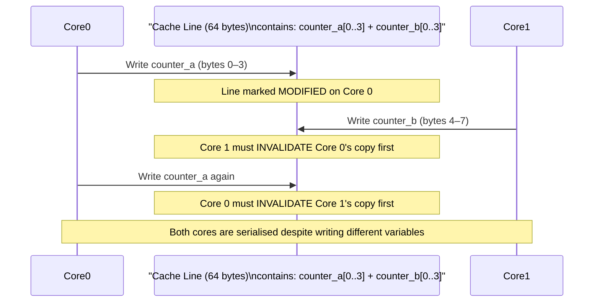
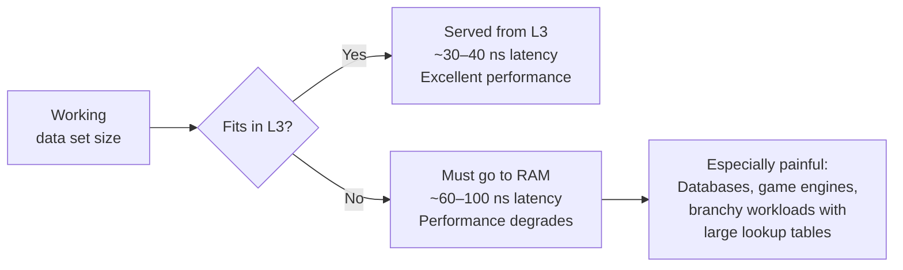

import Tabs from '@theme/Tabs';
import TabItem from '@theme/TabItem';

# Cache

> **Part of:** [CPU](./index) · [Hardware Fundamentals](../index)

The CPU cache is the single most impactful hardware concept for application-level performance. Code that fits its working set in cache runs orders of magnitude faster than code that constantly reaches out to RAM.

---

## The Memory Hierarchy

Every level is faster, more expensive, and smaller than the one below it. The CPU always tries the nearest level first.



**The key insight:** L1 cache is roughly **100× faster than RAM**. A cache miss that falls all the way to RAM stalls the CPU for 60–100 nanoseconds — enough time for 200+ wasted cycles. Programs whose working data fits in L3 run dramatically faster than those that spill to RAM constantly.

---

## Cache Lines — How Data Actually Moves

The CPU never moves individual bytes between cache levels. It moves **cache lines** — fixed 64-byte blocks. When you read a single `int` (4 bytes), the CPU fetches the entire 64-byte line containing it.



**Consequence:** accessing `array[0]` brings `array[0]` through `array[15]` (for a 4-byte int array) into L1 cache simultaneously. Accessing `array[1]` immediately after is effectively free.

---

## Cache-Friendly vs Cache-Hostile Code

<Tabs>
<TabItem value="friendly" label="Cache-Friendly (Fast)">

```python
# Sequential access — hardware prefetcher can predict and preload
total = sum(arr)  # Access arr[0], arr[1], arr[2]... same cache lines throughout

# Struct of Arrays (SoA) — process hot fields together
positions_x = [e.x for e in entities]  # All x values packed tightly
positions_y = [e.y for e in entities]  # All y values packed tightly

# When updating positions every frame:
for i in range(len(positions_x)):
    positions_x[i] += velocities_x[i]  # Accesses two tightly-packed arrays — cache-friendly
```

</TabItem>
<TabItem value="hostile" label="Cache-Hostile (Slow)">

```python
# Column-major access on a row-major array — jumps across cache lines
matrix = [[...] for _ in range(1000)]  # 1000×1000 matrix

# BAD: iterating column-first in a row-major layout
# Each matrix[row][col] access jumps ~4KB — cache thrashes
for col in range(1000):
    for row in range(1000):
        total += matrix[row][col]

# GOOD: row-first matches memory layout — same cache line hit repeatedly
for row in range(1000):
    for col in range(1000):
        total += matrix[row][col]
# The row-first version can be 5–10× faster on large matrices
```

</TabItem>
<TabItem value="struct" label="Array of Structs vs Struct of Arrays">

```rust
// Array of Structs (AoS) — bad for hot-loop access patterns
struct Entity {
    id: u64,        // 8 bytes  — queried rarely
    x: f32,         // 4 bytes  — updated every frame
    y: f32,         // 4 bytes  — updated every frame
    name: String,   // 24 bytes — almost never touched
    active: bool,   // 1 byte   — checked every frame
}
// Each Entity is ~41 bytes. To update x/y for 10,000 entities,
// we drag the unused `id` and `name` into cache unnecessarily.

// Struct of Arrays (SoA) — cache-optimal for batch processing
struct World {
    x: Vec<f32>,      // All x values packed contiguously
    y: Vec<f32>,      // All y values packed contiguously
    active: Vec<bool>,// All active flags packed contiguously
    name: Vec<String>,// Cold data — only load when needed
}
// Now the hot update loop only touches x, y, active — fits in cache perfectly.
// This is the foundation of Data-Oriented Design (DoD) used in game engines.
```

</TabItem>
</Tabs>

---

## False Sharing — A Multi-Core Cache Trap

False sharing occurs when two threads on different cores write to **different variables that happen to share a cache line**. The hardware cache coherency protocol causes the cache line to bounce between cores, serialising what should be parallel work.



**Fix:** Pad structures so each thread's data occupies its own cache line:

```rust
// Padded counter — each lives in its own 64-byte cache line
#[repr(align(64))]
struct PaddedCounter {
    value: u64,
    _pad: [u8; 56],   // Pad to 64 bytes total
}
```

---

## L3 Cache and Its Impact on Real Workloads

AMD's 3D V-Cache products (e.g., Ryzen 7 9800X3D with 96 MB L3) demonstrate how dramatically cache size affects cache-sensitive workloads:



---

## Practical Rules

| Rule | Reason |
|------|--------|
| Access arrays sequentially, not randomly | Hardware prefetcher can predict sequential access patterns |
| Group hot data together; keep cold data separate | Avoid dragging unused fields into cache lines |
| Avoid pointer-chasing in hot loops | Each pointer dereference is a potential cache miss (linked lists, trees) |
| Align thread-local data to cache line boundaries | Prevents false sharing |
| Prefer arrays and contiguous memory over scattered heap objects | Predictable access = better prefetching |

---

:::tip[Try It 🔍]
Write two versions of a 2D array sum in any language — one row-first, one column-first. Time both with a 2000×2000 matrix. The difference will be measurable and instructive. On large matrices that exceed L3 cache, the ratio often exceeds 5×.
:::
