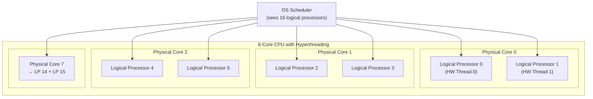
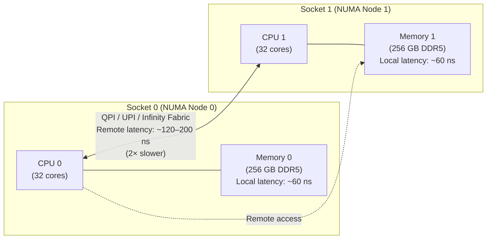
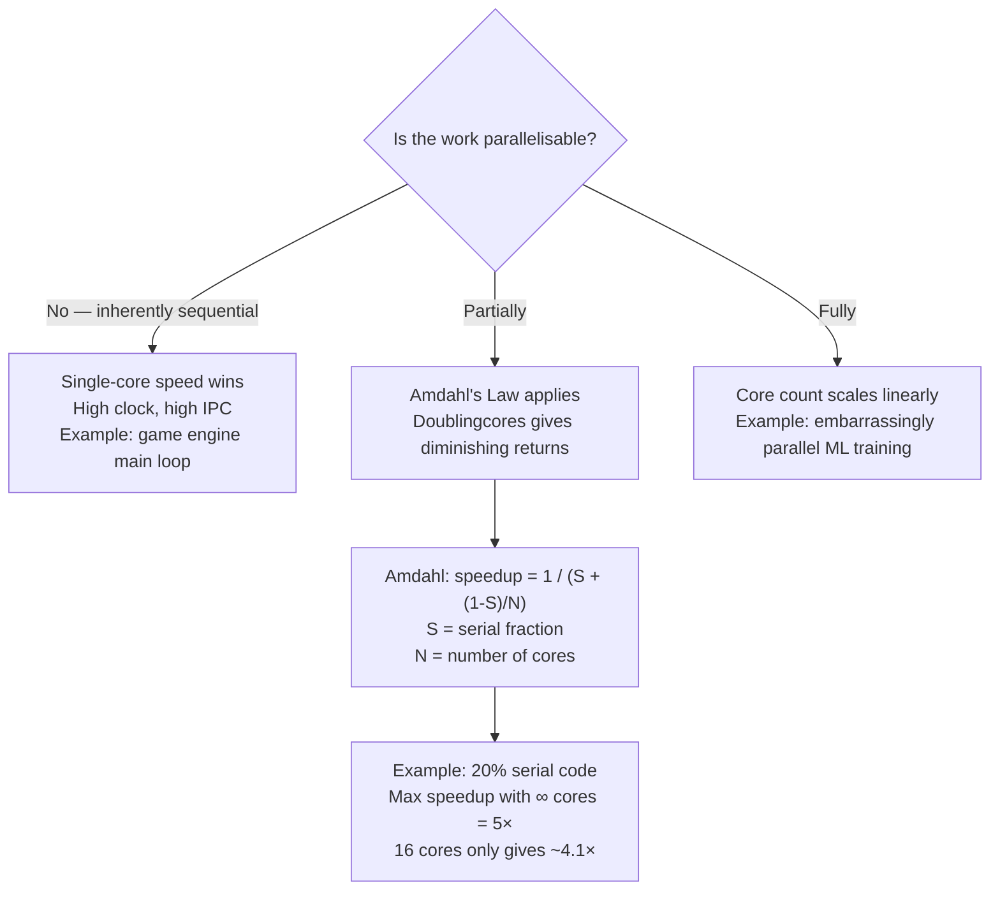

import Tabs from '@theme/Tabs';
import TabItem from '@theme/TabItem';

# Cores & Threads

> **Part of:** [CPU](./index) · [Hardware Fundamentals](../index)

Modern CPUs achieve parallelism through **physical cores** and **hardware threads**. Understanding the difference — and knowing where limits lie — is essential for writing performant server software, choosing cloud instances, and diagnosing bottlenecks.

---

## Physical Cores vs Logical Processors



| Concept | What It Is |
|---------|-----------|
| **Physical core** | A fully independent execution unit — its own registers, ALU, FPU, L1/L2 cache |
| **Logical processor** | What the OS sees. With Hyperthreading: 2 per physical core, sharing execution units |
| **Hyperthreading (Intel) / SMT (AMD)** | When one thread stalls waiting for memory, the second thread uses the idle execution units |
| **Thread (software)** | A unit of scheduled work — don't confuse with hardware threads |

**Practical impact of Hyperthreading:**
- Best case (one thread stalls a lot): ~30–40% extra throughput
- Worst case (both threads need full execution units): minimal gain, sometimes slight regression
- Disabled in some security-sensitive environments (Spectre/Meltdown mitigations)

---

## NUMA — Non-Uniform Memory Access

NUMA appears in **dual-socket server motherboards** — two physical CPUs sharing a single system.  Each CPU has RAM physically attached to it. Accessing the *other* socket's RAM crosses an interconnect and is significantly slower.



**Why this matters:**
- A process running on CPU 0 cores that allocates memory on NUMA node 1 pays 2× the memory latency penalty — on *every* memory access
- Database servers, JVMs, and in-memory caches can degrade severely if the OS scheduler ignores NUMA topology
- Cloud instances larger than 96 vCPUs are almost always NUMA systems

### Checking and Controlling NUMA

<Tabs>
<TabItem value="linux" label="Linux">

```bash
# Check NUMA topology
numactl --hardware             # Node count, memory per node, distance matrix
lstopo                         # Visual topology map (hwloc package)
lscpu | grep NUMA              # Quick NUMA node count

# Run a process pinned to NUMA node 0 (uses only local memory and cores)
numactl --cpunodebind=0 --membind=0 ./my_process

# Check NUMA memory stats
numastat                       # Per-node allocation hits/misses
numastat -p <pid>              # NUMA stats for a specific process

# Set NUMA policy for a process at runtime (Linux 5.x+)
taskset -c 0-31 ./my_process   # Pin to logical processors 0–31
```

</TabItem>
<TabItem value="windows" label="Windows (PowerShell)">

```powershell
# View NUMA nodes
Get-CimInstance Win32_Processor | Select-Object Name, NumberOfCores, SocketDesignation

# Check if system is NUMA
[System.Environment]::GetEnvironmentVariable("NUMBER_OF_PROCESSORS")
# Task Manager → Performance → CPU → right-click → Show NUMA nodes

# Set processor affinity for a process (pin to logical processors 0–31)
$proc = Start-Process "my_process.exe" -PassThru
$proc.ProcessorAffinity = [System.IntPtr]0x00000000FFFFFFFF  # Mask for first 32 LPs
```

</TabItem>
</Tabs>

---

## How Many Cores Do You Actually Need?



**Amdahl's Law in plain English:** If 20% of your program is single-threaded, adding more cores eventually stops helping — the serial section becomes the bottleneck. This is why most programs don't linearly scale with core count.

---

## Cloud Instance Sizing: Cores

| Need | Instance type | Reasoning |
|------|--------------|-----------|
| High-concurrency web server | Many vCPUs (c7i, c7g) | Requests are independent — scale with core count |
| Database (OLTP) | Moderate vCPUs + fast clock | Most queries are single-threaded |
| ML training | Many cores or GPU | Matrix ops are massively parallel |
| Background batch jobs | Burstable (t4g) | Rarely CPU-bound continuously |
| Real-time latency-sensitive | Dedicated (metal) instances | Avoid noisy-neighbour vCPU sharing |

:::tip[Research Question 🔍]
Search for "Amdahl's Law vs Gustafson's Law". Amdahl assumes a fixed problem size; Gustafson argues the workload grows with the hardware. Which model better describes how web servers scale when traffic increases?
:::
