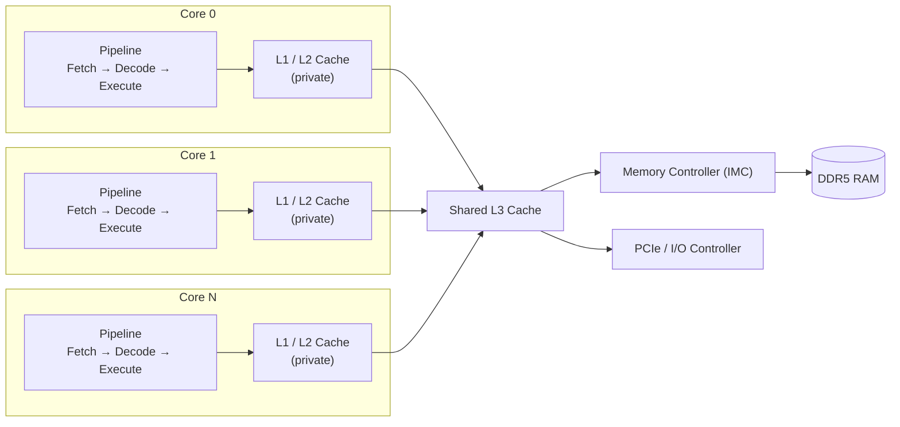
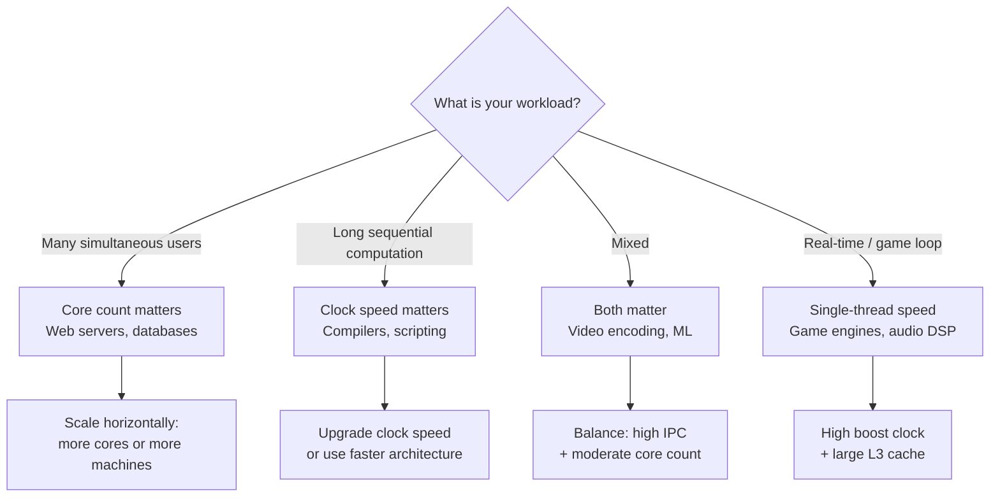

import Tabs from '@theme/Tabs';
import TabItem from '@theme/TabItem';

# CPU — Central Processing Unit

> **Part of:** [Hardware Fundamentals](../index)

> **Tool:** x86-64 ISA · **Introduced:** 1978 (x86), 2003 (x86-64/AMD64) · **Latest:** AMD Zen 5 / Intel Arrow Lake (2024–2025) · **Deprecated:** N/A · **Status:** 🟢 Modern (Foundation)

The **CPU** is the brain of every computer. It fetches instructions from memory, decodes them, executes them, and writes results back — billions of times per second. Everything your software does ultimately becomes CPU instructions.

---

## Anatomy of a Modern CPU Die



Each core is an **independent execution unit** with its own registers, instruction pipeline, and private L1/L2 cache. The L3 cache and memory controller are shared across all cores on the die.

---

## Key Terms

| Term | What it means |
|------|--------------|
| **Core** | An independent execution unit on the die. 8-core CPU = 8 parallel instruction streams |
| **Thread (HW)** | Hyperthreading: 2 logical threads share 1 core's execution units, improving utilisation when one thread stalls on memory |
| **Clock speed** | GHz = billion cycles per second. Higher = faster single-threaded work |
| **IPC** | Instructions Per Cycle — architecture efficiency. A newer CPU at 3 GHz often beats an older one at 4 GHz because IPC improved |
| **TDP** | Thermal Design Power — max heat (watts) the CPU generates under sustained load. Dictates cooling requirements |
| **Die** | The physical silicon chip. One package may contain multiple dies (chiplet design) |
| **Chiplet** | Modular design: multiple small dies in one package, cheaper to manufacture and easier to scale |
| **ISA** | Instruction Set Architecture — the contract between software and hardware. x86-64 and ARM are the dominant ISAs |

---

## Clock Speed vs Core Count

A common misconception: *more cores = faster*. Reality is more nuanced:



**Rule of thumb:** A 4 GHz 4-core CPU can handle 4 fully independent tasks at full speed. But a single-threaded task only ever uses 1 core — the other 3 sit idle. Clock speed still matters for anything that can't be parallelised.

---

## CPU Generations and Naming

<Tabs>
<TabItem value="intel" label="Intel">

```
Core i9 - 14900 K
│    │     │   │  └── Suffix
│    │     │   │        K  = unlocked / overclockable
│    │     │   │        H  = high-performance mobile
│    │     │   │        U  = ultra-low power (thin & light)
│    │     │   │        T  = low TDP (mini PCs)
│    │     │   └── Model tier within generation (900 = top of i9)
│    │     └── Generation (14 = 14th gen)
│    └── Tier
│          i3 = entry  │  i5 = mid  │  i7 = high  │  i9 = enthusiast
└── Brand
```

**Generations:** 12th (Alder Lake, 2021) → 13th (Raptor Lake) → 14th (Raptor Lake Refresh) → 15th (Arrow Lake, 2024)

Intel introduced **hybrid architecture** in 12th gen: **P-cores** (performance, out-of-order) + **E-cores** (efficiency, in-order, lower power) — similar to ARM's big.LITTLE design.

</TabItem>
<TabItem value="amd" label="AMD">

```
Ryzen 9  9950 X
│      │  │  │  └── Suffix
│      │  │  │        X   = high performance
│      │  │  │        X3D = 3D V-Cache stacked on die
│      │  │  │        G   = integrated Radeon GPU
│      │  │  └── Tier within generation (950 = top of Ryzen 9)
│      │  └── Generation (9xxx = Zen 5, 7xxx = Zen 4, 5xxx = Zen 3)
│      └── Tier
│            3 = entry  │  5 = mid  │  7 = high  │  9 = enthusiast
└── Brand
```

AMD uses **chiplet design** — separate compute dies (CCD) + I/O die (IOD) in one package, connected by AMD Infinity Fabric.

**3D V-Cache (X3D):** AMD stacks extra L3 cache (up to 192 MB) on top of the compute die using through-silicon via (TSV) bonding. Massive gains for cache-sensitive workloads like gaming.

</TabItem>
<TabItem value="arm" label="ARM (Servers / Apple)">

ARM CPUs are increasingly common in servers and developer machines:

- **Apple M-series (M1–M4):** ARM-based, unified memory architecture (CPU + GPU share the same physical RAM pool), exceptional performance-per-watt
- **AWS Graviton (3/4):** ARM Neoverse cores, typically 20–40% cheaper than x86 equivalents for cloud workloads
- **Ampere Altra:** Up to 192 ARM cores — extreme density for high-concurrency cloud workloads

ARM's advantage is **RISC efficiency**: simpler instruction decoding means lower power for the same throughput.

</TabItem>
</Tabs>

---

## Subsections

| Page | Topics |
|------|--------|
| [Cores & Threads](./cores_and_threads) | Physical cores, hyperthreading, NUMA, multi-socket servers |
| [Cache](./cache) | Memory hierarchy, cache lines, cache-friendly code |
| [Pipeline, Branch Prediction & SIMD](./pipeline) | Fetch/decode/execute, out-of-order execution, branch misprediction, AVX vectorisation |

---

## Measuring CPU Performance

<Tabs>
<TabItem value="linux" label="Linux">

```bash
# CPU topology and specs
lscpu                          # Core count, threads, cache sizes, architecture
cat /proc/cpuinfo              # Detailed per-core info including current frequency
nproc                          # Number of available logical processors

# Real-time CPU usage
htop                           # Best interactive view — press 1 to expand per-core
mpstat -P ALL 1                # Per-core stats every 1 second (sysstat package)

# Hardware performance counters (requires perf)
perf stat ./my_program                                     # Overall counters
perf stat -e cycles,instructions,cache-misses ./my_prog    # Specific events
perf record ./my_program && perf report                    # Sampling profiler

# CPU frequency and governor
cpupower frequency-info        # Current governor and frequency range
```

</TabItem>
<TabItem value="windows" label="Windows (PowerShell)">

```powershell
# CPU info
Get-CimInstance Win32_Processor |
  Select-Object Name, NumberOfCores, NumberOfLogicalProcessors, MaxClockSpeed

# Real-time performance
# Task Manager → Performance → CPU (right-click graph → Change graph to → Logical processors)
Get-Process | Sort-Object CPU -Descending | Select-Object -First 15

# Per-core usage samples
Get-Counter "\Processor(*)\% Processor Time" -SampleInterval 1 -MaxSamples 5

# Continuous total CPU polling
typeperf "\Processor(_Total)\% Processor Time" -si 1
```

</TabItem>
</Tabs>

---

:::tip[Research Question 🔍]
Look up the difference between **Intel's hybrid P-core/E-core design** and **AMD's chiplet approach**. Both were introduced around 2021–2022. What problem is each solving? Which approach scales better as core counts grow beyond 32?
:::
