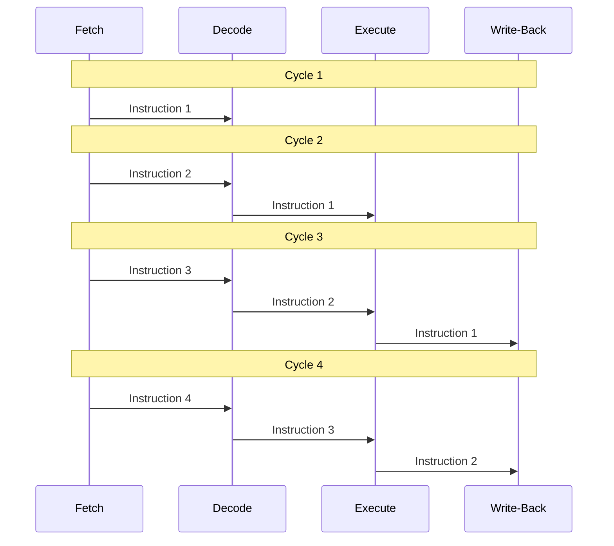
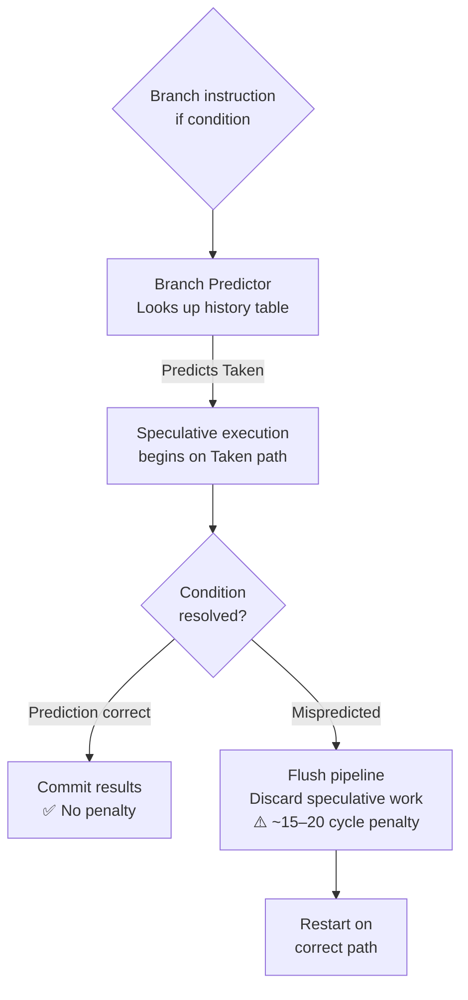
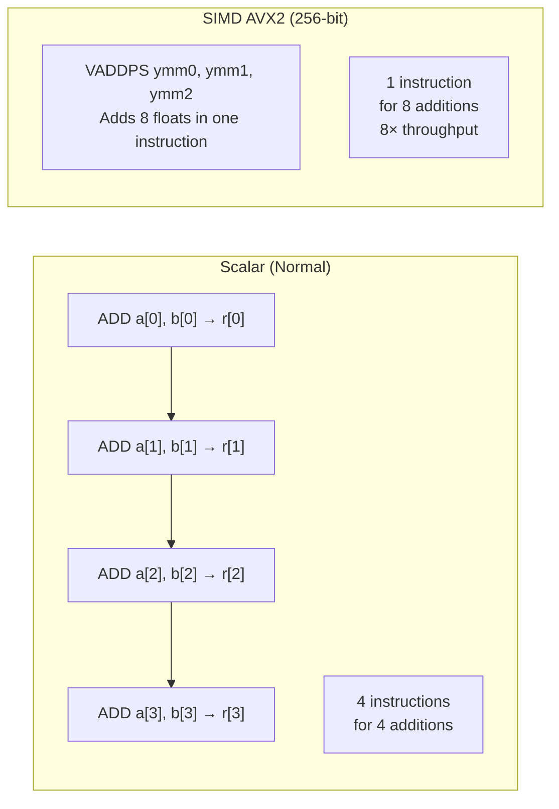

import Tabs from '@theme/Tabs';
import TabItem from '@theme/TabItem';

# Pipeline, Branch Prediction & SIMD

> **Part of:** [CPU](./index) · [Hardware Fundamentals](../index)

Modern CPUs don't execute one instruction at a time — they overlap, speculate, and vectorise. Understanding these mechanisms explains why instruction order matters, why random data can be slow, and why NumPy outperforms a Python for-loop by 100×.

---

## The Instruction Pipeline

A CPU pipeline breaks every instruction into stages so multiple instructions can be in-flight simultaneously — like an assembly line.



**Each stage:**
- **Fetch** — Load the next instruction from the L1 instruction cache
- **Decode** — Translate binary encoding into internal micro-operations (µops)
- **Execute** — Run the operation in execution units (ALU, FPU, load/store units)
- **Write-back** — Store the result in a register or L1 data cache

Modern CPUs have **out-of-order execution (OoOE):** the CPU dynamically reorders instructions to avoid stalls. If instruction 3 doesn't depend on instruction 2, it can execute first while instruction 2 waits for a memory load.

---

## Branch Prediction

At every `if` statement, the CPU must decide which branch will be taken — *before* it knows the condition's result. It guesses using history. A correct guess is free. A **misprediction flushes the pipeline** (throw away ~15–20 cycles of speculative work).



### Predictable vs Unpredictable Branches

<Tabs>
<TabItem value="predictable" label="Predictable (Fast)">

```python
# This branch is almost always taken — predictor learns quickly
data = list(range(1000))
total = 0
for i, val in enumerate(data):
    if i < 900:          # Taken 900 times, not taken 100 — very predictable
        total += val
```

```python
# Sorted data = predictable branches
data = sorted([random.randint(0, 255) for _ in range(100_000)])
total = sum(val for val in data if val > 128)
# All False values come first, then all True — predictor learns the transition
```

</TabItem>
<TabItem value="unpredictable" label="Unpredictable (Slow)">

```python
import random

# Random data = ~50% misprediction rate
data = [random.randint(0, 255) for _ in range(100_000)]
total = sum(val for val in data if val > 128)
# Predictor can't learn a pattern — mispredicts ~half the time
```

**Classic trick:** sorting the same data before filtering can be *faster* than filtering unsorted data, even though sorting has O(n log n) cost — because the sorted version eliminates mispredictions.

</TabItem>
<TabItem value="branchless" label="Branchless Alternative">

```rust
// Branchless: compute both paths, select result with a mask
// No branch = no misprediction penalty
let mask = (val > 128) as i64;    // 1 if true, 0 if false
total += val * mask;               // Either adds val or adds 0

// Rust's compiler often generates branchless code automatically from:
total += if val > 128 { val } else { 0 };
```

Compilers and CPUs increasingly handle this automatically, but knowing the pattern helps when profiling branch misprediction events with `perf stat -e branch-misses`.

</TabItem>
</Tabs>

---

## Spectre & Meltdown — When Speculation Goes Wrong

Branch prediction's speculative execution famously led to **Spectre** and **Meltdown** (2018) — vulnerabilities where speculatively executed code could read kernel or other processes' memory through cache timing side channels, even though the speculative results were never committed.

The mitigations (retpoline, IBRS, page table isolation) cause measurable performance penalties — 5–30% on I/O-heavy workloads. This is why some high-security environments disable Hyperthreading entirely.

---

## SIMD — Single Instruction, Multiple Data

**SIMD** lets one CPU instruction operate on multiple values simultaneously using wide registers.



### SIMD Instruction Sets (x86-64)

| ISA | Register width | Floats / instruction | Introduced |
|-----|---------------|---------------------|-----------|
| SSE2 | 128-bit | 4 × f32 or 2 × f64 | 2001 |
| AVX / AVX2 | 256-bit | 8 × f32 or 4 × f64 | 2011 / 2013 |
| AVX-512 | 512-bit | 16 × f32 or 8 × f64 | 2017 (server); 2022 (desktop) |

ARM equivalents: **NEON** (128-bit, standard on ARM), **SVE / SVE2** (scalable width, used in Apple M-series and AWS Graviton3).

### How You Encounter SIMD in Practice

You rarely write SIMD intrinsics by hand. Instead:

<Tabs>
<TabItem value="python" label="Python / NumPy">

```python
import numpy as np

# Pure Python — scalar, no SIMD
result = [a + b for a, b in zip(list_a, list_b)]  # slow

# NumPy — uses AVX2/AVX-512 internally via BLAS/OpenBLAS
a = np.array(list_a, dtype=np.float32)
b = np.array(list_b, dtype=np.float32)
result = a + b   # This single operation uses SIMD internally — 8–16× faster

# Matrix multiply — highly SIMD-optimised
C = np.matmul(A, B)   # Uses BLAS dgemm — this is why NumPy crushes Python loops
```

</TabItem>
<TabItem value="rust" label="Rust">

```rust
// Compiler auto-vectorisation — most reliable approach
// Compile with: rustc -C opt-level=3 -C target-cpu=native
fn sum_floats(data: &[f32]) -> f32 {
    data.iter().sum()  // Compiler generates AVX2 vector instructions automatically
}

// Explicit SIMD via std::simd (nightly / Rust 1.79+)
#![feature(portable_simd)]
use std::simd::f32x8;

fn add_arrays(a: &[f32; 8], b: &[f32; 8]) -> [f32; 8] {
    let va = f32x8::from_slice(a);
    let vb = f32x8::from_slice(b);
    (va + vb).to_array()
}
```

</TabItem>
<TabItem value="typescript" label="TypeScript (WASM / BLAS)">

```typescript
// Browser JS engines apply SIMD to TypedArrays automatically in some cases
const a = new Float32Array(1000);
const b = new Float32Array(1000);
const result = new Float32Array(1000);

// V8 can auto-vectorize simple typed array loops
for (let i = 0; i < a.length; i++) {
  result[i] = a[i] + b[i];
}

// For heavy math: use WebAssembly with SIMD intrinsics,
// or a library like ml-matrix which is compiled with SIMD support.
```

</TabItem>
</Tabs>

### When SIMD Cannot Help

SIMD requires:
- **Uniform operations** — the same operation on every element
- **Contiguous data** — packed in memory (arrays, not linked lists)
- **No dependencies between lanes** — `result[i]` must not depend on `result[i-1]`
- **No branches per element** — branchless or masked operations only

Random access patterns, pointer-chasing, and branch-heavy per-element logic prevent auto-vectorisation.

---

## Measuring Pipeline & SIMD Effects

```bash
# Linux — hardware performance counters
perf stat -e cycles,instructions ./my_program
# IPC = instructions / cycles — higher is better (modern CPUs target 2–5 IPC)

perf stat -e branch-misses,branch-instructions ./my_program
# Branch miss rate = branch-misses / branch-instructions — target < 1%

perf stat -e cache-misses,cache-references ./my_program
# Cache miss rate — above 5% for L3 is a red flag for hot loops

# Check if compiler vectorised your loop:
# GCC/Clang with -O3 -fopt-info-vec-optimized will annotate which loops got vectorised
```

---

:::tip[Research Question 🔍]
Look up **Spectre variant 1** and how retpoline mitigates it. Why can't you just "fix" speculative execution in hardware without a major architectural redesign? What does this say about the cost of the performance optimisations CPUs have accumulated since the 1990s?
:::
