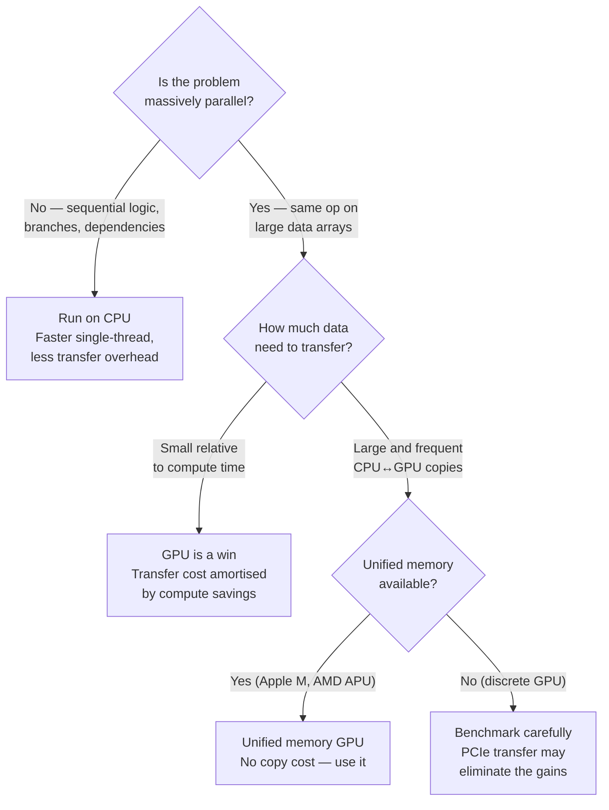
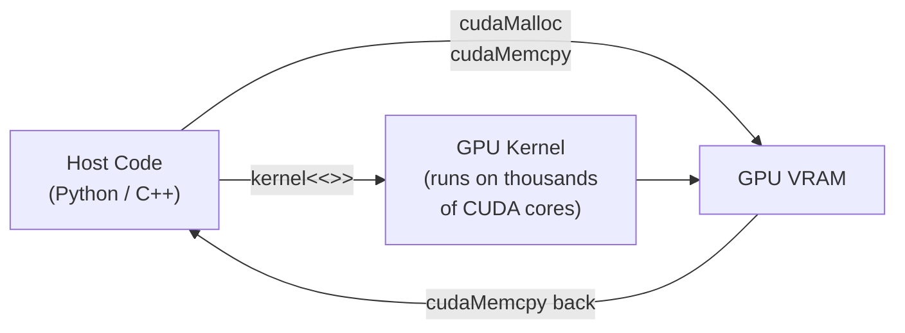
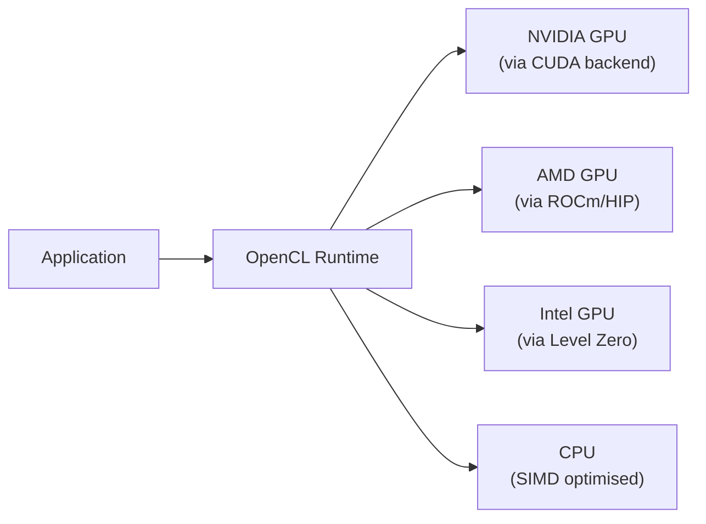
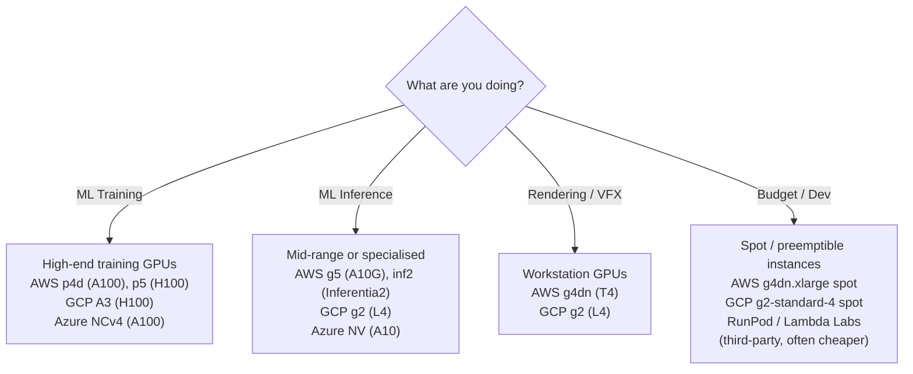

import Tabs from '@theme/Tabs';
import TabItem from '@theme/TabItem';

# GPU Compute — CUDA, OpenCL & Cloud

> **Part of:** [GPU](./index) · [Hardware Fundamentals](../index)

> **Tool:** CUDA · **Introduced:** 2007 · **Latest:** CUDA 12.x (2024) · **Deprecated:** N/A · **Status:** 🟢 Modern
> **Tool:** OpenCL · **Introduced:** 2009 · **Latest:** OpenCL 3.0 (2020) · **Deprecated:** N/A · **Status:** 🟡 Legacy (cross-vendor but losing ground to vendor-specific APIs)
> **Tool:** ROCm · **Introduced:** 2016 · **Latest:** ROCm 6.x (2024) · **Deprecated:** N/A · **Status:** 🟢 Modern (AMD)

---

## Choosing Between CPU and GPU

Not all computations benefit from GPU offloading. The key question is: **can the work be decomposed into thousands of independent, identical tasks?**



### Workload Examples

| Workload | Best device | Reason |
|---------|------------|--------|
| Neural network training | GPU | Matrix multiply = SIMT paradise |
| LLM inference (small batch) | GPU or CPU | Depends on model size vs VRAM |
| Video encoding | GPU (NVENC/AMF) | Frame processing is embarrassingly parallel |
| Web server request handling | CPU | Complex control flow, low parallelism |
| Database query (OLTP) | CPU | Single-row lookups, sequential |
| Physics simulation | GPU | Many bodies with identical force equations |
| Cryptography (hash cracking) | GPU | Same hash function on millions of inputs |
| Compilation | CPU | Inherently sequential, complex dependency resolution |

---

## CUDA — NVIDIA's Compute Platform

CUDA (Compute Unified Device Architecture) is NVIDIA's proprietary platform for writing GPU programs. It uses an extended C/C++/Python dialect and compiles to PTX (Parallel Thread Execution) bytecode before running on the GPU.



### CUDA Execution Model (Conceptual)

| Term | Description |
|------|-------------|
| **Kernel** | A GPU function that runs once per thread |
| **Thread** | One execution instance — maps to one CUDA core |
| **Block** | A group of 32–1024 threads that share Shared Memory and can synchronise |
| **Grid** | All blocks launched by one kernel call — can be millions of threads total |
| **Warp** | 32 threads that execute the same instruction simultaneously (hardware unit) |

### Accessing CUDA from Python

You usually don't write CUDA kernels directly. Libraries do it for you:

<Tabs>
<TabItem value="pytorch" label="PyTorch">

```python
import torch

# Check GPU availability
device = "cuda" if torch.cuda.is_available() else "cpu"
print(torch.cuda.get_device_name(0))      # e.g. "NVIDIA RTX 4090"
print(torch.cuda.get_device_properties(0).total_memory // 1024**3, "GB")

# Move tensors to GPU — operations now run on GPU automatically
a = torch.randn(10_000, 10_000, device=device)
b = torch.randn(10_000, 10_000, device=device)
c = a @ b   # Matrix multiply — runs entirely on GPU via cuBLAS

# Move result back to CPU
result = c.cpu().numpy()
```

</TabItem>
<TabItem value="numba" label="Numba (Custom CUDA Kernels)">

```python
from numba import cuda
import numpy as np

# Write a custom CUDA kernel in Python
@cuda.jit
def add_kernel(a, b, result):
    # Each thread handles one element
    i = cuda.grid(1)   # Thread's global index
    if i < result.size:
        result[i] = a[i] + b[i]

# Allocate and run
N = 1_000_000
a = np.random.rand(N).astype(np.float32)
b = np.random.rand(N).astype(np.float32)
result = np.zeros(N, dtype=np.float32)

threads_per_block = 256
blocks = (N + threads_per_block - 1) // threads_per_block

add_kernel[blocks, threads_per_block](a, b, result)
```

</TabItem>
<TabItem value="cupy" label="CuPy">

```python
import cupy as cp   # NumPy-compatible API on top of CUDA

# Almost identical API to NumPy — runs on GPU
a = cp.random.rand(10_000_000, dtype=cp.float32)
b = cp.random.rand(10_000_000, dtype=cp.float32)
result = a + b   # Runs on GPU via CUDA

# Transfer back to CPU (NumPy)
result_cpu = cp.asnumpy(result)
```

</TabItem>
</Tabs>

---

## OpenCL — Cross-Vendor Compute

**OpenCL** is an open standard for GPU compute that works across NVIDIA, AMD, Intel, and ARM GPUs. It's more portable than CUDA but more verbose, and has lost significant industry mindshare to vendor-specific APIs.



**When to use OpenCL:** Cross-vendor requirements, embedded systems, industrial hardware. In general-purpose ML work, PyTorch/CUDA is the de facto standard.

---

## ROCm — AMD's Compute Platform

**ROCm** (Radeon Open Compute) is AMD's answer to CUDA. It includes:
- **HIP** — A CUDA-compatible API (most CUDA code ports with minimal changes)
- **rocBLAS / rocSolver** — AMD equivalents of cuBLAS
- **MIOpen** — AMD's equivalent to cuDNN (deep learning primitives)

PyTorch supports ROCm natively; many CUDA codebases port to ROCm using HIP with `hipcc`.

---

## Cloud GPU Instances

You don't need to own a GPU to use one. All major cloud providers offer GPU instances:



### AWS GPU Instance Families at a Glance

| Family | GPU | VRAM | Best for |
|--------|-----|------|---------|
| `g4dn` | Tesla T4 | 16 GB | Inference, rendering, dev |
| `g5` | A10G | 24 GB | Large model inference, fine-tuning |
| `p3` | V100 | 16/32 GB | Training (older generation) |
| `p4d` | A100 40 GB | 40 GB × 8 | Large model training |
| `p5` | H100 80 GB | 80 GB × 8 | Frontier model training |
| `inf2` | AWS Inferentia2 | — | Inference-only, very cost-effective |
| `trn1` | AWS Trainium | — | Training-only custom silicon |

**Cost tip:** GPU spot instances can be 70–90% cheaper than on-demand. Use spot for training jobs that checkpoint regularly.

---

:::tip[Research Question 🔍]
Look up the difference between **CUDA cores**, **Tensor Cores**, and **RT Cores** on a modern NVIDIA GPU (e.g. RTX 4090). Tensor Cores are what makes modern ML training fast. What operation do they specifically accelerate, and why does matrix multiply benefit so much from them?
:::
