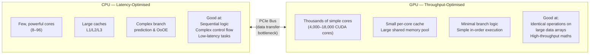
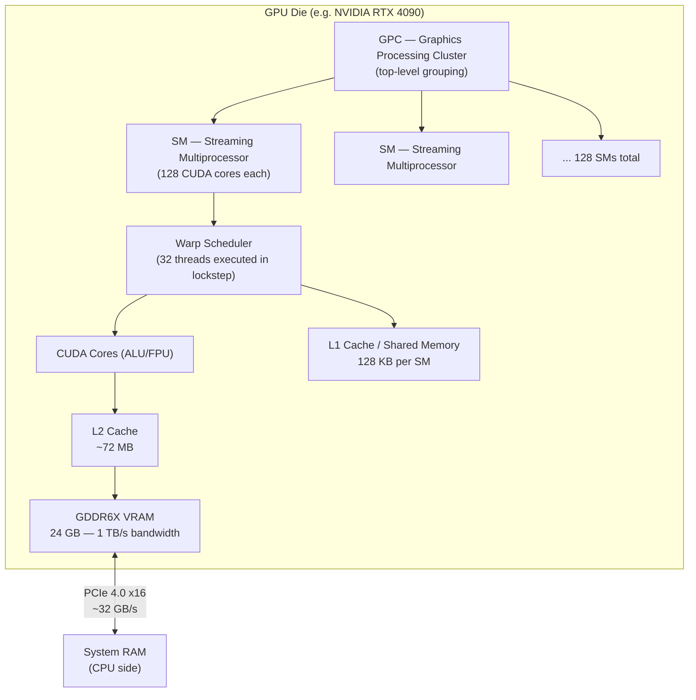
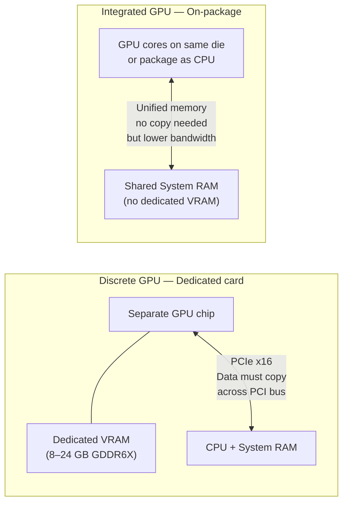

import Tabs from '@theme/Tabs';
import TabItem from '@theme/TabItem';

# GPU — Graphics Processing Unit

> **Part of:** [Hardware Fundamentals](../index)

> **Tool:** CUDA · **Introduced:** 2007 (CUDA 1.0) · **Latest:** CUDA 12.x (2024) · **Deprecated:** N/A · **Status:** 🟢 Modern

The **GPU** was designed to render graphics — a task requiring millions of identical, independent calculations per frame. That same architecture turned out to be ideal for machine learning, scientific simulation, and any workload with massive parallelism.

---

## CPU vs GPU Architecture

The fundamental design difference explains everything about when to use each:



**Rule of thumb:** Use the CPU for control flow and coordination; use the GPU for bulk parallel computation.

---

## Anatomy of a GPU



| Component | What it does |
|-----------|-------------|
| **SM (Streaming Multiprocessor)** | The basic compute unit — analogous to a CPU core but far simpler |
| **CUDA Core** | A single ALU/FPU. Executes one float operation per clock |
| **Warp** | 32 threads that execute the same instruction in lockstep (SIMT — Single Instruction, Multiple Threads) |
| **Shared Memory** | Fast, programmer-managed scratchpad inside each SM — analogous to L1 cache but explicitly controlled |
| **VRAM** | Dedicated GPU memory — extremely high bandwidth (~1 TB/s) but separate from system RAM |
| **GDDR6X** | High-bandwidth DRAM designed for GPUs. Much faster bandwidth than DDR5 but higher latency and cost per GB |

---

## Discrete vs Integrated GPU



| | Discrete GPU | Integrated GPU |
|---|---|---|
| **Examples** | NVIDIA RTX 4090, AMD RX 7900 XTX | Intel Iris Xe, Apple M4, AMD Radeon 890M |
| **VRAM** | Dedicated (8–24 GB GDDR6X) | Shared with system RAM |
| **Bandwidth** | ~1 TB/s (GDDR6X) | 50–400 GB/s (depends on system RAM type) |
| **Power draw** | 150–600W | 15–50W |
| **Best for** | ML training, gaming, rendering | Battery-powered workloads, light inference, display |
| **Unified memory** | No — must copy CPU↔GPU | Yes — Apple M-series strength |

**Apple M-series special case:** The CPU, GPU, and Neural Engine all share the same physical RAM pool with no PCIe bus in between. Large language models run effectively because the GPU can access the entire 128 GB of system memory at ~400 GB/s — impossible with a discrete GPU limited to 24 GB VRAM.

---

## Subsections

| Page | Topics |
|------|--------|
| [GPU Compute — CUDA, OpenCL & Cloud](./compute) | Compute APIs, CPU vs GPU workload selection, cloud GPU instances |

---

## Measuring GPU Performance

<Tabs>
<TabItem value="linux" label="Linux">

```bash
# NVIDIA GPU stats
nvidia-smi                         # Quick status: utilisation, VRAM, temperature
nvidia-smi dmon -s u               # Continuously poll GPU and memory utilisation
nvidia-smi --query-gpu=name,memory.total,memory.used,utilization.gpu --format=csv

# AMD GPU stats
rocm-smi                          # AMD equivalent of nvidia-smi
radeontop                         # Real-time AMD GPU usage monitor

# GPU in use by which process
nvidia-smi pmon -s u              # Per-process GPU utilisation
fuser /dev/nvidia*                # Processes using NVIDIA device files
```

</TabItem>
<TabItem value="windows" label="Windows">

```powershell
# Task Manager → Performance → GPU (shows VRAM, utilisation, dedicated vs shared)

# PowerShell: list GPU adapters
Get-CimInstance Win32_VideoController | Select-Object Name, AdapterRAM, DriverVersion

# GPU utilisation via counter
Get-Counter "\GPU Engine(*)\Utilization Percentage"

# NVIDIA: install nvidia-smi from NVIDIA driver package, then:
nvidia-smi
nvidia-smi dmon
```

</TabItem>
</Tabs>

---

:::tip[Research Question 🔍]
Search for "unified memory architecture Apple M-series" and compare it to how NVIDIA handles CPU-GPU data transfers. Why does NVIDIA's `cudaMemcpy` call exist, and what would need to change in hardware to eliminate it?
:::
