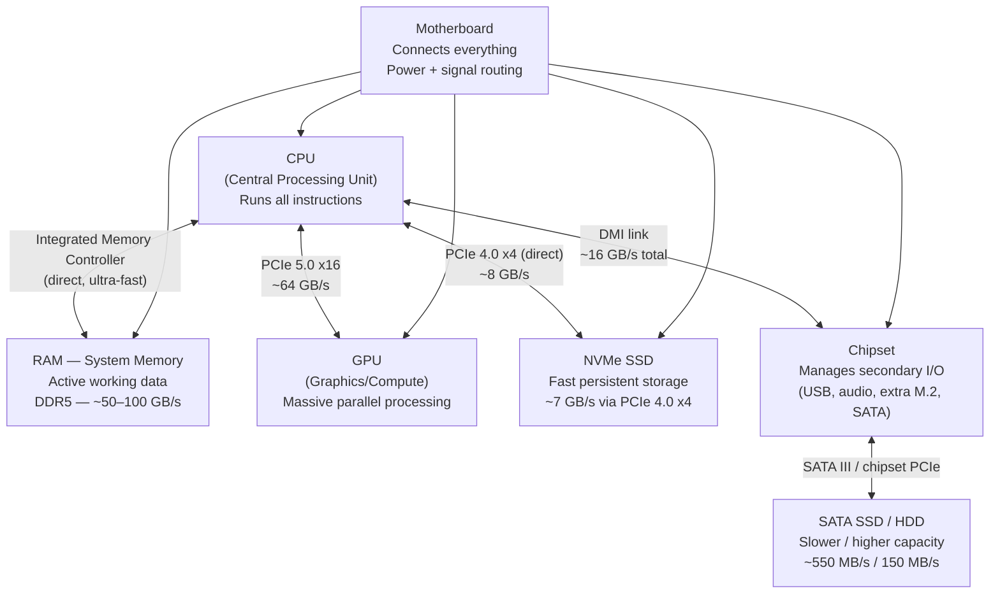

import Tabs from '@theme/Tabs';
import TabItem from '@theme/TabItem';

# Hardware Fundamentals

**Domain:** Foundations · **Time Estimate:** 2–3 weeks · **Relevant to:** Systems Programming, DevOps, Cloud, Performance, AI/ML

> **Prerequisites:** [OS Concepts](../os_concepts.md) is recommended but not required — this section stands independently.
>
> **Who needs this:** Systems programmers, DevOps engineers, performance engineers, anyone sizing cloud instances, and anyone asking *why* their software runs the way it does. You don't need to build hardware — but knowing how it works explains behaviour that otherwise looks like magic.

---

## 🎯 Learning Objectives

By the end of this section, you will be able to:

- [ ] Describe how the CPU, GPU, RAM, motherboard, and storage connect and communicate
- [ ] Explain the CPU pipeline, cache hierarchy, and branch prediction and their effect on code performance
- [ ] Describe what SIMD is and why NumPy is faster than a Python for-loop
- [ ] Explain the difference between physical cores, hyperthreading, and NUMA
- [ ] Describe GPU architecture and identify when to use a GPU over a CPU
- [ ] Explain PCIe lanes, generations, and how NVMe drives use them
- [ ] Choose between NVMe SSD, SATA SSD, and HDD for a given workload and budget
- [ ] Choose an appropriate cloud instance type based on workload hardware requirements
- [ ] Use OS tools to measure CPU, GPU, and storage performance

---

## How a PC's Components Connect

Every data path has a bandwidth and latency. When your program waits for data, it is waiting somewhere on this diagram. Performance engineering is the art of keeping data as close to the CPU as possible.

---

## 📚 Sections

### CPU

| Page | Topics |
|------|--------|
| [CPU Overview](./cpu/index) | Die anatomy, cores, clock speed, IPC, TDP, naming conventions |
| [Cores & Threads](./cpu/cores_and_threads) | Physical cores vs hyperthreading, NUMA, Amdahl's Law |
| [Cache](./cpu/cache) | Memory hierarchy, cache lines, cache-friendly code, false sharing |
| [Pipeline, Branch Prediction & SIMD](./cpu/pipeline) | Fetch/decode/execute, OoOE, branch misprediction cost, AVX vectorisation |

### GPU

| Page | Topics |
|------|--------|
| [GPU Overview](./gpu/index) | Shader cores, VRAM, memory bus, CPU vs GPU architecture, discrete vs integrated |
| [GPU Compute](./gpu/compute) | CUDA, OpenCL, ROCm, PyTorch/Numba examples, cloud GPU instances |

### Motherboard

| Page | Topics |
|------|--------|
| [Motherboard Overview](./motherboard/index) | CPU sockets, RAM slots, chipset role, BIOS/UEFI, XMP/EXPO, form factors |
| [PCIe](./motherboard/pcie) | Lanes, slot widths, Gen 3/4/5 bandwidth, NVMe-on-PCIe, bifurcation, NVLink |

### Storage

| Page | Topics |
|------|--------|
| [Storage Overview](./storage/index) | Latency hierarchy, interface comparison, cloud storage types |
| [SSD](./storage/ssd) | NVMe vs SATA, NAND cell types (TLC/MLC/SLC/QLC), write cliff, wear levelling |
| [HDD](./storage/hdd) | Platter mechanics, seek time, CMR vs SMR, when HDDs still make sense, RAID basics |

---

## 🏗️ Assignments

### Assignment 1 — Cache Line Experiment

Demonstrate the cache effect with measurement:

- [ ] Write two functions that sum a 2000×2000 matrix: row-major access and column-major access
- [ ] Time both versions. Record your results in a table (size, row-first time, col-first time, ratio)
- [ ] Write a paragraph explaining *why* the results differ, referencing cache lines
- [ ] ⭐ Stretch: vary the matrix size from 100×100 to 5000×5000 and plot where the performance cliff appears (hint: it's around your CPU's L3 cache size)

---

### Assignment 2 — GPU Awareness Check

Answer these questions using only documentation and benchmarks (no code required):

- [ ] Find the CUDA core count, VRAM size, and memory bandwidth of: (a) NVIDIA RTX 4060, (b) AWS g5.xlarge GPU, (c) Apple M3 Pro GPU
- [ ] For each, would it be adequate for fine-tuning a 7B parameter LLM? Why or why not?
- [ ] What is the PCIe generation and lane width connecting the GPU to the CPU in a standard desktop?
- [ ] Calculate the maximum theoretical GPU-to-CPU transfer rate for that configuration

---

### Assignment 3 — Cloud Instance Chooser

Build a simple instance recommender:

- [ ] Define at least 5 workload profiles: `web_server`, `ml_training`, `database_oltp`, `video_encoding`, `log_archive`
- [ ] For each profile, identify the primary bottleneck: CPU (cores vs clock), GPU, RAM, storage IOPS, or storage throughput
- [ ] Map each to an AWS instance family with justification (c, m, r, p, g, i series)
- [ ] Produce a markdown table: workload → bottleneck → instance family → why

---

## ✅ Milestone Checklist

- [ ] Can explain the memory hierarchy from registers to HDD without notes, including approximate latency at each level
- [ ] Can explain what a cache line is and identify cache-friendly vs cache-hostile access patterns
- [ ] Can explain the difference between a physical core, a hardware thread, and a software thread
- [ ] Can describe GPU vs CPU architecture trade-offs and identify which workloads benefit from GPUs
- [ ] Can explain what PCIe lanes are and why an NVMe SSD is faster than a SATA SSD
- [ ] Can distinguish CMR from SMR drives and explain why it matters for NAS builds
- [ ] Assignment 1 completed with measurable timing results
- [ ] Assignment 3 table completed and reasoned

---

## 🏆 Milestone Complete!

> **You now understand the machine under your code.**
>
> This knowledge makes you dangerous in performance conversations, cloud cost reviews,
> and architecture discussions. Most developers treat hardware as a black box — you don't.
> You know why your matrix loop is slow, why your NVMe is 10× faster than the old SATA drive,
> why your GPU handles inference so much faster than your CPU, and how to pick the right
> cloud instance for any workload.

**Log this in your kanban:** Move `foundations/hardware_fundamentals` to ✅ Done.
