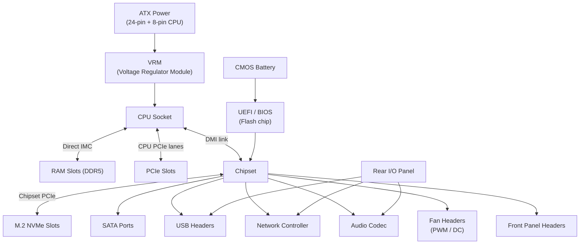
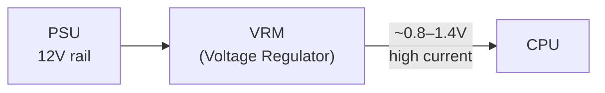

import Tabs from '@theme/Tabs';
import TabItem from '@theme/TabItem';

# Motherboard

> **Part of:** [Hardware Fundamentals](../index)

The **motherboard** (also called mainboard or system board) is the central circuit board that connects every component in a computer. It provides the electrical pathways, power delivery, and communication buses through which the CPU, RAM, GPU, and storage all communicate.

---

## Subsections

| Page | Topics |
|------|--------|
| [PCIe](./pcie) | PCIe lanes, slot widths, Gen 3/4/5 bandwidth, NVMe-on-PCIe, bifurcation, NVLink |
| [Power Delivery & VRM](./vrm) | VRM phases, CPU power stages, 12VHPWR, power limits |
| [Connectivity & I/O](./connectivity) | USB standards, Thunderbolt, 2.5GbE/Wi-Fi, rear I/O, onboard headers |

---

## Motherboard Anatomy



---

## CPU Socket

The socket is the physical connector that holds the CPU. CPU and motherboard sockets must match exactly — there is no cross-compatibility between socket generations.

| Platform | Socket | Compatible CPUs |
|---------|-------|----------------|
| Intel 14th/15th gen | LGA1851 | Core Ultra 200 series |
| Intel 13th/14th gen | LGA1700 | Core i3/i5/i7/i9 12th–14th gen |
| AMD Ryzen 7000/9000 | AM5 | Ryzen 7xxx, 9xxx (Zen 4/5) |
| AMD Ryzen 5000 | AM4 | Ryzen 3xxx, 5xxx (Zen 2/3) |
| Intel Xeon (server) | LGA4677 | Xeon Scalable 4th/5th gen |
| AMD EPYC (server) | SP5 | EPYC 9000-series (Genoa/Turin) |

**LGA vs PGA:** Intel uses **LGA** (pin-on-socket — pins are in the socket, flat pads on the CPU). AMD historically used **PGA** (pin-on-CPU) but switched to LGA with AM5. Bent pins on an LGA socket or a PGA CPU are a $300–500 mistake — handle carefully.

---

## VRM — Voltage Regulator Module

The VRM converts the 12V from the power supply down to the CPU's actual operating voltage (~0.8–1.4V). Without it, the CPU would receive far too much voltage.



**Why VRM quality matters:**

| VRM attribute | Effect |
|--------------|--------|
| **Phase count** | More phases = lower current per inductor = less heat, smoother voltage |
| **Component quality** | Cheap capacitors/inductors throttle under sustained load and degrade faster |
| **Heatsink** | Exposed VRMs throttle during long workloads — critical for Ryzen OC and Xeon builds |

Budget boards often have fewer VRM phases and smaller heatsinks. Under sustained CPU-intensive workloads (rendering, compiling, ML training), the VRM can throttle the CPU even if the CPU itself is running well under its thermal limit. This is a common cause of unexpected performance degradation on cheap boards with power-hungry CPUs.

**Power connectors:**
- **24-pin ATX** — motherboard main power (12V/5V/3.3V rails for everything except CPU)
- **8-pin EPS12V (CPU power)** — dedicated 12V feed directly to the VRM for the CPU
- High-end boards may use a **2×8-pin** or **16-pin 12VHPWR** for extreme OC

---

## RAM Slots

**Dual-channel:** Populating matching slots (e.g. A1 + B1) doubles the memory bandwidth by using two independent 64-bit buses simultaneously. Most consumer platforms support dual-channel; servers support quad- or octal-channel.

```
4 DIMM slots (typical):   A2  A1  | B2  B1
                          ─────────────────
2 sticks (optimal):            A1  |      B1   ← dual-channel
2 sticks (sub-optimal):   A2     |      B2    ← may be single-channel on some boards
4 sticks:                 A2  A1  | B2  B1   ← dual-channel, more capacity
```

Always check your motherboard manual for the recommended slot population order — it varies.

**DDR generations:**

| Gen | Max speed | Dual-channel bandwidth | Voltage | Slot keying |
|-----|-----------|----------------------|---------|------------|
| DDR4 | 3200–5333 MT/s | ~50 GB/s | 1.2V | Not compatible with DDR5 |
| DDR5 | 4800–9600+ MT/s | ~100+ GB/s | 1.1V | Not compatible with DDR4 |

DDR4 and DDR5 DIMMs use different physical keying — they cannot be swapped.

**XMP / EXPO:** RAM ships at base JEDEC speed (e.g. DDR5-4800). Enabling **XMP** (Intel) or **EXPO** (AMD) in UEFI loads the manufacturer's tested profile (e.g. DDR5-6000 CL30), boosting memory performance significantly. Always enable this after a new build.

---

## Chipset

The chipset is the secondary controller chip that handles everything the CPU doesn't manage directly. The CPU connects to the chipset via a fixed-bandwidth link (Intel's **DMI**, AMD's **Infinity Fabric**).

| What the CPU manages directly | What the chipset manages |
|-------------------------------|-------------------------|
| Primary PCIe lanes (GPU, primary M.2) | Additional PCIe lanes (secondary M.2, secondary GPU slots) |
| Integrated Memory Controller (RAM) | SATA ports |
| CPU-to-chipset link | USB 3.2 Gen 2 / Thunderbolt headers |
| | Audio codec |
| | Network controller (2.5GbE, Wi-Fi) |
| | Fan controller headers |
| | BIOS/UEFI flash chip |

**Chipset tiers (Intel example):**

| Chipset | OC support | PCIe lanes | Target |
|---------|-----------|-----------|--------|
| Z890 | ✅ Full | Most | Enthusiast / gaming |
| B860 | ⚠️ Limited (E-cores only on 15th gen) | Fewer | Mid-range |
| H810 | ❌ None | Minimal | Budget / OEM |

**AMD X870 / B850** follow a similar tier pattern.

---

## BIOS / UEFI

**BIOS** (Basic Input/Output System) was the original firmware standard. Modern systems use **UEFI** (Unified Extensible Firmware Interface), which is technically different but still commonly called the "BIOS."

**What UEFI does at power-on:**

1. **POST (Power-On Self Test)** — verify CPU, RAM, and storage are detected
2. **Hardware initialisation** — set up memory timings, PCIe link training
3. **Boot device selection** — check the boot order, hand off to the OS bootloader
4. **Secure Boot** — verify the bootloader is cryptographically signed (prevents bootkits)

**Key settings worth knowing:**

| Setting | What it does |
|---------|-------------|
| **XMP / EXPO** | Enable manufacturer RAM overclock profile |
| **Resizable BAR (ReBAR)** | Allows CPU to access all of GPU VRAM at once — GPU performance improvement in games |
| **VT-x / AMD-V** | Enable CPU virtualisation — required for VMware, VirtualBox, Hyper-V, WSL2 |
| **IOMMU** | Required for PCIe passthrough in VMs |
| **CPU power limits (PL1/PL2)** | Cap how much power the CPU can draw — affects sustained multi-core performance |
| **Fan curves** | Control fan speed vs temperature response |
| **Secure Boot** | Required for Windows 11; may need to be disabled for some Linux boot media |

**CMOS battery:** A small coin-cell battery (CR2032) keeps the UEFI configuration and real-time clock alive when the system is powered off. When the CMOS battery dies, the UEFI resets to defaults and the system clock loses time. CMOS batteries typically last 5–10 years.

---

## Fan Headers

Motherboards provide dedicated fan headers to control cooling:

| Header label | Purpose | Typical count |
|-------------|---------|--------------|
| **CPU_FAN** | CPU cooler — motherboard monitors this to trigger shutdowns if absent | 1 |
| **CPU_OPT** | Secondary CPU cooler fan (AIO pump or second fan) | 1 |
| **SYS_FAN / CHA_FAN** | Case fans | 4–8 |
| **AIO_PUMP** | All-in-one liquid cooler pump — runs at full speed always | 1 |
| **W_PUMP+** | High-current header for custom loop pumps | 1 (high-end boards) |

**PWM vs DC control:**
- **PWM (4-pin):** Fan speed controlled by duty cycle signal — precise, works at low speeds
- **DC (3-pin):** Fan speed controlled by varying voltage — less precise, minimum speed is higher

All modern chassis fans are PWM. Always connect the CPU cooler to the `CPU_FAN` header — the motherboard will shut down if it doesn't detect fan rotation there.

---

## Rear I/O Panel

The rear panel is fixed by the motherboard manufacturer and usually includes:

| Port / connector | Standard | Speed |
|----------------|---------|-------|
| **USB-A 3.2 Gen 1** | USB 3.2 / 5 Gbps | 5 Gb/s (~500 MB/s) |
| **USB-A 3.2 Gen 2** | USB 3.2 / 10 Gbps | 10 Gb/s (~1,000 MB/s) |
| **USB-C 3.2 Gen 2×2** | USB 3.2 / 20 Gbps | 20 Gb/s |
| **USB-C Thunderbolt 4** | TB4 / USB4 | 40 Gb/s |
| **USB-C Thunderbolt 5** | TB5 | 120 Gb/s (high-end boards) |
| **DisplayPort / HDMI** | For CPU-integrated graphics | 4K/8K display |
| **2.5GbE LAN** | RJ-45 Ethernet | 2,500 Mb/s |
| **10GbE LAN** | RJ-45 Ethernet | 10,000 Mb/s (high-end) |
| **Wi-Fi 6E / Wi-Fi 7** | 802.11ax / 802.11be | Up to 9.6 Gbps / 46 Gbps theoretical |
| **3.5mm audio jacks** | Analog audio out + mic in | — |
| **S/PDIF optical** | Digital audio out | — |
| **BIOS FlashBack button** | Update BIOS without installing a CPU | High-end boards only |
| **Clear CMOS button** | Reset UEFI settings | High-end boards only |

---

## Onboard Headers (Internal)

These connectors on the motherboard surface connect to the PC case and internal devices:

| Header | Connects to |
|--------|------------|
| **Front panel header** | Case power button, reset button, power LED, HDD activity LED |
| **USB 2.0 header** | Front-panel USB-A ports (older/budget case fronts) |
| **USB 3.2 Gen 1 header** | Front-panel USB-A 5 Gbps |
| **USB-C front panel** | Front-panel USB-C (Type-E connector) |
| **ARGB header (5V 3-pin)** | Addressable RGB lighting (individually controllable) |
| **RGB header (12V 4-pin)** | Non-addressable RGB (single colour at a time) |
| **Thunderbolt header** | Expansion Thunderbolt card |
| **TPM header** | Discrete TPM module (required for Windows 11 without firmware TPM) |

---

## Networking (Onboard)

Modern motherboards include network controllers onboard rather than requiring a separate card:

| Standard | Speed | Notes |
|---------|-------|-------|
| **Gigabit Ethernet (1GbE)** | 1,000 Mb/s | Obsolete for new builds — still common on budget boards |
| **2.5GbE** | 2,500 Mb/s | Consumer standard since ~2020. Most mid-range+ boards. |
| **10GbE** | 10,000 Mb/s | High-end boards — useful with a 10G switch or NAS |
| **Wi-Fi 6 (802.11ax)** | 9.6 Gbps theoretical | 6 GHz band not included |
| **Wi-Fi 6E** | 9.6 Gbps theoretical | Includes 6 GHz band — less congestion |
| **Wi-Fi 7 (802.11be)** | 46 Gbps theoretical | Multi-link operation — high-end boards 2024+ |

**Realworld throughput:** Theoretical wireless speeds assume ideal conditions. Real-world Wi-Fi 6E throughput is typically 1–2.5 Gbps. Wired 2.5GbE delivers consistent ~275 MB/s — better for NAS or desktop gaming.

---

## Onboard Audio

Most motherboards include an integrated audio codec (commonly **Realtek ALC**). Mid-range and above boards physically separate the audio circuitry from the rest of the board with a ground plane break — visible as the dashed line on the PCB — to prevent electromagnetic interference from the digital components causing noise in the analog audio signal.

| Codec tier | Typical board | Signal-to-noise ratio |
|-----------|-------------|----------------------|
| Realtek ALC897 | Budget | ~90 dB |
| Realtek ALC1220 | Mid-range | ~120 dB |
| ESS Sabre9218 / 9038 | High-end (ASUS SupremeFX, etc.) | 120–130 dB |

For most users, onboard audio is perfectly adequate. Audiophiles with high-impedance headphones (>150Ω) benefit from a dedicated DAC/amp or PCIe sound card.

---

:::tip[Research Question 🔍]
Look up **Intel DMI vs AMD Infinity Fabric**. Intel's Z890 chipset connects to the CPU via a DMI 4.0 link with ~16 GB/s total bandwidth shared by all chipset devices. AMD's X870 uses Infinity Fabric lanes that are electrically part of the same interconnect fabric as the CPU's core-to-core communication. What are the practical bandwidth differences, and does the DMI bottleneck actually affect real-world workloads?
:::
