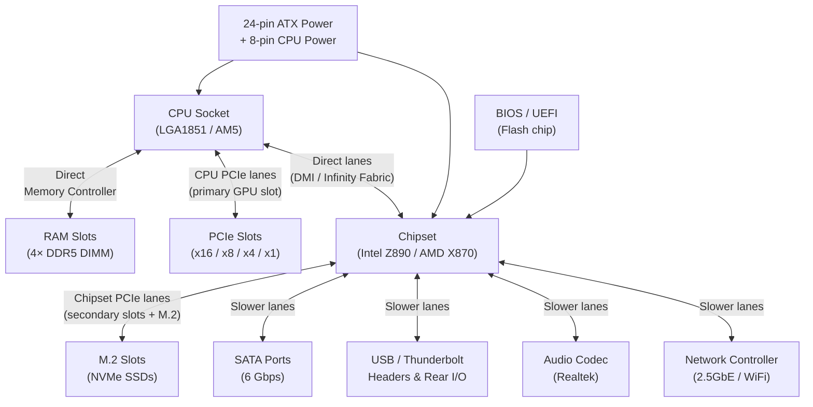
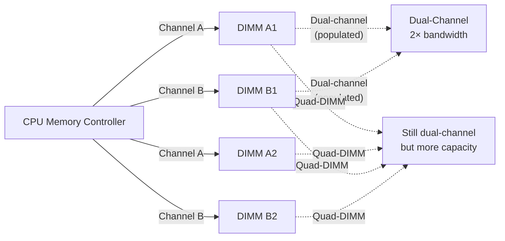
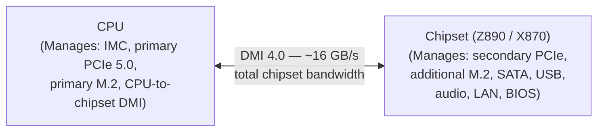

import Tabs from '@theme/Tabs';
import TabItem from '@theme/TabItem';

# Motherboard

> **Part of:** [Hardware Fundamentals](../index)

The **motherboard** (also called mainboard or system board) is the central circuit board that connects every component in a computer. It provides the electrical pathways, power delivery, and communication buses through which the CPU, RAM, GPU, and storage all talk to each other.

---

## Motherboard Anatomy

---

## Key Components Explained

### CPU Socket

The socket is the physical connector that holds the CPU on the motherboard. CPU and motherboard sockets must match exactly — there is no cross-compatibility.

| Platform | Socket | Compatible CPUs |
|---------|-------|----------------|
| Intel 14th/15th gen | LGA1851 | Core Ultra 200 series |
| Intel 13th/14th gen | LGA1700 | Core i3/i5/i7/i9 12th–14th gen |
| AMD Ryzen 7000/9000 | AM5 | Ryzen 7xxx, 9xxx (Zen 4/5) |
| AMD Ryzen 5000 | AM4 | Ryzen 3xxx, 5xxx (Zen 2/3) |
| Intel Xeon (server) | LGA4677 | Xeon Scalable 4th/5th gen |
| AMD EPYC (server) | SP5 | EPYC 9000-series (Genoa/Turin) |

**LGA vs PGA:** Intel uses **LGA** (pins on the socket, flat pads on the CPU). AMD historically used **PGA** (pins on the CPU) but switched to LGA with AM5. Bent pins on the CPU (PGA) or socket (LGA) are a $500 mistake.

---

### RAM Slots

**Dual-channel:** Populating matching slots (e.g. A1 + B1) doubles the memory bandwidth by using two independent 64-bit buses simultaneously. Most platforms support dual-channel; high-end server platforms support quad- or octal-channel.

**DDR generations:**

| Gen | Max speed | Bandwidth (dual) | Voltage |
|-----|-----------|-----------------|--------|
| DDR4 | 3200–5333 MT/s | ~50 GB/s | 1.2V |
| DDR5 | 4800–9600+ MT/s | ~100+ GB/s | 1.1V |

DDR4 and DDR5 DIMMs are not interchangeable — the socket keying is different.

---

### Chipset

The **chipset** is the secondary controller that handles everything the CPU doesn't manage directly. On modern Intel platforms, the CPU handles PCIe 5.0 lanes (to the GPU and primary M.2 slot) and the IMC directly. The chipset provides additional PCIe 4.0/3.0 lanes to secondary M.2 slots, SATA ports, USB, audio, and networking.

**Chipset tiers (Intel example):**
- **Z-series (Z890):** Unlocked overclocking, most PCIe lanes, enthusiast
- **B-series (B860):** Mid-range, no OC on non-K CPUs, fewer PCIe lanes
- **H-series (H810):** Budget/OEM, minimal expandability

---

### BIOS / UEFI

**BIOS** (Basic Input/Output System) was the original firmware standard. Modern systems use **UEFI** (Unified Extensible Firmware Interface), which is technically different but colloquially still called "BIOS."

UEFI responsibilities:
- Power-on self-test (POST) — check that all hardware is present and functional
- CPU, RAM, and storage initialisation
- Boot device selection (which drive/partition to load the OS from)
- Platform configuration: RAM speed (XMP/EXPO profiles), CPU power limits, fan curves, virtualization enable (VT-x / AMD-V)
- Secure Boot — verify the OS bootloader is cryptographically signed

**XMP / EXPO:** RAM ships at base JEDEC speed (e.g. DDR5-4800). Enabling XMP (Intel) or EXPO (AMD) in BIOS loads the manufacturer's tested overclock profile (e.g. DDR5-6000), boosting memory performance significantly.

---

### Form Factors

| Form Factor | Size | PCIe slots | Use case |
|------------|------|-----------|---------|
| ATX | 305×244 mm | 5–7 | Full towers, workstations |
| Micro-ATX (mATX) | 244×244 mm | 3–4 | Compact desktops |
| Mini-ITX | 170×170 mm | 1 | Small form factor builds |
| E-ATX | 305×330+ mm | 7+ | Dual-socket servers, high-end workstations |
| SSI CEB / EEB | Server standard | Multiple | Rackmount servers |

---

## Subsections

| Page | Topics |
|------|--------|
| [PCIe](./pcie) | PCIe lanes, slot widths, Gen 3/4/5 bandwidth, NVMe-on-PCIe, bifurcation |

---

:::tip[Research Question 🔍]
Look up **"DMI bottleneck"** for Intel motherboards. The CPU communicates with the chipset over a fixed-bandwidth DMI link (~16 GB/s). If you saturate multiple NVMe drives, multiple USB 3.2 devices, and network simultaneously, they all share this bus. How does AMD's Infinity Fabric architecture handle this differently?
:::
