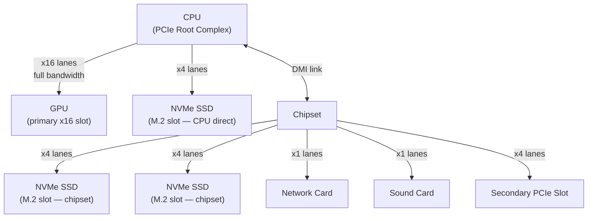
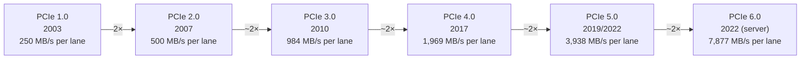
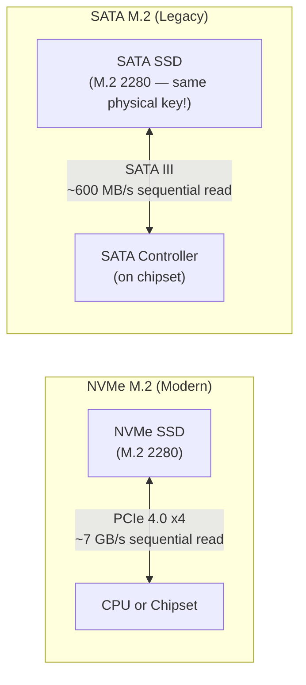
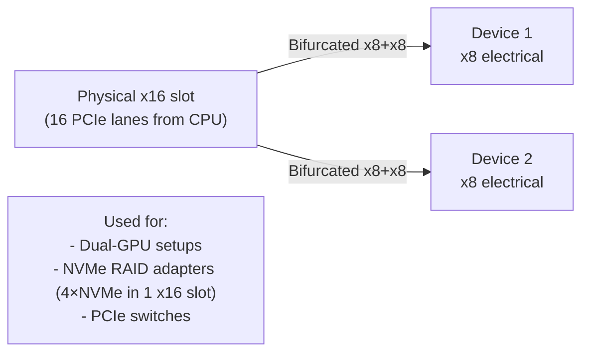
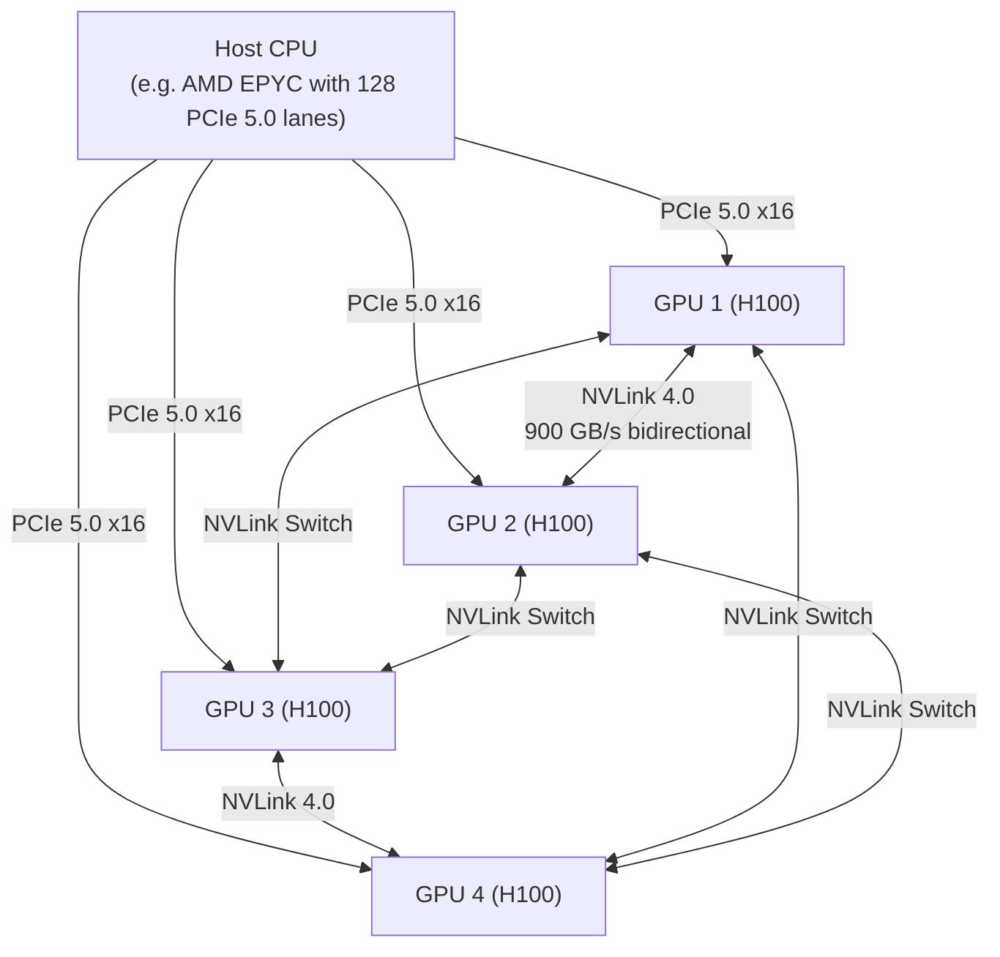

import Tabs from '@theme/Tabs';
import TabItem from '@theme/TabItem';

# PCIe — Peripheral Component Interconnect Express

> **Part of:** [Motherboard](./index) · [Hardware Fundamentals](../index)

> **Tool:** PCIe · **Introduced:** 2003 (PCIe 1.0) · **Latest:** PCIe 6.0 (2022, server) / PCIe 5.0 (consumer, 2022) · **Deprecated:** PCI, AGP 🔴 · **Status:** 🟢 Modern (Foundation)

**PCIe** is the high-speed serial interconnect that connects the CPU to the GPU, NVMe SSDs, network cards, and other expansion cards. It replaced PCI and AGP and remains the dominant expansion bus in all modern systems.

---

## How PCIe Works

PCIe uses **lanes** — each lane is a pair of differential signal pairs (one for transmit, one for receive) that carry data serially at multi-gigabit speeds. Multiple lanes can be bonded together for higher bandwidth.

---

## Slot Widths

Physical slots come in several sizes. The `x` number refers to how many lanes the slot provides:

| Slot | Lanes | Typical use |
|------|-------|-------------|
| **x1** | 1 | Network cards, sound cards, USB expansion |
| **x4** | 4 | NVMe SSDs (via M.2 or U.2), some NICs |
| **x8** | 8 | Secondary GPUs, RAID controllers, 10GbE NICs |
| **x16** | 16 | Primary GPU (the long black slot at top) |

**Physical vs electrical width:** A card in an x16 physical slot may only have x4 or x8 electrical lanes connected. The extra slot length allows physical compatibility while the chipset manages fewer lanes. Always check the motherboard spec sheet for the actual lane count, not just slot size.

---

## PCIe Generations — Bandwidth Table

Each generation doubles the per-lane bandwidth:

**Total bandwidth for common configurations:**

| Configuration | PCIe Gen | Total bandwidth |
|--------------|---------|----------------|
| x16 (GPU, Gen 4) | 4.0 | ~32 GB/s bidirectional |
| x16 (GPU, Gen 5) | 5.0 | ~64 GB/s bidirectional |
| x4 (NVMe, Gen 4) | 4.0 | ~8 GB/s bidirectional |
| x4 (NVMe, Gen 5) | 5.0 | ~16 GB/s bidirectional |
| x1 (NIC) | 3.0 | ~0.985 GB/s |

---

## NVMe SSDs on PCIe

NVMe SSDs plug into M.2 slots (or U.2/U.3 connectors on servers), which are physically connected to PCIe lanes. The NVMe protocol was designed from the ground up for flash storage — unlike SATA's AHCI protocol, which was designed for spinning HDDs.

**Caution:** M.2 is only a form factor. An M.2 slot can be NVMe (PCIe) or SATA depending on the drive and motherboard — the key slot looks similar. Always verify your motherboard's M.2 slot spec before purchasing an NVMe drive.

---

## PCIe Bifurcation

Some motherboards support **bifurcation** — splitting a physical x16 slot's lanes into multiple narrower connections:

Bifurcation must be supported by both the CPU (lane budget) and enabled in BIOS. Consumer platforms typically support only basic bifurcation; server platforms (EPYC, Xeon) have much more flexible lane routing.

---

## PCIe in Cloud and Servers

In cloud instances, PCIe topology is invisible to most users — but it matters for GPU workloads:

NVIDIA's **NVLink** is a proprietary high-bandwidth interconnect that bypasses PCIe entirely for GPU-to-GPU communication. An 8-GPU DGX H100 system has 900 GB/s NVLink bandwidth between GPUs — versus PCIe 5.0's ~64 GB/s. This is why large language model training requires specialised hardware: copying activations between GPUs at PCIe speeds would be the bottleneck.

---

:::tip[Research Question 🔍]
Search for **CXL — Compute Express Link** (CXL 1.1/2.0/3.0). It's layered on top of PCIe 5.0 and allows CPUs, GPUs, and memory expanders to share a coherent memory pool. Why is this critical for AI infrastructure where a single model's weights don't fit in one GPU's VRAM?
:::
