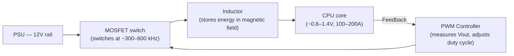

import Tabs from '@theme/Tabs';
import TabItem from '@theme/TabItem';

# Power Delivery & VRM

> **Part of:** [Motherboard](./index) · [Hardware Fundamentals](../index)

> **Tool:** ATX Power Standard · **Introduced:** 1995 (ATX 1.0) · **Latest:** ATX 3.1 (2023) · **Status:** 🟢 Modern

The **VRM (Voltage Regulator Module)** is one of the most underappreciated components on a motherboard. Every modern CPU operates at around 0.8–1.4V, but the power supply delivers 12V. The VRM performs this conversion in real time, at the exact current the CPU demands, thousands of times per second.

---

## Why CPUs Don't Run Directly on 12V

Operating a CPU at 12V would require impractically thin traces and would produce enormous heat. Modern CPUs operate at low voltage for three reasons:

- **Power = Voltage × Current** — Lower voltage means lower power per transistor
- **Heat = Current² × Resistance** — Thick low-voltage traces carry the same power with less resistive heating
- **Dynamic range** — Modern CPUs vary their core voltage constantly (Intel SpeedStep, AMD Cool'n'Quiet) to save power at idle and flatten voltage spikes under load

---

## How a VRM Works

A VRM is a **buck converter** — a switching circuit that rapidly alternates a transistor on/off to store and release energy in an inductor, producing a stable lower voltage.

**Phase count:** A single buck converter (1 phase) switching at 300 kHz struggles to supply 200A cleanly. By running multiple phases in parallel but offset in timing, ripple current cancels out and each phase handles a smaller fraction of total current. More phases = smoother output voltage = more stable CPU.

| Phase count | Typical board tier | CPU power headroom |
|------------|-------------------|-------------------|
| 4–6 phases | Budget | 65W–95W CPUs at stock |
| 8–12 phases | Mid-range | 125W CPUs, moderate OC |
| 14–20+ phases | High-end / enthusiast | 250W+ (Ryzen 7950X, i9-13900K unlocked) |

**Doublers vs true phases:** Some boards advertise "16 phases" but use a single PWM controller with doublers (duplicators) — each doubler runs two inductors off one control signal. True 16-phase boards use 16 independent PWM channels. Enthusiast boards advertise "16+2" to mean 16 CPU VCore phases + 2 SoC/auxiliary phases.

---

## Power Connectors

### PSU → Motherboard

| Connector | Pins | Purpose |
|-----------|------|---------|
| **24-pin ATX** | 24 | Main power to motherboard — 12V, 5V, 3.3V rails for all non-CPU components |
| **8-pin EPS12V (CPU)** | 8 | Dedicated 12V feed directly to the VRM for CPU power |
| **2×8-pin EPS12V** | 16 | High-end boards — doubled CPU power for heavy OC or server workloads |
| **16-pin 12VHPWR** | 16 | GPU power connector — up to 600W for RTX 4080/4090 class cards |

### GPU Power (12VHPWR / 16-pin ATX 3.0)

The 12VHPWR connector was introduced with ATX 3.0 for GPUs drawing over 300W. It replaces multiple PCIe 8-pin connectors with a single 16-pin. Early adapter cables had known failure modes (melting) if not seated fully — confirmed by NVIDIA. Use the native cable from your PSU if your PSU supports ATX 3.0; avoid adapters.

---

## Power Limits — PL1, PL2, and Tau

Intel CPUs expose configurable power limits through the motherboard UEFI:

| Setting | Meaning |
|---------|---------|
| **PL1** | Long-term sustained power limit (default: CPU TDP, e.g. 125W for i9-13900K) |
| **PL2** | Short-term burst power limit (Intel allows up to 253W on 13th gen) |
| **Tau** | How long (seconds) the CPU can sustain PL2 before falling back to PL1 |

Many motherboard vendors ship with **PL1 and PL2 set to unlimited** by default — the CPU draws as much as it wants (up to 250W+) permanently. This causes high temperatures and throttling on boards with inadequate VRM cooling. Setting PL1 = TDP restores predictable behaviour.

AMD CPUs use **PPT (Package Power Tracking)**, **TDC (Thermal Design Current)**, and **EDC (Electrical Design Current)** as equivalent limits.

---

## PSU Sizing

Rule of thumb for sizing your power supply:

| System type | Recommended PSU |
|------------|----------------|
| Office / light gaming (integrated GPU) | 400–500W |
| Gaming (RTX 4070 / RX 7800 XT) | 650–750W |
| High-end gaming (RTX 4080 / RX 7900 XTX) | 850W |
| Enthusiast (RTX 4090 + i9 unlocked) | 1000–1200W |
| AI workstation (2× RTX 4090) | 1600W+ |

**80+ efficiency ratings:** PSUs are rated by efficiency at 20%, 50%, and 100% load. An 80+ Gold at 50% load wastes ~10% as heat. An 80+ Platinum wastes ~6%. Higher efficiency = less heat in your case and lower electricity bill, not more power for components.

---

## VRM Thermal Management

A VRM that runs hot will throttle to protect itself — your CPU will suddenly lose multi-core performance even though CPU temperatures are fine. Signs of VRM thermal throttling:

- Sustained multi-core workloads (Cinebench, compiling) show lower scores than expected
- CPU power draw drops during the workload rather than staying steady
- VRM temperature (shown in UEFI or HWiNFO64 as **VRM MOS** or **NB Voltage temp**) exceeds 90°C

**Fixes:**
- Ensure case airflow reaches the VRM area (top of the motherboard)
- Add a heatsink to uncovered VRM components (third-party VRM heatsinks exist)
- Set CPU power limits (PL1/PPT) to rated TDP rather than unlimited

---

:::tip[Research Question 🔍]
Look up **AMD's Infinity Fabric voltage (FCLK) and its relationship to RAM speed**. When you run DDR5-6000 on an AM5 system, the Infinity Fabric runs at 3000 MHz in a 1:1 ratio with the memory controller. Exceeding that with faster RAM forces a 1:2 divider, which actually hurts latency. Why does this ratio matter, and what is the "sweet spot" DDR5 speed for AMD's Zen 4 architecture?
:::
