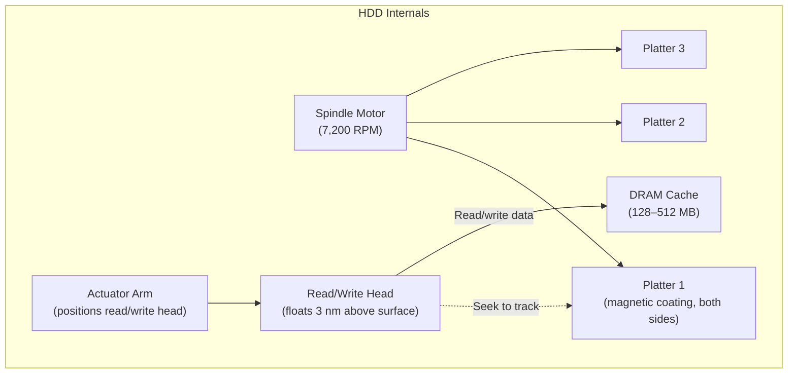
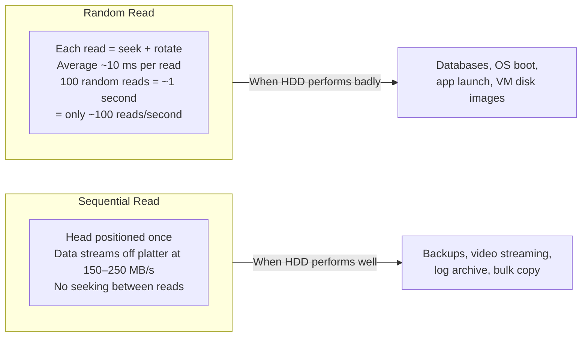

import Tabs from '@theme/Tabs';
import TabItem from '@theme/TabItem';

# HDD — Hard Disk Drives

> **Part of:** [Storage](./index) · [Hardware Fundamentals](../index)

> **Tool:** HDD · **Introduced:** 1956 (IBM 350) · **Latest:** 20–24 TB helium-filled drives (2024) · **Deprecated:** N/A · **Status:** 🟡 Legacy (substantially replaced by SSD for primary storage, but dominant for high-capacity cold storage)

Hard disk drives store data magnetically on spinning platters. They are orders of magnitude slower than SSDs for random access but remain cost-competitive for massive sequential storage — backup archives, media libraries, log retention, and cold-tier cloud storage.

---

## How an HDD Works



**Key mechanical concepts:**

| Term | Definition |
|------|-----------|
| **Platter** | Rigid disk coated in ferromagnetic material. Data is stored as magnetic domains |
| **Track** | Concentric ring on a platter — each platter has thousands |
| **Sector** | Fixed-size slice of a track — historically 512 bytes, modern drives use 4096-byte (4K) sectors |
| **Cylinder** | The same track number across all platters — the head stack moves together |
| **Seek time** | Time for the arm to physically move to the correct track (~3–12 ms average) |
| **Rotational latency** | Time for the correct sector to spin under the head (avg = half rotation = ~4.2 ms at 7,200 RPM) |
| **Transfer rate** | Once the head is in position, data streams off the platter at 150–250 MB/s |

**Total random read latency = seek time + rotational latency + transfer time**
~5 ms + 4 ms + ~0.1 ms = **~10 ms per random access** — compared to NVMe's ~0.07 ms.

---

## RPM and What It Means

Higher RPM means the correct sector arrives under the read head faster, reducing rotational latency:

| RPM | Market | Avg rotational latency | Use case |
|-----|--------|----------------------|----------|
| 5,400 | NAS / Laptop HDDs | ~5.6 ms | Quiet, power-efficient — light workloads |
| 7,200 | Desktop / Server | ~4.2 ms | Standard across most consumer and enterprise drives |
| 10,000 | Enterprise SAS (legacy) | ~3 ms | OLTP databases — largely superseded by SSDs |
| 15,000 | High-end enterprise SAS | ~2 ms | Highest HDD IOPS — still beaten by any SSD |

15K RPM drives have mostly been replaced by SSDs in enterprise settings. An NVMe SSD at ~0.07 ms random latency still beats a 15K drive (~2 ms) by **28×**.

---

## CMR vs SMR — Recording Technology

Modern HDDs use one of two write geometries, and the difference matters significantly for write-intensive workloads:

| | CMR (Conventional Magnetic Recording) | SMR (Shingled Magnetic Recording) |
|--|--------------------------------------|-----------------------------------|
| **Also called** | PMR (Perpendicular Magnetic Recording) | — |
| **Track layout** | Non-overlapping independent tracks | Tracks overlap like roof shingles |
| **Density** | Lower — wastes space between tracks | Higher — more GB per platter |
| **Overwrite** | Overwrite any track directly | Must read, erase, and rewrite an entire band (~20 MB) |
| **Random write perf** | Consistent | Degrades significantly under sustained random writes |
| **NAS / RAID suitability** | ✅ Safe — predictable rebuild times | ⚠️ Risky — very slow RAID rebuilds |
| **Examples** | WD Red Plus, Seagate IronWolf, Toshiba N300 | WD Blue (some SKUs), Seagate Barracuda (some SKUs) |

**Why SMR matters:** Many budget HDDs ship with SMR quietly — the box may just say "SMR" in fine print, or not mention it at all. In a NAS with RAID 5/6, an SMR drive can cause a rebuild to take days instead of hours and may fail the rebuild entirely under load. Always verify the recording technology in the manufacturer's spec sheet before buying drives for a NAS or server.

---

## Sequential vs Random Access

HDDs are extremely good at sequential access (reading one continuous stream of data) and extremely poor at random access (jumping between scattered locations):



---

## When HDDs Still Make Sense

Despite SSDs dominating primary storage, HDDs retain strong advantages:

| Use case | Why HDD wins |
|---------|-------------|
| **Bulk backup / archive** | 20 TB HDD = ~$30/TB vs $50–100+/TB for SSD |
| **Cold storage / compliance** | Sequential throughput is fine; cost-per-GB is decisive |
| **Video surveillance** | High sequential write, enormous capacity needs, cost-sensitive |
| **Media library** | Videos are large sequential reads — HDD bandwidth is sufficient |
| **NAS (non-RAID-rebuild heavy)** | CMR NAS drives offer reliability + capacity for home labs |
| **Cloud cold tier** | AWS S3 Glacier, GCP Nearline — backed by HDDs; pennies per GB |

---

## Checking HDD Health

<Tabs>
<TabItem value="linux" label="Linux">

```bash
# SMART health check (install smartmontools)
sudo smartctl -H /dev/sda       # Quick health summary
sudo smartctl -a /dev/sda       # Full SMART attribute dump

# Key SMART attributes to monitor:
# ID 5  — Reallocated Sector Count: non-zero = bad sectors remapped (warning sign)
# ID 187 — Reported Uncorrectable Errors: should be 0
# ID 197 — Current Pending Sector Count: sectors waiting to be remapped
# ID 198 — Uncorrectable Sector Count: sectors that couldn't be recovered

# Long self-test (takes hours on large drives)
sudo smartctl -t long /dev/sda
sudo smartctl -a /dev/sda       # Check results after test completes

# Real-time monitoring of a specific drive
sudo watch -n 5 smartctl -A /dev/sda
```

</TabItem>
<TabItem value="windows" label="Windows">

```powershell
# Quick health check
Get-PhysicalDisk | Select-Object FriendlyName, HealthStatus, OperationalStatus

# SMART data
Get-StorageReliabilityCounter -PhysicalDisk (Get-PhysicalDisk) |
  Select-Object DeviceId, ReadErrorsTotal, WriteErrorsTotal, Temperature

# Best option: CrystalDiskInfo (free GUI)
# Colour-coded health status, all SMART attributes, temperature history
# Download: https://crystalmark.info/en/software/crystaldiskinfo/

# Windows Disk Management
# Start → Disk Management — view partitions, disk status, format options
```

</TabItem>
</Tabs>

---

## RAID Basics (Awareness Level)

RAID (Redundant Array of Independent Disks) uses multiple HDDs together for either performance, redundancy, or both. The key levels:

| RAID Level | Disks | Capacity | Redundancy | Read / Write |
|-----------|-------|----------|-----------|-------------|
| RAID 0 | 2+ | 100% | None (one fail = all lost) | Fast R+W |
| RAID 1 | 2 | 50% | 1 disk can fail | Fast R, normal W |
| RAID 5 | 3+ | ~66–80% | 1 disk can fail | Good R, slower W |
| RAID 6 | 4+ | ~50–75% | 2 disks can fail | Good R, slower W |
| RAID 10 | 4+ | 50% | 1 per mirrored pair | Fast R+W |

:::warning
**RAID is not a backup.** Accidental deletion, ransomware, controller failure, or fire will destroy a RAID array just as effectively as a disk failure. RAID provides uptime; backups provide data recovery.
:::

---

:::tip[Research Question 🔍]
Look up **HAMR** (Heat-Assisted Magnetic Recording) and **MAMR** (Microwave-Assisted Magnetic Recording). Both are technologies for pushing HDD areal density beyond what conventional PMR/CMR can achieve (targeting 30–50 TB per drive by 2027). How do they work, and which major manufacturers are pursuing each approach?
:::
