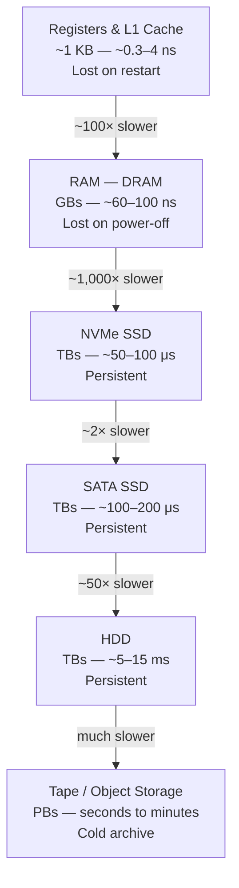
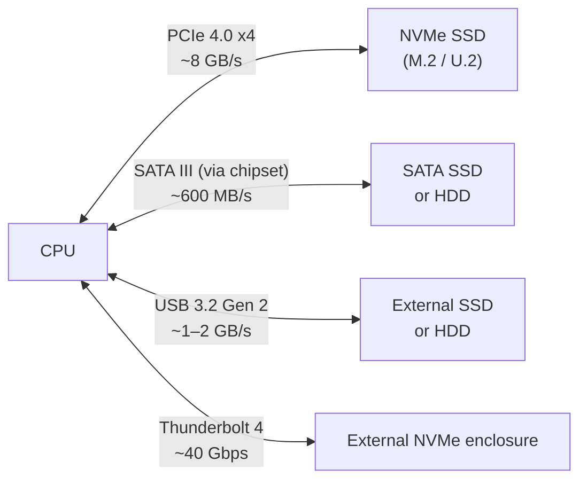
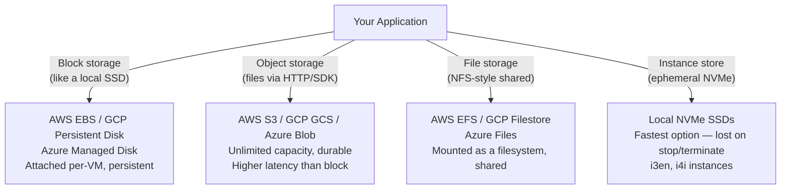

import Tabs from '@theme/Tabs';
import TabItem from '@theme/TabItem';

# Storage

> **Part of:** [Hardware Fundamentals](../index)

Storage is where data lives when it's not being actively computed. The type of storage you choose determines not just capacity, but the latency and throughput of every read and write your application performs — often by orders of magnitude.

---

## The Storage Hierarchy



**Latency numbers every programmer should know:**

| Operation | Time | Context |
|-----------|------|---------|
| L1 cache read | 0.5 ns | On-chip |
| L2 cache read | 7 ns | On-chip |
| RAM access | 100 ns | 200× L1 cache |
| NVMe SSD random read | ~70 μs | 700× RAM |
| SATA SSD random read | ~150 μs | 1,500× RAM |
| HDD seek + read | ~10 ms | 100,000× RAM |
| Network request (same DC) | ~500 μs | Between machines |

**The practical implication:** A single HDD random seek is equivalent to 20,000,000 L1 cache accesses. This is why database buffer pools, Redis caches, and read replicas exist — keeping hot data in memory avoids storage I/O entirely.

---

## Storage Interfaces



---

## Subsections

| Page | Topics |
|------|--------|
| [SSD — Solid State Drives](./ssd) | NVMe vs SATA SSD, NAND flash types (TLC/MLC/SLC/QLC), endurance, wear levelling |
| [HDD — Hard Disk Drives](./hdd) | Platter mechanics, seek time, RPM, CMR vs SMR, when HDDs still make sense |

---

## Storage in the Cloud

Cloud providers abstract physical storage behind managed services:



### AWS EBS Volume Types

| Type | Backend | IOPS | Throughput | Use case |
|------|---------|------|-----------|---------|
| `gp3` | NVMe SSD | Up to 16,000 | Up to 1,000 MB/s | General purpose (default) |
| `io2 Block Express` | NVMe SSD | Up to 256,000 | Up to 4,000 MB/s | High-performance databases |
| `st1` | HDD | 500 | 500 MB/s | Sequential throughput — logs, Kafka |
| `sc1` | HDD | 250 | 250 MB/s | Cold archive, infrequent access |

---

## Measuring Storage Performance

<Tabs>
<TabItem value="linux" label="Linux">

```bash
# Device info
lsblk                          # List all block devices and mount points
lsblk -o NAME,TYPE,SIZE,ROTA   # ROTA=1 means spinning (HDD), ROTA=0 means SSD
nvme list                      # List NVMe devices with firmware info (nvme-cli)

# Sequential and random speed test (safe — reads only)
hdparm -Tt /dev/nvme0n1        # Basic sequential read test

# Detailed I/O benchmarks (install fio)
# Sequential read (1M block)
fio --name=seq-read --rw=read --bs=1M --size=1G --numjobs=1 --ioengine=libaio

# Random 4K read (worst-case for HDD, good test of SSD IOPS)
fio --name=rand-read --rw=randread --bs=4K --size=1G --numjobs=1 --ioengine=libaio

# Real-time I/O monitoring
iostat -x 1                    # Per-device I/O stats every second
iotop                          # Per-process I/O usage (like top for disk)
```

</TabItem>
<TabItem value="windows" label="Windows">

```powershell
# Device info
Get-PhysicalDisk | Select-Object FriendlyName, MediaType, BusType, Size
Get-Disk | Select-Object Number, FriendlyName, BusType, Size, PartitionStyle

# Built-in benchmark
winsat disk -drive C           # Windows built-in sequential read/write benchmark

# Detailed info with NVMe specifics
Get-StorageReliabilityCounter -PhysicalDisk (Get-PhysicalDisk)

# Real-time monitoring
# Task Manager → Performance → Disk
# Resource Monitor → Disk tab (per-process read/write)
typeperf "\PhysicalDisk(_Total)\Disk Read Bytes/sec" -si 1
typeperf "\PhysicalDisk(_Total)\Avg. Disk sec/Read" -si 1  # Read latency

# CrystalDiskMark (free GUI) — industry-standard SSD benchmark for Windows
```

</TabItem>
</Tabs>
