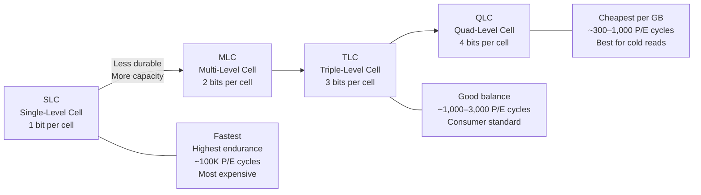
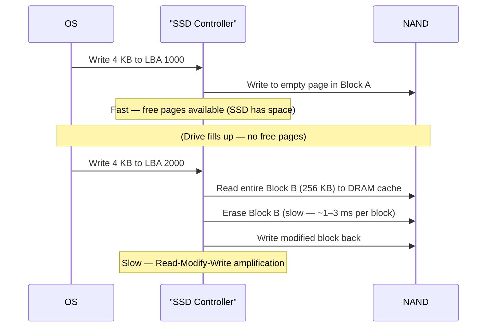
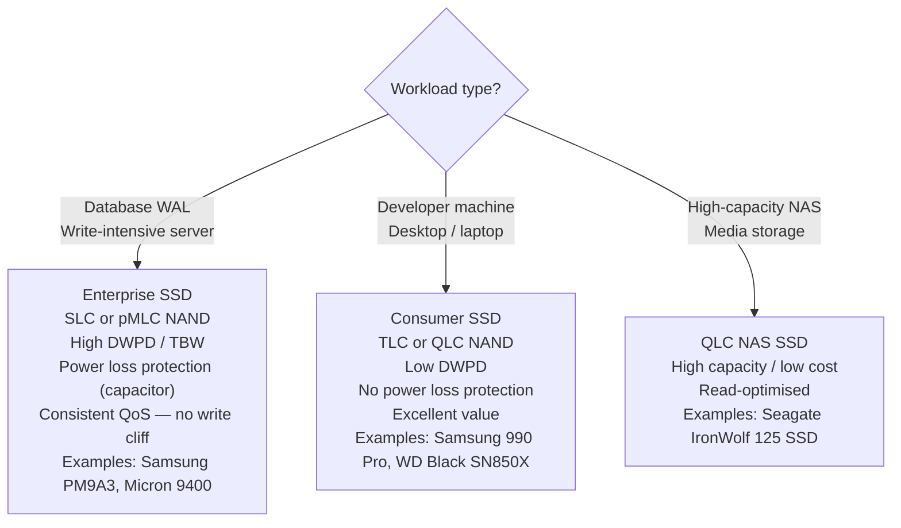

import Tabs from '@theme/Tabs';
import TabItem from '@theme/TabItem';

# SSD — Solid State Drives

> **Part of:** [Storage](./index) · [Hardware Fundamentals](../index)

> **Tool:** NVMe · **Introduced:** 2013 (NVMe 1.0) · **Latest:** NVMe 2.0 (2021) · **Deprecated:** AHCI (for SSDs) 🟡 · **Status:** 🟢 Modern
> **Tool:** SATA SSD · **Introduced:** 2007 · **Latest:** SATA III (6 Gbps) · **Deprecated:** N/A · **Status:** 🟡 Legacy (still common, but NVMe is the modern choice)

Solid-state drives store data in **NAND flash memory** — no moving parts, no seek time, and dramatically lower latency than HDDs. The primary differences between SSDs come down to interface (NVMe vs SATA), NAND cell type, and the firmware sophistication of the controller.

---

## NVMe vs SATA SSD

```mermaid
graph LR
    subgraph NVMe["NVMe (Modern)"]
        NV_PROTO["Protocol: NVMe\n(designed for flash)"]
        NV_IF["Interface: PCIe 4.0 x4"]
        NV_SEQ["Sequential read: ~7 GB/s"]
        NV_RAND["Random 4K read: ~1M IOPS"]
        NV_LAT["Latency: ~50–100 μs"]
    end

    subgraph SATA_SSD["SATA SSD (Legacy)"]
        SA_PROTO["Protocol: AHCI\n(designed for HDDs)"]
        SA_IF["Interface: SATA III (6 Gbps)"]
        SA_SEQ["Sequential read: ~550 MB/s"]
        SA_RAND["Random 4K read: ~100K IOPS"]
        SA_LAT["Latency: ~100–200 μs"]
    end

    NVMe -->|"~13× faster sequential\n~10× more IOPS"| SATA_SSD
```



**When SATA SSD is still fine:**
- Budget builds where cost-per-GB matters
- Older systems without M.2 NVMe slots
- External enclosures where PCIe bandwidth isn't available
- Workloads that are already RAM-bound (the SSD speed doesn't matter if hot data is in RAM)

---

## NAND Flash Cell Types

NAND flash stores bits by trapping electrons in floating-gate transistors. The number of bits stored per cell determines the trade-off between capacity, speed, and endurance:



| Type | Bits/cell | P/E cycles | Typical use |
|------|----------|-----------|------------|
| SLC | 1 | ~100,000 | Enterprise write-intensive (WAL, databases) |
| MLC (pMLC) | 2 | ~10,000 | Enterprise — Samsung 983 DCT, etc. |
| TLC | 3 | 1,000–3,000 | Consumer SSDs, prosumer NAS |
| QLC | 4 | 300–1,000 | High-capacity consumer / read-heavy NAS |

**P/E cycle:** Program/Erase cycle — how many times a cell can be written before it degrades. SSD controllers use **wear levelling** to distribute writes evenly across all cells.

---

## How SSDs Handle Writes — The Write Cliff

NAND flash cannot overwrite existing data in-place. It must **erase** a full block (~256 KB) before writing new data. This creates a write performance cliff when the SSD is nearly full:



**Write amplification:** The ratio of data actually written to NAND vs. data the OS requested. A drive in good health has write amplification close to 1. A full drive doing excessive garbage collection can have write amplification of 10×+.

**Best practices:**
- Keep SSDs under ~80% capacity to maintain performance
- Enable TRIM (OS command that tells the SSD which pages are free, allowing background garbage collection)
- Check drive health with `smartctl` (Linux) or CrystalDiskInfo (Windows)

---

## Wear Levelling and Endurance Ratings

Modern SSDs use the controller to distribute writes evenly across all NAND cells, preventing any single cell from wearing out early.

**TBW (Terabytes Written):** The manufacturer's rated endurance. A drive with 600 TBW can sustain 600 TB of writes over its lifetime.

**DWPD (Drive Writes Per Day):** TBW ÷ (SSD capacity × warranty years). A 1 TB drive with 600 TBW over 5 years = 600 / (1 × 5 × 365) ≈ 0.33 DWPD — typical for consumer SSDs.

Enterprise SSDs targeted at database WAL logs often have 3–10 DWPD.

---

## Enterprise vs Consumer SSDs



**Power loss protection (PLP):** Enterprise SSDs include supercapacitors that allow the drive to flush its DRAM write cache to NAND if power is suddenly lost. Consumer drives without PLP can corrupt data if power is cut mid-write — fine for desktops, dangerous for servers without UPS.

---

## Checking SSD Health

<Tabs>
<TabItem value="linux" label="Linux">

```bash
# Install smartmontools
sudo apt install smartmontools   # (or equivalent)

# Check NVMe health
sudo nvme smart-log /dev/nvme0   # Temperature, wear indicator, error counts

# SMART data for SATA SSD
sudo smartctl -a /dev/sda

# Key fields to watch:
# "Percentage Used" (NVMe) — 0% = new, 100% = at rated endurance
# "Data Units Written" (NVMe) — total TB written (multiply by 512 KB)
# "Reallocated Sector Count" (SATA SMART) — should be 0; non-zero = dying drive
```

</TabItem>
<TabItem value="windows" label="Windows">

```powershell
# Built-in SMART check (limited)
Get-StorageReliabilityCounter -PhysicalDisk (Get-PhysicalDisk) |
  Select-Object DeviceId, Wear, Temperature, ReadErrorsTotal, WriteErrorsTotal

# Better option: CrystalDiskInfo (free, GUI)
# Shows full SMART attributes, wear level, temperature, power-on hours
# Download: https://crystalmark.info/en/software/crystaldiskinfo/

# NVMe drive info via PowerShell
Get-PhysicalDisk | Where-Object BusType -eq NVMe | Select-Object FriendlyName, HealthStatus, OperationalStatus
```

</TabItem>
</Tabs>

---

:::tip[Research Question 🔍]
Look up **3D NAND** (also called V-NAND by Samsung). Traditional NAND is 2D — cells arranged flat on a wafer. 3D NAND stacks layers vertically (96L, 128L, 176L, 232L...). Why does stacking layers improve density and cost — and does it also improve cell endurance compared to planar NAND?
:::
