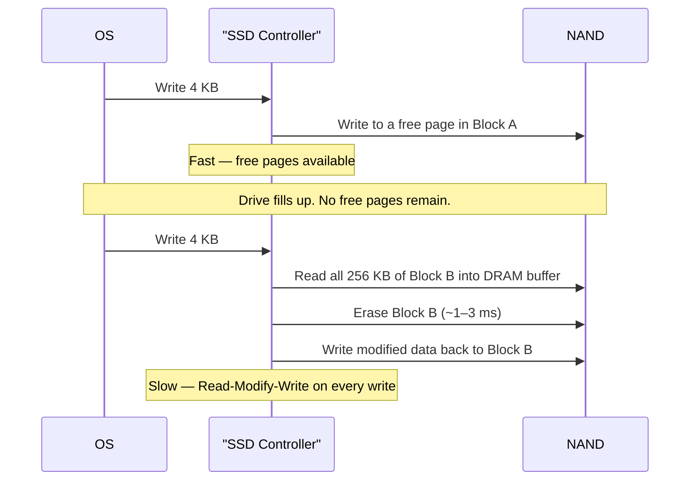

import Tabs from '@theme/Tabs';
import TabItem from '@theme/TabItem';

# SSD — Solid State Drives

> **Part of:** [Storage](./index) · [Hardware Fundamentals](../index)

> **Tool:** NVMe · **Introduced:** 2013 (NVMe 1.0) · **Latest:** NVMe 2.0 (2021) · **Deprecated:** AHCI (for SSDs) 🟡 · **Status:** 🟢 Modern
> **Tool:** SATA SSD · **Introduced:** 2007 · **Latest:** SATA III (6 Gbps) · **Status:** 🟡 Legacy (still common, but NVMe is the modern choice for new builds)

Solid-state drives store data in **NAND flash memory** — no moving parts, no seek time, and dramatically lower latency than HDDs. The primary differences between SSDs come down to interface (NVMe vs SATA), NAND cell type, and the firmware sophistication of the controller.

---

## NVMe vs SATA SSD

The interface is the biggest performance differentiator — NVMe uses PCIe lanes (designed for flash), while SATA uses a protocol originally built for spinning hard disks.

| Spec | NVMe (PCIe 4.0 × 4) | SATA SSD |
|------|---------------------|---------|
| **Protocol** | NVMe — built for low-latency flash | AHCI — built for HDDs, adapted for SSDs |
| **Interface** | PCIe 4.0 × 4 lanes | SATA III (6 Gbps physical limit) |
| **Sequential read** | ~7,000 MB/s | ~550 MB/s |
| **Sequential write** | ~6,500 MB/s | ~520 MB/s |
| **Random 4K read** | ~1,000,000 IOPS | ~100,000 IOPS |
| **Latency** | ~50–100 μs | ~100–200 μs |
| **Form factor** | M.2 (NVMe key) or U.2 | M.2 (SATA key) or 2.5" SATA |
| **Cost per GB** | Higher | Lower |

**When SATA SSD is still fine:**
- Budget builds where cost-per-GB matters
- Older systems without M.2 NVMe slots
- External enclosures where PCIe bandwidth isn't available
- Workloads that are RAM-bound (hot data lives in RAM — the SSD speed doesn't matter)

---

## NAND Flash Cell Types

NAND flash stores bits by trapping electrons in floating-gate transistors. The number of bits stored per cell determines the trade-off between capacity, speed, and endurance:

| Type | Bits / cell | P/E cycles | Speed | Cost / GB | Best for |
|------|------------|-----------|-------|----------|---------|
| **SLC** | 1 | ~100,000 | Fastest | Very high | Enterprise write-heavy (WAL, logging) |
| **MLC (pMLC)** | 2 | ~10,000 | Fast | High | Enterprise / prosumer (Samsung 983 DCT) |
| **TLC** | 3 | 1,000–3,000 | Good | Medium | Consumer SSDs — the mainstream standard |
| **QLC** | 4 | 300–1,000 | Slower on writes | Lowest | High-capacity read-heavy / archive |

**P/E cycle:** Program/Erase cycle — how many times a cell can be written before it wears out. SSD controllers use **wear levelling** to spread writes evenly across all cells so no single group dies early.

The trade-off is simple: more bits per cell = cheaper and larger, but fewer write cycles before the cell degrades.

---

## How SSDs Handle Writes — The Write Cliff

NAND flash cannot overwrite existing data in-place. It must **erase** a full block (~256 KB) before writing new pages. This creates a write performance cliff when the SSD fills up:



**Write amplification:** The ratio of actual NAND writes to OS-requested writes. A healthy drive has write amplification near 1×. A full drive with constant garbage collection can reach 10× or higher — significantly shortening drive life and degrading write throughput.

**Best practices:**
- Keep SSDs below ~80% capacity to maintain performance and preserve free space for garbage collection
- Enable TRIM — the OS notifies the SSD which pages are deleted, allowing background cleanup
- Check drive health regularly with `smartctl` (Linux) or CrystalDiskInfo (Windows)

---

## Wear Levelling and Endurance Ratings

Modern SSDs distribute writes evenly across all NAND cells so no single area wears out prematurely.

**TBW (Terabytes Written):** The manufacturer's lifetime write endurance. For example, 600 TBW means the drive is rated for 600 TB of total writes.

**DWPD (Drive Writes Per Day):** `TBW ÷ (capacity × warranty years)`. A 1 TB drive with 600 TBW over 5 years = `600 ÷ (1 × 5 × 365)` ≈ **0.33 DWPD** — typical for a consumer drive. Enterprise SSDs for database WAL logs often target 3–10 DWPD.

---

## Enterprise vs Consumer SSDs

| | Enterprise SSD | Consumer SSD | NAS / QLC SSD |
|--|---------------|-------------|--------------|
| **NAND type** | SLC or pMLC | TLC or QLC | QLC |
| **DWPD** | 3–10+ | 0.1–0.5 | 0.1–0.3 |
| **Power loss protection** | ✅ Supercapacitor included | ❌ None | ❌ None |
| **Write consistency** | Consistent — no write cliff | Variable — degrades when full | Variable |
| **Examples** | Samsung PM9A3, Micron 9400 | Samsung 990 Pro, WD Black SN850X | Seagate IronWolf 125 SSD |
| **Price / TB** | $300–600+ | $60–120 | $80–100 |

**Power loss protection (PLP):** Enterprise SSDs include supercapacitors that give the drive enough power to flush its DRAM write cache to NAND if power is cut suddenly. Consumer drives without PLP can lose or corrupt buffered writes during an unexpected shutdown — acceptable on a desktop, dangerous on a server without a UPS.

---

## Checking SSD Health

<Tabs>
<TabItem value="linux" label="Linux">

```bash
# Install smartmontools
sudo apt install smartmontools

# NVMe health summary
sudo nvme smart-log /dev/nvme0
# Key fields:
#   "percentage_used"     — 0 = new, 100 = at rated endurance
#   "data_units_written"  — total writes (× 512 KB per unit)
#   "media_errors"        — should be 0

# SATA SSD full SMART dump
sudo smartctl -a /dev/sda
# Key attributes:
#   ID 5  — Reallocated_Sector_Ct  → non-zero is a warning sign
#   ID 177 — Wear_Leveling_Count   → SSD-specific, counts P/E cycles
#   ID 187 — Reported_Uncorrect    → should be 0
```

</TabItem>
<TabItem value="windows" label="Windows">

```powershell
# Basic health via PowerShell
Get-StorageReliabilityCounter -PhysicalDisk (Get-PhysicalDisk) |
  Select-Object DeviceId, Wear, Temperature, ReadErrorsTotal, WriteErrorsTotal

# NVMe drive status
Get-PhysicalDisk | Where-Object BusType -eq NVMe |
  Select-Object FriendlyName, HealthStatus, OperationalStatus

# CrystalDiskInfo (free GUI — recommended)
# Shows full SMART attributes, wear level, temperature, power-on hours
# https://crystalmark.info/en/software/crystaldiskinfo/
```

</TabItem>
</Tabs>

---

:::tip[Research Question 🔍]
Look up **3D NAND** (also called V-NAND by Samsung). Traditional NAND is 2D — cells arranged flat on a wafer. 3D NAND stacks layers vertically (96L, 128L, 176L, 232L+). Why does stacking layers improve density and cost — and does it also improve cell endurance compared to planar NAND?
:::
