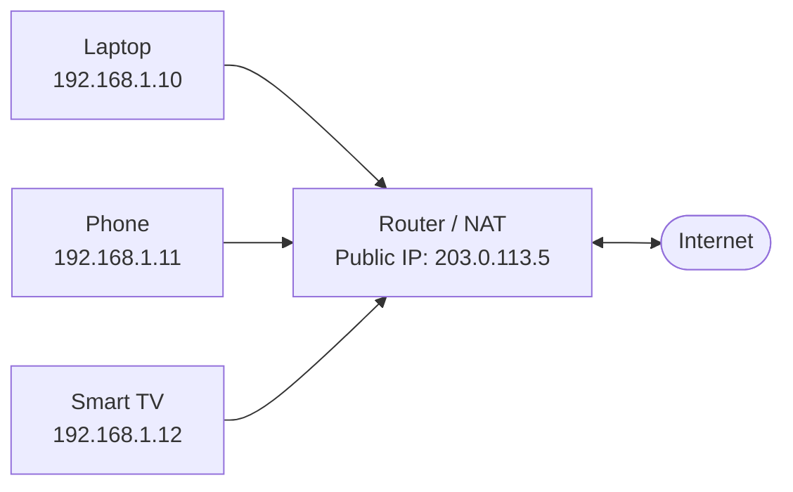
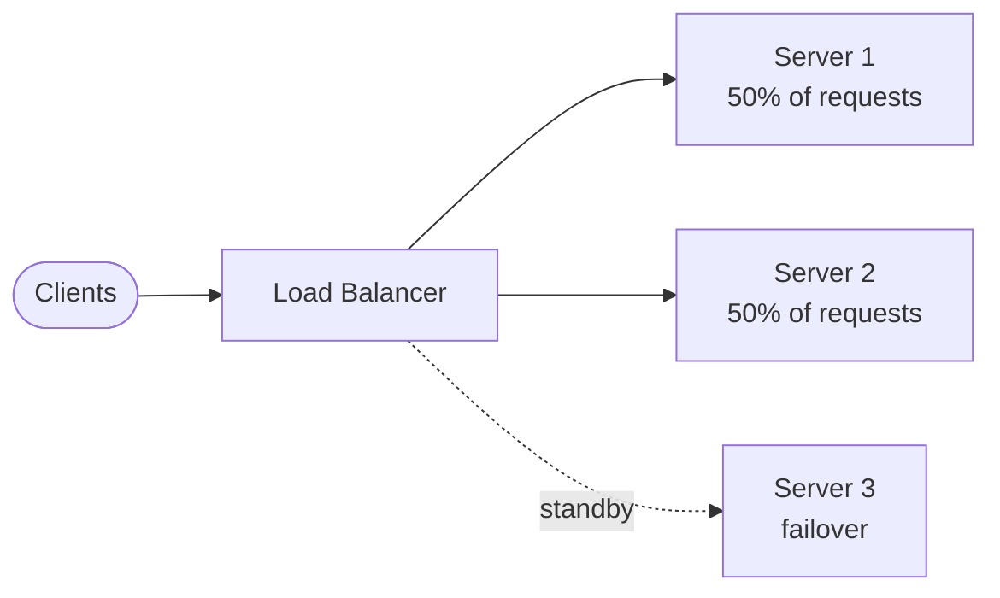
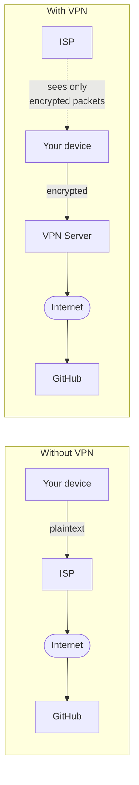
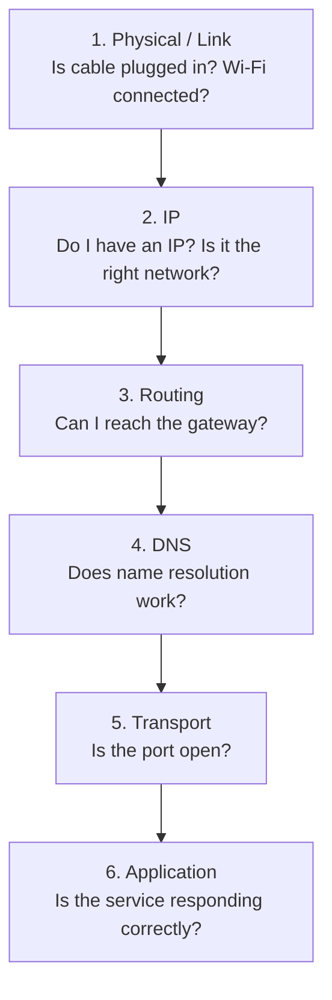

import Tabs from '@theme/Tabs';
import TabItem from '@theme/TabItem';
import YouTubeEmbed from '@site/src/components/YouTubeEmbed';
import QuizQuestion from '@site/src/components/QuizQuestion';
import MilestoneChecklist from '@site/src/components/MilestoneChecklist';

> **Domain:** Foundations · **Time Estimate:** 2–3 weeks · **Focus:** Practical understanding for developers and DevOps

> **Prerequisites:** [Protocols & Standards](protocols_and_standards) — understand HTTP, TCP/IP, and DNS first.
>
> **Who needs this:** DevOps engineers, backend developers, anyone who deploys software. Every production issue eventually becomes a networking issue.

---

## 🎯 Learning Objectives

By the end of this unit, you will be able to:

- [ ] Read and write CIDR notation and calculate subnet masks
- [ ] Explain how routers make forwarding decisions
- [ ] Configure basic firewall rules (iptables/UFW on Linux, Windows Firewall on Windows)
- [ ] Explain the difference between L4 and L7 load balancing
- [ ] Use `ping`, `traceroute`, `netstat`, `ss`, and `curl` to diagnose issues
- [ ] Explain NAT, VPN, and proxy server purposes
- [ ] Set up a simple home lab network and understand what each component does

---

<YouTubeEmbed
  id="qiQR5rTSshw"
  title="Computer Networking Full Course — freeCodeCamp"
  caption="freeCodeCamp full networking course — covers TCP/IP, subnetting, routing, DNS, and HTTP in detail."
/>

---

## 📖 Concepts

### 1. IP Addresses and Subnetting

Every device on a network has an **IP address** — a unique identifier for routing.

**IPv4** addresses are 32 bits, written as 4 octets in decimal:

```text
192.168.1.1
│   │   │ └── Host portion (varies by subnet mask)
│   │   └──── Network portion
└───────────── Full address
```

**CIDR notation** (`/prefix`) defines how many bits are the network portion:

```
192.168.1.0/24

/24 means the first 24 bits are the network → last 8 bits are host
Subnet mask: 255.255.255.0
Usable hosts: 2^8 - 2 = 254  (subtract network + broadcast address)
Range: 192.168.1.1 – 192.168.1.254
Broadcast: 192.168.1.255
```

**Common CIDR blocks:**

| CIDR | Hosts | Use Case |
|------|-------|---------| 
| `/8` | 16M | Large ISP allocations |
| `/16` | 65,534 | Large enterprise network |
| `/24` | 254 | Typical LAN segment |
| `/28` | 14 | Small office or cloud subnet |
| `/30` | 2 | Point-to-point links |
| `/32` | 1 | Single specific host |

**Private IP ranges (RFC 1918 — not routable on internet):**

```
10.0.0.0     – 10.255.255.255   /8
172.16.0.0   – 172.31.255.255   /12
192.168.0.0  – 192.168.255.255  /16
127.0.0.0    – 127.255.255.255  Loopback (localhost)
```

:::tip[Try It]
Run `ip addr` (Linux) or `ipconfig /all` (Windows). Find your machine's IP address and subnet mask. Calculate the network range you're on. Then ping another device on the same network.
:::

---

### 2. Routing

A **router** connects networks and forwards packets based on a **routing table** — a list of networks and which interface/next-hop to use for each.

```
Routing table example:
Destination         Gateway         Interface    Metric
0.0.0.0/0          192.168.1.1     eth0         100    ← Default route (internet)
192.168.1.0/24     0.0.0.0         eth0         0      ← Local network (direct)
10.8.0.0/24        10.8.0.1        tun0         50     ← VPN network

Decision process for packet to 8.8.8.8:
1. Check: does 8.8.8.8 match 10.8.0.0/24?  No
2. Check: does 8.8.8.8 match 192.168.1.0/24? No
3. Use default route 0.0.0.0/0 → send to gateway 192.168.1.1
```

<Tabs>
<TabItem value="linux" label="Linux">

```bash
# View routing table
ip route show
# Or older command:
route -n

# Add a static route
sudo ip route add 10.0.0.0/8 via 192.168.1.254

# Delete a route
sudo ip route del 10.0.0.0/8

# Show which interface + gateway will be used for a destination
ip route get 8.8.8.8
```

</TabItem>
<TabItem value="windows" label="Windows">

```powershell
# View routing table
route print
# Or:
Get-NetRoute | Where-Object {$_.AddressFamily -eq "IPv4"} | Format-Table

# Add static route
route add 10.0.0.0 mask 255.0.0.0 192.168.1.254

# Persistent route (survives reboot)
route -p add 10.0.0.0 mask 255.0.0.0 192.168.1.254

# Delete route
route delete 10.0.0.0
```

</TabItem>
</Tabs>

---

### 3. NAT — Network Address Translation

**NAT** is how millions of private devices share a handful of public IP addresses.



**How it works:**
1. Router replaces `192.168.1.10:54321` → `203.0.113.5:40001` and records the mapping
2. Google responds to `203.0.113.5:40001`
3. Router looks up mapping → forwards to `192.168.1.10:54321`
4. Your laptop receives the response — Google only ever sees one IP.

**Port forwarding** is the reverse — mapping an inbound request on the public IP to a specific internal device:

```
Inbound to 203.0.113.5:80 → DNAT → 192.168.1.20:80 (your web server)
```

---

### 4. DNS — Deeper

You learned DNS in [Protocols & Standards](protocols_and_standards). Here's the operational knowledge:

<Tabs>
<TabItem value="linux" label="Linux">

```bash
# DNS lookup (basic)
nslookup github.com
nslookup github.com 8.8.8.8   # Use specific DNS server (Google)

# dig — more powerful
dig github.com                 # A record lookup
dig github.com MX              # Mail records
dig github.com NS              # Nameserver records
dig +short github.com          # Just the IP(s)
dig +trace github.com          # Full resolution chain step by step
dig @1.1.1.1 github.com       # Query Cloudflare's resolver

# DNS configuration
cat /etc/resolv.conf           # Which DNS servers this machine uses
cat /etc/hosts                 # Local DNS overrides (hosts file)
sudo systemd-resolve --status  # systemd-resolved info

# Flush DNS cache
sudo resolvectl flush-caches   # systemd (modern)
```

</TabItem>
<TabItem value="windows" label="Windows">

```powershell
# DNS lookup
Resolve-DnsName github.com
Resolve-DnsName github.com -Type MX     # Mail records
Resolve-DnsName github.com -Server 8.8.8.8
nslookup github.com                     # Classic tool

# DNS configuration
Get-DnsClientServerAddress             # Which DNS servers are configured
ipconfig /displaydns                   # View Windows DNS cache
ipconfig /flushdns                     # Flush DNS cache

# Hosts file
notepad C:\Windows\System32\drivers\etc\hosts

# Set DNS server
Set-DnsClientServerAddress -InterfaceAlias "Ethernet" -ServerAddresses 1.1.1.1,8.8.8.8
```

</TabItem>
</Tabs>

---

### 5. Firewalls

A **firewall** controls which network traffic is allowed through based on rules.

**Stateful vs. stateless:**
- **Stateless:** Each packet evaluated independently. Simple, fast, can't track connections.
- **Stateful:** Tracks connection state. Allows return traffic for established connections automatically.

Modern firewalls are stateful. A rule allowing outbound HTTP automatically allows the response back.

<Tabs>
<TabItem value="linux" label="Linux (UFW / iptables)">

```bash
# UFW (simpler frontend to iptables) — recommended for most use cases
sudo ufw status
sudo ufw allow ssh
sudo ufw allow 80/tcp
sudo ufw allow 443/tcp
sudo ufw deny 8080
sudo ufw enable
sudo ufw status verbose

# iptables — lower level, still widely used
sudo iptables -L -v -n

# Allow established/related connections (critical — do this first)
sudo iptables -A INPUT -m conntrack --ctstate ESTABLISHED,RELATED -j ACCEPT
sudo iptables -A INPUT -i lo -j ACCEPT
sudo iptables -A INPUT -p tcp --dport 22 -j ACCEPT
sudo iptables -A INPUT -p tcp --dport 80 -j ACCEPT
sudo iptables -A INPUT -p tcp --dport 443 -j ACCEPT
sudo iptables -A INPUT -j DROP           # Drop everything else

# Save rules (Ubuntu/Debian)
sudo netfilter-persistent save
```

</TabItem>
<TabItem value="windows" label="Windows Firewall">

```powershell
# View firewall status
Get-NetFirewallProfile | Select-Object Name, Enabled

# Allow inbound on port 8080
New-NetFirewallRule -DisplayName "Allow Port 8080" `
    -Direction Inbound `
    -Protocol TCP `
    -LocalPort 8080 `
    -Action Allow

# Block outbound to specific IP
New-NetFirewallRule -DisplayName "Block Bad IP" `
    -Direction Outbound `
    -RemoteAddress 1.2.3.4 `
    -Action Block

# Remove a rule
Remove-NetFirewallRule -DisplayName "Allow Port 8080"

# Check active rules
Get-NetFirewallRule | Where-Object {$_.Enabled -eq "True"} |
    Format-Table DisplayName, Direction, Action
```

</TabItem>
</Tabs>

---

### 6. Load Balancers

A **load balancer** distributes incoming traffic across multiple backend servers.



**L4 vs L7 load balancing:**

| | L4 (Transport Layer) | L7 (Application Layer) |
|-|---------------------|----------------------|
| Sees | IP + Port | Full HTTP request |
| Routing based on | IP/TCP only | URL, headers, cookies |
| Examples | AWS NLB, HAProxy TCP mode | AWS ALB, nginx, Traefik |
| Speed | Faster | Slower but smarter |
| SSL termination | Usually not | Yes |
| Use when | Raw throughput, non-HTTP | HTTP routing, A/B testing |

**Common algorithms:**

| Algorithm | Behaviour |
|-----------|-----------|
| Round Robin | Each request to next server in rotation |
| Least Connections | Route to server with fewest active connections |
| IP Hash | Same client IP always → same server (session stickiness) |
| Weighted | Servers get proportional traffic based on capacity |

---

### 7. VPNs and Proxies

**VPN (Virtual Private Network):** Creates an encrypted tunnel between your device and a remote network.



**Types:**
- **Site-to-site:** Connects two office networks (or office to cloud VPC)
- **Remote access:** Individual users connect to office network remotely (e.g., WireGuard)
- **Personal VPN:** Privacy/geo-restriction bypass (not a DevOps concern)

**Common tools:** WireGuard (modern, fast — preferred), OpenVPN (widely supported), IPsec

<Tabs>
<TabItem value="linux" label="Linux (WireGuard)">

```bash
# Install WireGuard
sudo apt install wireguard

# Generate key pair
wg genkey | sudo tee /etc/wireguard/privatekey | \
    wg pubkey | sudo tee /etc/wireguard/publickey

# Bring interface up/down
sudo wg-quick up wg0
sudo wg-quick down wg0

# Status
sudo wg show
```

</TabItem>
<TabItem value="windows" label="Windows">

```powershell
# WireGuard has an official Windows client
winget install WireGuard.WireGuard

# Import tunnel config via GUI or:
& "C:\Program Files\WireGuard\wireguard.exe" /installtunnelservice "wg0.conf"
```

</TabItem>
</Tabs>

---

### 8. Network Troubleshooting Toolkit

When something doesn't connect, work layer by layer from bottom to top:



<Tabs>
<TabItem value="linux" label="Linux">

```bash
# 1. Interface status
ip link show
ip addr show

# 2. Reach gateway?
ping -c 4 $(ip route | grep default | awk '{print $3}')

# 3. Reach public IP (bypasses DNS)
ping -c 4 8.8.8.8

# 4. DNS working?
nslookup github.com

# 5. Is port open?
nc -zv github.com 443      # -z = just check, -v = verbose
ss -tulpn                   # TCP/UDP listening ports with process names

# 6. Trace route
traceroute 8.8.8.8
mtr 8.8.8.8                # Interactive ping + traceroute

# Port scanning (own systems only!)
nmap -p 80,443,22 192.168.1.1

# Packet capture
sudo tcpdump -i eth0 port 80
sudo tcpdump -w capture.pcap   # Save for Wireshark
```

</TabItem>
<TabItem value="windows" label="Windows">

```powershell
# 1. Interface info
ipconfig /all
Get-NetIPAddress

# 2. Reach gateway?
$gw = (Get-NetRoute -DestinationPrefix "0.0.0.0/0").NextHop
Test-Connection $gw -Count 4

# 3. Ping public IP
Test-Connection 8.8.8.8 -Count 4

# 4. DNS
Resolve-DnsName github.com

# 5. Is a port open?
Test-NetConnection -ComputerName github.com -Port 443

# 6. Trace route
Test-NetConnection github.com -TraceRoute
tracert github.com

# Active connections and listening ports
netstat -ano
Get-NetTCPConnection | Where-Object {$_.State -eq "Listen"}
```

</TabItem>
</Tabs>

---

## 🧠 Quick Check

<QuizQuestion
  id="networking-q1"
  question="Your server is at 192.168.1.50/24. A packet arrives destined for 192.168.2.10. What happens?"
  options={[
    { label: "The server delivers it directly — both are 192.168.x.x addresses", correct: false, explanation: "192.168.2.10 is on a different /24 subnet (192.168.2.0/24). Your server is on 192.168.1.0/24. Different subnets cannot communicate directly." },
    { label: "The packet is sent to the default gateway (router) which routes it to the correct network", correct: true, explanation: "Correct! The server's routing table shows 192.168.2.0/24 is not directly reachable, so it forwards to the default gateway. The router knows how to reach 192.168.2.x." },
    { label: "The packet is dropped immediately because 192.168 addresses are private", correct: false, explanation: "Private addresses are not routed on the internet, but they route perfectly fine within a private network. The issue is subnet boundary, not address type." },
    { label: "The packet uses NAT to reach the other subnet", correct: false, explanation: "NAT translates between private and public IPs. It doesn't route between two private subnets — that's plain routing." },
  ]}
/>

<QuizQuestion
  id="networking-q2"
  question="You need to load balance HTTP traffic and route /api requests to one server group and all other requests to another. Which load balancer type do you need?"
  options={[
    { label: "L4 (Transport Layer) — it's faster", correct: false, explanation: "L4 load balancers only see IP addresses and ports — they can't inspect the URL path. You can't split traffic by URL path at L4." },
    { label: "L7 (Application Layer) — it inspects the HTTP request including URL", correct: true, explanation: "Correct! L7 load balancers (like nginx, AWS ALB, Traefik) can inspect the full HTTP request — headers, path, cookies, etc. This allows content-based routing like /api → backend servers, /* → static frontend." },
    { label: "Either — both can inspect HTTP paths", correct: false, explanation: "L4 load balancers operate only at the TCP/IP layer and cannot read HTTP content. Only L7 operates at the application protocol level." },
    { label: "A DNS-based load balancer — route via CNAME records", correct: false, explanation: "DNS-based load balancing (e.g., round-robin DNS) can distribute traffic but can't inspect HTTP paths. DNS doesn't know anything about individual HTTP requests." },
  ]}
/>

<QuizQuestion
  id="networking-q3"
  question="A developer says 'the DNS is broken, nothing works.' You run ping 8.8.8.8 and it succeeds. What does that tell you?"
  options={[
    { label: "DNS is fine — if ping works, everything works", correct: false, explanation: "ping 8.8.8.8 uses a raw IP address — it doesn't use DNS at all. Success only proves IP connectivity to that specific host." },
    { label: "IP connectivity is working but DNS resolution might still be broken — test nslookup separately", correct: true, explanation: "Correct! Pinging an IP bypasses DNS entirely. You've confirmed the network layer (IP routing) works. DNS is a separate service on port 53 — test it explicitly with nslookup or dig github.com." },
    { label: "The firewall must be blocking port 53", correct: false, explanation: "A firewall blocking DNS would cause DNS failures, but you haven't tested DNS yet. This is a hypothesis, not a conclusion from the available data." },
    { label: "The server is down because ping returned results", correct: false, explanation: "Ping returning results means the destination is UP and reachable, not down." },
  ]}
/>

---

## 📚 Resources

<Tabs>
<TabItem value="primary" label="Primary">

- 📖 **[Julia Evans — Networking Zines (FREE)](https://wizardzines.com/)** — "How DNS Works", "TCP/IP", "Bite Size Networking" — fun, accurate, memorable
- 📺 **[Practical Networking — YouTube (FREE)](https://www.youtube.com/@PracticalNetworking)** — Clear explanations of routing, NAT, subnetting

</TabItem>
<TabItem value="supplemental" label="Supplemental">

- 📺 **[NetworkChuck — Networking Playlist (YouTube, FREE)](https://www.youtube.com/@NetworkChuck)** — Engaging, practical, covers Cisco concepts too
- 📖 **[High Performance Browser Networking — Free online](https://hpbn.co/)** — TCP internals, latency, HTTP from a network performance lens

</TabItem>
<TabItem value="tools" label="Tools">

- 🔧 **[Wireshark (FREE)](https://www.wireshark.org/)** — Full packet capture and analysis. Must-have.
- 🔧 **[Subnet Calculator](https://www.subnet-calculator.com/)** — Visualize CIDR notation
- 🔧 **[DNS Checker](https://dnschecker.org/)** — DNS propagation across global resolvers

</TabItem>
</Tabs>

---

## 🏗️ Assignments

### Assignment 1 — Network Topology Map
Document your home or lab network:

- [ ] Map every device: name, IP, MAC address, role
- [ ] Identify your gateway, DNS servers, subnet mask
- [ ] Calculate: how many usable IPs does your subnet have?
- [ ] Ping every device and note which respond (and which don't — why?)
- [ ] Run `traceroute` to `8.8.8.8` and label each hop

### Assignment 2 — Port Scanner (Build Your Own)
**Language:** Your choice

Build a basic TCP port scanner:
- [ ] Accept a hostname/IP and port range (e.g., `scanner.py 192.168.1.1 1-1024`)
- [ ] Attempt TCP connections to each port with a 1-second timeout
- [ ] Report: open ports with service name lookup
- [ ] Use threading/async to scan 10 ports concurrently
- [ ] Report scan time and open/closed/filtered counts

⭐ **Stretch:** Add banner grabbing — send a blank line once connected and read the first response line (reveals SSH version, HTTP server, etc.)

### Assignment 3 — Firewall Lab
- [ ] On Linux (VM or WSL2): configure UFW to allow only SSH (22) and HTTPS (443)
- [ ] Verify with `nc` that port 80 is rejected, 443 is accepted
- [ ] On Windows: create a firewall rule blocking a specific port
- [ ] Test with `Test-NetConnection` and verify it blocks
- [ ] Document: what is the difference between DROP and REJECT?

---

## ✅ Milestone Checklist

<MilestoneChecklist
  lessonId="wiki-networking"
  items={[
    "Can calculate subnet ranges and host counts from CIDR notation without a calculator",
    "Can read a routing table and explain which rule applies for a given packet",
    "Can use ping, traceroute, ss/netstat, and nslookup to diagnose a connectivity issue",
    "Can explain the difference between L4 and L7 load balancing",
    "Can explain what NAT does and why it exists",
    "All 3 assignments complete and documented",
  ]}
/>

---

## 🏆 Milestone Complete!

> **You can now navigate the network layer.**
>
> When a service "can't connect" you'll know exactly which tool to reach for and which layer to blame.
> This is one of the most underrated skills in software — most developers stop at "it works on my machine."

## ➡️ Next

→ [OS Concepts](os_concepts) · [DevOps: Linux CLI](../devops/linux_cli)
