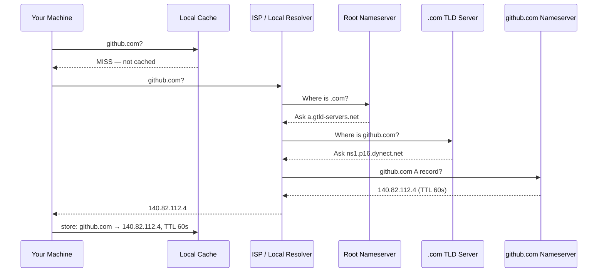

import Tabs from '@theme/Tabs';
import TabItem from '@theme/TabItem';

> **Section:** [Networking](.) · **Time Estimate:** 2 hours
>
> You learned how DNS resolution works conceptually in [Protocols & Standards — DNS](../protocols_and_standards/dns). This page covers the **operational tools** you'll use day to day.

---

## The Resolution Chain

When you type `github.com`, your machine doesn't magically know the IP. It asks a chain of DNS servers:



---

## DNS Query Tools

<Tabs>
<TabItem value="linux" label="Linux">

```bash
# Basic lookup — A record (IPv4)
nslookup github.com

# Query a specific DNS server (e.g., Google)
nslookup github.com 8.8.8.8

# dig — the professional tool
dig github.com            # A record
dig github.com MX         # Mail exchange records
dig github.com NS         # Nameservers for this domain
dig github.com TXT        # TXT records (SPF, DKIM, verification)
dig +short github.com     # Just the IP(s)
dig +trace github.com     # Full resolution chain step-by-step

# Query Cloudflare's resolver
dig @1.1.1.1 github.com

# Reverse lookup (IP → hostname)
dig -x 140.82.112.4
```

</TabItem>
<TabItem value="windows" label="Windows">

```powershell
# DNS lookup
Resolve-DnsName github.com

# Specific record types
Resolve-DnsName github.com -Type MX
Resolve-DnsName github.com -Type NS
Resolve-DnsName github.com -Type TXT

# Query a specific server
Resolve-DnsName github.com -Server 8.8.8.8

# Classic tool (works on both)
nslookup github.com
nslookup github.com 1.1.1.1
```

</TabItem>
</Tabs>

---

## DNS Record Types

| Type | Full Name | What It Contains | Example |
|------|-----------|------------------|---------|
| `A` | Address | IPv4 address | `github.com → 140.82.112.4` |
| `AAAA` | Address (v6) | IPv6 address | `github.com → 2606:50c0::` |
| `CNAME` | Canonical Name | Alias to another name | `www → github.com` |
| `MX` | Mail Exchange | Mail server address + priority | `10 aspmx.l.google.com` |
| `NS` | Nameserver | Authoritative DNS for this domain | `ns1.p16.dynect.net` |
| `TXT` | Text | Free-form (SPF, DKIM, verification) | `v=spf1 include:...` |
| `PTR` | Pointer | Reverse DNS (IP → name) | `4.112.82.140.in-addr.arpa` |
| `SRV` | Service | Service + port for discovery | `_http._tcp.example.com` |

---

## DNS Configuration Files

<Tabs>
<TabItem value="linux" label="Linux">

```bash
# Which DNS servers this machine queries
cat /etc/resolv.conf

# Example resolv.conf:
# nameserver 1.1.1.1
# nameserver 8.8.8.8
# search home.local

# systemd-resolved (modern Linux)
resolvectl status

# Flush DNS cache (systemd)
sudo resolvectl flush-caches

# Local hostname overrides — checked before DNS
cat /etc/hosts
# Add an override:
# 127.0.0.1  myapp.local
```

</TabItem>
<TabItem value="windows" label="Windows">

```powershell
# Which DNS servers are configured per interface
Get-DnsClientServerAddress

# View Windows DNS resolver cache
ipconfig /displaydns

# Flush DNS cache
ipconfig /flushdns

# Set DNS servers on an interface
Set-DnsClientServerAddress -InterfaceAlias "Wi-Fi" -ServerAddresses 1.1.1.1,8.8.8.8

# Hosts file — local overrides, checked before DNS
notepad C:\Windows\System32\drivers\etc\hosts
# Add a line like:
# 127.0.0.1  myapp.local
```

</TabItem>
</Tabs>

:::tip[Hosts file precedence]
The hosts file is **always checked before DNS**. This is useful for local development — add `127.0.0.1 myapp.local` and your browser will resolve it without a real DNS entry. Note it requires admin rights to edit.
:::
