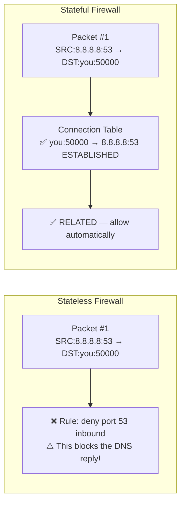
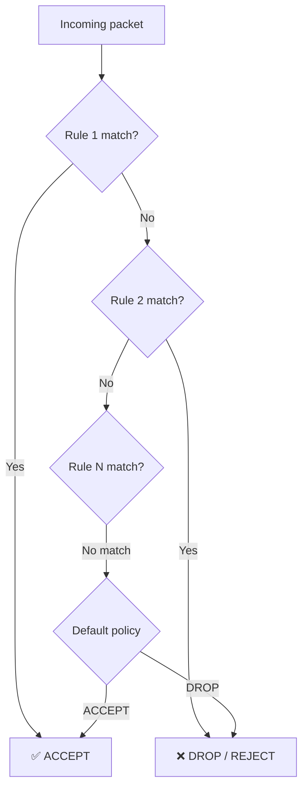

import Tabs from '@theme/Tabs';
import TabItem from '@theme/TabItem';

> **Section:** [Networking](.) · **Time Estimate:** 3–4 hours

---

## What a Firewall Does

A **firewall** controls which network traffic is allowed to pass based on a set of rules. Rules are evaluated in order and the first match wins.

### Stateful vs Stateless



| | Stateless | Stateful |
|--|-----------|----------|
| Tracks connections | No | Yes |
| Allows return traffic | Must write rules for it | Automatic |
| Performance | Faster | Slightly slower |
| Typical use | Core routers, simple ACLs | Servers, end-hosts, cloud security groups |

Modern firewalls (UFW, Windows Defender Firewall, AWS Security Groups) are **stateful**. A rule allowing outbound HTTP automatically permits the response.

---

## Linux — UFW (Recommended)

UFW is a simplified frontend to iptables. Use it for most server firewall tasks:

```bash
# Check UFW status
sudo ufw status verbose

# Allow common services by name
sudo ufw allow ssh            # Port 22
sudo ufw allow http           # Port 80
sudo ufw allow https          # Port 443

# Allow by port
sudo ufw allow 8080/tcp
sudo ufw deny 3306            # Block MySQL from outside

# Allow from a specific IP only
sudo ufw allow from 10.0.0.15 to any port 22

# Allow from an entire subnet
sudo ufw allow from 192.168.1.0/24

# Delete a rule
sudo ufw delete allow 8080/tcp

# Enable the firewall (do this AFTER allowing SSH!)
sudo ufw enable

# Reset to default (allow all out, deny all in)
sudo ufw reset
```

:::warning[Order matters]
Always allow SSH **before** enabling UFW. If you lock yourself out of an SSH session, you'll need console access to fix it.
:::

---

## Linux — iptables (Lower Level)

iptables is UFW's engine. You'll encounter it in logs, legacy configs, and advanced setups:

```bash
# View current rules with packet counts
sudo iptables -L -v -n

# The critical first rules — always add these before blocking
# 1. Allow established/related connections (return traffic)
sudo iptables -A INPUT -m conntrack --ctstate ESTABLISHED,RELATED -j ACCEPT
# 2. Allow loopback
sudo iptables -A INPUT -i lo -j ACCEPT

# Allow specific ports
sudo iptables -A INPUT -p tcp --dport 22 -j ACCEPT
sudo iptables -A INPUT -p tcp --dport 80 -j ACCEPT
sudo iptables -A INPUT -p tcp --dport 443 -j ACCEPT

# Drop everything else (put this LAST)
sudo iptables -A INPUT -j DROP

# Save rules so they persist across reboots
sudo netfilter-persistent save      # Debian/Ubuntu
sudo iptables-save > /etc/iptables/rules.v4
```

### DROP vs REJECT

| Action | Behaviour | Visible to attacker? |
|--------|-----------|:--------------------:|
| `DROP` | Packet silently discarded — sender gets no response | No |
| `REJECT` | Packet discarded + ICMP "port unreachable" sent back | Yes |

Use **DROP** on internet-facing interfaces to not reveal which ports exist. Use **REJECT** internally where you want fast failure feedback.

---

## Windows Firewall

<Tabs>
<TabItem value="powershell" label="PowerShell">

```powershell
# View firewall profile status (Domain / Private / Public)
Get-NetFirewallProfile | Select-Object Name, Enabled, DefaultInboundAction

# Allow inbound on a port
New-NetFirewallRule -DisplayName "Allow Port 8080" `
    -Direction Inbound `
    -Protocol TCP `
    -LocalPort 8080 `
    -Action Allow

# Allow a specific program
New-NetFirewallRule -DisplayName "Allow Python" `
    -Direction Inbound `
    -Program "C:\Python312\python.exe" `
    -Action Allow

# Block outbound to a specific IP
New-NetFirewallRule -DisplayName "Block Suspicious IP" `
    -Direction Outbound `
    -RemoteAddress 198.51.100.1 `
    -Action Block

# Remove a rule
Remove-NetFirewallRule -DisplayName "Allow Port 8080"

# List all enabled rules
Get-NetFirewallRule | Where-Object {$_.Enabled -eq "True"} |
    Format-Table DisplayName, Direction, Action
```

</TabItem>
<TabItem value="gui" label="GUI Path">

```
Windows Security → Firewall & network protection
  → Advanced settings
    → Inbound Rules → New Rule...
      → Port → TCP → specific port number
      → Allow / Block the connection
      → Which profiles (Domain, Private, Public)
      → Give it a name → Finish
```

</TabItem>
</Tabs>

---

## Rule Evaluation Flow



The firewall reads rules top-to-bottom and stops at the first match. **Order matters.** A broad ACCEPT rule above a specific DENY rule will let the traffic through.
