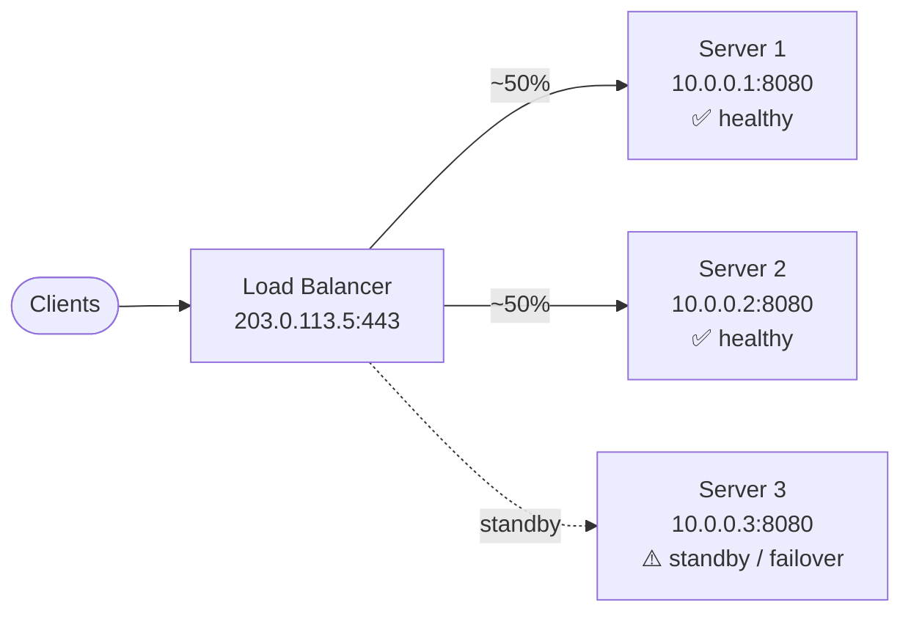
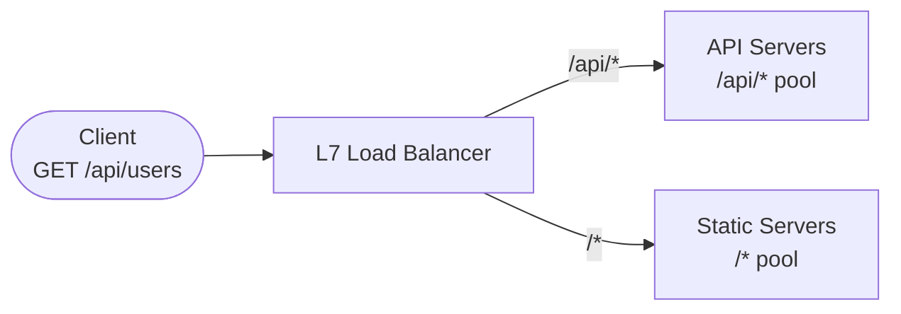

> **Section:** [Networking](.) · **Time Estimate:** 2 hours

---

## What a Load Balancer Does

A **load balancer** sits in front of a pool of backend servers and distributes incoming traffic so no single server is overwhelmed. It also provides fault tolerance — if one server fails, the load balancer stops sending it traffic.



---

## L4 vs L7 Load Balancing

The OSI layer at which a load balancer operates determines what it can see and what decisions it can make.

<svg viewBox="0 0 640 230" xmlns="http://www.w3.org/2000/svg" role="img" aria-label="L4 vs L7 load balancer comparison" style={{width:'100%',display:'block',margin:'1.5rem auto'}}>
  {/* L4 column */}
  <rect x="8" y="8" width="296" height="214" rx="8" fill="#3b82f6" fillOpacity="0.07" stroke="#3b82f6" strokeWidth="1.5"/>
  <rect x="8" y="8" width="296" height="36" rx="8" fill="#3b82f6" fillOpacity="0.18"/>
  <text x="30" y="32" fontFamily="sans-serif" fontSize="14" fontWeight="700" fill="#3b82f6">L4 — Transport Layer</text>

  <text x="24" y="68" fontFamily="sans-serif" fontSize="12" fill="var(--ifm-color-emphasis-700)">✅ Sees: IP address + port only</text>
  <text x="24" y="90" fontFamily="sans-serif" fontSize="12" fill="var(--ifm-color-emphasis-700)">✅ Routes by: Source IP / port</text>
  <text x="24" y="112" fontFamily="sans-serif" fontSize="12" fill="var(--ifm-color-emphasis-700)">✅ Protocol-agnostic (TCP/UDP)</text>
  <text x="24" y="134" fontFamily="sans-serif" fontSize="12" fill="var(--ifm-color-emphasis-700)">✅ Very fast — minimal processing</text>
  <text x="24" y="156" fontFamily="sans-serif" fontSize="12" fill="var(--ifm-color-emphasis-500)">❌ Cannot inspect URLs or headers</text>
  <text x="24" y="178" fontFamily="sans-serif" fontSize="12" fill="var(--ifm-color-emphasis-500)">❌ No content-based routing</text>

  <text x="24" y="208" fontFamily="monospace" fontSize="11" fill="#3b82f6">AWS NLB · HAProxy (TCP mode)</text>

  {/* L7 column */}
  <rect x="336" y="8" width="296" height="214" rx="8" fill="#10b981" fillOpacity="0.07" stroke="#10b981" strokeWidth="1.5"/>
  <rect x="336" y="8" width="296" height="36" rx="8" fill="#10b981" fillOpacity="0.18"/>
  <text x="358" y="32" fontFamily="sans-serif" fontSize="14" fontWeight="700" fill="#10b981">L7 — Application Layer</text>

  <text x="352" y="68" fontFamily="sans-serif" fontSize="12" fill="var(--ifm-color-emphasis-700)">✅ Sees: full HTTP request</text>
  <text x="352" y="90" fontFamily="sans-serif" fontSize="12" fill="var(--ifm-color-emphasis-700)">✅ Routes by: URL, headers, cookies</text>
  <text x="352" y="112" fontFamily="sans-serif" fontSize="12" fill="var(--ifm-color-emphasis-700)">✅ SSL/TLS termination</text>
  <text x="352" y="134" fontFamily="sans-serif" fontSize="12" fill="var(--ifm-color-emphasis-700)">✅ A/B testing, canary releases</text>
  <text x="352" y="156" fontFamily="sans-serif" fontSize="12" fill="var(--ifm-color-emphasis-700)">✅ Compression, caching</text>
  <text x="352" y="178" fontFamily="sans-serif" fontSize="12" fill="var(--ifm-color-emphasis-500)">❌ HTTP only · slightly more overhead</text>

  <text x="352" y="208" fontFamily="monospace" fontSize="11" fill="#10b981">AWS ALB · nginx · Traefik · Caddy</text>
</svg>

**Rule of thumb:** If you need to route by URL path, inspect headers, or terminate TLS — use L7. If you need raw throughput for non-HTTP protocols — use L4.

---

## Traffic Distribution Algorithms

| Algorithm | How It Works | Best For |
|-----------|-------------|---------|
| **Round Robin** | Each new request goes to the next server in rotation | Equally capable servers |
| **Weighted Round Robin** | Servers get proportional share based on their weight | Servers with different capacity |
| **Least Connections** | Route to the server with the fewest active connections | Long-lived connections (WebSockets) |
| **IP Hash** | Same source IP always maps to the same server | Session stickiness without cookies |
| **Least Response Time** | Route to the server with the lowest latency | Latency-sensitive APIs |

---

## Content-Based Routing (L7)

An L7 load balancer can route to different backend pools based on the HTTP request:



Example nginx config for content-based routing:

```nginx
upstream api_servers {
    server 10.0.0.1:3000;
    server 10.0.0.2:3000;
}

upstream frontend_servers {
    server 10.0.0.10:80;
    server 10.0.0.11:80;
}

server {
    listen 443 ssl;

    location /api/ {
        proxy_pass http://api_servers;
    }

    location / {
        proxy_pass http://frontend_servers;
    }
}
```

---

## Health Checks

Load balancers continuously probe backends and remove unhealthy servers from rotation:

| Check type | What it does | Example config |
|------------|-------------|----------------|
| **TCP** | Can I open a connection? | Port 8080 responds |
| **HTTP** | Does `/health` return 200? | `GET /health` → `200 OK` |
| **HTTPS** | Same, with TLS verification | `GET /health` via TLS |

A healthy `GET /health` endpoint typically returns:

```json
{ "status": "ok", "uptime": 3600, "version": "1.4.2" }
```

The load balancer polls this every few seconds. Two consecutive failures → server removed from rotation. Two consecutive successes → server re-added.
