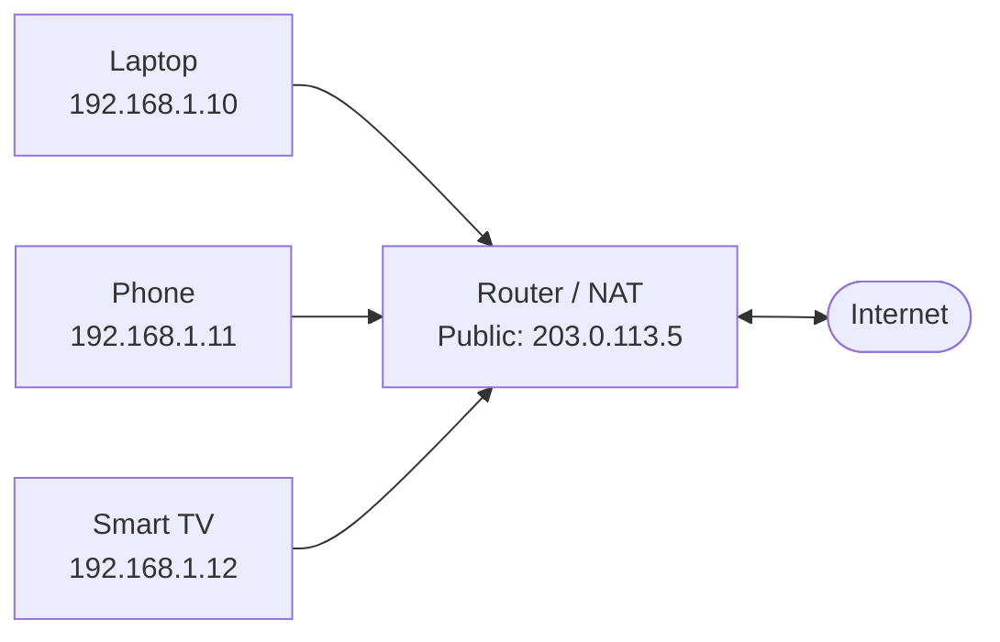

> **Section:** [Networking](.) · **Time Estimate:** 1–2 hours

---

## What NAT Does

**NAT (Network Address Translation)** is how millions of private devices share a single (or a handful of) public IP addresses. Your home router performs NAT every time you browse the web.



All three devices appear to the internet as `203.0.113.5`. Only the router knows which device is really communicating.

---

## How SNAT Works Step by Step

**SNAT (Source NAT)** is what your router does on every outbound connection:

<svg viewBox="0 0 680 200" xmlns="http://www.w3.org/2000/svg" role="img" aria-label="SNAT step-by-step diagram" style={{maxWidth:'680px',width:'100%',display:'block',margin:'1.5rem auto'}}>
  <defs>
    <marker id="nat-arrow" markerWidth="8" markerHeight="6" refX="8" refY="3" orient="auto">
      <polygon points="0 0, 8 3, 0 6" fill="#6366f1"/>
    </marker>
    <marker id="nat-arrow-green" markerWidth="8" markerHeight="6" refX="8" refY="3" orient="auto">
      <polygon points="0 0, 8 3, 0 6" fill="#10b981"/>
    </marker>
  </defs>

  {/* Step boxes */}
  <rect x="4" y="10" width="148" height="48" rx="6" fill="#6366f1" fillOpacity="0.12" stroke="#6366f1" strokeWidth="1.5"/>
  <text x="78" y="30" textAnchor="middle" fontFamily="monospace" fontSize="11" fill="#6366f1">192.168.1.10:54321</text>
  <text x="78" y="48" textAnchor="middle" fontFamily="sans-serif" fontSize="10" fill="var(--ifm-color-emphasis-600)">Laptop sends request</text>

  <rect x="196" y="10" width="148" height="48" rx="6" fill="#f59e0b" fillOpacity="0.12" stroke="#f59e0b" strokeWidth="1.5"/>
  <text x="270" y="28" textAnchor="middle" fontFamily="monospace" fontSize="10" fill="#f59e0b">192.168.1.10:54321</text>
  <text x="270" y="42" textAnchor="middle" fontFamily="sans-serif" fontSize="10" fill="var(--ifm-color-emphasis-600)">→ 203.0.113.5:40001</text>
  <text x="270" y="54" textAnchor="middle" fontFamily="sans-serif" fontSize="9" fill="var(--ifm-color-emphasis-500)">Router rewrites + logs</text>

  <rect x="388" y="10" width="148" height="48" rx="6" fill="#10b981" fillOpacity="0.12" stroke="#10b981" strokeWidth="1.5"/>
  <text x="462" y="30" textAnchor="middle" fontFamily="monospace" fontSize="11" fill="#10b981">203.0.113.5:40001</text>
  <text x="462" y="48" textAnchor="middle" fontFamily="sans-serif" fontSize="10" fill="var(--ifm-color-emphasis-600)">Google sees this IP</text>

  <rect x="580" y="10" width="92" height="48" rx="6" fill="#3b82f6" fillOpacity="0.12" stroke="#3b82f6" strokeWidth="1.5"/>
  <text x="626" y="34" textAnchor="middle" fontFamily="monospace" fontSize="11" fill="#3b82f6">google.com</text>

  {/* Arrows outbound */}
  <line x1="152" y1="34" x2="192" y2="34" stroke="#6366f1" strokeWidth="1.5" markerEnd="url(#nat-arrow)"/>
  <line x1="344" y1="34" x2="384" y2="34" stroke="#6366f1" strokeWidth="1.5" markerEnd="url(#nat-arrow)"/>
  <line x1="536" y1="34" x2="576" y2="34" stroke="#6366f1" strokeWidth="1.5" markerEnd="url(#nat-arrow)"/>

  {/* Return path */}
  <text x="340" y="110" textAnchor="middle" fontFamily="sans-serif" fontSize="11" fontWeight="600" fill="var(--ifm-color-emphasis-700)">Return path — Google responds to 203.0.113.5:40001</text>
  <line x1="580" y1="130" x2="536" y2="130" stroke="#10b981" strokeWidth="1.5" markerEnd="url(#nat-arrow-green)"/>
  <rect x="196" y="116" width="336" height="28" rx="4" fill="#10b981" fillOpacity="0.08" stroke="#10b981" strokeWidth="1"/>
  <text x="364" y="130" textAnchor="middle" fontFamily="monospace" fontSize="10" fill="#10b981">203.0.113.5:40001 → lookup → 192.168.1.10:54321</text>
  <text x="364" y="142" textAnchor="middle" fontFamily="sans-serif" fontSize="9" fill="var(--ifm-color-emphasis-600)">Router translates back using its mapping table</text>
  <line x1="192" y1="130" x2="152" y2="130" stroke="#10b981" strokeWidth="1.5" markerEnd="url(#nat-arrow-green)"/>

  {/* Laptop label on return */}
  <text x="78" y="130" textAnchor="middle" fontFamily="sans-serif" fontSize="10" fill="var(--ifm-color-emphasis-600)">Laptop receives reply</text>

  {/* Step numbers */}
  <circle cx="78" cy="75" r="9" fill="#6366f1" fillOpacity="0.15" stroke="#6366f1" strokeWidth="1"/>
  <text x="78" y="79" textAnchor="middle" fontFamily="sans-serif" fontSize="10" fontWeight="700" fill="#6366f1">1</text>
  <circle cx="270" cy="75" r="9" fill="#f59e0b" fillOpacity="0.15" stroke="#f59e0b" strokeWidth="1"/>
  <text x="270" y="79" textAnchor="middle" fontFamily="sans-serif" fontSize="10" fontWeight="700" fill="#f59e0b">2</text>
  <circle cx="462" cy="75" r="9" fill="#10b981" fillOpacity="0.15" stroke="#10b981" strokeWidth="1"/>
  <text x="462" y="79" textAnchor="middle" fontFamily="sans-serif" fontSize="10" fontWeight="700" fill="#10b981">3</text>
  <circle cx="626" cy="75" r="9" fill="#3b82f6" fillOpacity="0.15" stroke="#3b82f6" strokeWidth="1"/>
  <text x="626" y="79" textAnchor="middle" fontFamily="sans-serif" fontSize="10" fontWeight="700" fill="#3b82f6">4</text>
</svg>

1. Laptop sends a packet from `192.168.1.10:54321` to Google
2. Router rewrites the source to `203.0.113.5:40001` and records the mapping
3. Google receives the packet from `203.0.113.5` — it never sees the private IP
4. Google responds to `203.0.113.5:40001`; router translates back and delivers to the laptop

---

## Port Forwarding (DNAT)

**Port forwarding** (Destination NAT) is NAT in reverse — an inbound request on the public IP is redirected to a specific private device.

```
Inbound: 203.0.113.5:80  →  DNAT  →  192.168.1.20:80  (your web server)
Inbound: 203.0.113.5:22  →  DNAT  →  192.168.1.30:22  (your SSH host)
```

This is how you host a server behind a home router. The router is the only device with a public IP, so all inbound traffic hits it first — port forwarding tells it where to send each service.

| Public Port | Private Host | Private Port | Service |
|:-----------:|-------------|:------------:|---------|
| 80 | 192.168.1.20 | 80 | Web server |
| 443 | 192.168.1.20 | 443 | HTTPS |
| 22 | 192.168.1.30 | 22 | SSH |
| 25565 | 192.168.1.40 | 25565 | Minecraft server |

:::tip[Key insight]
Port forwarding is configured on your **router**, not on the server. The server just listens on its port normally. The router is the one that intercepts and redirects.
:::
