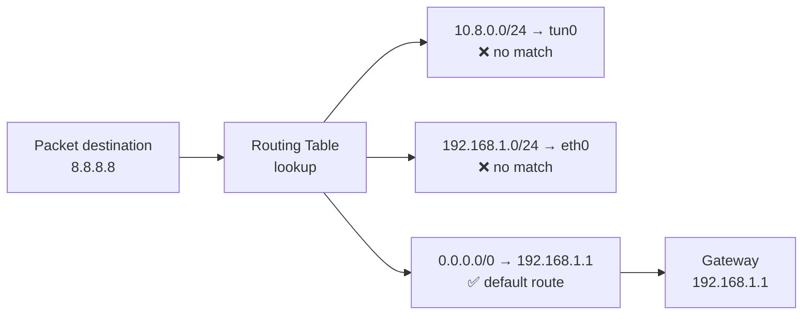
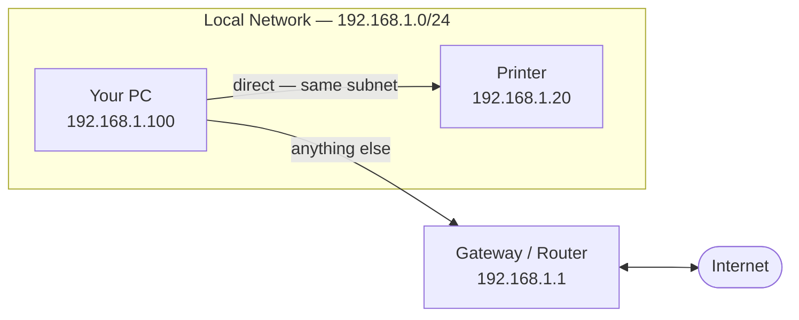

import Tabs from '@theme/Tabs';
import TabItem from '@theme/TabItem';

> **Section:** [Networking](.) · **Time Estimate:** 2–3 hours

---

## How Routing Works

A **router** connects networks and forwards packets based on a **routing table** — a list of known networks and which interface or next-hop to use for each one.

When a packet arrives, the router applies **longest prefix match**: it picks the most specific matching route.



---

## Reading a Routing Table

```
Destination         Gateway         Interface    Metric
0.0.0.0/0          192.168.1.1     eth0         100    ← Default route (internet)
192.168.1.0/24     0.0.0.0         eth0         0      ← Local network (direct)
10.8.0.0/24        10.8.0.1        tun0         50     ← VPN network
```

| Column | Meaning |
|--------|---------|
| **Destination** | The network this rule matches (CIDR) |
| **Gateway** | Next hop IP — `0.0.0.0` means "send directly on this interface" |
| **Interface** | Which network card to send the packet out of |
| **Metric** | Tie-breaker when multiple routes match — lower wins |

**Key rule:** `0.0.0.0/0` is the **default route** — it matches everything that no other rule matched. Traffic without a better match goes here (your internet gateway).

---

## Managing Routes

<Tabs>
<TabItem value="linux" label="Linux">

```bash
# View the routing table
ip route show

# Older command (still common)
route -n

# Find out which interface + gateway handles a specific IP
ip route get 8.8.8.8

# Add a static route (non-persistent)
sudo ip route add 10.0.0.0/8 via 192.168.1.254

# Delete a route
sudo ip route del 10.0.0.0/8
```

</TabItem>
<TabItem value="windows" label="Windows">

```powershell
# View routing table
route print

# PowerShell equivalent — IPv4 only
Get-NetRoute | Where-Object {$_.AddressFamily -eq "IPv4"} | Format-Table

# Add a static route (non-persistent — lost on reboot)
route add 10.0.0.0 mask 255.0.0.0 192.168.1.254

# Add a persistent static route (survives reboot)
route -p add 10.0.0.0 mask 255.0.0.0 192.168.1.254

# Delete a route
route delete 10.0.0.0
```

</TabItem>
</Tabs>

---

## The Default Gateway

Your default gateway is the router your machine uses for **any traffic not destined for the local subnet**. Without it, you can reach devices on your own subnet but nothing else — no internet.



:::tip[Try It]
Run `ip route show` (Linux) or `route print` (Windows). Identify your default gateway. Now ping it — if it doesn't respond, you have no internet regardless of what else is working.
:::
