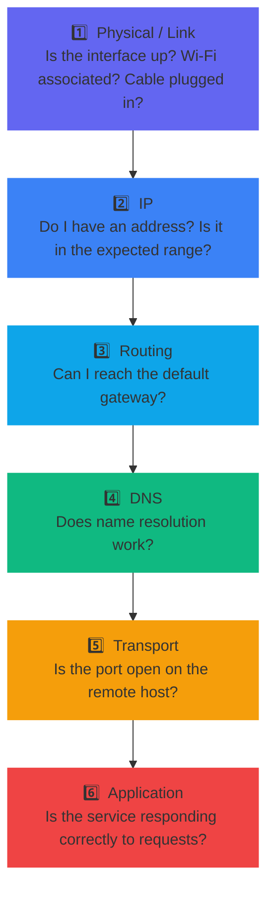

import Tabs from '@theme/Tabs';
import TabItem from '@theme/TabItem';

> **Section:** [Networking](.) · **Time Estimate:** 2–3 hours

---

## The Layer-by-Layer Method

When something won't connect, fight the urge to google the error immediately. Work from the **physical layer upward** — each layer depends on the one below. Fixing a higher layer problem won't help if a lower layer is broken.



---

## Layer 1 & 2 — Interface & Link

<Tabs>
<TabItem value="linux" label="Linux">

```bash
# Is the interface up?
ip link show

# Do I have an IP?
ip addr show

# Short summary of all interfaces + their IPs
ip -br addr

# Is Wi-Fi associated?
iwconfig          # legacy
iw dev wlan0 link # modern
```

</TabItem>
<TabItem value="windows" label="Windows">

```powershell
# Interface status and IP addresses
ipconfig /all

# PowerShell
Get-NetAdapter | Format-Table Name, Status, LinkSpeed
Get-NetIPAddress -AddressFamily IPv4
```

</TabItem>
</Tabs>

---

## Layer 3 — Routing & Gateway

<Tabs>
<TabItem value="linux" label="Linux">

```bash
# What is my default gateway?
ip route show default

# Ping the gateway (replace with your actual gateway IP)
ping -c 4 $(ip route | grep default | awk '{print $3}')

# Bypass DNS — ping a known public IP
ping -c 4 8.8.8.8

# Trace the path packet takes to a destination
traceroute 8.8.8.8
traceroute -T 8.8.8.8  # TCP mode (bypasses ICMP-blocking firewalls)

# Continuous ping + traceroute in one tool
mtr 8.8.8.8
```

</TabItem>
<TabItem value="windows" label="Windows">

```powershell
# What is my default gateway?
(Get-NetRoute -DestinationPrefix "0.0.0.0/0").NextHop

# Ping the gateway
$gw = (Get-NetRoute -DestinationPrefix "0.0.0.0/0").NextHop
Test-Connection $gw -Count 4

# Bypass DNS — ping a public IP
Test-Connection 8.8.8.8 -Count 4

# Trace route
tracert 8.8.8.8
Test-NetConnection github.com -TraceRoute
```

</TabItem>
</Tabs>

---

## Layer 4 — DNS

<Tabs>
<TabItem value="linux" label="Linux">

```bash
# Does name resolution work?
nslookup github.com

# More powerful lookup
dig github.com
dig +short github.com    # Just the IP

# If name resolves but connection fails — DNS is not the problem
# If this times out — check /etc/resolv.conf and DNS server reachability
```

</TabItem>
<TabItem value="windows" label="Windows">

```powershell
# DNS lookup
Resolve-DnsName github.com

# Classic
nslookup github.com
```

</TabItem>
</Tabs>

---

## Layer 5 — Transport (Port Check)

<Tabs>
<TabItem value="linux" label="Linux">

```bash
# Is a port open on a remote host?
nc -zv github.com 443      # -z = scan mode, -v = verbose
nc -zv github.com 22

# What's listening locally?
ss -tulpn                   # TCP+UDP, listening, process names
# t = TCP, u = UDP, l = listening, p = process, n = numeric ports

# Older alternative
netstat -tulpn
```

</TabItem>
<TabItem value="windows" label="Windows">

```powershell
# Is a port open on a remote host?
Test-NetConnection -ComputerName github.com -Port 443

# What's listening locally?
netstat -ano
Get-NetTCPConnection | Where-Object {$_.State -eq "Listen"} |
    Format-Table LocalAddress, LocalPort, State
```

</TabItem>
</Tabs>

---

## Layer 6 — Application

```bash
# Full HTTP request debug (shows TLS handshake, headers, redirect chain)
curl -v https://github.com

# Follow redirects
curl -Lv http://github.com

# Check specific header
curl -I https://github.com    # HEAD request — headers only

# Time each phase of the request
curl -w "\nDNS: %{time_namelookup}s\nConnect: %{time_connect}s\nTLS: %{time_appconnect}s\nTotal: %{time_total}s\n" \
     -o /dev/null -s https://github.com
```

---

## Advanced Tools

### tcpdump — Packet Capture

```bash
# Capture all traffic on eth0
sudo tcpdump -i eth0

# Filter by port
sudo tcpdump -i eth0 port 80

# Capture to file for Wireshark analysis
sudo tcpdump -i eth0 -w capture.pcap

# Read a capture file
tcpdump -r capture.pcap
```

### nmap — Port Scanner

```bash
# Scan common ports on a host (your own systems only!)
nmap 192.168.1.1

# Scan specific ports
nmap -p 22,80,443 192.168.1.1

# Scan an entire subnet
nmap 192.168.1.0/24

# Detect service versions
nmap -sV 192.168.1.1

# OS detection
sudo nmap -O 192.168.1.1
```

:::warning[Legal and ethical use]
Only scan systems you own or have explicit written permission to test. Unauthorized port scanning may be illegal in your jurisdiction.
:::

---

## Quick Reference — Symptom → First Check

| Symptom | First command | What you're testing |
|---------|--------------|---------------------|
| Nothing connects | `ip link show` / `ipconfig /all` | Interface up? IP assigned? |
| Can ping IP, not hostname | `nslookup github.com` | DNS resolution |
| Can't reach gateway | `ping <gateway-ip>` | Local routing |
| Port refuses connection | `nc -zv host port` | Port open/closed/filtered |
| HTTPS connection fails | `curl -v https://...` | TLS cert, redirect, server error |
| Intermittent packet loss | `mtr 8.8.8.8` | Which hop is dropping packets |
