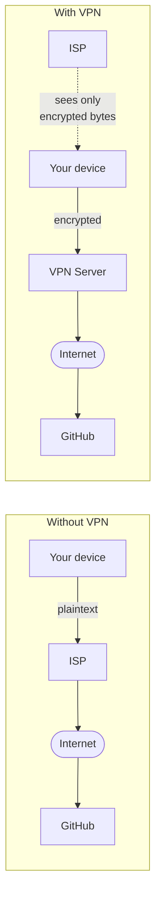

import Tabs from '@theme/Tabs';
import TabItem from '@theme/TabItem';

> **Section:** [Networking](.) · **Time Estimate:** 2–3 hours

---

## VPN — Virtual Private Network

A **VPN** creates an encrypted tunnel between two endpoints. Traffic inside the tunnel cannot be read by anyone in between (including your ISP).



---

## VPN Types

| Type | Purpose | Example |
|------|---------|---------|
| **Remote access** | Individual user connects to a company/office network from anywhere | Employee working from home |
| **Site-to-site** | Connects two entire networks (two offices, or office + cloud VPC) | Branch office ↔ HQ |
| **Personal / consumer** | Privacy / geo-bypass for individuals | NordVPN, ProtonVPN |

For DevOps, you'll encounter **site-to-site** (connecting your on-prem to AWS VPC) and **remote access** (letting engineers SSH into private cloud resources).

---

## WireGuard — Modern VPN

**WireGuard** is the recommended VPN for new deployments: simpler, faster, and more auditable than OpenVPN or IPsec.

> **Tool:** WireGuard · **Introduced:** 2018 · **Latest:** 1.0 (2020+) · **Deprecated:** N/A · **Status:** 🟢 Modern

<Tabs>
<TabItem value="linux" label="Linux (Server + Client)">

```bash
# Install
sudo apt install wireguard

# Generate a key pair (on each peer)
wg genkey | sudo tee /etc/wireguard/private.key
sudo chmod 600 /etc/wireguard/private.key
sudo cat /etc/wireguard/private.key | wg pubkey | sudo tee /etc/wireguard/public.key

# Example server config: /etc/wireguard/wg0.conf
[Interface]
PrivateKey = <SERVER_PRIVATE_KEY>
Address    = 10.0.0.1/24
ListenPort = 51820
PostUp     = iptables -A FORWARD -i wg0 -j ACCEPT; iptables -t nat -A POSTROUTING -o eth0 -j MASQUERADE
PostDown   = iptables -D FORWARD -i wg0 -j ACCEPT; iptables -t nat -D POSTROUTING -o eth0 -j MASQUERADE

[Peer]
PublicKey  = <CLIENT_PUBLIC_KEY>
AllowedIPs = 10.0.0.2/32

# Bring tunnel up / down
sudo wg-quick up wg0
sudo wg-quick down wg0

# Enable on boot
sudo systemctl enable wg-quick@wg0

# Show tunnel status
sudo wg show
```

</TabItem>
<TabItem value="windows" label="Windows (Client)">

```powershell
# Install WireGuard via winget
winget install WireGuard.WireGuard

# Example client config (save as wg0.conf)
# [Interface]
# PrivateKey = <CLIENT_PRIVATE_KEY>
# Address    = 10.0.0.2/24
# DNS        = 10.0.0.1
#
# [Peer]
# PublicKey  = <SERVER_PUBLIC_KEY>
# Endpoint   = your.server.com:51820
# AllowedIPs = 0.0.0.0/0   # Route all traffic through VPN

# Import and activate via CLI
& "C:\Program Files\WireGuard\wireguard.exe" /installtunnelservice "wg0.conf"

# Or use the GUI: WireGuard app → Import tunnel(s) from file
```

</TabItem>
</Tabs>

---

## Forward vs Reverse Proxy

**Proxy** is a broader concept that often gets confused with VPN. They're different:

<svg viewBox="0 0 640 220" xmlns="http://www.w3.org/2000/svg" role="img" aria-label="Forward proxy vs reverse proxy diagram" style={{width:'100%',display:'block',margin:'1.5rem auto'}}>
  <defs>
    <marker id="prx-arrow" markerWidth="8" markerHeight="6" refX="8" refY="3" orient="auto">
      <polygon points="0 0, 8 3, 0 6" fill="#6366f1"/>
    </marker>
    <marker id="prx-arrow-g" markerWidth="8" markerHeight="6" refX="8" refY="3" orient="auto">
      <polygon points="0 0, 8 3, 0 6" fill="#10b981"/>
    </marker>
  </defs>

  {/* Forward proxy */}
  <text x="160" y="20" textAnchor="middle" fontFamily="sans-serif" fontSize="13" fontWeight="700" fill="#6366f1">Forward Proxy</text>
  <rect x="8" y="34" width="90" height="40" rx="6" fill="#6366f1" fillOpacity="0.1" stroke="#6366f1" strokeWidth="1.2"/>
  <text x="53" y="59" textAnchor="middle" fontFamily="sans-serif" fontSize="11" fill="var(--ifm-color-emphasis-800)">Your Device</text>

  <rect x="120" y="34" width="80" height="40" rx="6" fill="#6366f1" fillOpacity="0.2" stroke="#6366f1" strokeWidth="1.5"/>
  <text x="160" y="49" textAnchor="middle" fontFamily="sans-serif" fontSize="10" fontWeight="700" fill="#6366f1">Forward</text>
  <text x="160" y="63" textAnchor="middle" fontFamily="sans-serif" fontSize="10" fontWeight="700" fill="#6366f1">Proxy</text>

  <rect x="222" y="34" width="90" height="40" rx="6" fill="#6366f1" fillOpacity="0.1" stroke="#6366f1" strokeWidth="1.2"/>
  <text x="267" y="59" textAnchor="middle" fontFamily="sans-serif" fontSize="11" fill="var(--ifm-color-emphasis-800)">Internet / Server</text>

  <line x1="98" y1="54" x2="116" y2="54" stroke="#6366f1" strokeWidth="1.5" markerEnd="url(#prx-arrow)"/>
  <line x1="200" y1="54" x2="218" y2="54" stroke="#6366f1" strokeWidth="1.5" markerEnd="url(#prx-arrow)"/>

  <text x="160" y="100" textAnchor="middle" fontFamily="sans-serif" fontSize="10" fill="var(--ifm-color-emphasis-600)">Client-side — hides your identity</text>
  <text x="160" y="114" textAnchor="middle" fontFamily="sans-serif" fontSize="10" fill="var(--ifm-color-emphasis-600)">Server sees proxy IP, not yours</text>
  <text x="160" y="128" textAnchor="middle" fontFamily="monospace" fontSize="10" fill="#6366f1">squid, browser proxy settings</text>

  {/* Reverse proxy */}
  <text x="480" y="20" textAnchor="middle" fontFamily="sans-serif" fontSize="13" fontWeight="700" fill="#10b981">Reverse Proxy</text>
  <rect x="330" y="34" width="80" height="40" rx="6" fill="#10b981" fillOpacity="0.1" stroke="#10b981" strokeWidth="1.2"/>
  <text x="370" y="59" textAnchor="middle" fontFamily="sans-serif" fontSize="11" fill="var(--ifm-color-emphasis-800)">Client</text>

  <rect x="430" y="34" width="80" height="40" rx="6" fill="#10b981" fillOpacity="0.2" stroke="#10b981" strokeWidth="1.5"/>
  <text x="470" y="49" textAnchor="middle" fontFamily="sans-serif" fontSize="10" fontWeight="700" fill="#10b981">Reverse</text>
  <text x="470" y="63" textAnchor="middle" fontFamily="sans-serif" fontSize="10" fontWeight="700" fill="#10b981">Proxy</text>

  <rect x="530" y="20" width="100" height="66" rx="6" fill="#10b981" fillOpacity="0.1" stroke="#10b981" strokeWidth="1.2"/>
  <text x="580" y="40" textAnchor="middle" fontFamily="sans-serif" fontSize="10" fill="var(--ifm-color-emphasis-800)">Server A</text>
  <text x="580" y="54" textAnchor="middle" fontFamily="sans-serif" fontSize="10" fill="var(--ifm-color-emphasis-800)">Server B</text>
  <text x="580" y="68" textAnchor="middle" fontFamily="sans-serif" fontSize="10" fill="var(--ifm-color-emphasis-800)">Server C</text>

  <line x1="410" y1="54" x2="426" y2="54" stroke="#10b981" strokeWidth="1.5" markerEnd="url(#prx-arrow-g)"/>
  <line x1="510" y1="44" x2="526" y2="44" stroke="#10b981" strokeWidth="1.5" markerEnd="url(#prx-arrow-g)"/>
  <line x1="510" y1="54" x2="526" y2="54" stroke="#10b981" strokeWidth="1.5" markerEnd="url(#prx-arrow-g)"/>
  <line x1="510" y1="64" x2="526" y2="64" stroke="#10b981" strokeWidth="1.5" markerEnd="url(#prx-arrow-g)"/>

  <text x="480" y="100" textAnchor="middle" fontFamily="sans-serif" fontSize="10" fill="var(--ifm-color-emphasis-600)">Server-side — hides backend topology</text>
  <text x="480" y="114" textAnchor="middle" fontFamily="sans-serif" fontSize="10" fill="var(--ifm-color-emphasis-600)">Client sees one IP — proxy handles routing</text>
  <text x="480" y="128" textAnchor="middle" fontFamily="monospace" fontSize="10" fill="#10b981">nginx, Traefik, Caddy, AWS ALB</text>
</svg>

| | Forward Proxy | Reverse Proxy |
|--|--------------|--------------|
| Sits in front of | Clients | Servers |
| Hides | Client identity from internet | Server topology from clients |
| Common uses | Corporate web filtering, privacy, geo-bypass | Load balancing, TLS termination, caching |
| Examples | Squid, browser proxy settings | nginx, Traefik, Caddy, AWS ALB/CloudFront |

:::tip[Reverse proxy is everywhere]
Every production web server runs behind a reverse proxy. nginx terminates TLS, adds headers, serves static files, and proxies application requests — so your app process doesn't need to handle any of that.
:::
