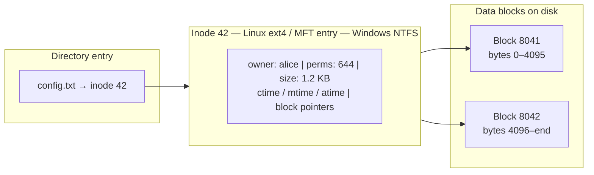

import Tabs from '@theme/Tabs';
import TabItem from '@theme/TabItem';

> **Section:** [OS Concepts](.) · **Time Estimate:** 2 hours

---

## What a File System Does

A **file system** provides the abstraction of files and directories on top of raw block storage. It tracks:
- **Data blocks** — where the bytes of your file live on disk
- **Metadata** — name, size, permissions, timestamps, owner
- **Structure** — which directories contain which files
- **Integrity** — journaling to survive crashes without corruption

---

## Linux vs Windows File Systems

| Feature | Linux (ext4) | Linux (XFS / btrfs) | Windows (NTFS) |
|---------|-------------|---:|----------------|
| **Default use** | General purpose | Large files / modern | System drive |
| **Directory separator** | `/` | `/` | `\` |
| **Root** | `/` | `/` | `C:\` |
| **Metadata structure** | Inode table | Same | MFT (Master File Table) |
| **Journaling** | Yes | Yes | Yes |
| **Max file size** | 16 TB | 8 EB | 16 EB |
| **Case sensitive** | Yes | Yes | No (by default) |
| **Symlinks** | Yes | Yes | Yes (requires admin) |
| **Hard links** | Yes | Yes | Yes |
| **ACLs** | Yes (setfacl) | Yes | Built in |

---

## Inodes and the MFT

Every file has a **metadata record** that stores everything *except* the name:



The directory just maps a **name → inode number**. This is why renaming a file within the same filesystem is instant — only the directory entry changes, not the data.

---

## Hard Links vs Symbolic Links

| | Hard Link | Symbolic Link (Symlink) |
|--|-----------|------------------------|
| Points to | The inode directly | A path string |
| Cross-filesystem? | No | Yes |
| Survives target deletion? | Yes (file stays until all hard links removed) | No (broken link) |
| Works on directories? | No (usually) | Yes |
| Detectable as link? | Only via inode count | Yes — `ls -la` shows `l` type |

<Tabs>
<TabItem value="linux" label="Linux">

```bash
# Symlink: /etc/nginx → /opt/nginx/conf
ln -s /opt/nginx/conf /etc/nginx

# Hard link: two names pointing to the same inode
ln /var/log/app.log /home/alice/app.log

# See where a symlink points
readlink -f /etc/nginx

# Confirm same inode (same number = same file)
ls -li /var/log/app.log /home/alice/app.log
```

</TabItem>
<TabItem value="windows" label="Windows">

```powershell
# Symlink (requires admin or Developer Mode)
New-Item -ItemType SymbolicLink -Path C:\nginx -Target C:\opt\nginx\conf

# Junction (directory-level hard link — doesn't require admin)
New-Item -ItemType Junction -Path C:\nginx -Target C:\opt\nginx\conf

# Hard link for a file
New-Item -ItemType HardLink -Path C:\logs\app2.log -Target C:\app\app.log

# Inspect link type and target
Get-Item C:\nginx | Select-Object LinkType, Target
```

</TabItem>
</Tabs>

---

## Essential Commands

<Tabs>
<TabItem value="linux" label="Linux">

```bash
# Disk space — what's using space?
df -h                           # Usage per mounted filesystem
du -sh /var/log/*               # Size of each item in /var/log
du -sh --max-depth=1 /home      # Top-level sizes
ncdu /                          # Interactive disk usage explorer

# File metadata
stat filename                   # All timestamps, permissions, inode, size
ls -li                          # Inode number + permissions
file filename                   # Detect file type by content (not extension)

# Mount management
mount                           # All mounted filesystems
lsblk                           # Block device tree with sizes
findmnt                         # Tree view of mount points
cat /etc/fstab                  # Persistent mounts configured at boot

# Filesystem health
sudo fsck /dev/sdb1             # Check and repair (device must be unmounted!)
sudo tune2fs -l /dev/sda1       # Show ext4 filesystem info

# Format a device (⚠️ destructive)
sudo mkfs.ext4 /dev/sdb1
```

</TabItem>
<TabItem value="windows" label="Windows">

```powershell
# Disk usage
Get-PSDrive -PSProvider FileSystem     # All drives with free/used
Get-Volume                              # Volume health, filesystem, label

# File metadata
Get-Item C:\Windows\notepad.exe | Select-Object *
(Get-Item C:\test.txt).Attributes

# Disk layout
Get-Partition | Format-Table DriveLetter, Size, Type
Get-Disk | Format-Table Number, FriendlyName, Size, HealthStatus

# Filesystem health
chkdsk C: /scan                 # Non-destructive scan
Repair-Volume -DriveLetter C -Scan

# Format (⚠️ destructive)
Format-Volume -DriveLetter D -FileSystem NTFS -NewFileSystemLabel "Data" -Confirm:$false
```

</TabItem>
</Tabs>

---

## The Linux Directory Hierarchy (FHS)

| Path | Purpose |
|------|---------|
| `/` | Root of everything |
| `/bin`, `/usr/bin` | User executables (ls, cat, grep) |
| `/sbin`, `/usr/sbin` | System admin executables (systemctl, fdisk) |
| `/etc` | Configuration files |
| `/var` | Variable data: logs, caches, spool queues |
| `/tmp` | Temporary files — cleared on reboot |
| `/home` | User home directories |
| `/proc` | Virtual FS — live kernel and process info |
| `/sys` | Virtual FS — hardware and driver info |
| `/dev` | Device files (disks, USB, terminals) |
| `/mnt`, `/media` | Mount points for temporary mounts |

:::tip[/proc is a goldmine]
`/proc` is not real storage — it's a virtual filesystem the kernel populates live. Browse `/proc/<PID>/` to see everything about a running process: open files, memory maps, environment variables, command line.
:::
