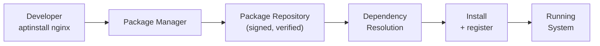

import Tabs from '@theme/Tabs';
import TabItem from '@theme/TabItem';

> **Section:** [OS Concepts](.) · **Time Estimate:** 1 hour

---

## What Package Managers Do

A **package manager** handles the full lifecycle of software: download, verify (cryptographic signature), install, dependency resolution, and removal. Without one, you'd manually download binaries, handle version conflicts, and never know what's installed.



---

## Linux — apt (Debian / Ubuntu)

> **Tool:** apt · **Introduced:** 1998 · **Latest:** 2.x · **Deprecated:** N/A · **Status:** 🟢 Modern

```bash
# Refresh package index (always before install/upgrade)
sudo apt update

# Upgrade all installed packages
sudo apt upgrade

# Full upgrade (handles dependency changes)
sudo apt full-upgrade

# Install packages
sudo apt install nginx
sudo apt install nginx curl git jq          # Multiple at once

# Remove packages
sudo apt remove nginx                       # Remove binary, keep config
sudo apt purge nginx                        # Remove binary + config
sudo apt autoremove                         # Remove orphaned dependencies

# Search
apt search "web server"
apt show nginx                              # Package info, version, size

# List installed
dpkg -l | grep nginx
apt list --installed

# Add a third-party repo (example: NodeSource for Node.js 20)
curl -fsSL https://deb.nodesource.com/setup_20.x | sudo -E bash -
sudo apt install nodejs
```

---

## Linux — dnf (RHEL / Fedora / CentOS)

> **Tool:** dnf · **Introduced:** 2015 · **Deprecated:** yum (legacy) · **Status:** 🟢 Modern

```bash
# Check for updates
sudo dnf check-update

# Upgrade all
sudo dnf upgrade

# Install
sudo dnf install nginx
sudo dnf install nginx curl git

# Remove
sudo dnf remove nginx

# Search
sudo dnf search nginx
sudo dnf info nginx

# List installed
rpm -qa | grep nginx
dnf list installed

# Enable EPEL (Extra Packages for Enterprise Linux — adds thousands of packages)
sudo dnf install epel-release

# Add a third-party repo
sudo dnf config-manager --add-repo https://rpm.nodesource.com/pub_20.x/nodejspkg.repo
```

---

## Windows — winget

> **Tool:** winget · **Introduced:** 2020 · **Latest:** 1.x · **Deprecated:** N/A · **Status:** 🟢 Modern

Microsoft's official package manager. Built into Windows 10 (1709+) and Windows 11.

```powershell
# Search for packages
winget search nodejs
winget search "visual studio code"

# Install
winget install OpenJS.NodeJS
winget install Git.Git
winget install Microsoft.VisualStudioCode
winget install WireGuard.WireGuard

# Install silently (no prompts)
winget install OpenJS.NodeJS --silent

# Upgrade
winget upgrade Git.Git
winget upgrade --all               # Upgrade everything

# List installed packages
winget list

# Uninstall
winget uninstall "Notepad++"

# Show package info
winget show OpenJS.NodeJS

# Export installed packages to restore later
winget export -o packages.json
winget import -i packages.json
```

---

## Windows — Chocolatey

> **Tool:** Chocolatey · **Introduced:** 2011 · **Status:** 🟢 Modern (community)

Larger package catalogue than winget, especially for developer tools:

```powershell
# Install Chocolatey first (run as Administrator)
Set-ExecutionPolicy Bypass -Scope Process -Force
[System.Net.ServicePointManager]::SecurityProtocol = [System.Net.ServicePointManager]::SecurityProtocol -bor 3072
iex ((New-Object System.Net.WebClient).DownloadString('https://community.chocolatey.org/install.ps1'))

# Install packages (run as Administrator)
choco install nodejs git vscode -y
choco install python --version=3.12.0 -y

# Upgrade
choco upgrade all -y

# List locally installed
choco list --local-only

# Uninstall
choco uninstall nodejs
```

---

## Windows — Scoop

> **Tool:** Scoop · **Introduced:** 2013 · **Status:** 🟢 Modern

User-space installer — no admin required. Ideal for CLI developer tools:

```powershell
# Install Scoop (no admin needed)
Set-ExecutionPolicy RemoteSigned -Scope CurrentUser -Force
irm get.scoop.sh | iex

# Install developer tools
scoop install git curl vim fzf ripgrep

# CLI language runtimes
scoop install python nodejs go rust

# Upgrade
scoop update *

# List installed
scoop list

# Uninstall
scoop uninstall vim
```

---

## Choosing a Windows Package Manager

| | winget | Chocolatey | Scoop |
|--|--------|------------|-------|
| **Official Microsoft** | ✅ | ❌ | ❌ |
| **Admin required** | Sometimes | Yes (most installs) | No |
| **Catalogue size** | Large (growing) | Very large | Focused (CLI/dev) |
| **Export/import** | ✅ | ✅ | ✅ |
| **Best for** | General software | Wide dev tool selection | CLI tools, no admin |

:::tip[Use winget for most things]
winget is the modern standard. Use Chocolatey when winget doesn't have the package you need. Use Scoop when you want clean, user-space installs of CLI tools without touching system paths.
:::
