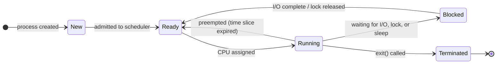

import Tabs from '@theme/Tabs';
import TabItem from '@theme/TabItem';

> **Section:** [OS Concepts](.) · **Time Estimate:** 2–3 hours

---

## Process vs Thread

A **process** is a running instance of a program. The OS gives it:
- Its own isolated virtual address space (other processes can't touch it)
- One or more threads of execution
- A set of open file handles / descriptors
- A lifecycle: New → Ready → Running → Blocked → Terminated

A **thread** is an execution unit *inside* a process. Multiple threads in the same process share the same memory and file handles, but each has its own:
- Stack (local variables, call frames)
- Registers and program counter
- Thread ID and scheduling state

<svg viewBox="0 0 640 230" xmlns="http://www.w3.org/2000/svg" role="img" aria-label="Process and thread anatomy diagram" style={{maxWidth:'640px',width:'100%',display:'block',margin:'1.5rem auto'}}>
  <defs>
    <linearGradient id="proc-grad" x1="0" y1="0" x2="0" y2="1">
      <stop offset="0%" stopColor="#6366f1" stopOpacity="0.18"/>
      <stop offset="100%" stopColor="#6366f1" stopOpacity="0.05"/>
    </linearGradient>
    <linearGradient id="thread-grad" x1="0" y1="0" x2="0" y2="1">
      <stop offset="0%" stopColor="#10b981" stopOpacity="0.22"/>
      <stop offset="100%" stopColor="#10b981" stopOpacity="0.06"/>
    </linearGradient>
    <linearGradient id="shared-grad" x1="0" y1="0" x2="0" y2="1">
      <stop offset="0%" stopColor="#f59e0b" stopOpacity="0.18"/>
      <stop offset="100%" stopColor="#f59e0b" stopOpacity="0.05"/>
    </linearGradient>
  </defs>

  {/* Process outline */}
  <rect x="4" y="4" width="632" height="222" rx="10" fill="url(#proc-grad)" stroke="#6366f1" strokeWidth="1.8"/>
  <text x="20" y="26" fontFamily="monospace" fontSize="13" fontWeight="700" fill="#6366f1">Process: web_server  (PID 1234)</text>

  {/* Thread 0 */}
  <rect x="20" y="38" width="176" height="86" rx="6" fill="url(#thread-grad)" stroke="#10b981" strokeWidth="1.2"/>
  <text x="108" y="58" textAnchor="middle" fontFamily="sans-serif" fontSize="11" fontWeight="700" fill="#10b981">Thread 0 (main)</text>
  <text x="108" y="74" textAnchor="middle" fontFamily="monospace" fontSize="10" fill="var(--ifm-color-emphasis-700)">listening for connections</text>
  <rect x="36" y="86" width="144" height="30" rx="4" fill="#10b981" fillOpacity="0.12" stroke="#10b981" strokeWidth="0.8"/>
  <text x="108" y="101" textAnchor="middle" fontFamily="monospace" fontSize="9" fill="var(--ifm-color-emphasis-700)">Stack₀ · Registers₀ · PC₀</text>

  {/* Thread 1 */}
  <rect x="212" y="38" width="176" height="86" rx="6" fill="url(#thread-grad)" stroke="#10b981" strokeWidth="1.2"/>
  <text x="300" y="58" textAnchor="middle" fontFamily="sans-serif" fontSize="11" fontWeight="700" fill="#10b981">Thread 1</text>
  <text x="300" y="74" textAnchor="middle" fontFamily="monospace" fontSize="10" fill="var(--ifm-color-emphasis-700)">handling client A request</text>
  <rect x="228" y="86" width="144" height="30" rx="4" fill="#10b981" fillOpacity="0.12" stroke="#10b981" strokeWidth="0.8"/>
  <text x="300" y="101" textAnchor="middle" fontFamily="monospace" fontSize="9" fill="var(--ifm-color-emphasis-700)">Stack₁ · Registers₁ · PC₁</text>

  {/* Thread 2 */}
  <rect x="404" y="38" width="176" height="86" rx="6" fill="url(#thread-grad)" stroke="#10b981" strokeWidth="1.2"/>
  <text x="492" y="58" textAnchor="middle" fontFamily="sans-serif" fontSize="11" fontWeight="700" fill="#10b981">Thread 2</text>
  <text x="492" y="74" textAnchor="middle" fontFamily="monospace" fontSize="10" fill="var(--ifm-color-emphasis-700)">handling client B request</text>
  <rect x="420" y="86" width="144" height="30" rx="4" fill="#10b981" fillOpacity="0.12" stroke="#10b981" strokeWidth="0.8"/>
  <text x="492" y="101" textAnchor="middle" fontFamily="monospace" fontSize="9" fill="var(--ifm-color-emphasis-700)">Stack₂ · Registers₂ · PC₂</text>

  {/* Shared area */}
  <rect x="20" y="140" width="560" height="36" rx="6" fill="url(#shared-grad)" stroke="#f59e0b" strokeWidth="1.2"/>
  <text x="300" y="155" textAnchor="middle" fontFamily="sans-serif" fontSize="11" fontWeight="700" fill="#f59e0b">Shared Memory (heap, globals)</text>
  <text x="300" y="169" textAnchor="middle" fontFamily="monospace" fontSize="10" fill="var(--ifm-color-emphasis-600)">All threads read and write here — race conditions happen here</text>

  {/* Open files */}
  <rect x="20" y="188" width="560" height="28" rx="6" fill="#3b82f6" fillOpacity="0.08" stroke="#3b82f6" strokeWidth="1"/>
  <text x="300" y="200" textAnchor="middle" fontFamily="sans-serif" fontSize="11" fontWeight="700" fill="#3b82f6">Open File Handles</text>
  <text x="300" y="212" textAnchor="middle" fontFamily="monospace" fontSize="10" fill="var(--ifm-color-emphasis-600)">fd:3 (socket) · fd:4 (log file) — shared across all threads</text>
</svg>

**Key consequences:**
- Process isolation means one process **cannot corrupt another's memory** without explicit OS permission.
- Thread sharing means a bug in one thread **can corrupt data used by all threads** — this is how race conditions and deadlocks happen. See [Concurrency](../concurrency) for how to handle this.

---

## Process States

A process cycles through states as the OS scheduler runs it:



**Blocked** (also called "Sleeping" or "Waiting") is not wasted time — while one thread waits for disk I/O, the scheduler runs other threads. This is the basis of concurrent I/O without burning CPU.

---

## Inspecting and Managing Processes

<Tabs>
<TabItem value="linux" label="Linux">

```bash
# All running processes
ps aux                          # BSD style — most common
ps -ef                          # System V style
pstree                          # Parent/child hierarchy as tree

# Interactive views
top                             # CPU-sorted, updates every 3s
htop                            # Improved top — install separately

# Find a specific process
ps aux | grep nginx
pgrep -a nginx                  # PIDs + names
pidof nginx                     # Just PIDs

# Inspect a process in depth (Linux exposes everything as files)
ls /proc/<PID>/
cat /proc/<PID>/status          # State, memory, parent PID
cat /proc/<PID>/cmdline | tr '\0' ' '   # Full command line
ls -la /proc/<PID>/fd/          # Open file descriptors

# Threads within a process
ps -L -p <PID>                  # List all threads
top -H -p <PID>                 # Show threads in top

# Signals
kill <PID>                      # SIGTERM — ask to terminate (graceful)
kill -9 <PID>                   # SIGKILL — force terminate immediately
kill -SIGHUP <PID>              # SIGHUP — reload config (daemons)
killall nginx                   # Terminate all processes named nginx
pkill -f "python server.py"     # Match by full command line
```

</TabItem>
<TabItem value="windows" label="Windows">

```powershell
# All processes
Get-Process
Get-Process | Sort-Object CPU -Descending

# Find specific processes
Get-Process -Name "chrome"
Get-Process | Where-Object {$_.WorkingSet -gt 500MB}

# Detailed info on a process
Get-Process -Id 1234 | Select-Object *

# Process tree (parent/child)
Get-CimInstance Win32_Process |
    Select-Object ProcessId, ParentProcessId, Name |
    Sort-Object ParentProcessId

# Threads within a process
(Get-Process -Id 1234).Threads | Select-Object Id, ThreadState, WaitReason

# Terminate
Stop-Process -Name "notepad"        # Graceful (SIGTERM equivalent)
Stop-Process -Id 1234 -Force        # Force kill
taskkill /F /PID 1234               # Classic tool
taskkill /F /IM chrome.exe /T       # Kill process tree
```

</TabItem>
</Tabs>

---

## Linux Signals Reference

Signals are the Linux mechanism for asynchronous notifications to a process:

| Signal | Number | Default action | Common use |
|--------|:------:|----------------|-----------|
| `SIGTERM` | 15 | Terminate (graceful) | `kill <PID>` — give app chance to clean up |
| `SIGKILL` | 9 | Force terminate | Can't be caught or ignored — last resort |
| `SIGHUP` | 1 | Terminate (or reload) | Daemons: reload config without restarting |
| `SIGINT` | 2 | Terminate | Ctrl+C in terminal |
| `SIGSTOP` | 19 | Pause | Can't be caught — freezes process |
| `SIGCONT` | 18 | Resume | Resume a stopped process |
| `SIGUSR1/2` | 10/12 | Custom | App-defined actions (rotate logs, dump stats) |

:::tip[Always try SIGTERM first]
`kill -9` is a last resort. It prevents the process from flushing buffers, releasing locks, or cleaning up temp files. A well-written daemon handles `SIGTERM` and shuts down cleanly.
:::
