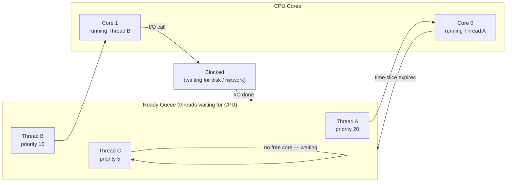

import Tabs from '@theme/Tabs';
import TabItem from '@theme/TabItem';

> **Section:** [OS Concepts](.) · **Time Estimate:** 1–2 hours
>
> Read [Processes & Threads](./processes_threads) first — scheduling acts on threads.

---

## How Scheduling Works

The CPU can only execute one thread per core at a time. On a 4-core system, exactly 4 threads run simultaneously. The **scheduler** decides which threads from the Ready queue get a time slice.



**Preemptive scheduling:** The OS uses a timer interrupt to forcibly pause a running thread after its time slice (typically 4–100ms). No thread can monopolise a CPU.

---

## Priority

Every thread has a **priority** value. Higher priority = more CPU time (shorter wait in the Ready queue).

<svg viewBox="0 0 620 120" xmlns="http://www.w3.org/2000/svg" role="img" aria-label="Linux nice vs Windows priority comparison" style={{maxWidth:'620px',width:'100%',display:'block',margin:'1.5rem auto'}}>
  {/* Linux scale */}
  <text x="160" y="18" textAnchor="middle" fontFamily="sans-serif" fontSize="12" fontWeight="700" fill="var(--ifm-color-emphasis-800)">Linux nice value</text>

  <defs>
    <linearGradient id="sched-l-grad" x1="0" y1="0" x2="1" y2="0">
      <stop offset="0%" stopColor="#ef4444"/>
      <stop offset="100%" stopColor="#10b981"/>
    </linearGradient>
    <linearGradient id="sched-w-grad" x1="0" y1="0" x2="1" y2="0">
      <stop offset="0%" stopColor="#ef4444"/>
      <stop offset="100%" stopColor="#10b981"/>
    </linearGradient>
  </defs>

  <rect x="20" y="28" width="280" height="22" rx="4" fill="url(#sched-l-grad)" fillOpacity="0.7"/>
  <text x="20" y="68" fontFamily="monospace" fontSize="10" fill="#ef4444">-20</text>
  <text x="145" y="68" textAnchor="middle" fontFamily="monospace" fontSize="10" fill="var(--ifm-color-emphasis-600)">0 (default)</text>
  <text x="296" y="68" textAnchor="middle" fontFamily="monospace" fontSize="10" fill="#10b981">+19</text>
  <text x="20" y="84" fontFamily="sans-serif" fontSize="10" fill="#ef4444">highest priority</text>
  <text x="296" y="84" textAnchor="middle" fontFamily="sans-serif" fontSize="10" fill="#10b981">lowest priority</text>
  <text x="160" y="100" textAnchor="middle" fontFamily="sans-serif" fontSize="10" fill="var(--ifm-color-emphasis-600)">Negative values require root</text>

  {/* Windows scale */}
  <text x="460" y="18" textAnchor="middle" fontFamily="sans-serif" fontSize="12" fontWeight="700" fill="var(--ifm-color-emphasis-800)">Windows priority class</text>

  <rect x="330" y="28" width="272" height="22" rx="4" fill="url(#sched-w-grad)" fillOpacity="0.7"/>
  <text x="330" y="68" fontFamily="monospace" fontSize="9" fill="#ef4444">Realtime</text>
  <text x="390" y="68" fontFamily="monospace" fontSize="9" fill="#e88010">High</text>
  <text x="433" y="68" fontFamily="monospace" fontSize="9" fill="#f59e0b">AboveNormal</text>
  <text x="507" y="68" fontFamily="monospace" fontSize="9" fill="#10b981">Normal</text>
  <text x="556" y="68" fontFamily="monospace" fontSize="9" fill="#22c55e">Below</text>
  <text x="330" y="84" fontFamily="sans-serif" fontSize="9" fill="#ef4444">←high</text>
  <text x="570" y="84" fontFamily="sans-serif" fontSize="9" fill="#10b981">low→</text>
  <text x="460" y="100" textAnchor="middle" fontFamily="sans-serif" fontSize="10" fill="var(--ifm-color-emphasis-600)">Realtime can starve system processes</text>
</svg>

---

## Managing Priority

<Tabs>
<TabItem value="linux" label="Linux">

```bash
# Start a new process with a lower CPU priority (be "nicer" to others)
nice -n 10 ./my_backup_script.sh

# Lower priority further — useful for background jobs
nice -n 19 ./compress_logs.sh

# Change priority of an already-running process
renice -n 5 -p <PID>             # Lower priority
renice -n -5 -p <PID>            # Raise priority (requires root for negative)

# Check a process's scheduling policy
chrt -p <PID>

# Real-time scheduling — for latency-critical work only
sudo chrt -f 99 ./realtime_app   # SCHED_FIFO, priority 99
                                  # ⚠️ Can starve all other work — use carefully

# View current load averages (1min / 5min / 15min)
uptime
# Load average > number of CPU cores = system overloaded
cat /proc/loadavg
```

</TabItem>
<TabItem value="windows" label="Windows">

```powershell
# Change priority of a running process
$p = Get-Process -Name "notepad"
$p.PriorityClass = "BelowNormal"

# Valid classes: Idle, BelowNormal, Normal, AboveNormal, High, RealTime

# Start a new process at a specific priority
Start-Process "python.exe" -ArgumentList "server.py" -Priority BelowNormal

# Query CPU load
Get-Counter '\Processor(_Total)\% Processor Time' -SampleInterval 2 -MaxSamples 5
```

</TabItem>
</Tabs>

---

## CPU Affinity — Pinning to Specific Cores

You can restrict a process to run only on specific CPU cores. Useful for:
- Isolating a latency-sensitive process from noisy neighbours
- Benchmarking (eliminate scheduler variance)
- Testing NUMA behaviour on multi-socket servers

<Tabs>
<TabItem value="linux" label="Linux">

```bash
# Run a command on CPU cores 0 and 1 only
taskset -c 0,1 ./my_app

# Pin an already-running process
taskset -cp 0,1 <PID>

# View current affinity
taskset -p <PID>

# Check how many CPUs are available
nproc
lscpu | grep "CPU(s)"
```

</TabItem>
<TabItem value="windows" label="Windows">

```powershell
# Pin a process to cores 0 and 1 (bitmask: binary 0011 = 3)
$p = Get-Process -Id <PID>
$p.ProcessorAffinity = 3    # bit 0 = core 0, bit 1 = core 1

# For 4 cores all enabled: 0b1111 = 15
$p.ProcessorAffinity = 15

# You can also set affinity in Task Manager:
# Details tab → right-click process → Set Affinity
```

</TabItem>
</Tabs>

---

## Reading Load Average (Linux)

```bash
$ uptime
 09:45:12 up 3 days,  2:14,  2 users,  load average: 1.23, 2.10, 1.87
                                                       │     │     │
                                                       │     │     └── 15-minute average
                                                       │     └──────── 5-minute average
                                                       └────────────── 1-minute average
```

Load average represents the average number of **runnable + uninterruptable threads** over each time window. Compare it to your CPU count:

| Load average vs CPUs | Meaning |
|---------------------|---------|
| Load < CPU count | System has spare capacity |
| Load ≈ CPU count | System is fully utilised |
| Load > CPU count | System is overloaded — threads are queuing for CPU |

:::tip[Rule of thumb]
On a 4-core server, a 15-minute load average consistently above 4.0 means you're CPU-bound and should either optimise the workload or scale horizontally.
:::
