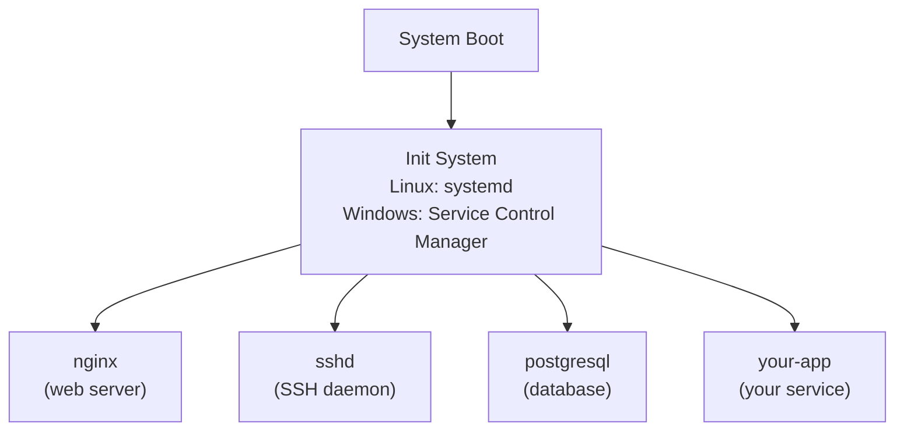

import Tabs from '@theme/Tabs';
import TabItem from '@theme/TabItem';

> **Section:** [OS Concepts](.) · **Time Estimate:** 2–3 hours

---

## What Services and Daemons Are

A **daemon** (Linux) or **service** (Windows) is a long-running background process that starts at boot and runs without an interactive user session. Examples: web servers, databases, logging agents, SSH server.



The init system is responsible for:
- Starting services in the right order (dependencies)
- Restarting services that crash
- Logging their output
- Shutting them down gracefully on reboot

---

## Linux — systemd

**systemd** is the standard init system on all major Linux distributions (Ubuntu, RHEL, Debian, Arch, etc.).

### Managing Services

```bash
# Basic lifecycle
sudo systemctl start nginx          # Start now
sudo systemctl stop nginx           # Stop now
sudo systemctl restart nginx        # Stop then start
sudo systemctl reload nginx         # Reload config (no downtime, if supported)

# Persistence across reboots
sudo systemctl enable nginx         # Start on boot
sudo systemctl disable nginx        # Don't start on boot
sudo systemctl enable --now nginx   # Enable AND start immediately

# Status and health
sudo systemctl status nginx         # Status, PID, recent logs
systemctl is-active nginx           # Exits 0 if running
systemctl is-enabled nginx          # Exits 0 if enabled

# See all services
systemctl list-units --type=service
systemctl list-units --type=service --state=failed
```

### Reading Logs with journalctl

systemd captures stdout/stderr of all services into the **journal**:

```bash
# All logs for a service
journalctl -u nginx

# Follow live (like tail -f)
journalctl -u nginx -f

# Since a specific time
journalctl -u nginx --since "2026-04-10 09:00:00"
journalctl -u nginx --since "1 hour ago"

# Only errors and above
journalctl -u nginx -p err

# Boot messages
journalctl -b                       # Current boot
journalctl -b -1                    # Previous boot

# Disk usage
journalctl --disk-usage
```

### Writing a Unit File

Create `/etc/systemd/system/myapp.service`:

```ini
[Unit]
Description=My Application Server
# This service starts after the network is up
After=network.target
# If it depends on PostgreSQL:
# After=postgresql.service
# Requires=postgresql.service

[Service]
Type=simple
User=appuser
Group=appgroup
WorkingDirectory=/opt/myapp

# The main process to run
ExecStart=/opt/myapp/server --port 8080

# Restart policy
Restart=on-failure
RestartSec=5s
StartLimitIntervalSec=60
StartLimitBurst=3

# Environment variables
Environment=PORT=8080
Environment=LOG_LEVEL=info
# Or load from a file:
# EnvironmentFile=/etc/myapp/env

# Resource limits
LimitNOFILE=65536

[Install]
WantedBy=multi-user.target
```

```bash
# After creating or editing the file, always reload
sudo systemctl daemon-reload

# Then enable and start
sudo systemctl enable --now myapp

# Verify
sudo systemctl status myapp
journalctl -u myapp -f
```

---

## Windows — Services

<Tabs>
<TabItem value="powershell" label="PowerShell">

```powershell
# Basic service lifecycle
Start-Service "nginx"
Stop-Service "nginx"
Restart-Service "nginx"
Get-Service "nginx"

# View all running services
Get-Service | Where-Object {$_.Status -eq "Running"} |
    Select-Object Name, DisplayName, StartType

# Set startup type
Set-Service "nginx" -StartupType Automatic   # Start on boot
Set-Service "nginx" -StartupType Manual      # Start manually only
Set-Service "nginx" -StartupType Disabled    # Cannot be started

# Create a service from an existing EXE
New-Service -Name "MyApp" `
    -BinaryPathName "C:\myapp\server.exe --production" `
    -DisplayName "My Application" `
    -StartupType Automatic `
    -Description "Production application server"

Start-Service "MyApp"

# Remove a service
Stop-Service "MyApp"
Remove-Service "MyApp"   # PowerShell 6+
# Or: sc.exe delete MyApp

# View service logs
Get-EventLog -LogName Application -Source "MyApp" -Newest 50
```

</TabItem>
<TabItem value="nssm" label="NSSM (Recommended for scripts/interpreters)">

NSSM (Non-Sucking Service Manager) wraps any executable — including Python scripts, Node.js apps, batch files — as a Windows service, with automatic restart and proper stdin/stdout/stderr capture.

```powershell
# Install NSSM
winget install NSSM.NSSM

# Register a Python app as a service
nssm install MyPythonApp "C:\Python312\python.exe"
nssm set MyPythonApp AppParameters "C:\myapp\server.py"
nssm set MyPythonApp AppDirectory "C:\myapp"
nssm set MyPythonApp AppRestartDelay 5000    # 5 second delay before restart
nssm set MyPythonApp AppStdout "C:\myapp\logs\stdout.log"
nssm set MyPythonApp AppStderr "C:\myapp\logs\stderr.log"

# Start it
nssm start MyPythonApp

# Edit settings (opens a GUI)
nssm edit MyPythonApp

# Remove
nssm stop MyPythonApp
nssm remove MyPythonApp confirm
```

</TabItem>
</Tabs>

---

## systemd vs Windows Services — Key Differences

| Feature | systemd (Linux) | Windows Services |
|---------|----------------|-----------------|
| Config format | INI-style `.service` file | Binary registry entries |
| Dependency ordering | `After=`, `Requires=` | `DependOnService` in registry |
| Log access | `journalctl -u <name>` | Event Viewer / `Get-EventLog` |
| Restart on failure | `Restart=on-failure` (built in) | Configurable in GUI / `sc.exe failure` |
| Run as user | `User=` in \[Service\] | Log On tab in services.msc |
| Hot reload | `systemctl reload` (if app supports it) | No standard equivalent |
| Scripted apps | Native (ExecStart=any binary) | Requires NSSM or similar wrapper |

:::tip[Always set Restart=on-failure]
Production services should always restart automatically after a crash. In systemd that's `Restart=on-failure`. In Windows Services, go to services.msc → Recovery tab → set "First failure: Restart the Service".
:::
