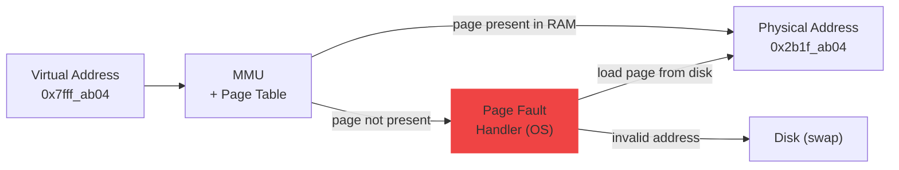

import Tabs from '@theme/Tabs';
import TabItem from '@theme/TabItem';

> **Section:** [OS Concepts](.) · **Time Estimate:** 2–3 hours
>
> For the hardware side of this topic, see [CPU Cache](../hardware_fundamentals/cpu/cache) and [Memory Management](../memory_management).

---

## The Virtual Address Space

Every process gets the *illusion* of a large, private, contiguous block of memory — its **virtual address space**. In reality, this maps onto scattered physical RAM pages (and sometimes disk).

<svg viewBox="0 0 760 460" xmlns="http://www.w3.org/2000/svg" role="img" aria-label="Virtual address space layout diagram" style={{width:'100%',display:'block',margin:'1.5rem auto'}}>
  <defs>
    <linearGradient id="vas-kernel" x1="0" y1="0" x2="1" y2="0">
      <stop offset="0%" stopColor="#6366f1" stopOpacity="0.30"/>
      <stop offset="100%" stopColor="#6366f1" stopOpacity="0.08"/>
    </linearGradient>
    <linearGradient id="vas-stack" x1="0" y1="0" x2="1" y2="0">
      <stop offset="0%" stopColor="#3b82f6" stopOpacity="0.25"/>
      <stop offset="100%" stopColor="#3b82f6" stopOpacity="0.06"/>
    </linearGradient>
    <linearGradient id="vas-gap" x1="0" y1="0" x2="1" y2="0">
      <stop offset="0%" stopColor="#64748b" stopOpacity="0.12"/>
      <stop offset="100%" stopColor="#64748b" stopOpacity="0.03"/>
    </linearGradient>
    <linearGradient id="vas-heap" x1="0" y1="0" x2="1" y2="0">
      <stop offset="0%" stopColor="#10b981" stopOpacity="0.25"/>
      <stop offset="100%" stopColor="#10b981" stopOpacity="0.06"/>
    </linearGradient>
    <linearGradient id="vas-data" x1="0" y1="0" x2="1" y2="0">
      <stop offset="0%" stopColor="#f59e0b" stopOpacity="0.30"/>
      <stop offset="100%" stopColor="#f59e0b" stopOpacity="0.08"/>
    </linearGradient>
    <linearGradient id="vas-code" x1="0" y1="0" x2="1" y2="0">
      <stop offset="0%" stopColor="#ec4899" stopOpacity="0.25"/>
      <stop offset="100%" stopColor="#ec4899" stopOpacity="0.06"/>
    </linearGradient>
  </defs>

  {/* ── Left address rail ── */}
  <line x1="148" y1="10" x2="148" y2="446" stroke="var(--ifm-color-emphasis-300)" strokeWidth="1"/>

  {/* HIGH address label */}
  <text x="4" y="42" fontFamily="monospace" fontSize="13" fill="var(--ifm-color-emphasis-500)">0xFFFF…</text>
  <text x="4" y="58" fontFamily="monospace" fontSize="11" fill="var(--ifm-color-emphasis-400)">(top)</text>

  {/* LOW address label */}
  <text x="4" y="414" fontFamily="monospace" fontSize="13" fill="var(--ifm-color-emphasis-500)">0x0000</text>
  <text x="4" y="430" fontFamily="monospace" fontSize="11" fill="var(--ifm-color-emphasis-400)">(bottom)</text>

  {/* ── Kernel Space ── */}
  <rect x="152" y="10" width="596" height="64" rx="6" fill="url(#vas-kernel)" stroke="#6366f1" strokeWidth="1.8"/>
  <text x="450" y="38" textAnchor="middle" fontFamily="sans-serif" fontSize="16" fontWeight="700" fill="#6366f1">Kernel Space</text>
  <text x="450" y="58" textAnchor="middle" fontFamily="sans-serif" fontSize="13" fill="var(--ifm-color-emphasis-600)">OS code and data — user programs cannot access directly</text>

  {/* ── Stack ── */}
  <rect x="152" y="80" width="596" height="72" rx="6" fill="url(#vas-stack)" stroke="#3b82f6" strokeWidth="1.8"/>
  <text x="450" y="108" textAnchor="middle" fontFamily="sans-serif" fontSize="16" fontWeight="700" fill="#3b82f6">Stack</text>
  <text x="450" y="128" textAnchor="middle" fontFamily="sans-serif" fontSize="13" fill="var(--ifm-color-emphasis-600)">grows downward ↓  ·  local variables, function call frames, return addresses</text>

  {/* Arrow showing stack growth direction */}
  <text x="162" y="122" fontFamily="sans-serif" fontSize="20" fill="#3b82f6">↓</text>

  {/* ── Unmapped gap ── */}
  <rect x="152" y="158" width="596" height="80" rx="6" fill="url(#vas-gap)" stroke="var(--ifm-color-emphasis-300)" strokeWidth="1.2" strokeDasharray="8,5"/>
  <text x="450" y="192" textAnchor="middle" fontFamily="sans-serif" fontSize="15" fontWeight="600" fill="var(--ifm-color-emphasis-400)">— unmapped gap —</text>
  <text x="450" y="214" textAnchor="middle" fontFamily="sans-serif" fontSize="13" fill="var(--ifm-color-emphasis-400)">touch this → Segmentation Fault (Linux) / Access Violation (Windows)</text>

  {/* ── Heap ── */}
  <rect x="152" y="244" width="596" height="72" rx="6" fill="url(#vas-heap)" stroke="#10b981" strokeWidth="1.8"/>
  <text x="450" y="272" textAnchor="middle" fontFamily="sans-serif" fontSize="16" fontWeight="700" fill="#10b981">Heap</text>
  <text x="450" y="292" textAnchor="middle" fontFamily="sans-serif" fontSize="13" fill="var(--ifm-color-emphasis-600)">grows upward ↑  ·  malloc() / new allocations · managed by allocator</text>
  <text x="162" y="290" fontFamily="sans-serif" fontSize="20" fill="#10b981">↑</text>

  {/* ── Data / BSS ── */}
  <rect x="152" y="322" width="596" height="56" rx="6" fill="url(#vas-data)" stroke="#f59e0b" strokeWidth="1.8"/>
  <text x="450" y="347" textAnchor="middle" fontFamily="sans-serif" fontSize="16" fontWeight="700" fill="#f59e0b">Data / BSS</text>
  <text x="450" y="367" textAnchor="middle" fontFamily="sans-serif" fontSize="13" fill="var(--ifm-color-emphasis-600)">global variables (Data = initialised, BSS = zero-initialised)</text>

  {/* ── Text (Code) ── */}
  <rect x="152" y="384" width="596" height="56" rx="6" fill="url(#vas-code)" stroke="#ec4899" strokeWidth="1.8"/>
  <text x="450" y="409" textAnchor="middle" fontFamily="sans-serif" fontSize="16" fontWeight="700" fill="#ec4899">Text (Code)</text>
  <text x="450" y="429" textAnchor="middle" fontFamily="sans-serif" fontSize="13" fill="var(--ifm-color-emphasis-600)">compiled machine instructions · read-only · shared between forked processes</text>

  {/* ── NULL note ── */}
  <text x="450" y="452" textAnchor="middle" fontFamily="monospace" fontSize="12" fill="var(--ifm-color-emphasis-400)">0x0 = NULL — null pointer dereferences crash here</text>
</svg>

---

## Paging — Virtual → Physical Translation

The OS divides both virtual and physical memory into fixed-size **pages** (typically 4 KB). A **page table** translates virtual page numbers to physical frame numbers. The CPU's **MMU (Memory Management Unit)** performs this translation on every memory access, transparently.



**Page fault** — what happens when you access an address whose page is not currently in RAM:
- **Minor fault:** Page exists but wasn't loaded yet (lazy allocation) — OS maps it in, continues
- **Major fault:** Page was swapped to disk — OS fetches it, slow (~10,000× slower than RAM)
- **Segfault / Access Violation:** No valid mapping exists — process is killed

---

## Swap and the Page File

When physical RAM fills up, the OS **evicts** the least-recently-used pages to disk. This is **swap** (Linux) or the **page file** (Windows).

| | Linux | Windows |
|--|-------|---------|
| Name | Swap partition / swap file | Page file (`pagefile.sys`) |
| Location | Dedicated partition or `/swapfile` | Usually `C:\pagefile.sys` |
| Size | Typically 1–2× RAM | Managed automatically |
| Performance cost | ~10,000× slower than RAM reads | Same |

Heavy swap usage is a **warning sign** — the system doesn't have enough RAM for the workload.

---

## Inspecting Memory

<Tabs>
<TabItem value="linux" label="Linux">

```bash
# RAM and swap overview
free -h

# Detailed breakdown
cat /proc/meminfo

# Per-process memory map
pmap <PID>

# Quick check for OOM (Out Of Memory) killer events
dmesg | grep -i "oom\|killed process"

# Virtual memory stats (r=reads from disk per sec, si/so=swap in/out)
vmstat 1

# Swap devices
swapon --show
cat /proc/swaps

# Per-process memory stats from /proc
cat /proc/<PID>/status | grep -i "vm\|rss"
```

</TabItem>
<TabItem value="windows" label="Windows">

```powershell
# RAM overview
Get-CimInstance Win32_OperatingSystem |
    Select-Object @{N="Total GB";E={[math]::Round($_.TotalVisibleMemorySize/1MB,1)}},
                  @{N="Free GB"; E={[math]::Round($_.FreePhysicalMemory/1MB,1)}}

# Page file usage
Get-CimInstance Win32_PageFileUsage |
    Select-Object Name, AllocatedBaseSize, CurrentUsage

# Top 10 processes by RAM (Working Set = physical RAM used)
Get-Process | Sort-Object WorkingSet -Descending |
    Select-Object -First 10 Name,
        @{N="RAM MB"; E={[math]::Round($_.WorkingSet/1MB,1)}},
        @{N="Virtual MB"; E={[math]::Round($_.VirtualMemorySize64/1MB,1)}}
```

</TabItem>
</Tabs>

:::tip[Committed vs Working Set (Windows)]
**Working Set** = physical RAM pages the process is currently using.  
**Virtual Memory** = total virtual address space allocated (most may be unmapped or paged out).  
Task Manager's "Memory" column shows Working Set.
:::
