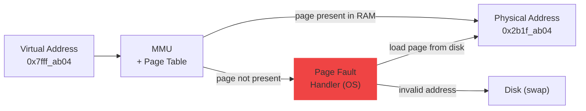

import Tabs from '@theme/Tabs';
import TabItem from '@theme/TabItem';

> **Section:** [OS Concepts](.) · **Time Estimate:** 2–3 hours
>
> For the hardware side of this topic, see [CPU Cache](../hardware_fundamentals/cpu/cache) and [Memory Management](../memory_management).

---

## The Virtual Address Space

Every process gets the *illusion* of a large, private, contiguous block of memory — its **virtual address space**. In reality, this maps onto scattered physical RAM pages (and sometimes disk).

<svg viewBox="0 0 620 340" xmlns="http://www.w3.org/2000/svg" role="img" aria-label="Virtual address space layout diagram" style={{maxWidth:'420px',width:'100%',display:'block',margin:'1.5rem auto'}}>
  <defs>
    <linearGradient id="vas-kernel" x1="0" y1="0" x2="1" y2="0">
      <stop offset="0%" stopColor="#6366f1" stopOpacity="0.3"/>
      <stop offset="100%" stopColor="#6366f1" stopOpacity="0.08"/>
    </linearGradient>
    <linearGradient id="vas-stack" x1="0" y1="0" x2="1" y2="0">
      <stop offset="0%" stopColor="#3b82f6" stopOpacity="0.25"/>
      <stop offset="100%" stopColor="#3b82f6" stopOpacity="0.06"/>
    </linearGradient>
    <linearGradient id="vas-heap" x1="0" y1="0" x2="1" y2="0">
      <stop offset="0%" stopColor="#10b981" stopOpacity="0.25"/>
      <stop offset="100%" stopColor="#10b981" stopOpacity="0.06"/>
    </linearGradient>
    <linearGradient id="vas-data" x1="0" y1="0" x2="1" y2="0">
      <stop offset="0%" stopColor="#f59e0b" stopOpacity="0.3"/>
      <stop offset="100%" stopColor="#f59e0b" stopOpacity="0.08"/>
    </linearGradient>
    <linearGradient id="vas-code" x1="0" y1="0" x2="1" y2="0">
      <stop offset="0%" stopColor="#ec4899" stopOpacity="0.25"/>
      <stop offset="100%" stopColor="#ec4899" stopOpacity="0.06"/>
    </linearGradient>
  </defs>

  {/* Address labels */}
  <text x="10" y="26" fontFamily="monospace" fontSize="10" fill="var(--ifm-color-emphasis-500)">0xFFFFFFFFFFFF</text>
  <text x="10" y="298" fontFamily="monospace" fontSize="10" fill="var(--ifm-color-emphasis-500)">0x000000000000</text>

  {/* Kernel space */}
  <rect x="100" y="14" width="280" height="44" rx="4" fill="url(#vas-kernel)" stroke="#6366f1" strokeWidth="1.2"/>
  <text x="240" y="32" textAnchor="middle" fontFamily="sans-serif" fontSize="12" fontWeight="700" fill="#6366f1">Kernel Space</text>
  <text x="240" y="48" textAnchor="middle" fontFamily="sans-serif" fontSize="10" fill="var(--ifm-color-emphasis-600)">OS code — user programs cannot access</text>

  {/* Stack */}
  <rect x="100" y="62" width="280" height="50" rx="4" fill="url(#vas-stack)" stroke="#3b82f6" strokeWidth="1.2"/>
  <text x="240" y="82" textAnchor="middle" fontFamily="sans-serif" fontSize="12" fontWeight="700" fill="#3b82f6">Stack</text>
  <text x="240" y="98" textAnchor="middle" fontFamily="sans-serif" fontSize="10" fill="var(--ifm-color-emphasis-600)">grows downward ↓ · local variables, call frames</text>

  {/* Gap */}
  <rect x="100" y="116" width="280" height="60" rx="4" fill="var(--ifm-color-emphasis-100)" stroke="var(--ifm-color-emphasis-300)" strokeWidth="1" strokeDasharray="5,4"/>
  <text x="240" y="143" textAnchor="middle" fontFamily="sans-serif" fontSize="11" fill="var(--ifm-color-emphasis-400)">unmapped gap</text>
  <text x="240" y="158" textAnchor="middle" fontFamily="sans-serif" fontSize="10" fill="var(--ifm-color-emphasis-400)">touch this → Segfault / Access Violation</text>

  {/* Heap */}
  <rect x="100" y="180" width="280" height="50" rx="4" fill="url(#vas-heap)" stroke="#10b981" strokeWidth="1.2"/>
  <text x="240" y="200" textAnchor="middle" fontFamily="sans-serif" fontSize="12" fontWeight="700" fill="#10b981">Heap</text>
  <text x="240" y="216" textAnchor="middle" fontFamily="sans-serif" fontSize="10" fill="var(--ifm-color-emphasis-600)">grows upward ↑ · malloc / new allocations</text>

  {/* Data */}
  <rect x="100" y="234" width="280" height="34" rx="4" fill="url(#vas-data)" stroke="#f59e0b" strokeWidth="1.2"/>
  <text x="240" y="252" textAnchor="middle" fontFamily="sans-serif" fontSize="12" fontWeight="700" fill="#f59e0b">Data / BSS</text>
  <text x="240" y="264" textAnchor="middle" fontFamily="sans-serif" fontSize="10" fill="var(--ifm-color-emphasis-600)">global and static variables</text>

  {/* Text / Code */}
  <rect x="100" y="272" width="280" height="34" rx="4" fill="url(#vas-code)" stroke="#ec4899" strokeWidth="1.2"/>
  <text x="240" y="288" textAnchor="middle" fontFamily="sans-serif" fontSize="12" fontWeight="700" fill="#ec4899">Text (Code)</text>
  <text x="240" y="300" textAnchor="middle" fontFamily="sans-serif" fontSize="10" fill="var(--ifm-color-emphasis-600)">compiled instructions — read-only, shared if forked</text>

  {/* Null zone hint */}
  <text x="240" y="320" textAnchor="middle" fontFamily="monospace" fontSize="10" fill="var(--ifm-color-emphasis-400)">0x0 = NULL — null pointer dereference crashes here</text>
</svg>

---

## Paging — Virtual → Physical Translation

The OS divides both virtual and physical memory into fixed-size **pages** (typically 4 KB). A **page table** translates virtual page numbers to physical frame numbers. The CPU's **MMU (Memory Management Unit)** performs this translation on every memory access, transparently.



**Page fault** — what happens when you access an address whose page is not currently in RAM:
- **Minor fault:** Page exists but wasn't loaded yet (lazy allocation) — OS maps it in, continues
- **Major fault:** Page was swapped to disk — OS fetches it, slow (~10,000× slower than RAM)
- **Segfault / Access Violation:** No valid mapping exists — process is killed

---

## Swap and the Page File

When physical RAM fills up, the OS **evicts** the least-recently-used pages to disk. This is **swap** (Linux) or the **page file** (Windows).

| | Linux | Windows |
|--|-------|---------|
| Name | Swap partition / swap file | Page file (`pagefile.sys`) |
| Location | Dedicated partition or `/swapfile` | Usually `C:\pagefile.sys` |
| Size | Typically 1–2× RAM | Managed automatically |
| Performance cost | ~10,000× slower than RAM reads | Same |

Heavy swap usage is a **warning sign** — the system doesn't have enough RAM for the workload.

---

## Inspecting Memory

<Tabs>
<TabItem value="linux" label="Linux">

```bash
# RAM and swap overview
free -h

# Detailed breakdown
cat /proc/meminfo

# Per-process memory map
pmap <PID>

# Quick check for OOM (Out Of Memory) killer events
dmesg | grep -i "oom\|killed process"

# Virtual memory stats (r=reads from disk per sec, si/so=swap in/out)
vmstat 1

# Swap devices
swapon --show
cat /proc/swaps

# Per-process memory stats from /proc
cat /proc/<PID>/status | grep -i "vm\|rss"
```

</TabItem>
<TabItem value="windows" label="Windows">

```powershell
# RAM overview
Get-CimInstance Win32_OperatingSystem |
    Select-Object @{N="Total GB";E={[math]::Round($_.TotalVisibleMemorySize/1MB,1)}},
                  @{N="Free GB"; E={[math]::Round($_.FreePhysicalMemory/1MB,1)}}

# Page file usage
Get-CimInstance Win32_PageFileUsage |
    Select-Object Name, AllocatedBaseSize, CurrentUsage

# Top 10 processes by RAM (Working Set = physical RAM used)
Get-Process | Sort-Object WorkingSet -Descending |
    Select-Object -First 10 Name,
        @{N="RAM MB"; E={[math]::Round($_.WorkingSet/1MB,1)}},
        @{N="Virtual MB"; E={[math]::Round($_.VirtualMemorySize64/1MB,1)}}
```

</TabItem>
</Tabs>

:::tip[Committed vs Working Set (Windows)]
**Working Set** = physical RAM pages the process is currently using.  
**Virtual Memory** = total virtual address space allocated (most may be unmapped or paged out).  
Task Manager's "Memory" column shows Working Set.
:::
