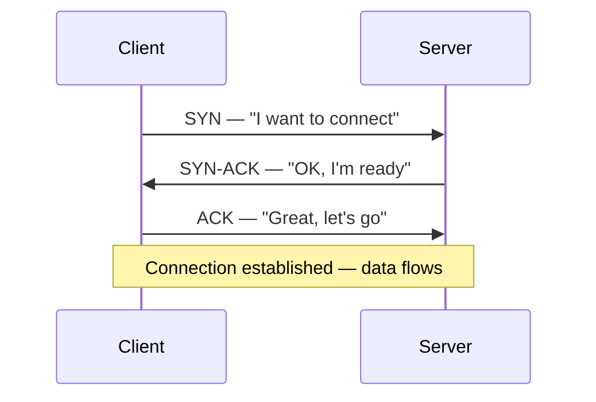
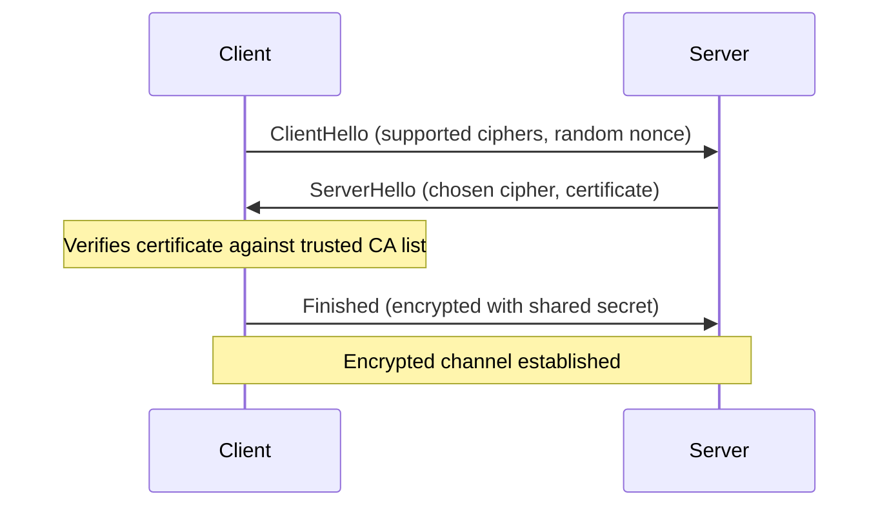
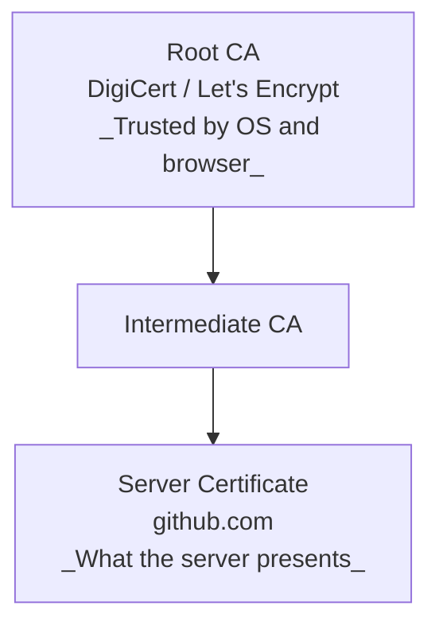
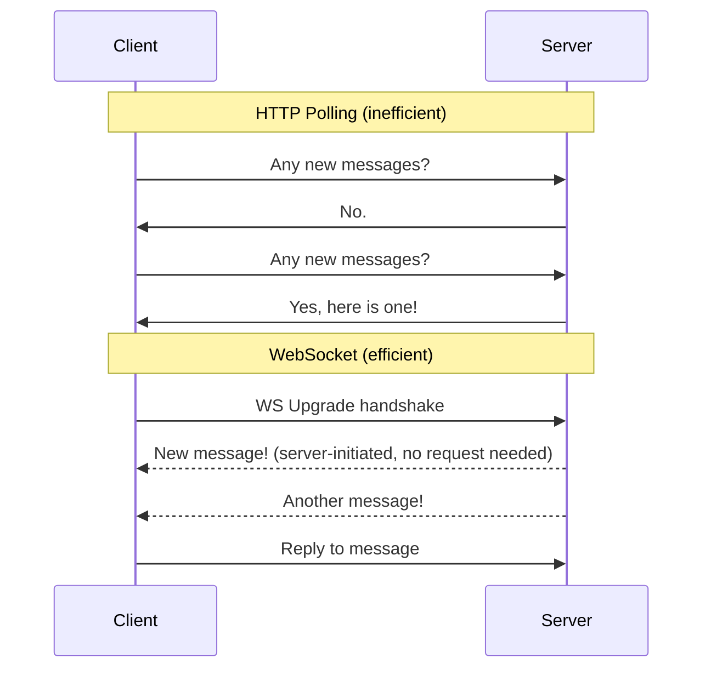

import Tabs from '@theme/Tabs';
import TabItem from '@theme/TabItem';

# Protocols & Standards

**Domain:** Foundations · **Time Estimate:** 2 weeks · **Language:** Conceptual — implementation examples in multiple languages

> **Prerequisites:** [Networking](networking.md) helps but is not required — this unit is mostly conceptual.
>
> **Who needs this:** Everyone in IT, web dev, DevOps, or systems programming. These protocols are the *lingua franca* of the internet. You will encounter HTTP, DNS, and TLS in every production system.

---

## 🎯 Learning Objectives

By the end of this unit, you will be able to:

- [ ] Explain how HTTP/1.1, HTTP/2, and HTTP/3 differ and when each is used
- [ ] Read and construct valid HTTP request and response headers
- [ ] Explain the TCP/IP model and how data moves through layers
- [ ] Describe how DNS resolves a domain name to an IP address
- [ ] Explain what TLS does and how a TLS handshake works (conceptually)
- [ ] Describe REST architectural constraints and why they matter
- [ ] Explain WebSockets and when to use them vs. HTTP
- [ ] Know what a standard is, who makes them, and why they matter (RFC, W3C, IEEE, ISO)

---

## 📖 Concepts

### 1. What Protocols and Standards Are

A **protocol** is a set of rules that two parties agree to follow so they can communicate. Without protocols, every system would need custom logic to talk to every other system.

A **standard** is a protocol that has been formally documented and ratified by a standards body, so any implementation following it should interoperate with any other.

**Why this matters to you:**
- When you write a REST API, you're following the HTTP standard
- When you debug a network issue, you use DNS knowledge
- When you add `https://`, TLS is protecting your users
- When you build real-time features, you choose between WebSockets, SSE, or long-polling

---

### 2. The TCP/IP Model (Network Layers)

The internet is built on layers. Each layer has one job and talks only to the layers directly above and below it.

<div className="svg-graphic-container margin-bottom--lg text--center">
  <svg viewBox="0 0 600 350" xmlns="http://www.w3.org/2000/svg" className="diagram-svg">
    <style>
      {`.bg-app      { fill: var(--diagram-layer-1-fill); stroke: var(--diagram-layer-1-stroke); stroke-width: 2; }
        .bg-transport { fill: var(--diagram-layer-2-fill); stroke: var(--diagram-layer-2-stroke); stroke-width: 2; }
        .bg-internet  { fill: var(--diagram-layer-3-fill); stroke: var(--diagram-layer-3-stroke); stroke-width: 2; }
        .bg-network   { fill: var(--diagram-layer-4-fill); stroke: var(--diagram-layer-4-stroke); stroke-width: 2; }
        .dg-title { fill: var(--diagram-text);       font-family: var(--ifm-font-family-base); font-weight: bold; font-size: 18px; text-anchor: middle; }
        .dg-sub   { fill: var(--diagram-text-muted); font-family: monospace;                   font-size: 13px;   text-anchor: middle; }
        .dg-arrow { stroke: var(--diagram-text-muted); stroke-width: 2; marker-end: url(#arrow-tcp); }`}
    </style>
    <defs>
      <marker id="arrow-tcp" markerWidth="10" markerHeight="7" refX="9" refY="3.5" orient="auto">
        <polygon points="0 0, 10 3.5, 0 7" fill="var(--diagram-text-muted)" />
      </marker>
    </defs>

    {/* Application Layer */}
    <rect x="100" y="20" width="400" height="60" className="bg-app" rx="6"/>
    <text x="300" y="46" className="dg-title">Application Layer</text>
    <text x="300" y="65" className="dg-sub">HTTP · DNS · SSH · SMTP · FTP</text>
    <line x1="300" y1="80" x2="300" y2="100" className="dg-arrow" />

    {/* Transport Layer */}
    <rect x="100" y="100" width="400" height="60" className="bg-transport" rx="6"/>
    <text x="300" y="126" className="dg-title">Transport Layer</text>
    <text x="300" y="146" className="dg-sub">TCP · UDP (Ports, segments, reliable delivery)</text>
    <line x1="300" y1="160" x2="300" y2="180" className="dg-arrow" />

    {/* Internet Layer */}
    <rect x="100" y="180" width="400" height="60" className="bg-internet" rx="6"/>
    <text x="300" y="206" className="dg-title">Internet Layer</text>
    <text x="300" y="226" className="dg-sub">IP · ICMP (IP addresses, routing packets)</text>
    <line x1="300" y1="240" x2="300" y2="260" className="dg-arrow" />

    {/* Network Access Layer */}
    <rect x="100" y="260" width="400" height="60" className="bg-network" rx="6"/>
    <text x="300" y="286" className="dg-title">Network Access Layer</text>
    <text x="300" y="306" className="dg-sub">Ethernet · Wi-Fi (MAC addresses, physical frames)</text>
  </svg>
</div>

**TCP vs. UDP:**

| | TCP | UDP |
|-|-----|-----|
| Connection | Connection-oriented (handshake) | Connectionless |
| Reliability | Guaranteed delivery, ordering | No guarantee, no ordering |
| Speed | Slower (overhead) | Faster (less overhead) |
| Use when | Correctness matters (HTTP, SSH, DB) | Speed matters (video, DNS, games) |

**The Three-Way Handshake (TCP connection setup):**


---

### 3. DNS — Domain Name System

DNS is the internet's phone book. It translates human-readable names (`github.com`) into IP addresses (`140.82.114.4`) that computers use to route traffic.

You type `https://github.com` — here's what happens:

1. Browser checks its own DNS cache → not found
2. OS checks `/etc/hosts` (or Windows hosts file) → not found
3. Query sent to **Recursive Resolver** (your ISP or 8.8.8.8)
4. Recursive Resolver asks **Root Nameserver**: "Who handles `.com`?"
5. Root says: "Ask the `.com` TLD server"
6. Recursive Resolver asks **.com TLD**: "Who handles `github.com`?"
7. `.com` TLD says: "Ask GitHub's nameserver (`ns1.github.com`)"
8. Recursive Resolver asks **GitHub's nameserver**: "What's `github.com`'s IP?"
9. GitHub's nameserver returns: `140.82.114.4`
10. Recursive Resolver **caches** this (TTL = time to live)
11. Browser connects to `140.82.114.4`

**Common DNS record types:**

| Record | Purpose | Example |
|--------|---------|---------|
| `A` | Domain → IPv4 address | `github.com → 140.82.114.4` |
| `AAAA` | Domain → IPv6 address | `github.com → 2606:50c0:...` |
| `CNAME` | Domain → another domain | `www.example.com → example.com` |
| `MX` | Mail server for domain | `example.com → mail.example.com` |
| `TXT` | Text record (verification, SPF) | Various |
| `NS` | Authoritative nameserver | `github.com → ns1.p16.dynect.net` |

:::tip[Try It 🔍]
Open a terminal and run: `nslookup github.com` or `dig github.com`. You'll see the actual DNS resolution in real time. Try `dig +trace github.com` to watch the full chain.
:::

---

### 4. HTTP — HyperText Transfer Protocol

HTTP is the foundation of data communication on the web. It's a **request-response** protocol — one side asks, the other answers.

#### HTTP Request Structure

```
GET /api/users/42 HTTP/1.1               ← Request line: method, path, version
Host: api.example.com                    ← Required header (which server)
Accept: application/json                 ← What response formats I accept
Authorization: Bearer eyJhb...          ← Auth token
User-Agent: Mozilla/5.0                  ← Who is making the request
Content-Type: application/json           ← What format my body is in
                                         ← Blank line separates headers from body
{"filter": "active"}                     ← Optional body (for POST/PUT/PATCH)
```

#### HTTP Response Structure

```
HTTP/1.1 200 OK                          ← Status line: version, code, reason
Content-Type: application/json           ← Format of response body
Content-Length: 247                      ← Size of body in bytes
Cache-Control: max-age=60               ← Caching instructions
Set-Cookie: session=abc123; HttpOnly    ← Set a cookie
                                         ← Blank line
{"id": 42, "name": "Alice", ...}        ← Response body
```

#### HTTP Methods

| Method | Purpose | Body? | Idempotent? |
|--------|---------|-------|-------------|
| `GET` | Retrieve a resource | No | Yes |
| `POST` | Create a new resource | Yes | No |
| `PUT` | Replace a resource entirely | Yes | Yes |
| `PATCH` | Partially update a resource | Yes | No |
| `DELETE` | Remove a resource | No | Yes |
| `HEAD` | Like GET but no body (check existence) | No | Yes |
| `OPTIONS` | List allowed methods for a resource | No | Yes |

**Idempotent** means calling it multiple times has the same effect as calling it once. `DELETE /users/42` twice should not error the second time.

#### HTTP Status Codes

```
1xx — Informational
  100 Continue        — Server received headers, continue sending body

2xx — Success
  200 OK              — Standard success
  201 Created         — Resource was created (usually after POST)
  204 No Content      — Success, but no body to return (e.g. DELETE)

3xx — Redirection
  301 Moved Permanently — Redirect, update bookmarks
  302 Found           — Temporary redirect
  304 Not Modified    — Cached version is still valid

4xx — Client Error (you did something wrong)
  400 Bad Request     — Malformed request
  401 Unauthorized    — Not authenticated
  403 Forbidden       — Authenticated but not allowed
  404 Not Found       — Resource doesn't exist
  409 Conflict        — State conflict (e.g. duplicate)
  422 Unprocessable   — Validation failed
  429 Too Many Requests — Rate limited

5xx — Server Error (we did something wrong)
  500 Internal Server Error — Unhandled exception
  502 Bad Gateway     — Upstream server error
  503 Service Unavailable — Down for maintenance or overloaded
  504 Gateway Timeout — Upstream server didn't respond in time
```

#### HTTP/1.1 vs HTTP/2 vs HTTP/3

| Feature | HTTP/1.1 | HTTP/2 | HTTP/3 |
|---------|----------|--------|--------|
| Transport | TCP | TCP | QUIC (UDP-based) |
| Requests | One at a time per connection | Multiplexed | Multiplexed |
| Headers | Text, repeated every request | Binary, compressed (HPACK) | Binary, compressed (QPACK) |
| Server Push | No | Yes | Yes |
| Head-of-line blocking | Yes | Partial | No |
| Adoption | Universal | Most servers | Growing |

!!! tip "Research Question 🔍"
    What is **head-of-line blocking** and why did HTTP/2 not fully solve it? Why did HTTP/3 switch from TCP to QUIC?

---

### 5. HTTPS and TLS

**TLS (Transport Layer Security)** encrypts the connection between client and server. HTTPS = HTTP over TLS.

**What TLS provides:**
- **Confidentiality** — data is encrypted, eavesdroppers see gibberish
- **Integrity** — data cannot be tampered with in transit
- **Authentication** — confirms you're talking to who you think (via certificate)

**Simplified TLS 1.3 handshake:**


**Certificate chain of trust:**


:::tip[Try It 🔍]
Click the 🔒 padlock next to any HTTPS URL in Chrome/Firefox and view the certificate. You'll see the chain, the validity period, and the cipher suite being used.
:::

---

### 6. REST — Representational State Transfer

REST is an **architectural style** (not a protocol) for designing web APIs. It describes constraints:

1. **Client-Server** — Separation of concerns. UI and data storage evolve independently.
2. **Stateless** — Each request contains all information needed. Server stores no session state.
3. **Cacheable** — Responses must define whether they are cacheable.
4. **Uniform Interface** — Resources identified by URI, representations via HTTP, self-descriptive messages.
5. **Layered System** — Client doesn't know if it's talking to origin server or a proxy.
6. **Code on Demand** (optional) — Server can send executable code.

**REST resource design:**

| Pattern | Example | Notes |
|---------|---------|-------|
| ❌ Verb in URL | `GET /getUser?id=42` | Use HTTP methods instead |
| ✅ Noun resource | `GET /users/42` | Get user 42 |
| ✅ Create | `POST /users` | Create a new user |
| ✅ Replace | `PUT /users/42` | Replace user 42 entirely |
| ✅ Partial update | `PATCH /users/42` | Update user 42 partially |
| ✅ Delete | `DELETE /users/42` | Delete user 42 |
| ✅ Nested resource | `GET /users/42/orders` | All orders for user 42 |
| ✅ Filtering | `GET /users?status=active&sort=name&page=2` | Query params for filtering |

:::note[REST vs. GraphQL vs. gRPC]
REST is not the only API style. **GraphQL** lets clients specify exactly what data they need. **gRPC** uses Protocol Buffers for high-performance binary communication. REST is the most common starting point — learn it first, then explore the alternatives in the [Web Dev domain](../web_dev/graphql.md).
:::

---

### 7. WebSockets

HTTP is request-response — the client always initiates. **WebSockets** open a persistent, bidirectional channel.



**When to use WebSockets:**
- Chat applications
- Live dashboards
- Multiplayer games
- Collaborative editors (like Google Docs)
- Real-time notifications

**When NOT to use WebSockets:**
- Regular request-response patterns (just use REST)
- Infrequent updates (use Server-Sent Events instead — simpler, one-directional)

<Tabs>
<TabItem value="python-server" label="Python (server)">

```python
# Using websockets library: pip install websockets
import asyncio
import websockets

async def handler(websocket):
    async for message in websocket:
        print(f"Received: {message}")
        await websocket.send(f"Echo: {message}")

async def main():
    async with websockets.serve(handler, "localhost", 8765):
        await asyncio.Future()  # Run forever

asyncio.run(main())
```


</TabItem>
<TabItem value="ts-client" label="TypeScript (client)">

```typescript
// Browser WebSocket API (built-in, no library needed)
const ws = new WebSocket('ws://localhost:8765');

ws.onopen = () => {
    console.log('Connected');
    ws.send('Hello, server!');
};

ws.onmessage = (event) => {
    console.log('Received:', event.data);
};

ws.onclose = () => console.log('Disconnected');
ws.onerror = (error) => console.error('Error:', error);

// Server-side with Node.js using 'ws' package
import { WebSocketServer } from 'ws';
const wss = new WebSocketServer({ port: 8765 });
wss.on('connection', (ws) => {
    ws.on('message', (data) => ws.send(`Echo: ${data}`));
});
```


</TabItem>
</Tabs>

---

### 8. Who Makes the Standards?

| Body | Focus | Key Standards |
|------|-------|--------------|
| **IETF** (Internet Engineering Task Force) | Internet protocols | HTTP (RFC 9110), TCP, DNS, TLS, WebSockets |
| **W3C** (World Wide Web Consortium) | Web technologies | HTML, CSS, SVG, WASM |
| **IEEE** (Inst. of Electrical & Electronics Engineers) | Networking hardware | Wi-Fi (802.11), Ethernet (802.3) |
| **ISO** (Intl. Organization for Standardization) | Broad standards | ISO 8601 (dates), ISO 27001 (security) |
| **ECMA** | Scripting languages | ECMAScript (JavaScript standard) |
| **OpenAPI** | API specification | OpenAPI 3.0 (REST API docs format) |

**RFCs** (Request for Comments) are the documents that define internet standards. They're freely available at [rfc-editor.org](https://www.rfc-editor.org/). Reading an RFC sounds scary — but RFC 2616 (HTTP/1.1) is surprisingly readable and is historically important.

:::tip[Research Question 🔍]
Read the first 5 pages of [RFC 9110 (HTTP Semantics)](https://www.rfc-editor.org/rfc/rfc9110). How are RFCs structured? What is a "MUST" vs a "SHOULD" in RFC language? (Look up "RFC 2119" — it defines these terms.)
:::

---

## 📚 Resources

<Tabs>
<TabItem value="primary" label="Primary (Do These)">

- 📖 **[MDN — HTTP Overview (FREE)](https://developer.mozilla.org/en-US/docs/Web/HTTP/Overview)** — Most thorough HTTP reference, free, always up-to-date
- 📖 **[How DNS Works (FREE comic)](https://howdns.works/)** — Visual, fun, accurate — read this first for DNS


</TabItem>
<TabItem value="supplemental" label="Supplemental">

- 📖 **[High Performance Browser Networking — Ilya Grigorik (FREE online)](https://hpbn.co/)** — Deep, excellent coverage of TCP, TLS, HTTP/2
- 📺 **[Fireship — HTTP Crash Course (YouTube, FREE)](https://www.youtube.com/watch?v=iYM2zFP3Zn0)** — 12-minute visual intro


</TabItem>
<TabItem value="tools-to-use" label="Tools to Use">

- 🔧 **[Postman (FREE tier)](https://www.postman.com/)** — GUI for making HTTP requests
- 🔧 **curl** — CLI HTTP client, available everywhere. Learn `curl -v` for verbose output showing full request/response
- 🔧 **Wireshark (FREE)** — Capture and inspect real network packets
- 🔧 **Browser DevTools → Network tab** — See every HTTP request your browser makes in real time


</TabItem>
</Tabs>

---

## 🏗️ Assignments

### Assignment 1 — HTTP Inspector
**Combines:** HTTP, DNS, CLI tools, file I/O

Using only `curl` and `nslookup`/`dig` from the terminal:
- [ ] Perform a full `curl -v` request to `https://github.com` and annotate what each line means (write it in a markdown doc)
- [ ] Find the IP address of 5 different domains using `nslookup`
- [ ] Identify which HTTP version is being used (HTTP/1.1, 2, or 3) for each
- [ ] Find a `301` redirect in the wild (try `http://github.com` — no S)
- [ ] Observe a `304 Not Modified` response (hint: make the same request twice, check `If-None-Match`)

---

### Assignment 2 — Build a REST Client
**Language:** Your choice

Without using a REST client library for the core logic, build an HTTP client that:
- [ ] Makes GET, POST, PUT, DELETE requests
- [ ] Sends and receives JSON
- [ ] Handles response status codes correctly (404 should throw, 201 should read Location header)
- [ ] Implements retry logic (retry on 503, max 3 times with backoff)
- [ ] Logs each request: method, URL, status code, time taken

Test it against a public API like `https://jsonplaceholder.typicode.com/`.

---

### Assignment 3 — WebSocket Chat Server
**Language:** Python or TypeScript

Build a simple multi-user chat server:
- [ ] Server accepts WebSocket connections on a port
- [ ] When a message arrives, **broadcast** it to all connected clients
- [ ] Include the sender's username in the broadcast
- [ ] Handle disconnections gracefully (don't crash when a user leaves)
- [ ] Command: `/users` lists all currently connected usernames
- [ ] Command: `/quit` disconnects the requesting client

⭐ **Stretch:** Add a `/dm username message` for direct messages.

---

## ✅ Milestone Checklist

- [ ] Can draw the TCP/IP 4-layer model from memory with examples at each layer
- [ ] Can explain the DNS resolution chain without notes
- [ ] Can read any HTTP request/response and identify method, headers, status, and body
- [ ] Know what TLS does and why HTTPS matters (can explain to a non-technical person)
- [ ] Know the 5 REST constraints and can identify REST vs. non-REST APIs
- [ ] Know when to use WebSockets vs. HTTP
- [ ] All 3 assignments committed to GitHub

---

## 🏆 Milestone Complete!

> **You now speak the internet's language.**
>
> HTTP, DNS, and TLS underpin almost every professional system you'll work with.
> Every API you build, every cloud service you deploy, every security audit you participate in
> requires this knowledge. You've got it.

**Log this in your kanban:** Move `foundations/protocols_and_standards` to ✅ Done.

---

## ➡️ Next Units

- → [Networking](networking.md) — Go deeper on TCP/IP, subnetting, load balancers
- → [REST APIs](../web_dev/rest_api.md) — Build production REST APIs
- → [Docker](../devops/docker.mdx) — Apply networking knowledge to containers
