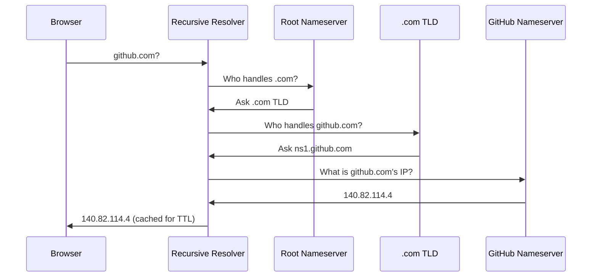

# DNS — Domain Name System

> **Part of:** [Protocols & Standards](./index)

> **Tool:** DNS · **Introduced:** 1983 · **Status:** 🟢 Modern — universally deployed; DNSSEC and DoH are modern extensions

DNS is the internet's phone book. It translates human-readable names (`github.com`) into IP addresses (`140.82.114.4`) that computers use to route traffic. Without DNS, every URL would be a raw IP address you'd have to memorise.

---

## Resolution Chain

You type `https://github.com` — here's what happens:

1. Browser checks its own **DNS cache** → not found
2. OS checks `/etc/hosts` (or `C:\Windows\System32\drivers\etc\hosts` on Windows) → not found
3. Query sent to **Recursive Resolver** (your ISP or a public resolver like `8.8.8.8`)
4. Recursive Resolver asks **Root Nameserver**: "Who handles `.com`?"
5. Root says: "Ask the `.com` TLD server"
6. Recursive Resolver asks **.com TLD**: "Who handles `github.com`?"
7. `.com` TLD says: "Ask GitHub's nameserver (`ns1.github.com`)"
8. Recursive Resolver asks **GitHub's authoritative nameserver**: "What's `github.com`'s IP?"
9. GitHub's nameserver returns: `140.82.114.4`
10. Recursive Resolver **caches** the answer (for the duration of the TTL)
11. Browser connects to `140.82.114.4`



---

## DNS Record Types

| Record | Purpose | Example |
|--------|---------|---------|
| `A` | Domain → IPv4 address | `github.com → 140.82.114.4` |
| `AAAA` | Domain → IPv6 address | `github.com → 2606:50c0:8000::154` |
| `CNAME` | Domain → another domain (alias) | `www.example.com → example.com` |
| `MX` | Mail server for domain | `example.com → mail.example.com` (priority 10) |
| `TXT` | Arbitrary text (verification, SPF, DKIM) | Various |
| `NS` | Authoritative nameserver for domain | `github.com → ns1.p16.dynect.net` |
| `PTR` | IP → domain (reverse DNS) | `140.82.114.4 → github.com` |
| `SRV` | Service discovery (port + hostname) | Used by SIP, XMPP, Kubernetes |
| `SOA` | Start of Authority — zone metadata | TTL, serial, admin contact |

---

## TTL — Time To Live

Every DNS record has a **TTL** (Time To Live) in seconds. Once cached, a record is not re-queried until the TTL expires.

- **Short TTL** (60–300 s) — fast failover, but more DNS queries (higher load on nameservers)
- **Long TTL** (3600–86400 s) — fewer queries, but changes propagate slowly
- Before a planned IP migration, lower the TTL days in advance so the change propagates quickly

---

## Modern DNS Extensions

| Extension | What It Does |
|-----------|-------------|
| **DNSSEC** | Cryptographically signs DNS records to prevent spoofing |
| **DoH** (DNS over HTTPS) | Encrypts DNS queries inside HTTPS (RFC 8484) — prevents ISP snooping |
| **DoT** (DNS over TLS) | Same goal as DoH, different transport (port 853) |

:::tip[Try It 🔍]
Open a terminal and run:
```
nslookup github.com
```
or on Linux/macOS:
```
dig github.com
dig +trace github.com
```
`dig +trace` shows the full resolution chain — root → TLD → authoritative — in real time.
:::

:::note[Windows Note]
`dig` is not shipped with Windows by default. Use `nslookup` (built-in) or install [BIND tools](https://www.isc.org/bind/) / use WSL2 for `dig`.
:::
