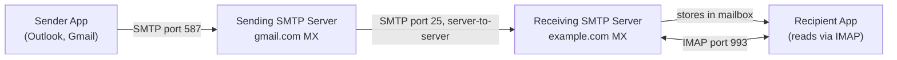

import Tabs from '@theme/Tabs';
import TabItem from '@theme/TabItem';

# Email Protocols

> **Part of:** [Protocols & Standards](./index)

Email predates the web. The protocols that power it — SMTP, IMAP, and POP3 — are decades-old but still form the backbone of global email infrastructure. Understanding them helps you integrate email sending into applications, configure mail servers, and debug delivery failures.

---

## Email Protocol Overview

| Protocol | Port(s) | Direction | Purpose |
|----------|---------|-----------|---------|
| **SMTP** | 25, 587, 465 | Client → Server, Server → Server | Sending email |
| **IMAP** | 143, 993 (TLS) | Client ↔ Server | Reading email, keeps messages on server |
| **POP3** | 110, 995 (TLS) | Client ← Server | Downloading email, removes from server |



---

## SMTP — Simple Mail Transfer Protocol

SMTP handles **sending** email. Your mail client (or application) connects to an SMTP server and submits the message. SMTP servers then relay the message from server to server until it reaches the destination mail server.

> **Tool:** SMTP · **Introduced:** 1982 (RFC 821) · **Latest:** RFC 5321 (2008) · **Status:** 🟢 Modern

### SMTP Ports

| Port | Name | Use |
|------|------|-----|
| 25 | SMTP | Server-to-server relay (not for clients — usually blocked by ISPs) |
| 587 | Submission | Client → server with STARTTLS (modern, recommended) |
| 465 | SMTPS | Client → server with implicit TLS (older, still common) |

### SMTP Conversation

```
Client: EHLO mail.sender.com
Server: 250-smtp.gmail.com Hello, pleased to meet you
Server: 250-AUTH LOGIN PLAIN
Server: 250-STARTTLS

Client: STARTTLS
Server: 220 Ready to start TLS
[TLS handshake...]

Client: AUTH PLAIN <credentials>
Server: 235 Authentication successful

Client: MAIL FROM:<alice@sender.com>
Server: 250 OK

Client: RCPT TO:<bob@example.com>
Server: 250 OK

Client: DATA
Server: 354 Send message, end with "." on a line by itself

Client: Subject: Hello
Client: From: alice@sender.com
Client: To: bob@example.com
Client:
Client: Hi Bob!
Client: .
Server: 250 Message queued as abc123

Client: QUIT
Server: 221 Bye
```

### Sending Email from Code

<Tabs>
<TabItem value="python" label="Python">

```python
import smtplib
from email.mime.text import MIMEText
from email.mime.multipart import MIMEMultipart

msg = MIMEMultipart()
msg['Subject'] = 'Hello from Python'
msg['From'] = 'sender@example.com'
msg['To'] = 'recipient@example.com'
msg.attach(MIMEText('This is the email body.', 'plain'))

# Connect to SMTP server with TLS
with smtplib.SMTP('smtp.gmail.com', 587) as server:
    server.ehlo()
    server.starttls()
    server.login('your@gmail.com', 'app-password')
    server.send_message(msg)
    print('Email sent!')
```

</TabItem>
<TabItem value="typescript" label="TypeScript">

```typescript
// npm install nodemailer @types/nodemailer
import nodemailer from 'nodemailer';

const transporter = nodemailer.createTransport({
  host: 'smtp.gmail.com',
  port: 587,
  secure: false,   // true for 465 (SMTPS), false for 587 (STARTTLS)
  auth: {
    user: 'your@gmail.com',
    pass: 'app-password',
  },
});

await transporter.sendMail({
  from: '"My App" <your@gmail.com>',
  to: 'recipient@example.com',
  subject: 'Hello from Node.js',
  text: 'Plain text body',
  html: '<b>HTML body</b>',
});
```

</TabItem>
</Tabs>

:::note[Use a transactional email service in production]
In production, use a service like **Resend**, **SendGrid**, **Postmark**, or **AWS SES** instead of a raw SMTP connection. They handle deliverability, bounces, unsubscribes, and reputation management. Your SMTP username and password in those cases are API credentials, not a personal email account.
:::

---

## IMAP — Internet Message Access Protocol

IMAP lets clients **read and manage email that stays on the server**. Changes are synchronised — read, delete, and folder moves are reflected on every device.

> **Tool:** IMAP · **Introduced:** 1986 · **Latest:** IMAP4rev2 (RFC 9051, 2021) · **Status:** 🟢 Modern

**Key behaviours:**
- Email stays on the server — synced across all devices
- Supports folders (mailboxes), flags (read/unread/starred)
- Clients can fetch headers only, then download body on demand (efficient on mobile)
- Uses persistent connections with server push notifications

```python
import imaplib

with imaplib.IMAP4_SSL('imap.gmail.com', 993) as mail:
    mail.login('your@gmail.com', 'app-password')
    mail.select('INBOX')

    # Search for unread messages
    _, msgnums = mail.search(None, 'UNSEEN')
    for num in msgnums[0].split():
        _, data = mail.fetch(num, '(RFC822)')
        print(data[0][1][:200])  # First 200 bytes of raw message
```

---

## POP3 — Post Office Protocol

POP3 is the older retrieval protocol. It downloads messages to the client and (by default) deletes them from the server. This means email is only on one device.

> **Tool:** POP3 · **Introduced:** 1984 · **Latest:** RFC 1939 (1996) · **Status:** 🟡 Legacy — use IMAP instead for new systems

| | IMAP | POP3 |
|-|------|------|
| Messages stored | On server (synced) | Downloaded to device |
| Multi-device | ✅ Yes | ❌ No (without workarounds) |
| Offline access | Partial (headers cached) | Full (after download) |
| Bandwidth | On-demand fetch | Full download |
| Recommended for new systems | ✅ Yes | ❌ No |

---

## Email Authentication Standards

These DNS-based standards prevent spam, spoofing, and phishing — relevant when you're setting up a domain to send email:

| Standard | DNS Record | Purpose |
|----------|-----------|---------|
| **SPF** (Sender Policy Framework) | `TXT` record | Lists servers authorised to send email for your domain |
| **DKIM** (DomainKeys Identified Mail) | `TXT` record | Cryptographically signs outgoing email |
| **DMARC** | `TXT` record | Policy for handling SPF/DKIM failures; enables reporting |

Without these, your emails will be marked as spam or rejected by major providers.
