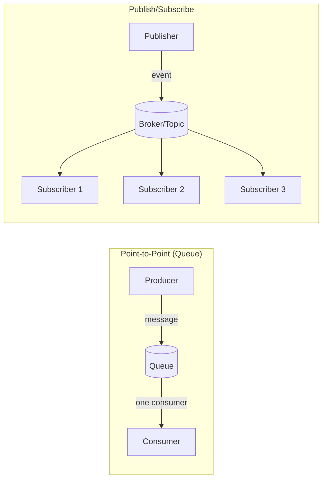
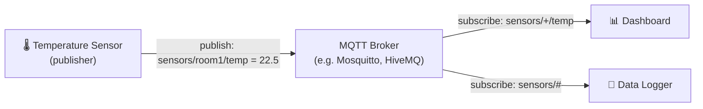

import Tabs from '@theme/Tabs';
import TabItem from '@theme/TabItem';

# Messaging Protocols

> **Part of:** [Protocols & Standards](./index)

**Messaging protocols** enable asynchronous, decoupled communication between services and devices. Unlike HTTP (request-response), messaging protocols use **publish/subscribe** or **queue** patterns — producers send messages without waiting for consumers, and consumers process at their own pace.

---

## Core Patterns



| Pattern | Use When |
|---------|---------|
| **Queue** | One message, one consumer (task distribution, work queues) |
| **Pub/Sub** | One message, many consumers (events, notifications, fan-out) |

---

## MQTT — Message Queuing Telemetry Transport

MQTT is the **IoT messaging protocol**. It is lightweight, designed for constrained devices and unreliable networks. A 250-byte hello-world MQTT message vs a similar HTTP message is ~10× smaller.

> **Tool:** MQTT · **Introduced:** 1999 (IBM) · **Latest:** MQTT 5.0 (2019) · **Status:** 🟢 Modern

### How It Works



- **Broker** — central message router (Mosquitto, EMQX, HiveMQ, AWS IoT Core)
- **Topic** — hierarchical string path: `sensors/room1/temperature`
- **Wildcard `+`** — single-level: `sensors/+/temp` matches `sensors/room1/temp`
- **Wildcard `#`** — multi-level: `sensors/#` matches everything under `sensors/`

### QoS Levels

| Level | Guarantee | Use When |
|-------|-----------|---------|
| QoS 0 | At most once (fire and forget) | Sensor data where dropped readings are OK |
| QoS 1 | At least once (may duplicate) | Commands that must arrive but can be processed twice |
| QoS 2 | Exactly once (handshake) | Financial or critical operations |

<Tabs>
<TabItem value="python" label="Python">

```python
# pip install paho-mqtt
import paho.mqtt.client as mqtt

# Publisher
client = mqtt.Client()
client.connect("mqtt.example.com", 1883)
client.publish("sensors/room1/temperature", "22.5", qos=1)
client.disconnect()

# Subscriber
def on_message(client, userdata, msg):
    print(f"{msg.topic}: {msg.payload.decode()}")

sub = mqtt.Client()
sub.on_message = on_message
sub.connect("mqtt.example.com", 1883)
sub.subscribe("sensors/+/temperature", qos=1)
sub.loop_forever()  # Blocking event loop
```

</TabItem>
<TabItem value="typescript" label="TypeScript">

```typescript
// npm install mqtt
import mqtt from 'mqtt';

const client = mqtt.connect('mqtt://mqtt.example.com:1883');

// Subscribe
client.on('connect', () => {
  client.subscribe('sensors/+/temperature', { qos: 1 });
});

client.on('message', (topic, payload) => {
  console.log(`${topic}: ${payload.toString()}`);
});

// Publish (from a separate connection or same)
client.publish('sensors/room1/temperature', '22.5', { qos: 1 });
```

</TabItem>
</Tabs>

---

## AMQP — Advanced Message Queuing Protocol

AMQP is the **enterprise messaging protocol** used by message brokers like **RabbitMQ**. More feature-rich and complex than MQTT — designed for reliable, transactional business messaging.

> **Tool:** AMQP · **Introduced:** 2003 · **Latest:** AMQP 1.0 (2011, ISO 19464) · **Status:** 🟢 Modern

### Core Concepts

| Concept | What It Is |
|---------|-----------|
| **Producer** | Sends messages to an exchange |
| **Exchange** | Routes messages to queues based on rules |
| **Queue** | Stores messages until consumed |
| **Consumer** | Reads from a queue |
| **Binding** | Rule connecting an exchange to a queue |

### Exchange Types

| Type | Routing Behaviour | Example Use |
|------|------------------|-------------|
| `direct` | Route by exact routing key | `order.created` → orders queue |
| `topic` | Route by pattern (`*` = one word, `#` = many) | `payment.*` → payment queues |
| `fanout` | Broadcast to all bound queues | Notifications to all services |
| `headers` | Route by message headers | Flexible metadata-based routing |

```python
# pip install pika
import pika

connection = pika.BlockingConnection(pika.ConnectionParameters('localhost'))
channel = connection.channel()

# Declare queue
channel.queue_declare(queue='task_queue', durable=True)

# Producer: publish a message
channel.basic_publish(
    exchange='',
    routing_key='task_queue',
    body='Process this task',
    properties=pika.BasicProperties(delivery_mode=2)  # Persistent
)

# Consumer: receive messages
def callback(ch, method, properties, body):
    print(f"Received: {body.decode()}")
    ch.basic_ack(delivery_tag=method.delivery_tag)

channel.basic_consume(queue='task_queue', on_message_callback=callback)
channel.start_consuming()
```

---

## Protocol Comparison

| | MQTT | AMQP | Redis Pub/Sub | Kafka |
|-|------|------|---------------|-------|
| Designed for | IoT, constrained devices | Enterprise messaging | Fast in-memory pub/sub | High-throughput event streaming |
| Message persistence | Optional (retained messages) | ✅ Durable queues | ❌ Fire-and-forget | ✅ Built-in log retention |
| Ordering guarantee | Per-topic | Per-queue | None | Per-partition |
| Replay messages | ❌ No | ❌ No | ❌ No | ✅ Yes (consumer groups) |
| Broker | Mosquitto, EMQX, HiveMQ | RabbitMQ | Redis | Apache Kafka |
| Throughput | Low–Medium | Medium | High | Very high |
| Learning curve | Low | Medium | Low | High |
| Use when | IoT devices, sensors | Task queues, microservices | Simple event fan-out | Log processing, event sourcing |

:::note[Kafka is not covered here]
Apache Kafka uses its own custom protocol and is a full event streaming platform, not just a message queue. It deserves a dedicated wiki entry in the DevOps or architecture section. For application-layer pub/sub in microservices, AMQP via RabbitMQ is the entry point.
:::
