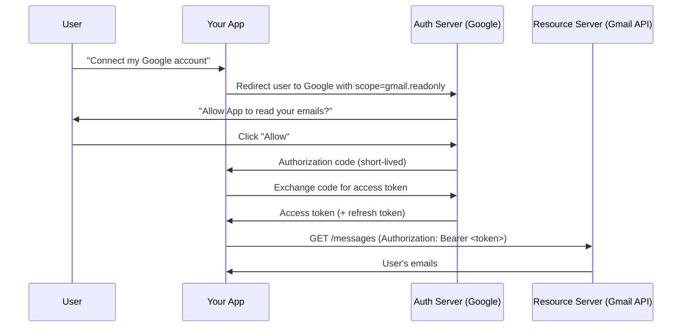
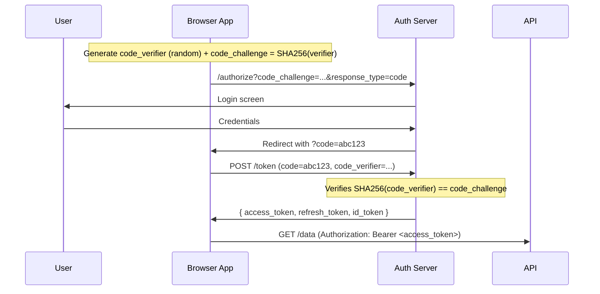

import Tabs from '@theme/Tabs';
import TabItem from '@theme/TabItem';

# OAuth 2.0 & OpenID Connect

> **Part of:** [Protocols & Standards](./index)

> **Tool:** OAuth 2.0 · **Introduced:** 2012 (RFC 6749) · **Latest:** OAuth 2.1 (draft) · **Status:** 🟢 Modern  
> **Tool:** OpenID Connect · **Introduced:** 2014 (OpenID Foundation) · **Status:** 🟢 Modern

**OAuth 2.0** is an open authorisation framework that lets a user grant a third-party application access to their resources on another service — without sharing their password. It is the foundation of "Sign in with Google/GitHub/Apple" and API authorisation on the web.

**OpenID Connect (OIDC)** is an identity layer built on top of OAuth 2.0. OAuth tells you *what you can access*; OIDC tells you *who the user is*.

---

## The Core Problem OAuth Solves

Before OAuth, if you wanted "App B" to read your emails from "Email Service A", you'd have to give App B your email password. This is terrible:
- App B can do anything with your credentials
- You can't revoke access without changing your password
- App A can't distinguish App B from you

OAuth replaces this with **time-limited, scoped access tokens**:



---

## OAuth 2.0 Grant Types (Flows)

| Flow | When to Use | Involves |
|------|------------|---------|
| **Authorization Code** | Web apps, mobile apps (most secure) | Browser redirect + backend token exchange |
| **Authorization Code + PKCE** | SPAs, native/mobile apps (no client secret) | Same + proof key to prevent code interception |
| **Client Credentials** | Machine-to-machine (no user) | Direct token request with client ID + secret |
| **Device Code** | TVs, CLI tools, devices without a browser | Poll-based, user completes auth on another device |
| **Implicit** 🔴 | Deprecated — do not use | Previously used for SPAs; PKCE replaces this |
| **Resource Owner Password** 🔴 | Deprecated — do not use | Username/password sent directly to auth server |

### Authorization Code + PKCE (The Modern Standard)



---

## OAuth Tokens

| Token | Lifetime | Purpose |
|-------|----------|---------|
| **Access token** | Short (15 min – 1 hour) | Sent with API requests to prove authorisation |
| **Refresh token** | Long (days – indefinite) | Exchange for new access tokens without re-prompting user |
| **ID token** (OIDC) | Short | JWT containing user identity information |
| **Authorization code** | Very short (seconds) | One-time code exchanged for tokens at the backend |

---

## OpenID Connect — Who Are You?

OIDC adds user identity to OAuth. After authentication, the app receives an **ID token** — a signed JWT containing claims about the user:

```json
{
  "iss": "https://accounts.google.com",
  "sub": "110169484474386276334",
  "aud": "your-client-id",
  "exp": 1715000000,
  "iat": 1714996400,
  "email": "alice@example.com",
  "name": "Alice Smith",
  "picture": "https://lh3.googleusercontent.com/...",
  "email_verified": true
}
```

Standard OIDC endpoints (discoverable at `/.well-known/openid-configuration`):
- `POST /token` — exchange code for tokens
- `GET /userinfo` — fetch current user's claims
- `GET /jwks` — public keys to verify ID token signatures

---

## JWT — JSON Web Tokens

Access tokens and ID tokens are commonly JWTs (RFC 7519). A JWT is a base64-encoded, signed claim set:

```
header.payload.signature

eyJhbGciOiJSUzI1NiJ9  ←  {"alg":"RS256"}
.
eyJzdWIiOiIxMjMiLCJuYW1lIjoiQWxpY2UiLCJleHAiOjE3MTUwMH0=  ←  {"sub":"123","name":"Alice","exp":1715000000}
.
<RSA signature>
```

**Verifying a JWT:**
1. Decode the header to find the signing algorithm
2. Fetch the auth server's public key from its JWKS endpoint
3. Verify the signature
4. Check `exp` (not expired), `iss` (expected issuer), `aud` (expected audience)

<Tabs>
<TabItem value="python" label="Python">

```python
# pip install python-jose[cryptography] requests
from jose import jwt
import requests

def verify_jwt(token: str, issuer: str, audience: str) -> dict:
    # Fetch JWKS from auth server
    oidc_config = requests.get(f"{issuer}/.well-known/openid-configuration").json()
    jwks = requests.get(oidc_config["jwks_uri"]).json()

    return jwt.decode(
        token,
        jwks,
        algorithms=["RS256"],
        audience=audience,
        issuer=issuer,
    )

claims = verify_jwt(id_token, "https://accounts.google.com", "your-client-id")
print(claims["email"])  # alice@example.com
```

</TabItem>
<TabItem value="typescript" label="TypeScript">

```typescript
// npm install jose
import { createRemoteJWKSet, jwtVerify } from 'jose';

const JWKS = createRemoteJWKSet(
  new URL('https://accounts.google.com/.well-known/jwks.json')
);

const { payload } = await jwtVerify(idToken, JWKS, {
  issuer: 'https://accounts.google.com',
  audience: 'your-client-id',
});

console.log(payload.email);  // alice@example.com
```

</TabItem>
</Tabs>

---

## Popular OAuth 2.0 / OIDC Providers

| Provider | Use Case |
|----------|---------|
| **Auth0** | Managed auth for apps — easiest to integrate |
| **Okta** | Enterprise identity management |
| **Keycloak** | Self-hosted, open-source OAuth/OIDC server |
| **Google Identity** | "Sign in with Google" |
| **GitHub OAuth** | Developer tools |
| **AWS Cognito** | AWS-native user pools |
| **Neon Auth** | Branch-aware auth for Neon databases |

:::tip[Don't reinvent auth]
Unless you are building an auth product, use a managed provider or an open standard library. Implementing OAuth correctly — with PKCE, token rotation, and JWKS verification — is complex and security-critical. Libraries like [better-auth](https://better-auth.com), [Auth.js](https://authjs.dev), and [Lucia](https://lucia-auth.com) handle this correctly.
:::
