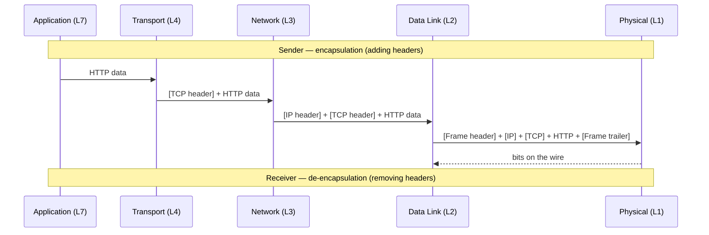

# OSI Model

> **Part of:** [Protocols & Standards](./index)

The **OSI (Open Systems Interconnection)** model is a 7-layer conceptual framework for how network communication works. It was developed by ISO in 1984 and is still the standard reference model used in networking education, troubleshooting, and protocol documentation — even though the internet runs on the **TCP/IP model** in practice.

:::note[OSI vs TCP/IP]
The OSI model is a *reference model* — it describes what should happen at each layer. TCP/IP is the *implementation* the internet actually uses. They mostly align, but the layers don't map 1:1. See [TCP/IP Model](./tcp_ip) for the practical 4-layer stack.
:::

---

## The 7 Layers

| # | Layer | Name | Protocols / Examples | Responsibility |
|---|-------|------|---------------------|----------------|
| 7 | Application | **Application** | HTTP, DNS, SMTP, SSH, FTP | Interface between software and network |
| 6 | Presentation | **Presentation** | TLS/SSL, JPEG, MPEG, ASCII | Data translation, encryption, compression |
| 5 | Session | **Session** | NetBIOS, RPC, SIP | Managing communication sessions (open, maintain, close) |
| 4 | Transport | **Transport** | TCP, UDP | End-to-end delivery, ports, flow control |
| 3 | Network | **Network** | IP, ICMP, BGP | Routing across networks, IP addressing |
| 2 | Data Link | **Data Link** | Ethernet, Wi-Fi (802.11), ARP | Node-to-node transfer, MAC addresses, frames |
| 1 | Physical | **Physical** | Coax, fibre, radio waves | Physical transmission of bits |

**Memory aid:** *Please Do Not Throw Sausage Pizza Away* (Physical, Data Link, Network, Transport, Session, Presentation, Application — bottom to top).

---

## How a Packet Travels

When you send an HTTP request, data is **encapsulated** as it moves down the layers on the sender side, and **de-encapsulated** as it moves up on the receiver side:

Each layer adds its own header (and sometimes trailer). The payload from one layer becomes the data for the layer below.

---

## OSI vs TCP/IP Layer Mapping

| OSI Layer | TCP/IP Layer | Notes |
|-----------|-------------|-------|
| Application (7) | Application | Merged into one |
| Presentation (6) | Application | TLS lives here (or at Transport in TCP/IP framing) |
| Session (5) | Application | Session management handled by app or OS |
| Transport (4) | Transport | Direct 1:1 |
| Network (3) | Internet | Direct 1:1 (IP, ICMP, routing) |
| Data Link (2) | Network Access | Merged |
| Physical (1) | Network Access | Merged |

---

## Why OSI Still Matters

Even though TCP/IP dominates in practice, OSI is still critical for:

1. **Troubleshooting** — "Is this a Layer 2 or Layer 3 issue?" is the first question in network debugging. A connectivity issue is different from a routing issue is different from an application issue.
2. **Vendor documentation** — Firewalls, switches, and routers all reference OSI layers. A "Layer 7 firewall" inspects HTTP content; a "Layer 3 switch" routes by IP.
3. **Protocol design** — Any new protocol specifies which OSI layers it operates at.
4. **Certifications** — CompTIA Network+, CCNA, and every other networking cert tests OSI extensively.

---

## Layer-by-Layer Protocol Reference

### Layer 7 — Application
The layer your code directly interacts with. Protocols here define how apps communicate.

| Protocol | Port(s) | Purpose |
|----------|---------|---------|
| HTTP | 80 | Web traffic |
| HTTPS | 443 | Encrypted web traffic |
| DNS | 53 (UDP/TCP) | Name resolution |
| SMTP | 25, 587 | Email sending |
| IMAP | 143, 993 | Email retrieval |
| SSH | 22 | Secure remote shell |
| FTP | 20, 21 | File transfer |
| MQTT | 1883, 8883 | IoT messaging |

### Layer 4 — Transport
Determines *how* data is delivered between endpoints.

| Protocol | Reliability | Use |
|----------|-------------|-----|
| TCP | ✅ Guaranteed, ordered | HTTP, SSH, databases |
| UDP | ❌ Fire-and-forget | DNS, video, games, QUIC |
| QUIC | ✅ Reliable streams on UDP | HTTP/3 |

### Layer 3 — Network
Handles *where* data goes. IP is the foundation.

| Protocol | Purpose |
|----------|---------|
| IPv4 | 32-bit addresses, routing |
| IPv6 | 128-bit addresses, replacing IPv4 |
| ICMP | Error reporting (ping, traceroute) |
| BGP | Inter-AS routing (the internet's routing protocol) |

### Layer 2 — Data Link
Node-to-node delivery on the same network segment.

| Protocol | Purpose |
|----------|---------|
| Ethernet (802.3) | Wired LAN |
| Wi-Fi (802.11) | Wireless LAN |
| ARP | Maps IP → MAC address |

:::tip[Try It 🔍]
Run `arp -a` on Windows or Linux to see your local ARP cache — the Layer 2 ↔ Layer 3 mapping table your machine keeps for nearby hosts.
:::
