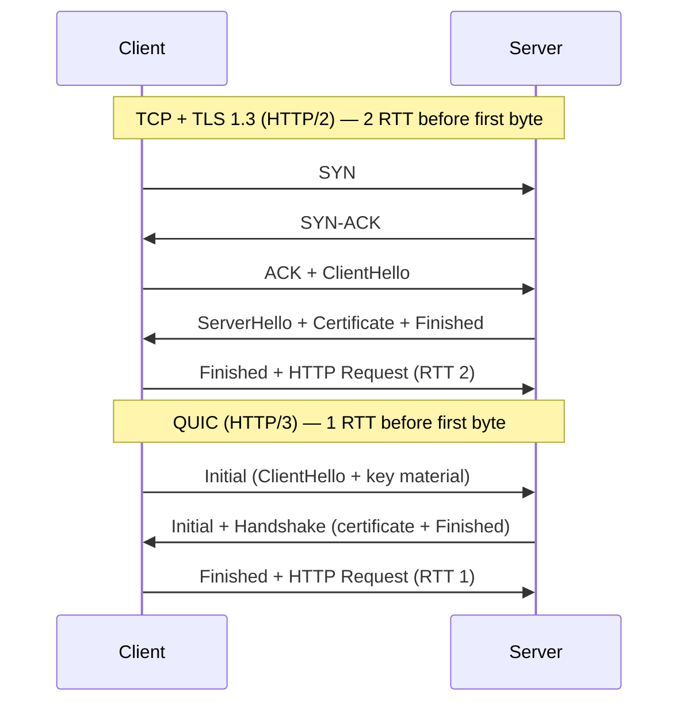

# QUIC

> **Part of:** [Protocols & Standards](./index)

> **Tool:** QUIC · **Introduced:** 2012 (Google experiment) · **Standardised:** 2021 (RFC 9000) · **Status:** 🟢 Modern

QUIC is a **general-purpose transport protocol** built on UDP that delivers the reliability and ordering guarantees of TCP while eliminating the performance bottlenecks that TCP couldn't solve. It is the transport layer underneath HTTP/3.

:::note[Context]
HTTP/3 is the application protocol. QUIC is the transport. Just as HTTP/1.1 and HTTP/2 run on TCP, HTTP/3 runs on QUIC. See [HTTP](./http) for the application-layer comparison.
:::

---

## Why QUIC Was Needed

TCP was designed in 1974. It was not built for:
- Multiplexed HTTP/2 streams
- Mobile clients that switch between Wi-Fi and cellular (changing IP)
- Low-latency connection setup (TLS + TCP = 2–3 RTTs before first byte)

### Head-of-Line Blocking

The fundamental problem TCP has with HTTP/2:

```
HTTP/2 Stream A ─────────────▶ packet lost ✗
HTTP/2 Stream B ─────────────▶ BLOCKED — TCP waits for A's retransmit
HTTP/2 Stream C ─────────────▶ BLOCKED
```

TCP has one ordered byte stream. If one packet is lost, everything behind it — even unrelated HTTP/2 streams — stalls until TCP retransmits.

```
QUIC Stream A ─────────────▶ packet lost ✗ (retransmitting...)
QUIC Stream B ─────────────▶ ✅ continues independently
QUIC Stream C ─────────────▶ ✅ continues independently
```

QUIC maintains independent streams. A single lost packet only stalls *its own* stream, not others.

---

## Key Features

| Feature | How QUIC Handles It |
|---------|---------------------|
| **Reliability** | Built-in retransmission and ordering per stream — same guarantees as TCP |
| **Multiplexing** | Independent streams — no head-of-line blocking between streams |
| **Connection migration** | Connections survive IP address changes (switching Wi-Fi → cellular) via a connection ID |
| **Built-in encryption** | TLS 1.3 is mandatory and integrated into the handshake — no plain QUIC |
| **0-RTT resumption** | Resumed connections can send data immediately, before handshake completes (with replay-attack caveats) |
| **Reduced handshake** | First connection: 1 RTT (vs TCP + TLS = 2–3 RTT). Resumed: 0 RTT |

---

## Connection Setup Comparison



---

## QUIC Packet Types

| Packet Type | Purpose |
|-------------|---------|
| `Initial` | Begins handshake, carries ClientHello/ServerHello |
| `Handshake` | Carries TLS handshake messages at a higher encryption level |
| `0-RTT` | Carries early data before handshake is complete |
| `1-RTT` | Post-handshake data — all normal application traffic |
| `Retry` | Server requests address validation (anti-amplification) |
| `Version Negotiation` | Signals unsupported QUIC version |

---

## Connection Migration

A defining feature of QUIC not possible with TCP:

```
Phone connects via Wi-Fi → QUIC connection established (Connection ID: abc123)
Phone moves away → switches to 4G → IP address changes
                                    ↓
QUIC: connection continues using Connection ID abc123 — no reconnect needed
TCP:  connection dies — must re-establish TCP + TLS from scratch
```

This makes QUIC significantly better for mobile applications and long-lived connections.

---

## Where You'll Encounter QUIC

- **HTTP/3** — the primary use case
- **Google services** — Gmail, YouTube, Google Search have used QUIC since ~2015
- **Cloudflare** — serves HTTP/3 by default for all proxied sites
- **MASQUE** — QUIC-based VPN/tunnelling (RFC 9298)
- **WebTransport** — browser API for bidirectional QUIC streams (alternative to WebSockets)

:::tip[Check if a site uses QUIC]
Open Chrome DevTools → Network tab → right-click a column header → enable "Protocol". You'll see `h3` (HTTP/3 over QUIC) vs `h2` (HTTP/2) vs `http/1.1`. Most Cloudflare-proxied sites serve `h3`.

Or use: `curl --http3 -I https://cloudflare.com` if your `curl` build supports QUIC.
:::
