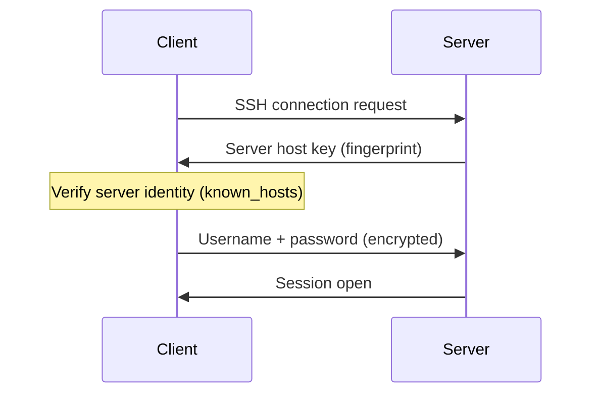
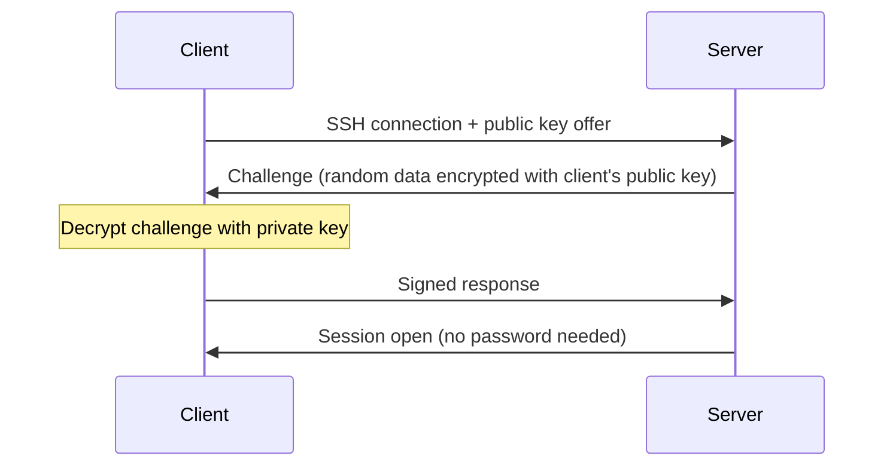

import Tabs from '@theme/Tabs';
import TabItem from '@theme/TabItem';

# SSH — Secure Shell

> **Part of:** [Protocols & Standards](./index)

> **Tool:** SSH · **Introduced:** 1995 (SSH-1), SSH-2 in 2006 (RFC 4251–4254) · **Latest:** OpenSSH 9.x (2024) · **Deprecated:** Telnet, rsh, rlogin 🔴 · **Status:** 🟢 Modern

SSH is the **secure, encrypted protocol for remote access to computers**. It replaced `telnet` and `rsh`, which sent credentials and data in plaintext. Every developer, sysadmin, and DevOps engineer uses SSH daily.

---

## What SSH Does

| Feature | Description |
|---------|-------------|
| **Remote shell** | Open an interactive terminal on a remote machine |
| **File transfer** | Copy files securely (`scp`, `sftp`) |
| **Port forwarding** | Tunnel other protocols through the encrypted channel |
| **Key-based auth** | Log in without a password using public/private key pairs |
| **Agent forwarding** | Use your local SSH keys on remote machines without copying them |

---

## How SSH Authentication Works

SSH supports two authentication methods. **Key-based auth is strongly preferred** — password auth is less secure and should be disabled on public servers.

### Password Authentication


### Key-Based Authentication


---

## Key Pair Setup

<Tabs>
<TabItem value="powershell" label="PowerShell (Windows)">

```powershell
# Generate an Ed25519 key pair (modern, recommended over RSA)
ssh-keygen -t ed25519 -C "your@email.com"
# Default location: C:\Users\you\.ssh\id_ed25519 (private) and id_ed25519.pub (public)

# Copy your public key to a remote server
# Windows doesn't ship ssh-copy-id — do it manually:
$pubkey = Get-Content ~/.ssh/id_ed25519.pub
ssh user@host "mkdir -p ~/.ssh && echo '$pubkey' >> ~/.ssh/authorized_keys"

# Connect
ssh user@hostname

# Connect with a specific key
ssh -i ~/.ssh/my_key user@hostname

# Connect on a non-default port
ssh -p 2222 user@hostname
```

</TabItem>
<TabItem value="bash" label="Bash (Linux/macOS)">

```bash
# Generate an Ed25519 key pair
ssh-keygen -t ed25519 -C "your@email.com"
# Stored in ~/.ssh/id_ed25519 (private) and ~/.ssh/id_ed25519.pub (public)

# Copy public key to remote server (one command)
ssh-copy-id user@hostname

# Connect
ssh user@hostname

# Connect with a specific identity file
ssh -i ~/.ssh/my_key user@hostname

# Connect on a non-default port
ssh -p 2222 user@hostname
```

</TabItem>
</Tabs>

---

## SSH Config File

Instead of typing long `ssh` commands, put your settings in `~/.ssh/config`:

```
Host myserver
    HostName 203.0.113.42
    User ubuntu
    IdentityFile ~/.ssh/deploy_key
    Port 22

Host bastion
    HostName 203.0.113.1
    User ec2-user
    IdentityFile ~/.ssh/bastion_key

Host internal
    HostName 10.0.1.50
    User app
    ProxyJump bastion   # Hop through bastion host
```

Now you just type `ssh myserver` instead of `ssh -i ~/.ssh/deploy_key ubuntu@203.0.113.42`.

---

## Port Forwarding

SSH can forward arbitrary TCP traffic through the encrypted tunnel:

| Type | Command | Use case |
|------|---------|---------|
| **Local forwarding** | `ssh -L 5432:db-host:5432 user@bastion` | Access a remote DB locally as `localhost:5432` |
| **Remote forwarding** | `ssh -R 8080:localhost:3000 user@server` | Expose your local port 3000 on the remote server's port 8080 |
| **Dynamic (SOCKS)** | `ssh -D 1080 user@host` | Use the remote server as a SOCKS proxy |

---

## File Transfer: SCP and SFTP

```bash
# scp — copy files over SSH (simple, works anywhere)
scp file.txt user@host:/remote/path/
scp -r ./dir user@host:/remote/path/   # Recursive
scp user@host:/remote/file ./local/    # Download

# sftp — interactive file transfer session
sftp user@host
# Commands inside sftp session:
# ls, cd, pwd, get remote-file, put local-file, mkdir, exit
```

---

## Security Hardening

For any public-facing SSH server, apply these settings in `/etc/ssh/sshd_config`:

```
PasswordAuthentication no        # Require key-based auth only
PermitRootLogin no               # Never log in as root directly
PubkeyAuthentication yes         # Enable key auth
AuthorizedKeysFile .ssh/authorized_keys
Port 2222                        # Non-default port (minor obscurity, reduces log noise)
MaxAuthTries 3                   # Limit brute-force attempts
AllowUsers deploy ubuntu         # Allowlist specific users
```

:::tip[Try It 🔍]
Generate a key pair, add the public key to a cloud VM (AWS EC2, DigitalOcean Droplet, etc.) during provisioning, and connect using only `ssh -i your_key user@ip`. Disable password auth after confirming key access works.
:::
