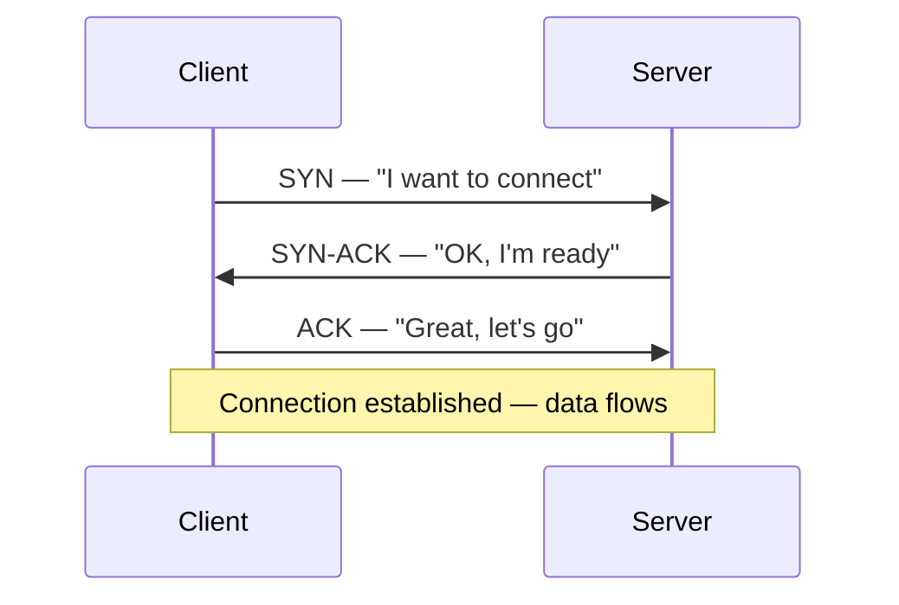
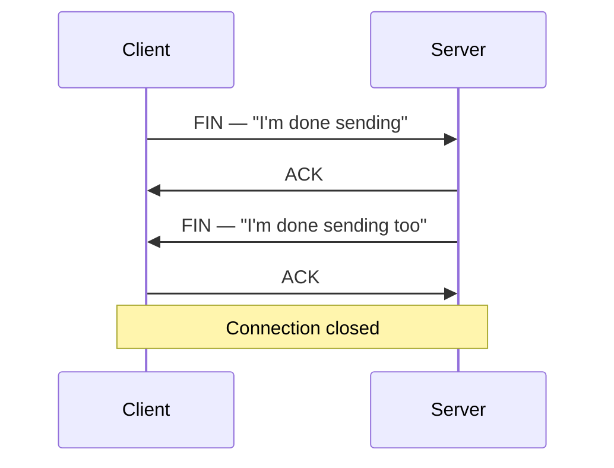

# TCP/IP Model

> **Part of:** [Protocols & Standards](./index)

The internet is built on layers. Each layer has one job and talks only to the layers directly above and below it. This layered design means protocols can be swapped or upgraded at one layer without breaking the others.

---

## The Four Layers

  

| Layer | Name | Protocols | Responsibility |
|-------|------|-----------|----------------|
| 4 | Application | HTTP, DNS, FTP, SSH, SMTP | What the application sees and sends |
| 3 | Transport | TCP, UDP | Reliable (or fast) delivery between ports |
| 2 | Internet | IP, ICMP | Routing packets across networks |
| 1 | Network Access | Ethernet, Wi-Fi | Physical transmission; MAC addresses, frames |

**Mental model:** Each layer wraps the layer above like an envelope. When a packet arrives, each layer unwraps its envelope and passes the contents up.

---

## TCP vs. UDP

Both TCP and UDP live at the Transport layer, but they make opposite tradeoffs:

| | TCP | UDP |
|-|-----|-----|
| Connection | Connection-oriented (handshake required) | Connectionless |
| Reliability | Guaranteed delivery, ordering, error-checking | No guarantee, no ordering |
| Speed | Slower (overhead from acknowledgements) | Faster (less overhead) |
| Use when | Correctness matters (HTTP, SSH, databases) | Speed matters (video, DNS, games, QUIC) |

---

## The Three-Way Handshake (TCP Connection Setup)

Before any data flows over TCP, the client and server perform a handshake to synchronise sequence numbers and agree the connection is open:

**What each flag means:**
- **SYN** — Synchronise: starts the handshake, sends the client's initial sequence number
- **SYN-ACK** — Acknowledges the client's SYN and sends the server's own sequence number
- **ACK** — Acknowledges the server's sequence number; connection is live

---

## Connection Teardown (Four-Way)

Closing a TCP connection is slightly more involved — each side closes independently:

---

## QUIC — The Transport Behind HTTP/3

**QUIC** is a transport protocol built on UDP that implements reliability, multiplexing, and encryption at the transport layer. It was designed by Google and standardised by the IETF (RFC 9000).

Why UDP instead of TCP?
- TCP head-of-line blocking: one lost packet stalls *all* streams on the connection
- QUIC multiplexes independent streams — a lost packet only stalls *its own* stream
- QUIC bakes TLS 1.3 into the handshake, saving a round-trip on connection setup

HTTP/3 runs on QUIC instead of TCP. See [HTTP](./http) for the full comparison.

:::tip[Try It 🔍]
Run `tracert github.com` (Windows) or `traceroute github.com` (Linux/macOS) to watch your packets hop across routers at the Internet layer. Each hop is a router forwarding at Layer 2.
:::
