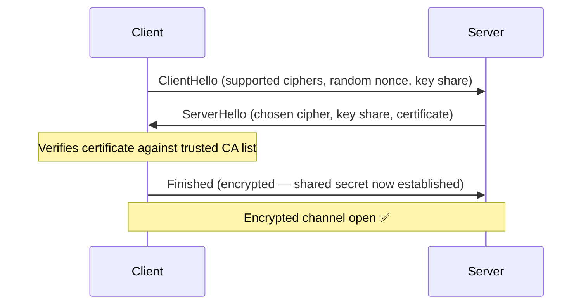
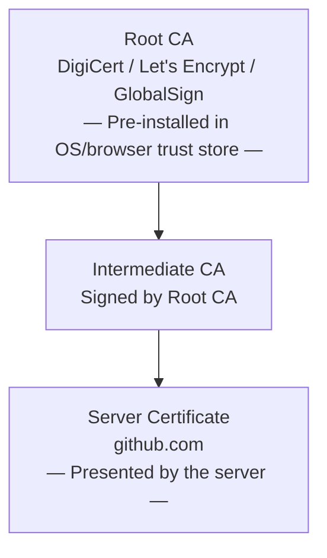

# TLS & HTTPS

> **Part of:** [Protocols & Standards](./index)

> **Tool:** TLS · **Introduced:** SSL 1995 (Netscape) · **Latest:** TLS 1.3 (RFC 8446, 2018) · **Deprecated:** SSL 3.0, TLS 1.0, TLS 1.1 🔴 · **Status:** 🟢 Modern

**TLS (Transport Layer Security)** encrypts the connection between client and server. **HTTPS** is simply HTTP running over a TLS-secured channel.

---

## What TLS Provides

| Property | What It Means |
|----------|--------------|
| **Confidentiality** | Data is encrypted end-to-end — eavesdroppers see only ciphertext |
| **Integrity** | A tampered packet is detected and rejected (MAC/AEAD) |
| **Authentication** | The server proves it is who it claims to be via a certificate signed by a trusted CA |

Without TLS, anyone on the same network (café Wi-Fi, ISP, nation-state) can read or modify your traffic.

---

## TLS 1.3 Handshake

TLS 1.3 reduced the handshake to one round-trip (1-RTT), or zero for resumed sessions (0-RTT):



**What changed from TLS 1.2:**
- No longer supports RSA key exchange (forward secrecy mandatory via ECDHE)
- Removed weak cipher suites (RC4, 3DES)
- Handshake takes 1 RTT instead of 2 RTT
- Session resumption can achieve 0-RTT (with replay-attack caveats)

---

## Certificate Chain of Trust

A TLS certificate is only trusted if it is signed by a **Certificate Authority (CA)** that your OS or browser trusts. This creates a chain:



**Why the intermediate?** Root CA private keys are kept offline for security. The intermediate CA signs server certificates day-to-day and can be revoked without touching the root.

**Certificate fields you should know:**

| Field | Meaning |
|-------|---------|
| `Subject` | Who the certificate is for (domain name) |
| `Issuer` | Which CA signed it |
| `Valid From / To` | Validity window (typically 90 days for Let's Encrypt, 1 year max per industry rules) |
| `SAN` | Subject Alternative Names — additional domains covered (`www.`, API subdomains) |
| `Public Key` | Server's public key (used in key exchange) |
| `Signature` | CA's digital signature over the certificate data |

---

## Certificate Validation Failures

| Error | Cause |
|-------|-------|
| `ERR_CERT_AUTHORITY_INVALID` | Cert signed by an untrusted or self-signed CA |
| `ERR_CERT_DATE_INVALID` | Cert has expired or not yet valid |
| `ERR_CERT_COMMON_NAME_INVALID` | Domain doesn't match the cert's Subject/SAN |
| `HSTS error` | Site sent HSTS header previously; browser refuses to downgrade to HTTP |

---

## HSTS — HTTP Strict Transport Security

After a successful HTTPS connection, a server can send:

```
Strict-Transport-Security: max-age=31536000; includeSubDomains; preload
```

This tells the browser: **never connect to this domain over plain HTTP again**, even if the user types `http://`. This prevents SSL-stripping attacks.

---

## Let's Encrypt

[Let's Encrypt](https://letsencrypt.org/) is a free, automated CA that issues 90-day certificates. It is the reason HTTPS became universal. You can obtain and renew certificates automatically with **Certbot** (`certbot certonly`) or via cloud platforms (AWS ACM, Cloudflare, etc.).

:::tip[Try It 🔍]
Click the 🔒 padlock next to any HTTPS URL in Chrome or Firefox. View the certificate to see:
- The issuer (CA)
- Validity window
- The full Subject Alternative Names (SAN) list
- The cipher suite in use
:::
