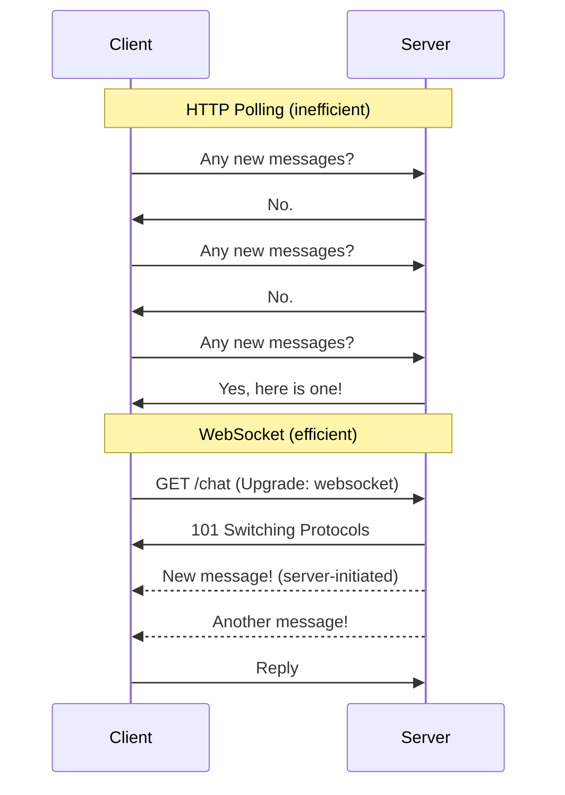

import Tabs from '@theme/Tabs';
import TabItem from '@theme/TabItem';

# WebSockets

> **Part of:** [Protocols & Standards](./index)

> **Tool:** WebSocket · **Introduced:** 2011 (RFC 6455) · **Status:** 🟢 Modern

HTTP is request-response — the **client** always initiates. **WebSockets** open a persistent, full-duplex channel where either side can send a message at any time. The connection starts as an HTTP upgrade and then switches protocols.

---

## HTTP Polling vs. WebSockets



Polling wastes bandwidth and adds latency. WebSockets are event-driven — the server pushes when there's something to say.

---

## The WebSocket Handshake

WebSocket connections start as a regular HTTP request:

```
GET /chat HTTP/1.1
Host: example.com
Upgrade: websocket
Connection: Upgrade
Sec-WebSocket-Key: dGhlIHNhbXBsZSBub25jZQ==
Sec-WebSocket-Version: 13
```

Server responds with `101 Switching Protocols`, and from that point the TCP connection carries WebSocket frames instead of HTTP.

---

## When to Use WebSockets

**Use WebSockets when:**
- Chat and messaging applications
- Live dashboards and real-time analytics
- Multiplayer games (low-latency bidirectional)
- Collaborative editors (Google Docs style)
- Real-time notifications (financial tickers, live scores)
- Streaming server logs or build output

**Don't use WebSockets when:**
- Standard request-response patterns — just use REST
- Infrequent server-to-client updates — use **Server-Sent Events (SSE)** instead (simpler, one-directional, HTTP-native)
- The client only needs to push data, rarely receives — use REST POST

---

## Server-Sent Events (SSE) — The Simpler Alternative

SSE is a one-directional stream from server → client over a regular HTTP connection. No library required, works through proxies, auto-reconnects.

```typescript
// Client (browser — built-in EventSource API)
const es = new EventSource('/stream');
es.onmessage = (event) => console.log(event.data);
es.onerror   = () => es.close();
```

| | WebSocket | SSE |
|-|-----------|-----|
| Direction | Bidirectional | Server → Client only |
| Protocol | WS / WSS | HTTP |
| Reconnect | Manual | Automatic |
| Binary support | ✅ | ❌ (text only) |
| Proxy/firewall | Sometimes blocked | ✅ Works through HTTP proxies |
| Use when | Full duplex needed | Push-only (feeds, notifications) |

---

## Code Examples

<Tabs>
<TabItem value="python-server" label="Python (server)">

```python
# pip install websockets
import asyncio
import websockets

# Track connected clients
CLIENTS: set = set()

async def handler(websocket):
    CLIENTS.add(websocket)
    try:
        async for message in websocket:
            print(f"Received: {message}")
            # Broadcast to all connected clients
            for client in CLIENTS:
                await client.send(f"Echo: {message}")
    finally:
        CLIENTS.remove(websocket)

async def main():
    async with websockets.serve(handler, "localhost", 8765):
        await asyncio.Future()  # Run forever

asyncio.run(main())
```

</TabItem>
<TabItem value="ts-server" label="TypeScript (server)">

```typescript
// npm install ws @types/ws
import { WebSocketServer, WebSocket } from 'ws';

const wss = new WebSocketServer({ port: 8765 });
const clients = new Set<WebSocket>();

wss.on('connection', (ws) => {
    clients.add(ws);

    ws.on('message', (data) => {
        const msg = data.toString();
        console.log('Received:', msg);
        // Broadcast to all connected clients
        for (const client of clients) {
            if (client.readyState === WebSocket.OPEN) {
                client.send(`Echo: ${msg}`);
            }
        }
    });

    ws.on('close', () => clients.delete(ws));
});

console.log('WebSocket server running on ws://localhost:8765');
```

</TabItem>
<TabItem value="ts-client" label="TypeScript (browser client)">

```typescript
// No library needed — WebSocket is a browser built-in
const ws = new WebSocket('ws://localhost:8765');

ws.onopen = () => {
    console.log('Connected');
    ws.send('Hello, server!');
};

ws.onmessage = (event) => {
    console.log('Received:', event.data);
};

ws.onclose = () => console.log('Disconnected');
ws.onerror = (error) => console.error('Error:', error);
```

</TabItem>
</Tabs>

---

## Production Considerations

| Concern | Notes |
|---------|-------|
| **Scaling** | WebSocket connections are stateful — connections belong to a server. Use a pub/sub broker (Redis Pub/Sub, Kafka) to relay messages across servers. |
| **Proxies** | Some HTTP proxies time out idle connections. Send periodic ping/pong frames to keep connections alive. |
| **Authentication** | Pass a token in the query string on connect (`wss://host/chat?token=xyz`) or via a cookie — WebSocket upgrade requests support both. |
| **Rate limiting** | Implement server-side limits on message frequency per connection. |
| **Reconnection** | Implement client-side exponential backoff reconnection logic — connections drop. |
