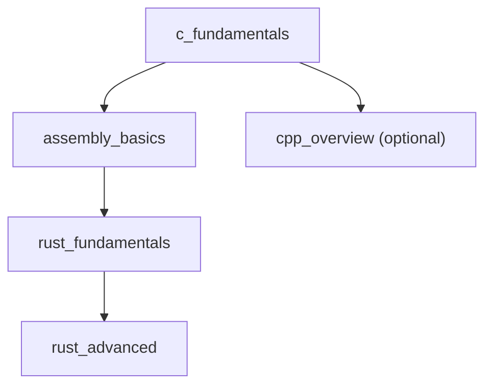

# 🔩 Systems Programming Domain Index

> Low-level programming — C, Rust, memory, OS interaction, and assembly.

---

## Units in This Domain

| Unit | Topic | Estimated Time | Status |
|------|-------|---------------|--------|
| [`c_fundamentals.md`](c_fundamentals.md) | Pointers, memory, structs, compilation | 6 weeks | 📋 Planned |
| [`rust_fundamentals.md`](rust_fundamentals.md) | Ownership, borrowing, traits, Cargo | 6 weeks | 📋 Planned |
| [`rust_advanced.md`](rust_advanced.md) | Async/Tokio, unsafe, FFI, macros | 4 weeks | 📋 Planned |
| [`assembly_basics.md`](assembly_basics.md) | x86/x64 registers, instructions, calling conventions | 3 weeks | 📋 Planned |
| [`cpp_overview.md`](cpp_overview.md) | C++ vs C, RAII, smart pointers, STL | 4 weeks | 📋 Planned |

---

## Dependency Order

## Context

Systems programming is the foundation of everything:
- Operating systems (Linux, Windows) are written in C
- High-performance services are increasingly written in Rust
- Understanding assembly helps you read compiler output and debug at the lowest level

This domain pairs directly with [`domains/foundations/memory_management.md`](../foundations/memory_management.md) and [`domains/foundations/os_concepts.md`](../foundations/os_concepts.md).
