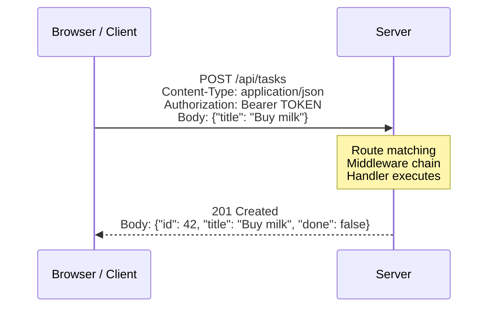
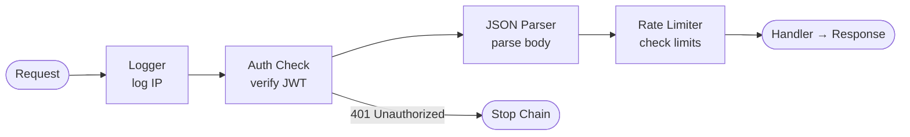
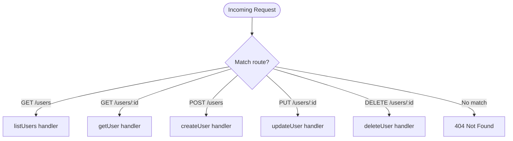
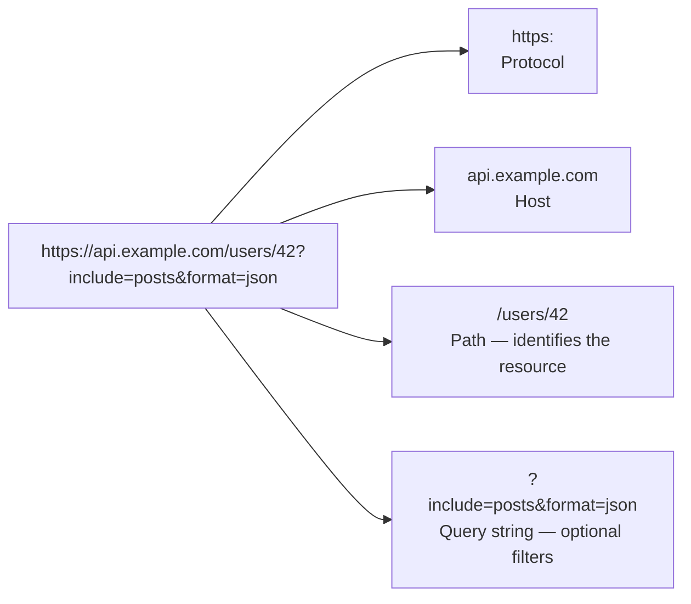
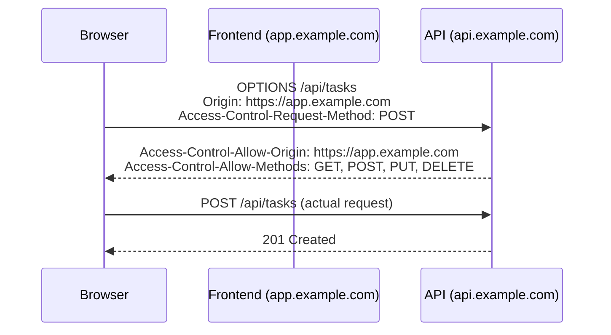
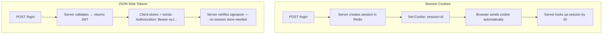

import Tabs from '@theme/Tabs';
import TabItem from '@theme/TabItem';

> **Scope:** Server-side HTTP concepts — how web servers receive and respond to requests, middleware patterns, and routing. Language-agnostic; examples use Node.js and PHP.

---

## The Request / Response Lifecycle

Every HTTP interaction follows the same pattern:



---

## HTTP Methods (Verbs)

| Method | Meaning | Body? | Idempotent? |
|--------|---------|-------|-------------|
| `GET` | Read a resource | No | ✅ |
| `POST` | Create a resource | Yes | ❌ |
| `PUT` | Replace a resource | Yes | ✅ |
| `PATCH` | Partially update | Yes | ❌ |
| `DELETE` | Remove a resource | No | ✅ |
| `HEAD` | Like GET, headers only | No | ✅ |
| `OPTIONS` | Supported methods? (CORS preflight) | No | ✅ |

**Idempotent:** Calling the same request N times has the same result as calling it once.

---

## Status Codes

| Range | Meaning | Common Codes |
|-------|---------|-------------|
| 2xx | Success | 200 OK, 201 Created, 204 No Content |
| 3xx | Redirect | 301 Permanent, 302 Temporary, 304 Not Modified |
| 4xx | Client Error | 400 Bad Request, 401 Unauthorized, 403 Forbidden, 404 Not Found |
| 5xx | Server Error | 500 Internal Server Error, 502 Bad Gateway, 503 Service Unavailable |

:::tip
**401 vs 403:** 401 = "Who are you? Please authenticate." 403 = "I know who you are, you're just not allowed."
:::

---

## Middleware Pattern

Middleware is a **chain of functions** that each receive the request and response, do something, then pass control to the next function.



Each middleware can:
- **Pass through** — call `next()` to continue the chain
- **Respond early** — send a response and stop the chain (e.g. 401)
- **Modify req/res** — attach data for downstream handlers (e.g. `req.user = decoded.user`)

<Tabs>
  <TabItem value="express" label="Express (TypeScript)">
  ```ts
  // Express middleware signature
  function myMiddleware(req: Request, res: Response, next: NextFunction) {
      // Do something
      next();  // Pass to next middleware / route handler
      // OR:
      res.status(401).json({ error: 'Unauthorised' });  // Stop chain
  }
  ```
  </TabItem>
  <TabItem value="php" label="PHP (Laravel)">
  ```php
  // Laravel middleware
  public function handle(Request $request, Closure $next): Response
  {
      // Do something before
      $response = $next($request);
      // Do something after
      return $response;
  }
  ```
  </TabItem>
</Tabs>

---

## Routing

Routing maps an **HTTP method + URL pattern** to a handler function:



### URL Anatomy



---

## CORS — Cross-Origin Resource Sharing

Browsers block JavaScript from making requests to a **different origin** (protocol + host + port) by default.



<Tabs>
  <TabItem value="express" label="Express">
  ```ts
  import cors from 'cors';  // npm install cors

  app.use(cors({
      origin:      'https://app.example.com',  // Or '*' for public APIs
      credentials: true                         // Required if sending cookies
  }));
  ```
  </TabItem>
  <TabItem value="laravel" label="Laravel">
  ```php
  // config/cors.php
  'allowed_origins' => ['https://app.example.com'],
  'allowed_methods' => ['GET', 'POST', 'PUT', 'DELETE'],
  'allowed_headers' => ['Content-Type', 'Authorization'],
  'supports_credentials' => true,
  ```
  </TabItem>
</Tabs>

---

## Authentication Patterns



| | Session Cookies | JWT |
|-|----------------|-----|
| Revocation | Easy — delete session | Hard — must use short expiry + refresh tokens |
| Scaling | Requires Redis for horizontal scale | Stateless — scales naturally |
| Storage | Server-side | Client-side |

---

## 📚 See Also

- [Course: Express API](../courses/express_api/index)
- [Course: Node.js Fundamentals](../courses/nodejs_fundamentals/index)
- [Course: PHP & SSR](../courses/php_ssr/index)
- [Wiki: REST APIs](./rest_api)
- [Wiki: Node.js](./nodejs)
