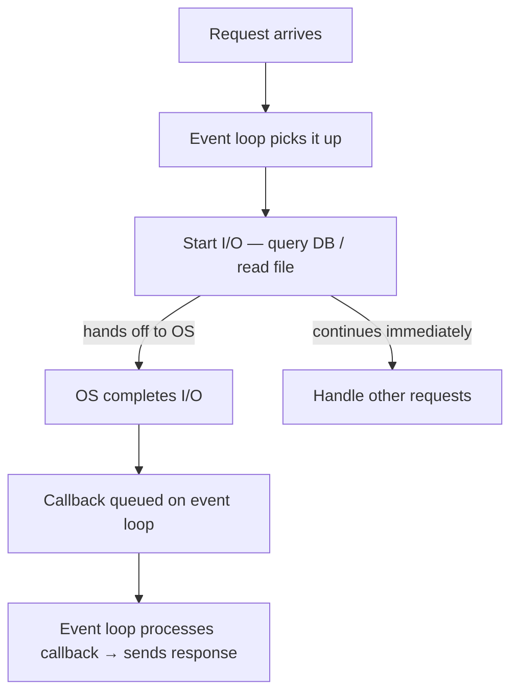

import Tabs from '@theme/Tabs';
import TabItem from '@theme/TabItem';
import YouTubeEmbed from '@site/src/components/YouTubeEmbed';

# Node Core

> **Tool:** Node.js · **Introduced:** 2009 · **Latest:** v22 LTS (2024) · **Status:** 🟢 Modern

Node.js is a **server-side JavaScript runtime** built on V8 (Chrome's JS engine). It executes JavaScript outside the browser, enabling the same language on both frontend and backend.

> **Prerequisite:** [JavaScript](../core/javascript)
> **For web frameworks on top of Node:** [Backend Frameworks](../backend_frameworks)
> **Courses:** [Node.js Fundamentals](../../courses/nodejs_fundamentals/index) · [Express API](../../courses/express_api/index)

<YouTubeEmbed
  id="Oe421EPjeBE"
  title="Node.js Full Course for Beginners by freeCodeCamp"
  caption="Complete Node.js course by freeCodeCamp — covers the event loop, modules, file system, http, and npm."
/>

---

## What Makes Node.js Different

### Non-Blocking, Event-Driven I/O

Traditional servers (Apache, Python's `socket`) create a new **thread per request**. Threads have overhead (~1–8 MB RAM each), and blocking I/O (waiting for a file or database) wastes CPU while the thread sits idle.

Node.js uses a **single thread** with an **event loop**. I/O operations are handed off to the OS (via libuv); the event loop continues processing other work. When the OS completes the I/O, a callback is queued.



**Result:** A single Node.js process can handle thousands of concurrent connections with minimal memory compared to a thread-per-request model.

:::note
Node.js is excellent for **I/O-intensive** workloads (REST APIs, real-time apps, file proxies, BFFs).
It is **not** ideal for **CPU-intensive** workloads (video encoding, image processing, ML inference) — those block the event loop. Use Worker Threads or a separate service for CPU work.
:::

### The Event Loop Phases

```
Phase         Callbacks processed
─────────────────────────────────────
timers      → setTimeout, setInterval callbacks
pending I/O → most I/O completion callbacks
idle/prep   → internal use only
poll        → retrieve new I/O events (blocks here if queue empty)
check       → setImmediate() callbacks
close       → socket.on('close', ...) callbacks
```

Microtasks (`process.nextTick()`, `Promise.then()`) drain completely **between** phases:
```
nextTick queue → runs first
Promise queue  → runs after nextTick
→ then next event loop phase begins
```

```javascript
// Execution order demonstration
console.log('1 sync');

setTimeout(() => console.log('5 setTimeout'), 0);
setImmediate(() => console.log('4 setImmediate'));
Promise.resolve().then(() => console.log('3 Promise.then'));
process.nextTick(() => console.log('2 nextTick'));

console.log('1 sync end');
// Output: 1 sync → 1 sync end → 2 nextTick → 3 Promise.then → 4 setImmediate → 5 setTimeout
```

---

## Module System

### CommonJS (CJS) — Legacy, Still Common

```js
// math.js — export
function add(a, b) { return a + b; }
module.exports = { add };

// main.js — import
const { add } = require('./math');

// Dynamic (conditional) require — works because CJS is synchronous
const logger = process.env.DEBUG ? require('./debug-logger') : require('./logger');
```

### ES Modules (ESM) — Modern Standard

```js
// math.mjs  (or package.json: "type": "module")
export function add(a, b) { return a + b; }
export const PI = 3.14159;
export default function multiply(a, b) { return a * b; }

// main.mjs
import multiply, { add, PI } from './math.mjs';
import * as MathUtils from './math.mjs';

// Dynamic import — async, returns a Promise
const { heavy } = await import('./heavy-module.mjs');
```

**Key differences:**

| | CJS | ESM |
|-|----|-----|
| Syntax | `require()` / `module.exports` | `import` / `export` |
| Loading | Synchronous | Asynchronous |
| Static analysis | ❌ (dynamic paths possible) | ✅ (enables tree-shaking) |
| `__dirname` | ✅ Available | ❌ Use `import.meta.url` |
| Top-level `await` | ❌ | ✅ |
| `package.json "type"` | `"commonjs"` (default) | `"module"` |

:::tip
New projects should use ESM (`"type": "module"` in `package.json`). Most modern libraries (ESLint, Prettier, Vitest) have moved to ESM-first.
:::

---

## Built-in Modules

Node.js includes a rich standard library. Always prefix built-ins with `node:` to distinguish from npm packages.

### `fs` — File System

```js
import { readFile, writeFile, readdir, mkdir, rm, stat, copyFile, rename } from 'node:fs/promises';
import { createReadStream, createWriteStream, watch } from 'node:fs';

// Read / write files
const content = await readFile('./data.json', 'utf-8');
const parsed  = JSON.parse(content);

await writeFile('./output.json', JSON.stringify(parsed, null, 2));

// Directory operations
await mkdir('./uploads', { recursive: true });  // Creates parent dirs too
const files = await readdir('./src');           // Returns filenames (not full paths)
await rm('./temp', { recursive: true });        // Delete directory

// File metadata
const info = await stat('./file.txt');
console.log(info.size, info.mtime, info.isDirectory());

// Watch for changes (does not recurse by default)
watch('./src', { recursive: true }, (eventType, filename) => {
    console.log(`${eventType}: ${filename}`);
});

// Stream a large file (efficient — doesn't load entire file into memory)
createReadStream('./large.csv').pipe(process.stdout);
```

### `path` — Cross-Platform Path Handling

```js
import path from 'node:path';

path.join('/src', 'utils', 'helper.js')   // /src/utils/helper.js
path.resolve('../config.json')            // Absolute path from CWD
path.extname('report.pdf')               // '.pdf'
path.basename('/src/index.js')           // 'index.js'
path.basename('/src/index.js', '.js')   // 'index'
path.dirname('/src/utils/helper.js')    // '/src/utils'
path.parse('/src/utils/helper.js')      // { root, dir, base, ext, name }

// ESM equivalent of __dirname
import { fileURLToPath } from 'node:url';
const __filename = fileURLToPath(import.meta.url);
const __dirname  = path.dirname(__filename);
```

### `http` — Raw HTTP Server

```js
import { createServer } from 'node:http';

const server = createServer((req, res) => {
    const url    = new URL(req.url, `http://${req.headers.host}`);
    const method = req.method;

    if (method === 'GET' && url.pathname === '/health') {
        res.writeHead(200, { 'Content-Type': 'application/json' });
        res.end(JSON.stringify({ status: 'ok', uptime: process.uptime() }));
        return;
    }

    // Read POST body
    if (method === 'POST') {
        let body = '';
        req.on('data', chunk => { body += chunk; });
        req.on('end', () => {
            const data = JSON.parse(body);
            res.writeHead(201, { 'Content-Type': 'application/json' });
            res.end(JSON.stringify({ received: data }));
        });
        return;
    }

    res.writeHead(404, { 'Content-Type': 'application/json' });
    res.end(JSON.stringify({ error: 'Not found' }));
});

server.listen(3000, () => console.log('Listening on http://localhost:3000'));
```

:::tip
In practice, use **Express** or **Fastify** instead of the raw `http` module. They handle routing, middleware, and error handling. The raw `http` module is here for foundational understanding and for building your own minimal servers.
:::

### `crypto` — Hashing, Encryption, Random

```js
import { randomUUID, randomBytes, createHash, createHmac, timingSafeEqual } from 'node:crypto';

// Random IDs
const id   = randomUUID();                              // UUID v4: 'b1b6...'
const token= randomBytes(32).toString('hex');           // 64-char random hex

// Hashing
const hash = createHash('sha256').update('password').digest('hex');

// HMAC (message authentication)
const mac = createHmac('sha256', secretKey).update(payload).digest('hex');

// Timing-safe comparison (prevents timing attacks)
const isValid = timingSafeEqual(
    Buffer.from(suppliedMac, 'hex'),
    Buffer.from(expectedMac, 'hex')
);
```

### `os` — Operating System Info

```js
import os from 'node:os';

os.platform()           // 'win32' | 'linux' | 'darwin'
os.arch()               // 'x64' | 'arm64'
os.cpus().length        // Number of CPU cores
os.freemem()            // Free memory in bytes
os.totalmem()           // Total memory in bytes
os.homedir()            // '/home/user' or 'C:\Users\user'
os.hostname()           // Machine hostname
os.uptime()             // System uptime in seconds
os.networkInterfaces()  // Network interface info
```

### `events` — EventEmitter Pattern

```js
import { EventEmitter } from 'node:events';

class Downloader extends EventEmitter {
    async download(url) {
        this.emit('start', url);

        try {
            const response = await fetch(url);
            const buffer   = await response.arrayBuffer();
            this.emit('progress', 100);
            this.emit('done', { url, size: buffer.byteLength });
            return buffer;
        } catch (error) {
            this.emit('error', error);  // 'error' events MUST be handled
        }
    }
}

const dl = new Downloader();
dl.on('start',    url   => console.log(`Starting: ${url}`));
dl.on('progress', pct   => console.log(`${pct}%`));
dl.on('done',     data  => console.log(`Done! ${data.size} bytes`));
dl.on('error',    error => console.error('Download failed:', error));

dl.download('https://example.com/large-file.zip');
```

### `child_process` — Run External Processes

```js
import { exec, spawn, execSync } from 'node:child_process';
import { promisify } from 'node:util';

const execAsync = promisify(exec);

// exec — run a shell command, buffer output
const { stdout } = await execAsync('git log --oneline -5');
console.log(stdout);

// spawn — stream output in real-time (better for long-running commands)
const child = spawn('npm', ['run', 'build'], { stdio: 'inherit' });
child.on('exit', code => console.log(`Build exited: ${code}`));

// execSync — synchronous (blocks event loop — only use in scripts)
const version = execSync('node --version', { encoding: 'utf-8' }).trim();
```

### `worker_threads` — CPU-Bound Work

```js
import { Worker, isMainThread, parentPort, workerData } from 'node:worker_threads';

if (isMainThread) {
    // Main thread: spawn a worker
    const worker = new Worker(new URL(import.meta.url), {
        workerData: { numbers: [1, 2, 3, 4, 5] }
    });
    worker.on('message', result => console.log('Sum:', result));
    worker.on('error', err => console.error(err));
} else {
    // Worker thread: do CPU work
    const sum = workerData.numbers.reduce((a, b) => a + b, 0);
    parentPort.postMessage(sum);
}
```

---

## Streams

Streams process data **piece-by-piece**, avoiding loading the entire payload into memory.

```
Readable → Transform → Writable
  │                       ▲
  └── pipe() chains them ─┘
```

```js
import { createReadStream, createWriteStream } from 'node:fs';
import { pipeline }                             from 'node:stream/promises';
import { createGzip, createBrotliCompress }     from 'node:zlib';
import { Transform }                            from 'node:stream';

// Compress a file without loading it all into RAM
await pipeline(
    createReadStream('large.csv'),
    createGzip(),
    createWriteStream('large.csv.gz')
);

// Custom transform stream — uppercase each line
const uppercase = new Transform({
    transform(chunk, encoding, callback) {
        callback(null, chunk.toString().toUpperCase());
    }
});

await pipeline(
    createReadStream('input.txt'),
    uppercase,
    createWriteStream('output.txt')
);
```

**Stream types:**

| Type | Description | Common examples |
|------|-------------|----------------|
| **Readable** | Source of data | `fs.createReadStream`, `http.IncomingMessage` |
| **Writable** | Destination | `fs.createWriteStream`, `http.ServerResponse` |
| **Duplex** | Both read and write | TCP sockets, `net.Socket` |
| **Transform** | Duplex that modifies data | `zlib.createGzip()`, CSV parsers |

---

## npm — Package Management

```bash
npm init -y                      # Create package.json
npm install express              # Add runtime dependency → package.json dependencies
npm install -D typescript vitest # Dev-only → devDependencies
npm install -g nodemon           # Global CLI tool (avoid unless necessary)

npm run <script>                 # Run a script from package.json
npm update                       # Update all dependencies within semver range
npm outdated                     # List packages with newer versions
npm audit                        # Check for security vulnerabilities
npm audit fix                    # Auto-fix safe vulnerabilities
npm ci                           # Clean install (use in CI — reads package-lock.json)
```

### `package.json` Essentials

```json
{
    "name": "my-api",
    "version": "1.0.0",
    "type": "module",
    "engines": { "node": ">=20" },
    "scripts": {
        "start":   "node src/index.js",
        "dev":     "node --watch --env-file=.env src/index.js",
        "build":   "tsc",
        "test":    "vitest",
        "lint":    "eslint src/"
    },
    "dependencies": {
        "express": "^4.19.2"
    },
    "devDependencies": {
        "typescript": "^5.4.0",
        "vitest":     "^1.6.0",
        "@types/node": "^20.0.0"
    }
}
```

:::tip
Node.js 18+ ships `node --watch` (built-in auto-restart on file change). Node 20.6+ ships `--env-file=.env` (built-in dotenv). You no longer need `nodemon` or `dotenv` packages for basic development.
:::

---

## Environment Variables

```js
// .env file — NEVER commit to git
// PORT=3000
// DATABASE_URL=postgres://...
// API_KEY=abc123
// NODE_ENV=production

// Load with built-in flag (Node 20.6+)
// node --env-file=.env src/index.js

// Or with dotenv package (older Node)
import 'dotenv/config';

// Access env vars
const port       = process.env.PORT       ? parseInt(process.env.PORT) : 3000;
const dbUrl      = process.env.DATABASE_URL ?? throwMissingVar('DATABASE_URL');
const isDev      = process.env.NODE_ENV !== 'production';

function throwMissingVar(name: string): never {
    throw new Error(`Required environment variable "${name}" is not set`);
}
```

---

## 📚 Resources

<Tabs>
<TabItem value="primary" label="Primary">

- [Node.js Official Docs](https://nodejs.org/en/docs) — API reference, guides
- [Node.js Best Practices (GitHub)](https://github.com/goldbergyoni/nodebestpractices) — 80+ production patterns
- [Course: Node.js Fundamentals](../../courses/nodejs_fundamentals/index)

</TabItem>
<TabItem value="supplemental" label="Supplemental">

- [libuv Docs](https://libuv.org/) — the C library behind Node's event loop
- [Node.js Changelog](https://github.com/nodejs/node/blob/HEAD/CHANGELOG.md) — what's new in each release

</TabItem>
</Tabs>

---

## See Also

- [Backend Frameworks](../backend_frameworks) — Express and Next.js build on top of `node:http`
- [JavaScript](../core/javascript) — the language Node.js executes
