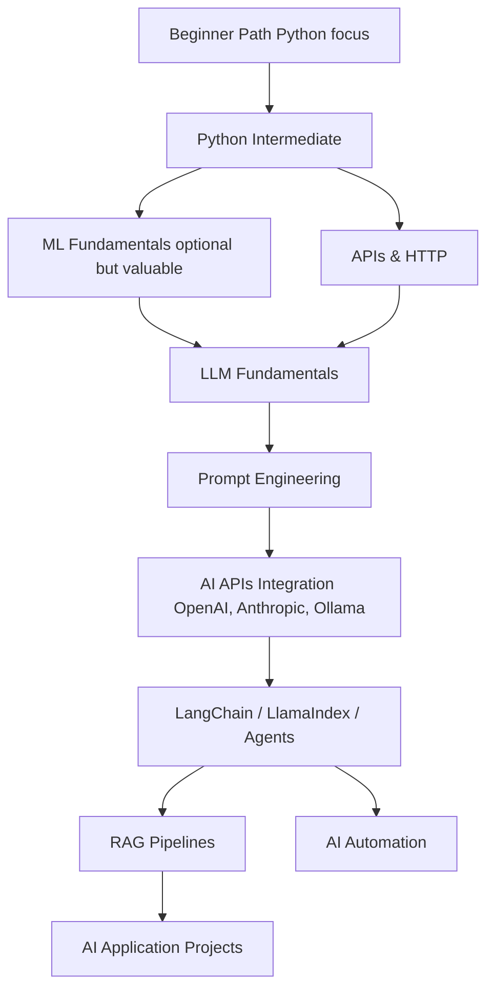

# ⚫ AI Engineer Path

> **Who this is for:** You want to build AI-powered products — not just use ChatGPT, but integrate, deploy, and extend LLMs.
> **Goal:** Build AI agents, pipelines, and applications using real engineering practices.
> **Time estimate:** 8–12 months | **Dependencies:** Beginner Path + Python comfortable + basic web dev

---

## Dependency Map

---

## Note on This Path

This path focuses on **AI Engineering** — building *with* AI systems, not *building* AI from scratch.

ML fundamentals (training models, neural network math) are included as optional depth — not required to build valuable AI products.

---

## 🏁 Milestones

### Milestone 1 — Python Intermediate 🐍
*~2 weeks (if not already done)*

- [ ] Object-oriented Python (classes, inheritance, dataclasses)
- [ ] Type hints and mypy
- [ ] Decorators and context managers
- [ ] Async Python (asyncio, await)
- [ ] Environment management (venv, pyenv)
- [ ] Package management (pip, poetry, uv)

#### Resource
- 📺 [Real Python Tutorials (FREE)](https://realpython.com/) — Filter by intermediate level

---

### Milestone 2 — ML Fundamentals (Optional Depth) 📐
*~3 weeks*

Skip if your goal is AI engineering, not research. Come back later.

- [ ] [ML Foundations Wiki](../domains/ai_ml/foundations.md)
  - Linear algebra intuition (vectors, matrices, dot products)
  - Probability basics (distributions, Bayes)
  - What is training? Loss functions, gradient descent
  - Classification vs regression vs generation
  - Neural network intuition (layers, activation functions)

#### Course
- 📺 [fast.ai — Practical Deep Learning (FREE)](https://course.fast.ai/) — Top-down, practical first

---

### Milestone 3 — LLM Fundamentals 🧠
*~2 weeks*

- [ ] [LLM Engineering Wiki](../domains/ai_ml/llm_engineering.md)
  - What is a transformer? (Intuition, not math)
  - Tokens, context windows, embeddings
  - Temperature, top-p, system prompts
  - Fine-tuning vs RAG vs few-shot
  - Model families: GPT-4o, Claude, Gemini, Llama, Mistral

#### Resources
- 📺 [Andrej Karpathy: Let's build GPT (YouTube, FREE)](https://www.youtube.com/watch?v=kCc8FmEb1nY) — Best LLM intuition video
- 📚 [Chip Huyen: LLM Engineering Guide (FREE)](https://huyenchip.com/llm-engineering/) — Practical

---

### Milestone 4 — Prompt Engineering 🎯
*~1 week*

- [ ] System prompts vs user prompts
- [ ] Chain of thought, few-shot, and zero-shot
- [ ] Output formatting (JSON mode, structured outputs)
- [ ] Prompt injection and security
- [ ] Evaluating prompt quality

#### Resource
- 📺 [Anthropic Prompt Engineering Guide (FREE)](https://docs.anthropic.com/en/docs/build-with-claude/prompt-engineering/overview)
- 📺 [OpenAI Prompt Engineering Guide (FREE)](https://platform.openai.com/docs/guides/prompt-engineering)

---

### Milestone 5 — Building with AI APIs ⚡
*~3 weeks*

- [ ] OpenAI / Anthropic SDK (Python)
- [ ] Streaming responses
- [ ] Function calling / tool use
- [ ] Vision/multimodal inputs
- [ ] Rate limiting and cost management
- [ ] Local models with Ollama

#### Assignment
- Build a multi-turn chatbot with memory (conversation history management)
- [ ] Handles context window limits gracefully
- [ ] Has a simple web UI (Streamlit or Gradio — trivial to set up)
- [ ] Logs cost per session

**🏆 Reward:** You can build real AI products right now.

---

### Milestone 6 — RAG (Retrieval-Augmented Generation) 📚
*~4 weeks*

- [ ] What is RAG and why it exists
- [ ] Embeddings and vector search
- [ ] Vector databases: Chroma, Pinecone, pgvector
- [ ] Chunking strategies for documents
- [ ] Reranking and hybrid search
- [ ] Evaluation metrics (faithfulness, relevance)

#### Course
- 📺 [DeepLearning.AI — LangChain for LLM App Dev (FREE)](https://learn.deeplearning.ai/langchain) — Short, practical

#### Assignment
- Build a "chat with your documents" system:
  - [ ] Upload PDF → extract text → chunk → embed → store in vector DB
  - [ ] Query: find relevant chunks → inject into prompt → generate answer
  - [ ] Show source citations in the response

**🏆 Reward:** You can make any LLM "know" your private data.

---

### Milestone 7 — AI Agents 🤖
*~3 weeks*

- [ ] What agents are (LLM + tools + memory + planning)
- [ ] Tool calling patterns
- [ ] ReAct (Reason + Act) pattern
- [ ] Multi-agent architectures
- [ ] LangChain Agents or LlamaIndex Agents
- [ ] Agent evaluation and safety

#### Resources
- 📺 [DeepLearning.AI — AI Agents in LangGraph (FREE)](https://learn.deeplearning.ai/courses/ai-agents-in-langgraph)
- 📚 [LangGraph Documentation](https://langchain-ai.github.io/langgraph/)

---

### Milestone 8 — AI Application Project 🚀
See [`projects/p06_ai_agent.md`](../projects/p06_ai_agent.md)

Build a complete AI application:
- [ ] LLM core with tool use
- [ ] RAG for domain knowledge
- [ ] Web interface
- [ ] Deployed and shareable

**🏆 Reward: 🎉 You are an AI engineer. This is one of the most in-demand skills on the planet.**

---

## Optional Extensions

| Topic | Notes |
|-------|-------|
| Fine-tuning open models | Requires GPU time (use free Colab or Vast.ai) |
| AI automation / n8n | No-code AI workflow automation |
| Computer vision | OpenCV + vision models |
| Speech (STT/TTS) | Whisper + ElevenLabs / Coqui |
| AI code generation tools | Building copilot-style tools |
