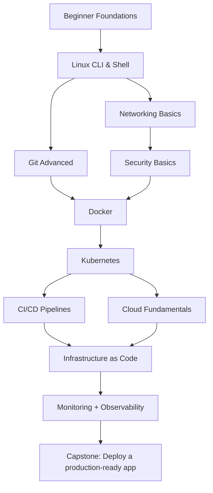

# 🟠 DevOps Engineer Path

> **Who this is for:** You want to build, deploy, and operate software infrastructure at scale.
> **Goal:** Master containerization, CI/CD, cloud, and infrastructure-as-code.
> **Time estimate:** 8–14 months at 1 hr/day | **Dependencies:** Beginner Path + basic comfort with one programming language

---

## Dependency Map

---

## 🏁 Milestones

### Milestone 1 — Linux & Shell Mastery 🐧
*~3 weeks*

- [ ] [Linux CLI Wiki](../domains/devops/linux_cli.md)
  - Filesystem navigation and manipulation
  - Users, permissions, sudo
  - Processes (ps, htop, kill, systemd)
  - Package management (apt, yum/dnf)
  - Shell scripting (bash): variables, loops, conditionals, functions
  - SSH, SCP, rsync
  - Text processing (grep, awk, sed, cut, sort)
  - Cron jobs

#### Course
- 📺 [The Missing Semester of CS Education — MIT (FREE)](https://missing.csail.mit.edu/) — Shell, vim, git, scripting
- 📺 [Linux Command Line Basics — Udemy (~$15)](https://www.udemy.com/course/linux-command-line-volume1/) — Good if you want structured video

#### Assignment
- Write a bash script that:
  - Monitors disk usage
  - Sends an alert (prints a warning) if any partition > 80% full
  - Logs results to a file with timestamps
- [ ] Schedule it with cron to run every hour

**🏆 Reward:** You can administer any Linux server confidently.

---

### Milestone 2 — Git Advanced & Collaboration Workflows 🌿
*~1 week*

- [ ] [Git Workflow Wiki](../domains/devops/git_workflow.md)
  - GitFlow and trunk-based development
  - Rebase vs merge
  - Interactive rebase (clean up commits)
  - Git hooks (pre-commit, pre-push)
  - Conventional commits
  - GitHub/GitLab: PRs, code review, branch protection

**🏆 Reward:** Your git history tells a story. You can contribute to any team project.

---

### Milestone 3 — Docker 🐳
*~3 weeks*

- [ ] [Docker Wiki](../domains/devops/docker.mdx)
  - What containers are (vs VMs)
  - Dockerfile syntax and best practices
  - Image layers and caching
  - Docker volumes and bind mounts
  - Docker networking (bridge, host, overlay)
  - Docker Compose for multi-service apps
  - Container security basics

#### Course
- 📺 [Docker & Kubernetes: The Practical Guide — Udemy (~$15)](https://www.udemy.com/course/docker-kubernetes-the-practical-guide/) — Best Docker course available

#### Assignment
- Containerize your REST API project from the Web Dev path (or any app):
  - [ ] Multi-stage Dockerfile (build stage + runtime stage)
  - [ ] Docker Compose with app + database
  - [ ] Non-root user in container
  - [ ] Health check endpoint

**🏆 Reward:** Any app you write can run anywhere. "Works on my machine" is dead.

---

### Milestone 4 — Networking Basics 🌐
*~2 weeks*

- [ ] [Networking Wiki](../domains/foundations/networking.md)
  - OSI model (focus on layers 3–7 in practice)
  - IP addressing, subnets, CIDR
  - TCP vs UDP
  - DNS (how domains resolve)
  - HTTP/HTTPS, TLS handshake
  - Load balancers and reverse proxies (nginx, Traefik)
  - Ports and firewalls

#### Research Questions 🔍
- What happens when you type a URL in your browser? (Trace every step)
- What is NAT and why does it exist?
- How does mTLS differ from regular TLS?

**🏆 Reward:** Network errors are diagnosable. You can configure any network stack.

---

### Milestone 5 — Kubernetes ☸️
*~5 weeks*

- [ ] [Kubernetes Wiki](../domains/devops/kubernetes.md)
  - Pods, Deployments, Services, ConfigMaps, Secrets
  - Namespaces and RBAC basics
  - Persistent volumes
  - Ingress and networking
  - Helm charts
  - Horizontal Pod Autoscaling
  - Rolling updates and rollbacks

#### Course
- 📺 [Docker & Kubernetes: The Practical Guide — Udemy (~$15)](https://www.udemy.com/course/docker-kubernetes-the-practical-guide/) — Covers both Docker + K8s
- 🔧 [Play with Kubernetes (FREE)](https://labs.play-with-k8s.com/) — Browser-based K8s playground

#### Assignment
- Deploy your containerized app to K8s (use minikube or kind locally, or a free cloud tier):
  - [ ] Deployment with 2 replicas
  - [ ] Service + Ingress
  - [ ] ConfigMap for environment config
  - [ ] Liveness and readiness probes

**🏆 Reward:** You can deploy and operate production-grade applications.

---

### Milestone 6 — CI/CD Pipelines ⚙️
*~3 weeks*

- [ ] [CI/CD Wiki](../domains/devops/ci_cd.md)
  - What CI/CD is and why it matters
  - GitHub Actions deep dive
    - Workflows, jobs, steps
    - Triggers (push, PR, schedule)
    - Secrets management
    - Matrix builds
  - CD: auto-deploy on merge to main
  - Rollback strategies

#### Assignment
- Build a GitHub Actions pipeline for your app:
  - [ ] Lint + test on every PR
  - [ ] Build Docker image and push to Docker Hub on merge
  - [ ] Deploy to K8s (via kubectl or ArgoCD) on merge to main

**🏆 Reward:** Your software ships automatically, safely, and repeatably.

---

### Milestone 7 — Cloud Fundamentals ☁️
*~3 weeks*

- [ ] [Cloud Fundamentals Wiki](../domains/cloud/fundamentals.md)
  - Cloud concepts: regions, AZs, pricing models
  - Compute: VMs, containers, serverless
  - Storage: object storage, block storage, databases
  - IAM: users, roles, policies
  - Networking: VPCs, security groups

#### Course (pick one based on target cloud)
- 📺 [AWS Cloud Practitioner Essentials (FREE)](https://aws.amazon.com/training/digital/aws-cloud-practitioner-essentials/)
- 📺 [Google Cloud Fundamentals (FREE on Coursera with audit)](https://www.coursera.org/learn/gcp-fundamentals)

**🏆 Reward:** You can deploy to any major cloud provider.

---

### Milestone 8 — Infrastructure as Code 🏗️
*~3 weeks*

- [ ] [Infrastructure as Code Wiki](../domains/devops/iac.md)
  - Why IaC (reproducible, versioned infrastructure)
  - Terraform: providers, resources, state, modules
  - Terraform Cloud (free tier)
  - Ansible basics (configuration management)

#### Course
- 📺 [Terraform Tutorials (FREE)](https://developer.hashicorp.com/terraform/tutorials) — Official, hands-on

#### Assignment: [`projects/p04_containerized_service.md`](../projects/p04_containerized_service.md)

**🏆 Reward:** You can provision an entire cloud environment from a single command.

---

### Milestone 9 — Monitoring & Observability 📊
*~2 weeks*

- [ ] Prometheus + Grafana stack
- [ ] Structured logging (JSON logs, log levels)
- [ ] Distributed tracing concepts (OpenTelemetry)
- [ ] Alerting and runbooks

**🏆 Reward:** You know when things break before users do.

---

### Capstone Project
See [`projects/p07_devops_pipeline.md`](../projects/p07_devops_pipeline.md)

**🏆 Reward: 🎉 You are a DevOps engineer. Put it on your resume.**
